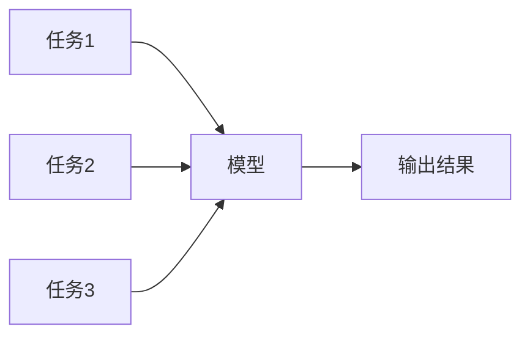

                 

# 企业AI Agent的多任务学习框架：提升模型通用性与迁移能力

**关键词：** 多任务学习，企业AI Agent，模型通用性，迁移能力，机器学习，AI系统架构

**摘要：**  
随着企业智能化转型的加速，AI Agent（人工智能代理）在企业中的应用越来越广泛。然而，单一任务的AI模型难以满足企业复杂多样的需求。为了解决这一问题，多任务学习（Multi-Task Learning, MTL）成为提升AI Agent通用性和迁移能力的关键技术。本文将从企业AI Agent的核心需求出发，系统地探讨多任务学习的原理、算法实现、系统架构设计以及实际应用案例。通过深入分析多任务学习的优势与挑战，结合具体的项目实战，本文为读者提供一套提升企业AI Agent模型通用性和迁移能力的解决方案。

---

# 第1章: 企业AI Agent与多任务学习的背景

## 1.1 问题背景

### 1.1.1 企业AI Agent的核心需求  
企业在数字化转型中，需要AI Agent能够处理多种任务，例如自然语言理解、数据分析、决策优化等。单一任务模型难以应对复杂场景，而多任务学习通过共享任务特征，提升模型的通用性和效率。

### 1.1.2 多任务学习在企业AI中的重要性  
企业场景中，任务间存在高度相关性，例如客服系统需要同时处理客户咨询、情绪分析和推荐服务。多任务学习能够利用这些相关性，减少模型训练的数据需求，提升模型性能。

### 1.1.3 当前模型通用性与迁移能力的挑战  
传统单任务模型在企业场景中存在数据利用率低、泛化能力弱的问题。多任务学习通过共享任务特征，能够显著提升模型的通用性和迁移能力。

## 1.2 问题描述

### 1.2.1 单任务学习的局限性  
单任务学习模型在面对复杂企业场景时，需要分别训练多个模型，导致资源浪费和效率低下。

### 1.2.2 企业场景中多任务学习的必要性  
企业AI Agent需要在单一模型中同时处理多种任务，降低计算成本，提高处理效率。

### 1.2.3 多任务学习的目标与边界  
目标是通过共享任务特征，提升模型的通用性和迁移能力；边界在于任务间相关性较低或完全无关的任务。

## 1.3 问题解决

### 1.3.1 多任务学习的核心思想  
通过共享任务特征，利用任务间相关性，提升模型的通用性和迁移能力。

### 1.3.2 企业AI Agent的通用性提升策略  
通过多任务学习框架，设计通用模型，能够同时处理多种任务。

### 1.3.3 迁移能力的实现路径  
通过任务特征共享，提升模型在不同任务间的迁移能力。

## 1.4 核心概念结构与组成

### 1.4.1 多任务学习的组成要素  
任务、模型、任务间关系、任务权重。

### 1.4.2 企业AI Agent的系统架构  
任务层、模型层、应用层。

### 1.4.3 任务相关性的度量方法  
余弦相似度、皮尔逊相关系数。

---

# 第2章: 多任务学习的核心概念与联系

## 2.1 多任务学习的原理

### 2.1.1 多任务学习的基本概念  
多任务学习是指在单一模型中同时学习多个任务，通过共享特征提升模型性能。

### 2.1.2 任务间关系的分类  
任务相关性：正相关、负相关、无关；任务间共享特征。

### 2.1.3 多任务学习的优势与劣势  
优势：数据共享、减少训练成本；劣势：任务间干扰。

## 2.2 核心概念对比分析

### 2.2.1 任务独立性与相关性的对比  
任务独立性：每个任务单独优化；任务相关性：任务间共享特征。

### 2.2.2 单任务学习与多任务学习的对比  
单任务学习：模型专用；多任务学习：模型通用。

### 2.2.3 企业AI Agent与传统AI的区别  
传统AI：单任务处理；企业AI Agent：多任务处理。

## 2.3 实体关系图

---

通过以上章节的分析，我们可以看到多任务学习在企业AI Agent中的重要性。接下来，我们将深入探讨多任务学习的算法原理、系统架构设计和实际项目实现，为企业AI Agent的开发提供全面的解决方案。

