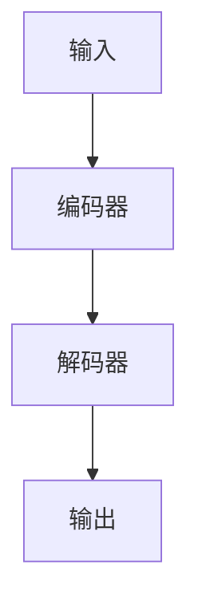
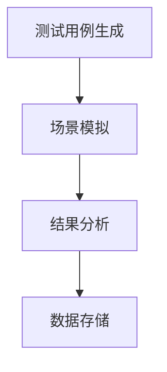

                 

# 企业AI Agent的多场景测试：模拟真实业务环境

> 关键词：AI Agent，多场景测试，模拟环境，业务场景，测试方法，系统架构，算法实现

> 摘要：本文深入探讨了企业AI Agent在多场景测试中的应用，结合实际业务环境，分析了AI Agent的核心概念、算法原理、系统架构，并通过项目实战展示了如何在真实业务环境中进行有效的多场景测试。文章内容涵盖从理论到实践的全过程，为读者提供了全面的技术指导。

---

## # 第一部分: 引言

### # 第1章: 引言

#### 1.1 什么是企业AI Agent
企业AI Agent是一种能够理解和执行复杂任务的智能代理，它通过自然语言处理、机器学习和知识图谱等技术，模拟人类与计算机之间的交互，为企业提供自动化服务。AI Agent在企业中的应用场景包括客户支持、流程自动化、数据分析和决策支持等。

#### 1.2 多场景测试的重要性
AI Agent需要在多种真实业务环境中运行，因此测试必须覆盖所有可能的场景。通过模拟真实业务环境，可以发现AI Agent在不同场景中的潜在问题，确保其在实际应用中的稳定性和可靠性。

#### 1.3 本文的目的和结构
本文旨在通过理论分析和实践案例，详细讲解企业AI Agent的多场景测试方法。文章结构包括背景介绍、核心概念、算法原理、系统架构、项目实战和总结展望。

---

## # 第二部分: 核心概念与背景

### # 第2章: 企业AI Agent的核心概念

#### 2.1 AI Agent的组成与工作原理
AI Agent由知识库、对话系统和任务规划模块组成。知识库存储业务数据和规则，对话系统负责与用户交互，任务规划模块根据需求执行任务。

#### 2.2 业务场景的多样性
企业AI Agent需要处理的场景包括客户咨询、订单处理、数据分析等。每个场景都有其独特的业务规则和数据结构。

#### 2.3 模拟环境的特点
模拟环境需要高度还原真实业务环境，包括数据结构、业务规则和用户行为模式。

### # 第3章: 多场景测试的背景

#### 3.1 测试在AI Agent开发中的作用
测试是确保AI Agent在各种场景中正常运行的关键环节。通过测试可以验证AI Agent的逻辑、数据处理能力和异常处理能力。

#### 3.2 模拟环境的重要性
模拟环境可以提供一致的测试条件，方便测试人员进行系统性测试，同时避免干扰真实业务数据。

#### 3.3 测试环境的构建
构建测试环境需要考虑数据源、业务规则和用户行为的模拟。

---

## # 第三部分: 算法原理与系统架构

### # 第4章: AI Agent的核心算法

#### 4.1 对话系统的算法实现
对话系统基于深度学习模型，使用注意力机制和循环神经网络（RNN）进行多轮对话处理。

#### 4.2 任务规划算法
任务规划算法基于图搜索和状态机，通过优先级队列优化任务执行顺序。

### # 第5章: 系统架构设计

#### 5.1 系统功能模块
系统功能模块包括测试用例生成、场景模拟和结果分析。

#### 5.2 系统架构图

---

## # 第四部分: 项目实战

### # 第6章: 项目实战

#### 6.1 环境搭建
安装必要的依赖库，配置开发环境。

#### 6.2 代码实现
实现AI Agent的核心功能，包括对话系统和任务规划模块。

#### 6.3 测试与优化
在模拟环境中进行测试，分析结果并优化系统。

---

## # 第五部分: 总结与展望

### # 第7章: 总结与展望

#### 7.1 本文总结
本文详细探讨了企业AI Agent的多场景测试方法，分析了核心算法和系统架构，并通过项目实战展示了测试过程。

#### 7.2 未来展望
未来研究方向包括更复杂的场景模拟、更智能的测试算法和更高效的系统架构。

---

通过本文的分析和实践，读者可以全面了解企业AI Agent的多场景测试方法，并在实际项目中应用这些技术。

