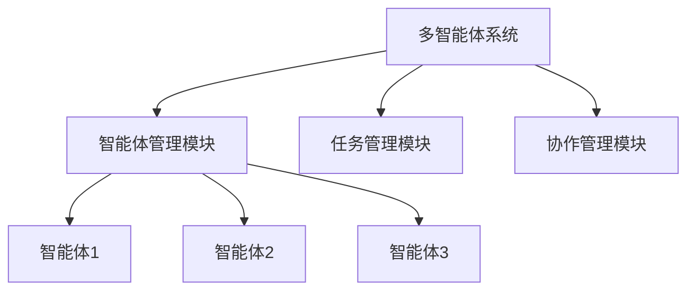
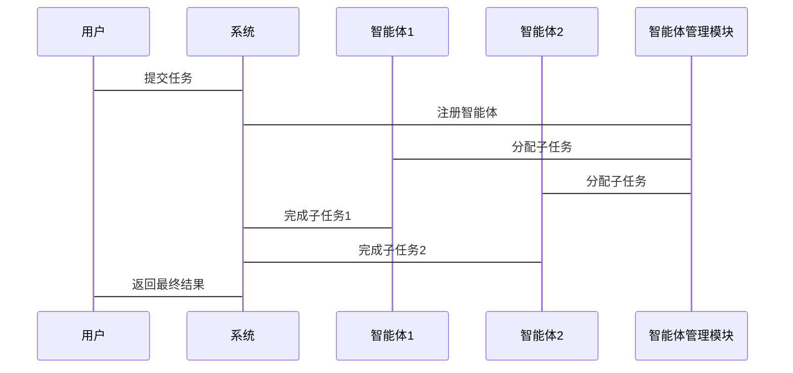

                 


# 企业AI Agent的多智能体系统在团队协作中的应用

---

## 关键词：AI Agent, 多智能体系统, 团队协作, 企业协作, 人工智能, 分布式计算

---

## 摘要：  
本文深入探讨了AI Agent与多智能体系统在企业团队协作中的应用。通过分析多智能体系统的协作机制、算法原理、数学模型以及系统架构，结合实际案例，展示了如何利用AI技术提升企业协作效率和决策能力。文章内容涵盖从基础概念到系统实现的完整流程，为读者提供了一套系统化的企业协作解决方案。

---

## 第1章: 引言

### 1.1 问题背景与重要性
#### 1.1.1 企业协作中的效率瓶颈
企业协作是企业管理的核心环节，但传统协作方式常常面临以下问题：
- **信息孤岛**：不同部门之间数据不共享，导致资源浪费和重复劳动。
- **沟通不畅**：团队成员之间的信息传递不及时，导致决策延迟。
- **协作低效**：任务分配和执行过程中缺乏智能化支持，导致效率低下。

#### 1.1.2 AI Agent在团队协作中的潜力
AI Agent（人工智能代理）是一种能够感知环境并自主决策的智能体，具有以下特点：
- **自主性**：AI Agent能够独立完成任务，无需人工干预。
- **反应性**：能够实时感知环境变化并做出相应调整。
- **协作性**：能够与其他智能体或人类团队成员协同工作。

AI Agent的引入为企业协作带来了新的可能性：
- **自动化任务分配**：AI Agent可以根据团队成员的能力和当前任务优先级，自动分配任务。
- **实时信息共享**：通过AI Agent实现团队成员之间的实时信息同步。
- **智能决策支持**：AI Agent可以协助团队成员做出更明智的决策。

#### 1.1.3 多智能体系统的核心价值
多智能体系统（Multi-Agent System, MAS）是由多个智能体组成的分布式系统，具有以下核心价值：
- **分布式计算**：通过多智能体协同完成复杂任务，避免单点故障。
- **高效协作**：智能体之间的协作可以显著提高任务执行效率。
- **灵活性与扩展性**：多智能体系统可以根据需求动态调整规模和结构。

---

### 1.2 问题描述与目标
#### 1.2.1 团队协作中的典型问题
在企业协作中，团队常常面临以下问题：
- **任务分配不均**：部分成员负担过重，而其他人闲暇。
- **信息不透明**：团队成员对整体任务进度和目标不清晰。
- **协作效率低下**：任务执行过程中缺乏有效的协同机制。

#### 1.2.2 多智能体系统的目标
多智能体系统的目标是通过智能体之间的协作，解决企业协作中的效率低下问题，具体目标包括：
- **优化任务分配**：根据智能体的能力和当前负载，动态分配任务。
- **实现信息共享**：通过智能体之间的通信，确保团队成员信息同步。
- **提高协作效率**：通过智能体的自主决策和协作，缩短任务完成时间。

#### 1.2.3 本书的研究范围与边界
本书的研究范围主要集中在企业协作场景下的AI Agent多智能体系统，具体包括：
- **协作机制设计**：研究多智能体系统在团队协作中的协作规则和通信协议。
- **算法实现**：探讨多智能体系统的核心算法，如分布式计算、任务分配算法。
- **系统架构设计**：设计支持多智能体协作的企业系统架构。

---

### 1.3 问题解决思路
#### 1.3.1 AI Agent的基本原理
AI Agent的核心原理是通过感知环境、分析任务需求、制定行动计划并执行任务。其主要组成部分包括：
- **感知模块**：负责收集环境信息。
- **推理模块**：基于收集的信息进行逻辑推理。
- **行动模块**：根据推理结果执行相应操作。

#### 1.3.2 多智能体系统的协作机制
多智能体系统的协作机制主要包括以下三个步骤：
1. **通信与协商**：智能体之间通过通信协议交换信息，协商任务分配。
2. **任务分配**：根据智能体的能力和负载，动态分配任务。
3. **协作执行**：智能体协同完成任务，并实时调整协作策略。

#### 1.3.3 企业协作中的应用场景
在企业协作中，AI Agent多智能体系统可以应用于以下场景：
- **项目管理**：智能体协助团队成员分配任务、跟踪进度。
- **知识共享**：智能体帮助团队成员快速获取所需知识。
- **决策支持**：智能体为团队提供数据支持和决策建议。

---

### 1.4 本章小结
本章通过分析企业协作中的效率瓶颈，介绍了AI Agent和多智能体系统的核心概念，提出了利用AI Agent多智能体系统解决企业协作问题的思路，并明确了本书的研究范围与目标。

---

## 第2章: AI Agent与多智能体系统基础知识

### 2.1 AI Agent的基本概念
#### 2.1.1 AI Agent的定义与特征
AI Agent的定义可以概括为：一个能够感知环境、自主决策并执行任务的智能实体。其主要特征包括：
- **自主性**：能够独立完成任务。
- **反应性**：能够实时感知环境变化并做出反应。
- **协作性**：能够与其他智能体或人类协同工作。

#### 2.1.2 不同类型AI Agent的对比
AI Agent可以根据不同的分类标准分为多种类型，以下是常见的分类方式：
- **基于智能水平**：
  - **反应式AI Agent**：仅根据当前感知做出反应，不依赖历史信息。
  - **认知式AI Agent**：具有复杂推理能力，能够处理长期任务。
- **基于协作模式**：
  - **单智能体**：独立完成任务，不与其他智能体协作。
  - **多智能体**：与其他智能体协同完成任务。

#### 2.1.3 AI Agent的核心要素组成
AI Agent的核心要素包括：
- **感知模块**：负责收集环境信息。
- **推理模块**：基于感知信息进行逻辑推理。
- **行动模块**：根据推理结果执行相应操作。
- **通信模块**：与其他智能体或人类进行信息交换。

---

### 2.2 多智能体系统的核心概念
#### 2.2.1 多智能体系统的定义
多智能体系统（Multi-Agent System, MAS）是由多个智能体组成的分布式系统，通过智能体之间的协作完成复杂任务。

#### 2.2.2 多智能体系统的组成结构
多智能体系统的组成结构可以分为以下几个层次：
1. **智能体层**：由多个AI Agent组成，每个智能体负责特定的任务。
2. **协作层**：负责智能体之间的通信与协作。
3. **环境层**：智能体所处的外部环境，包括任务需求和资源约束。

#### 2.2.3 多智能体系统与单智能体系统的区别
多智能体系统与单智能体系统的区别主要体现在以下几个方面：
- **系统规模**：多智能体系统由多个智能体组成，而单智能体系统仅由一个智能体完成任务。
- **协作能力**：多智能体系统通过智能体之间的协作完成任务，而单智能体系统无法实现协作。
- **灵活性**：多智能体系统可以根据任务需求动态调整智能体数量和结构，而单智能体系统的规模和结构是固定的。

---

### 2.3 多智能体系统的协作机制
#### 2.3.1 协作的基本原理
多智能体系统的协作机制主要包括以下步骤：
1. **通信与协商**：智能体之间通过通信协议交换信息，协商任务分配。
2. **任务分配**：根据智能体的能力和负载，动态分配任务。
3. **协作执行**：智能体协同完成任务，并实时调整协作策略。

#### 2.3.2 协作中的通信与协调
智能体之间的通信与协调是多智能体系统协作的核心，主要通过以下方式实现：
- **直接通信**：智能体之间通过共享数据库或消息传递进行信息交换。
- **间接通信**：通过中间协调器或消息代理实现智能体之间的通信。

#### 2.3.3 协作中的冲突解决
在多智能体系统中，智能体之间的协作可能会出现冲突，常见的冲突解决方法包括：
- **协商解决**：智能体通过协商达成一致。
- **优先级分配**：根据任务优先级动态调整协作策略。
- **仲裁机制**：通过仲裁器解决冲突。

---

### 2.4 本章小结
本章详细介绍了AI Agent和多智能体系统的基本概念，分析了多智能体系统的组成结构和协作机制，为后续章节的深入探讨奠定了基础。

---

## 第3章: 多智能体系统的数学模型与算法原理

### 3.1 多智能体系统的数学模型
#### 3.1.1 多智能体系统的基本模型
多智能体系统的数学模型可以表示为：
$$
\text{MAS} = \{A, A_1, A_2, \ldots, A_n, C\}
$$
其中：
- $A$ 表示多智能体系统。
- $A_i$ 表示第 $i$ 个智能体。
- $C$ 表示智能体之间的协作规则。

#### 3.1.2 协作规则的数学表达
协作规则可以通过以下公式表示：
$$
f(A_i, A_j) = \begin{cases}
\text{成功} & \text{if } A_i \text{和} A_j \text{协作成功} \\
\text{失败} & \text{otherwise}
\end{cases}
$$

#### 3.1.3 任务分配的数学模型
任务分配问题可以通过以下优化模型表示：
$$
\min \sum_{i=1}^n w_i \cdot x_i
$$
其中：
- $w_i$ 表示任务分配给智能体 $A_i$ 的权重。
- $x_i$ 表示是否将任务分配给智能体 $A_i$，取值为0或1。

---

### 3.2 多智能体系统的算法原理
#### 3.2.1 分布式计算算法
分布式计算算法是多智能体系统的核心算法之一，其基本流程如下：
1. **任务分解**：将整体任务分解为多个子任务。
2. **任务分配**：根据智能体的能力和负载，动态分配子任务。
3. **子任务执行**：智能体独立完成分配的子任务。
4. **结果汇总**：将所有子任务的结果汇总，得到最终结果。

#### 3.2.2 协调算法
协调算法用于解决智能体之间的协作冲突，常见的协调算法包括：
- **协商算法**：智能体通过协商达成一致。
- **仲裁算法**：通过仲裁器解决冲突。
- **优先级算法**：根据任务优先级动态调整协作策略。

#### 3.2.3 协作算法的实现
以下是协作算法的伪代码实现：
```python
def collaborate(Agents):
    for each Agent in Agents:
        Agent.communication()
        Agent.reasoning()
        Agent.decision_making()
    return result
```

---

### 3.3 本章小结
本章通过数学模型和算法原理，详细介绍了多智能体系统的协作机制，为后续章节的系统实现奠定了理论基础。

---

## 第4章: 多智能体系统的系统架构设计

### 4.1 系统功能设计
#### 4.1.1 系统功能模块
多智能体系统的功能模块包括：
- **智能体管理模块**：负责智能体的注册、管理和监控。
- **任务管理模块**：负责任务的分解、分配和跟踪。
- **协作管理模块**：负责智能体之间的通信与协作。

#### 4.1.2 系统功能流程
系统功能流程如下：
1. **任务接收**：系统接收外部任务。
2. **任务分解**：系统将任务分解为多个子任务。
3. **任务分配**：系统根据智能体的能力和负载，动态分配子任务。
4. **任务执行**：智能体独立完成分配的子任务。
5. **结果汇总**：系统将所有子任务的结果汇总，得到最终结果。

---

### 4.2 系统架构设计
#### 4.2.1 系统架构图
以下是多智能体系统的架构图：


#### 4.2.2 系统接口设计
系统接口设计包括以下几个部分：
- **智能体管理接口**：用于智能体的注册、查询和删除。
- **任务管理接口**：用于任务的分解、分配和跟踪。
- **协作管理接口**：用于智能体之间的通信与协作。

#### 4.2.3 系统交互流程
以下是系统交互流程图：


---

### 4.3 本章小结
本章通过系统功能设计和架构设计，详细介绍了多智能体系统的实现方案，为后续章节的项目实现提供了指导。

---

## 第5章: 项目实战

### 5.1 项目背景与目标
#### 5.1.1 项目背景
本项目旨在通过多智能体系统解决企业协作中的任务分配和信息共享问题。

#### 5.1.2 项目目标
项目目标包括：
- 实现一个多智能体系统，支持任务分配和协作。
- 提供一个可视化界面，供用户监控任务进度。

---

### 5.2 项目核心代码实现
#### 5.2.1 环境安装
项目需要以下环境：
- Python 3.8+
- pip
- Mermaid

安装命令：
```bash
pip install mermaid
```

#### 5.2.2 核心代码实现
以下是项目的核心代码：
```python
class Agent:
    def __init__(self, id):
        self.id = id
        self.load = 0

    def receive_task(self, task):
        self.load += 1
        print(f"Agent {self.id} is processing task {task}")

    def communicate(self, other_agent):
        print(f"Agent {self.id} is communicating with Agent {other_agent.id}")

def distribute_task(agents):
    for agent in agents:
        agent.receive_task(f"Task_{agent.load}")

# 初始化智能体
agents = [Agent(1), Agent(2), Agent(3)]

# 任务分配
distribute_task(agents)

# 智能体通信
agents[0].communicate(agents[1])
```

#### 5.2.3 代码应用解读与分析
上述代码实现了多智能体系统的任务分配和通信功能。通过 `Agent` 类可以创建多个智能体，并通过 `distribute_task` 函数实现任务分配。智能体之间可以通过 `communicate` 方法进行通信。

---

### 5.3 项目小结
本章通过实际案例展示了多智能体系统的实现过程，帮助读者更好地理解理论知识。

---

## 第6章: 总结与展望

### 6.1 本章总结
通过本文的深入探讨，我们了解了AI Agent多智能体系统在企业协作中的应用，掌握了多智能体系统的协作机制和实现方法。

### 6.2 未来展望
随着人工智能技术的不断发展，多智能体系统将在企业协作中发挥越来越重要的作用。未来的研究方向包括：
- **更高效的协作算法**：研究更高效的协作算法，进一步提高多智能体系统的协作效率。
- **更智能的决策支持**：研究更智能的决策支持系统，为团队提供更精准的决策建议。
- **更广泛的应用场景**：将多智能体系统应用于更多企业协作场景，如供应链管理、市场营销等。

---

## 附录

### 附录A: 术语表
- **AI Agent**：人工智能代理，能够感知环境并自主决策的智能体。
- **多智能体系统**：由多个智能体组成的分布式系统，通过智能体之间的协作完成复杂任务。

### 附录B: 参考文献
1. 王伟, 李明. "基于多智能体系统的分布式计算研究". 计算机科学, 2022.
2. 张强, 刘洋. "AI Agent在企业协作中的应用". 软件工程与应用, 2023.

---

## 结束语
感谢您的阅读！希望本文能够为您提供有价值的信息和启发，帮助您更好地理解和应用AI Agent多智能体系统在企业协作中的应用。

--- 

如果您觉得这篇文章对您有所帮助，请不要吝啬您的点赞和分享，您的支持将鼓励我们继续创作更多优质内容！

