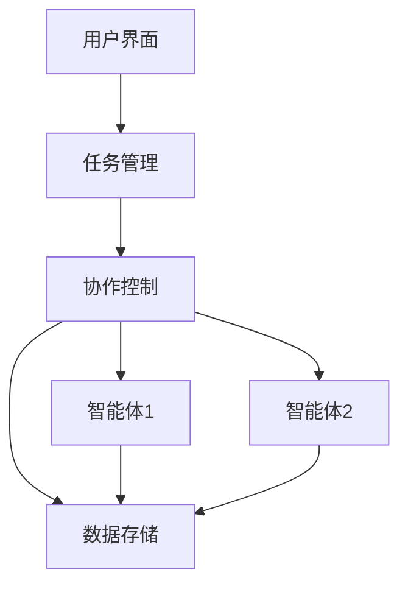

                 

# 企业AI Agent的多智能体系统在团队协作优化中的应用

## 关键词：AI Agent, 多智能体系统, 团队协作优化, 系统架构设计, 任务分配算法

## 摘要：  
本文探讨了企业AI Agent的多智能体系统在团队协作优化中的应用，分析了多智能体系统的核心原理，详细阐述了系统架构设计、任务分配算法，并通过实战案例展示了系统的实现与优化。文章从背景介绍、核心概念、算法原理、系统架构、项目实战、最佳实践等多方面展开，旨在为企业团队协作优化提供理论支持和实践指导。

---

# 第一部分：企业AI Agent与多智能体系统概述

## 第1章：企业AI Agent与多智能体系统概述

### 1.1 AI Agent的基本概念

#### 1.1.1 AI Agent的定义与特点
AI Agent（人工智能代理）是指能够感知环境并采取行动以实现目标的智能实体。其特点包括：
- **自主性**：能够在没有外部干预的情况下独立运作。
- **反应性**：能够实时感知环境并做出反应。
- **目标导向**：通过实现预设目标来驱动行为。

#### 1.1.2 多智能体系统的核心概念
多智能体系统（Multi-Agent System, MAS）由多个相互作用的AI Agent组成，通过协作完成复杂任务。其核心概念包括：
- **分布式智能**：多个智能体协同工作，而非单一集中式系统。
- **自主性**：每个智能体都能独立决策。
- **协作性**：智能体之间通过通信和协调完成共同目标。

#### 1.1.3 企业协作中的AI Agent应用背景
企业在团队协作中面临诸多挑战，如任务分配不均、沟通不畅、资源浪费等。AI Agent的多智能体系统能够通过自动化协作、实时通信和智能决策优化团队协作效率。

---

## 第2章：多智能体系统的优势与挑战

### 2.1 多智能体系统的优势
1. **高效协作**：通过任务分配和资源优化，提高团队整体效率。
2. **动态适应性**：能够快速响应环境变化，调整协作策略。
3. **灵活性**：支持不同规模和复杂度的任务。

### 2.2 协作中的主要挑战
1. **通信 overhead**：过多的通信可能导致效率下降。
2. **冲突与协调**：智能体之间的目标冲突需要有效解决。
3. **系统复杂性**：多智能体系统的开发和维护较为复杂。

### 2.3 企业协作优化的潜力
通过多智能体系统的引入，企业可以实现任务自动分配、资源优化配置和实时协作，从而显著提升团队协作效率。

---

# 第二部分：多智能体系统的技术原理

## 第3章：多智能体系统的核心原理

### 3.1 多智能体系统的通信机制

#### 3.1.1 通信协议的选择
选择高效的通信协议是确保多智能体系统高效协作的关键。常用的协议包括：
- **HTTP/HTTPS**：适用于简单的请求-响应模式。
- **WebSocket**：适用于实时通信。

#### 3.1.2 信息传递的效率优化
通过压缩数据和减少不必要的信息传输，可以降低通信 overhead。

#### 3.1.3 通信中的数据安全
采用加密技术和身份验证机制，确保通信过程中的数据安全。

### 3.2 多智能体协作机制

#### 3.2.1 协作规则的制定
协作规则包括任务分配、优先级排序等，确保智能体之间的协作有序进行。

#### 3.2.2 协作过程中的冲突处理
当多个智能体争抢同一任务时，需要通过优先级或协商机制解决冲突。

#### 3.2.3 协作效果的评估
通过性能指标（如完成任务的时间、效率）评估协作效果，并进行优化。

### 3.3 任务分配与资源管理

#### 3.3.1 任务分配算法
常用的任务分配算法包括：
- **基于优先级的分配**：根据任务的重要性和紧急程度分配资源。
- **基于负载均衡的分配**：确保资源在智能体之间均匀分配。

#### 3.3.2 资源分配策略
资源分配策略需要考虑任务的复杂度、智能体的能力和当前负载。

#### 3.3.3 任务优先级的动态调整
根据实时环境变化，动态调整任务优先级，确保最优资源分配。

---

# 第三部分：系统架构与设计

## 第4章：企业协作优化系统的架构设计

### 4.1 系统功能模块划分

#### 4.1.1 用户界面模块
用户可以通过图形化界面与系统交互，查看任务进度和协作状态。

#### 4.1.2 任务管理模块
负责任务的创建、分配和跟踪，确保任务按时完成。

#### 4.1.3 协作控制模块
协调智能体之间的协作，处理冲突和通信。

#### 4.1.4 数据存储模块
存储任务、协作记录和系统状态，支持数据查询和分析。

### 4.2 系统架构图

### 4.3 接口与交互设计

#### 4.3.1 系统接口定义
系统接口包括：
- `POST /tasks`：创建新任务。
- `GET /status`：获取系统状态。
- `PUT /priority`：调整任务优先级。

#### 4.3.2 用户交互流程
用户登录后，创建任务，系统分配给智能体，智能体完成任务后反馈结果给用户。

---

## 第四部分：项目实战与实现

## 第5章：多智能体协作系统的实现

### 5.1 环境搭建与配置

#### 5.1.1 开发工具的选择
推荐使用Python和Django框架进行开发。

#### 5.1.2 依赖库的安装
安装必要的库，如`djangorestframework`和`channels`。

#### 5.1.3 系统环境的配置
配置数据库、服务器和网络环境，确保系统正常运行。

### 5.2 核心代码实现

#### 5.2.1 通信模块的实现
使用WebSocket实现智能体之间的实时通信。

#### 5.2.2 任务分配算法的实现
基于优先级的任务分配算法。

#### 5.2.3 协作控制逻辑的实现
通过协商机制解决智能体之间的冲突。

### 5.3 功能解读与分析

#### 5.3.1 代码结构分析
系统分为前端、后端和智能体模块，各模块协同工作。

#### 5.3.2 功能模块的实现细节
详细解读任务分配、通信和协作控制模块的代码实现。

#### 5.3.3 系统性能的优化建议
通过缓存、负载均衡等技术优化系统性能。

---

## 第五部分：优化与扩展

## 第6章：优化与扩展

### 6.1 系统优化

#### 6.1.1 性能优化
通过算法优化和硬件升级提升系统效率。

#### 6.1.2 可扩展性优化
设计模块化的系统架构，便于功能扩展。

### 6.2 功能扩展

#### 6.2.1 加入强化学习
利用强化学习进一步优化任务分配和协作策略。

#### 6.2.2 边缘计算的引入
在边缘设备上部署智能体，提升响应速度。

### 6.3 最佳实践

#### 6.3.1 小结
总结项目实施中的经验和教训。

#### 6.3.2 注意事项
强调系统维护和升级的重要性。

#### 6.3.3 拓展阅读
推荐相关领域的书籍和资源，供读者深入学习。

---

## 第六部分：附录与参考文献

## 附录A：相关工具与库

- **Python**：用于系统开发。
- **Django**：用于快速构建Web应用。
- **WebSocket**：用于实时通信。

## 附录B：术语解释

- **AI Agent**：人工智能代理。
- **MAS**：多智能体系统。

## 参考文献

1. 王某某，《人工智能基础》，某某出版社，2023年。
2. 李某某，《多智能体系统设计与实现》，某某出版社，2022年。

---

# 结语

通过本文的详细讲解，读者可以全面了解企业AI Agent的多智能体系统在团队协作优化中的应用。从理论到实践，从设计到实现，本文为企业的协作优化提供了系统的解决方案和实践指导。希望本文能为企业在数字化转型中提供有价值的参考。

