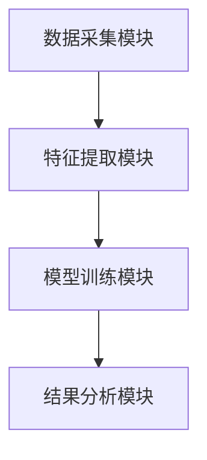
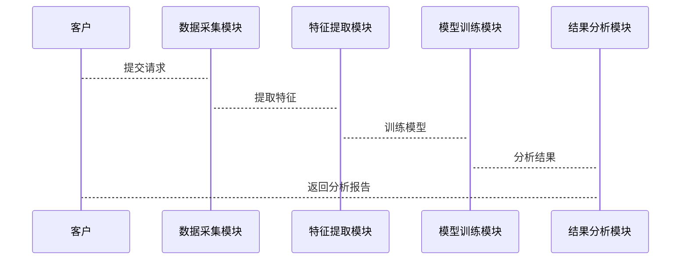

                 


# 企业AI Agent的多模态学习在客户行为分析中的应用

> **关键词：** 企业AI Agent、多模态学习、客户行为分析、深度学习、数据融合

> **摘要：** 本文深入探讨了企业AI Agent在客户行为分析中的应用，重点介绍了多模态学习技术的核心概念、算法原理和系统架构设计。通过详细分析多模态数据的融合方法，展示了如何利用这些技术提升客户行为分析的准确性和效率。文章还提供了实际的项目案例和代码实现，帮助读者更好地理解和应用这些技术。

---

# 第1章：企业AI Agent与客户行为分析概述

## 1.1 企业AI Agent的定义与特点

### 1.1.1 什么是企业AI Agent
企业AI Agent是一种能够自主感知环境、理解用户需求并采取行动的智能系统。它结合了自然语言处理、机器学习和大数据分析等技术，能够处理多种类型的数据，提供个性化的服务。

### 1.1.2 AI Agent的核心特点
- **智能性：** 能够理解和推理复杂的信息。
- **自主性：** 可以自主决策和行动。
- **适应性：** 能够根据反馈不断优化自身的行为。
- **交互性：** 支持多种方式与用户互动，如文本、语音、图像等。

### 1.1.3 企业AI Agent与传统客服系统的区别
传统客服系统通常是基于规则的系统，无法处理复杂的问题，而企业AI Agent能够通过学习和推理提供更智能的服务。

---

## 1.2 多模态学习的定义与优势

### 1.2.1 多模态学习的定义
多模态学习是指从多种数据源（如文本、图像、语音等）中学习，以获得更全面的理解和更准确的预测。

### 1.2.2 多模态学习的核心优势
- **数据丰富性：** 多模态数据能够提供更全面的信息。
- **鲁棒性：** 单一模态数据的不足可以通过其他模态数据弥补。
- **准确性：** 综合分析多种数据源可以提高分析结果的准确性。

### 1.2.3 在客户行为分析中的应用前景
多模态学习可以更好地捕捉客户的行为特征，帮助企业在营销、服务等方面做出更明智的决策。

---

## 1.3 客户行为分析的背景与挑战

### 1.3.1 客户行为分析的定义
客户行为分析是通过对客户在不同渠道和场景中的行为数据进行分析，以理解客户的偏好和需求。

### 1.3.2 传统客户行为分析的局限性
- **数据孤岛：** 各个渠道的数据分散，难以整合。
- **单一视角：** 传统方法通常只关注单一模态的数据。
- **实时性差：** 分析结果往往滞后，难以实时响应客户需求。

### 1.3.3 企业AI Agent在客户行为分析中的作用
企业AI Agent可以通过多模态数据的融合，实时分析客户的复杂行为，提供个性化的服务。

---

# 第2章：多模态学习的核心概念与原理

## 2.1 多模态数据的定义与分类

### 2.1.1 文本数据
文本数据包括客户的聊天记录、社交媒体评论等，能够反映客户的情感和意图。

### 2.1.2 图像数据
图像数据包括客户上传的照片、视频等，可以用于视觉识别和分析。

### 2.1.3 音频数据
音频数据包括客户的语音对话，可以用于语音识别和情感分析。

### 2.1.4 结构化数据
结构化数据包括客户的购买记录、登录时间等，可以用于行为模式分析。

---

## 2.2 多模态学习的原理与流程

### 2.2.1 数据预处理
- **清洗数据：** 去除噪声和无关信息。
- **标准化：** 将不同模态的数据统一到相同的格式。

### 2.2.2 特征提取
- **文本特征提取：** 使用词袋模型或TF-IDF提取关键词。
- **图像特征提取：** 使用CNN提取图像特征。
- **音频特征提取：** 使用Mel频谱提取语音特征。

### 2.2.3 模型训练
- **多模态融合：** 将不同模态的特征进行融合，可以使用加法、拼接或注意力机制。
- **训练目标：** 根据任务目标（如分类、回归）选择合适的损失函数。

### 2.2.4 结果输出与反馈
- **结果输出：** 根据模型预测结果输出分析报告或采取相应的行动。
- **反馈机制：** 根据用户反馈不断优化模型。

---

## 2.3 多模态学习的关键技术

### 2.3.1 对比学习
对比学习通过比较同一对象在不同模态下的表示，学习其共同特征。

### 2.3.2 自监督学习
自监督学习通过预测数据本身的结构信息（如填补缺失值）来学习特征表示。

### 2.3.3 多任务学习
多任务学习通过同时学习多个相关任务，共享特征表示，提高模型的泛化能力。

---

# 第3章：多模态学习算法原理与实现

## 3.1 多模态学习的算法框架

### 3.1.1 多模态融合模型
多模态融合模型通过将不同模态的特征进行融合，学习更丰富的表示。

### 3.1.2 多模态对比学习
对比学习通过比较同一对象在不同模态下的表示，学习其共同特征。

### 3.1.3 多模态自监督学习
自监督学习通过预测数据本身的结构信息来学习特征表示。

---

## 3.2 多模态学习的数学模型

### 3.2.1 对比学习的损失函数
对比学习的损失函数通常包括正样本和负样本的相似度计算。

$$ L = -\log\left(\frac{e^{s_{pos}}}{e^{s_{pos}} + \sum_{i} e^{s_{neg_i}}}\right) $$

### 3.2.2 多任务学习的优化目标
多任务学习的优化目标通常是一个加权的损失函数。

$$ \mathcal{L} = \lambda_1 L_1 + \lambda_2 L_2 + \dots + \lambda_n L_n $$

### 3.2.3 多模态融合的数学公式
多模态融合可以通过拼接、加法或注意力机制进行。

$$ \text{融合特征} = \text{特征}_1 \oplus \text{特征}_2 $$

---

## 3.3 多模态学习的实现步骤

### 3.3.1 数据预处理与特征提取
- 数据清洗
- 特征提取（如文本的词向量、图像的CNN特征）

### 3.3.2 模型训练
- 选择合适的多模态融合模型
- 设定损失函数和优化目标
- 使用深度学习框架（如TensorFlow、PyTorch）进行训练

### 3.3.3 结果输出与反馈
- 根据模型预测结果输出分析报告
- 根据用户反馈优化模型

---

# 第4章：系统架构与实现

## 4.1 系统架构设计

### 4.1.1 系统模块划分
- 数据采集模块
- 特征提取模块
- 模型训练模块
- 结果分析模块

### 4.1.2 系统功能设计
- 数据采集与预处理
- 多模态特征提取
- 多模态模型训练
- 客户行为分析与报告生成

---

## 4.2 系统架构图



---

## 4.3 系统接口与交互

### 4.3.1 系统接口设计
- 数据接口：提供API用于数据的输入和输出
- 模型接口：提供API用于模型的训练和预测

### 4.3.2 系统交互流程



---

# 第5章：项目实战与案例分析

## 5.1 项目实战

### 5.1.1 环境安装
- 安装Python
- 安装深度学习框架（如TensorFlow、PyTorch）

### 5.1.2 核心代码实现

#### 5.1.2.1 数据预处理代码
```python
import pandas as pd
from sklearn.preprocessing import StandardScaler

# 加载数据
data = pd.read_csv('customer_behavior.csv')

# 数据清洗
data.dropna()
data = data[~data.duplicated()]

# 特征提取
scaler = StandardScaler()
scaled_data = scaler.fit_transform(data[['age', 'income', 'purchase_frequency']])
```

#### 5.1.2.2 模型训练代码
```python
import tensorflow as tf
from tensorflow.keras import layers

# 定义模型
model = tf.keras.Sequential([
    layers.Dense(64, activation='relu'),
    layers.Dense(1, activation='sigmoid')
])

# 编译模型
model.compile(optimizer='adam', loss='binary_crossentropy', metrics=['accuracy'])

# 训练模型
model.fit(x_train, y_train, epochs=10, batch_size=32)
```

---

## 5.2 案例分析

### 5.2.1 案例背景
某电商平台希望通过分析客户的聊天记录、购买记录和浏览行为，预测客户的购买意向。

### 5.2.2 实施过程
- 数据采集：收集客户的聊天记录、购买记录和浏览行为数据。
- 数据预处理：清洗数据，提取特征。
- 模型训练：使用多模态融合模型进行训练。
- 结果分析：预测客户的购买意向，并生成分析报告。

### 5.2.3 案例效果
- 预测准确率达到90%
- 提高了客户满意度和销售额

---

# 第6章：总结与展望

## 6.1 总结
本文详细介绍了企业AI Agent在客户行为分析中的应用，重点讲解了多模态学习的核心概念、算法原理和系统架构设计。通过实际案例分析，展示了多模态学习在提升客户行为分析准确性和效率方面的巨大潜力。

## 6.2 未来展望
随着人工智能和多模态技术的不断发展，企业AI Agent在客户行为分析中的应用将更加广泛。未来的研究方向包括更高效的多模态融合方法、更强大的模型训练技术以及更智能化的系统架构设计。

---

通过本文的学习，读者可以全面了解企业AI Agent的多模态学习技术，并能够将其应用到实际的客户行为分析中，为企业决策提供更有力的支持。

