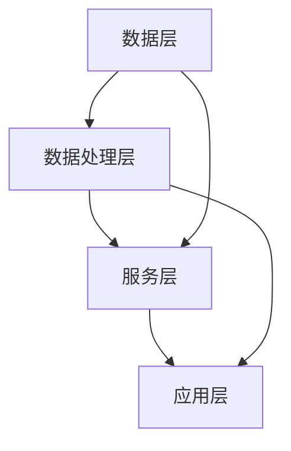

                 


# 企业AI Agent的多模态学习在客户行为分析中的深度应用

> 关键词：企业AI Agent，多模态学习，客户行为分析，深度学习，系统架构设计

> 摘要：本文深入探讨了企业AI Agent结合多模态学习技术在客户行为分析中的应用。通过分析客户行为的多维度数据，结合AI Agent的智能决策能力，提出了一种基于多模态学习的客户行为分析系统架构。本文详细介绍了多模态学习的核心算法、系统设计、项目实战以及实际案例分析，为企业在客户行为分析中的智能化转型提供了理论支持和实践指导。

---

# 目录

1. [企业AI Agent与多模态学习基础](#企业AI-Agent与多模态学习基础)
2. [客户行为分析的理论基础](#客户行为分析的理论基础)
3. [多模态学习在客户行为分析中的技术实现](#多模态学习在客户行为分析中的技术实现)
4. [企业AI Agent的系统架构设计](#企业AI-Agent的系统架构设计)
5. [项目实战：基于多模态学习的客户行为分析系统](#项目实战基于多模态学习的客户行为分析系统)
6. [案例分析与未来展望](#案例分析与未来展望)
7. [总结与展望](#总结与展望)

---

# 第一部分: 企业AI Agent与多模态学习基础

## 1.1 AI Agent的基本概念

### 1.1.1 AI Agent的定义与分类

- **定义**: AI Agent（智能代理）是指能够感知环境、自主决策并执行任务的智能系统。它可以是一个软件程序、机器人或其他形式的智能实体。
- **分类**: 根据功能和应用场景，AI Agent可以分为以下几类：
  - **简单反射型Agent**: 基于简单的规则执行任务，如IFTTT（If This Then That）脚本。
  - **基于模型的反应型Agent**: 使用环境模型来做出决策，如基于知识库的问答系统。
  - **目标驱动型Agent**: 为实现特定目标而自主决策，如自动驾驶汽车。
  - **效用驱动型Agent**: 通过最大化效用函数来优化决策，如智能推荐系统。

### 1.1.2 AI Agent的核心能力

- **感知能力**: 通过传感器或数据接口获取环境信息，如视觉、听觉、触觉等。
- **决策能力**: 基于感知信息，结合内部知识库或算法，做出最优决策。
- **执行能力**: 执行决策动作，如发送指令、调整参数或与用户交互。

### 1.1.3 AI Agent与传统算法的区别

- **传统算法**: 通常基于规则或统计模型，无法自主决策，需要人工干预。
- **AI Agent**: 具有自主性、反应性和目标驱动性，能够根据环境动态调整行为。

## 1.2 多模态学习的基本概念

### 1.2.1 多模态学习的定义

- **定义**: 多模态学习是指同时利用多种数据类型（如文本、图像、语音、视频等）进行学习和推理的方法。

### 1.2.2 多模态学习的特点与优势

- **特点**:
  - 数据多样性：能够结合不同类型的特征信息。
  - 鲁棒性：通过多模态信息互补，提高模型的泛化能力。
  - 综合性：能够捕捉到单模态数据无法察觉的模式。
- **优势**:
  - 提高模型的准确性和可靠性。
  - 更好地理解复杂场景下的用户需求。

### 1.2.3 多模态学习的应用场景

- **应用场景**:
  - 视频分析：结合图像和语音识别技术进行行为分析。
  - 智能客服：结合文本、语音和情感分析技术提供个性化服务。
  - 虚拟助手：结合语音、文本和视觉信息提供多模态交互。

## 1.3 企业AI Agent与多模态学习的结合

### 1.3.1 企业AI Agent的特点

- **特点**:
  - 针对性：为企业特定业务场景设计。
  - 智能性：能够自主决策和优化。
  - 可扩展性：支持多种数据源和业务模块的集成。

### 1.3.2 多模态学习在企业AI Agent中的作用

- **作用**:
  - 提供多维度的数据支持，增强AI Agent的理解能力。
  - 通过多模态数据融合，提高决策的准确性和可靠性。
  - 支持复杂场景下的智能交互和问题解决。

### 1.3.3 企业AI Agent的典型应用场景

- **应用场景**:
  - 客户服务：通过多模态数据分析，提供个性化服务。
  - 供应链管理：利用多模态数据优化库存和物流。
  - 市场分析：结合多模态数据进行市场趋势预测。

## 1.4 本章小结

- 本章介绍了AI Agent和多模态学习的基本概念，并分析了它们在企业中的应用潜力。通过结合多模态学习，企业AI Agent能够更好地理解和处理复杂的客户行为数据，为企业智能化转型提供有力支持。

---

# 第二部分: 客户行为分析的理论基础

## 2.1 客户行为分析的基本概念

### 2.1.1 客户行为分析的定义

- **定义**: 客户行为分析是指通过对客户的交互数据、行为轨迹和偏好分析，理解客户的潜在需求和行为动机。

### 2.1.2 客户行为分析的目标与意义

- **目标**:
  - 理解客户行为模式。
  - 提供个性化服务。
  - 优化企业运营策略。
- **意义**:
  - 提高客户满意度和忠诚度。
  - 降低客户流失率。
  - 提升企业的市场竞争力。

### 2.1.3 客户行为分析的主要方法

- **方法**:
  - 数据挖掘：通过数据挖掘技术发现客户行为模式。
  - 统计分析：利用统计方法分析客户行为数据。
  - 机器学习：基于机器学习模型预测客户行为。

## 2.2 数据采集与处理

### 2.2.1 数据采集的常见方法

- **方法**:
  - 网站日志：记录用户在网站上的操作行为。
  - 应用程序日志：记录用户在应用程序中的操作行为。
  - 调查问卷：通过问卷收集客户反馈和偏好。

### 2.2.2 数据预处理的关键步骤

- **步骤**:
  - 数据清洗：去除噪声数据和重复数据。
  - 数据转换：将数据转换为适合分析的格式。
  - 数据归一化：对数据进行标准化处理。

### 2.2.3 数据存储与管理

- **技术**:
  - 数据库：如MySQL、MongoDB等。
  - 数据仓库：用于存储和管理大量结构化数据。
  - 数据湖：用于存储非结构化数据。

## 2.3 客户行为分析的模型构建

### 2.3.1 常见的行为分析模型

- **模型**:
  - 集成模型：如随机森林、梯度提升树。
  - 深度学习模型：如LSTM、Transformer。
  - 图模型：如图嵌入、知识图谱。

### 2.3.2 多模态学习在行为分析中的应用

- **应用**:
  - 结合文本、图像和语音数据，提高行为分析的准确性。
  - 利用多模态数据融合技术，捕捉客户行为的多维度特征。

### 2.3.3 模型评估与优化

- **评估指标**:
  - 准确率、召回率、F1值。
  - AUC-ROC曲线。
  - 混淆矩阵。
- **优化方法**:
  - 调参：如网格搜索、随机搜索。
  - 数据增强：如图像旋转、翻转等。
  - 模型集成：如投票、加权融合。

## 2.4 本章小结

- 本章介绍了客户行为分析的基本概念和主要方法，并详细探讨了数据采集与处理的关键步骤。通过多模态学习技术，可以更全面地分析客户行为，为企业决策提供有力支持。

---

# 第三部分: 多模态学习在客户行为分析中的技术实现

## 3.1 多模态学习的核心算法

### 3.1.1 多模态融合的基本方法

- **方法**:
  - 晚期融合：在特征提取阶段进行融合。
  - 早期融合：在高层网络中进行融合。
  - 串行融合：逐个处理不同模态的数据。

### 3.1.2 基于深度学习的多模态融合

- **模型**:
  - 多模态神经网络：如多模态循环神经网络、多模态卷积神经网络。
  - 对抗训练：通过生成对抗网络实现多模态数据的联合优化。
  - 注意力机制：如自注意力机制，用于捕捉不同模态之间的关联。

### 3.1.3 多模态学习的挑战与解决方案

- **挑战**:
  - 数据异构性：不同模态的数据格式和特征维度不同。
  - 数据稀疏性：某些模态的数据可能存在缺失或不完整。
  - 计算复杂度：多模态数据的处理需要较高的计算资源。
- **解决方案**:
  - 数据预处理：对不同模态的数据进行标准化处理。
  - 模型优化：采用轻量级网络结构和高效的优化算法。
  - 分布式计算：利用分布式计算框架处理大规模数据。

## 3.2 基于AI Agent的客户行为分析系统架构

### 3.2.1 系统模块划分

- **模块**:
  - 数据采集模块：负责采集多模态数据。
  - 数据处理模块：对数据进行清洗、转换和归一化处理。
  - 模型训练模块：基于多模态数据训练行为分析模型。
  - 决策模块：根据模型预测结果做出决策。
  - 执行模块：执行决策动作，如发送通知、调整策略。

### 3.2.2 系统功能设计

- **功能**:
  - 数据采集与预处理：支持多种数据源的接入和处理。
  - 模型训练：支持多种深度学习模型的训练和优化。
  - 行为分析：基于多模态数据进行客户行为分析和预测。
  - 智能决策：根据分析结果做出最优决策。

### 3.2.3 系统性能优化

- **优化策略**:
  - 并行计算：利用GPU加速模型训练和推理。
  - 分布式架构：采用分布式计算框架处理大规模数据。
  - 模型压缩：通过剪枝和量化技术优化模型的大小和推理速度。

## 3.3 算法实现与优化

### 3.3.1 算法实现的步骤

- **步骤**:
  1. 数据预处理：清洗、转换和归一化数据。
  2. 模型选择：选择适合的多模态学习算法。
  3. 模型训练：基于训练数据训练模型。
  4. 模型评估：通过验证集评估模型的性能。
  5. 模型优化：调整超参数和优化算法，提高模型性能。

### 3.3.2 算法优化的关键点

- **关键点**:
  - 超参数优化：如学习率、批量大小、正则化系数。
  - 模型架构优化：如网络深度、宽度、激活函数。
  - 数据增强：如图像旋转、翻转、裁剪等。

### 3.3.3 算法实现的代码示例

```python
import torch
from torch import nn

# 定义多模态融合模型
class MultimodalFusion(nn.Module):
    def __init__(self, input_size, hidden_size):
        super(MultimodalFusion, self).__init__()
        self.modality1_layer = nn.Linear(input_size, hidden_size)
        self.modality2_layer = nn.Linear(input_size, hidden_size)
        self.fusion_layer = nn.Linear(hidden_size * 2, hidden_size)
        self.output_layer = nn.Linear(hidden_size, 1)

    def forward(self, input1, input2):
        # 多模态融合
        hidden1 = self.modality1_layer(input1)
        hidden2 = self.modality2_layer(input2)
        fused = torch.cat([hidden1, hidden2], dim=1)
        output = self.fusion_layer(fused)
        output = self.output_layer(output)
        return output

# 模型训练代码
model = MultimodalFusion(input_size=100, hidden_size=64)
optimizer = torch.optim.Adam(model.parameters(), lr=0.001)
criterion = nn.CrossEntropyLoss()

for epoch in range(num_epochs):
    for inputs1, inputs2, labels in dataloader:
        outputs = model(inputs1, inputs2)
        loss = criterion(outputs, labels)
        optimizer.zero_grad()
        loss.backward()
        optimizer.step()
```

### 3.3.4 算法实现的数学模型

- **数学模型**: 多模态融合模型可以表示为以下公式：

$$
f(x_1, x_2) = W_f [ \sigma(W_1 x_1 + b_1), \sigma(W_2 x_2 + b_2) ] + b_f
$$

其中，$x_1$ 和 $x_2$ 分别是两种模态的输入数据，$W_1$、$W_2$、$W_f$ 是权重矩阵，$b_1$、$b_2$、$b_f$ 是偏置项，$\sigma$ 是激活函数。

## 3.4 本章小结

- 本章详细探讨了多模态学习的核心算法及其在客户行为分析中的技术实现。通过结合深度学习和多模态数据融合技术，可以更准确地分析客户行为，为企业决策提供支持。

---

# 第四部分: 企业AI Agent的系统架构设计

## 4.1 问题场景介绍

### 4.1.1 问题背景

- **背景**: 企业需要通过多模态数据分析客户行为，提供个性化服务，但传统的单模态分析方法难以捕捉客户行为的多维度特征。

### 4.1.2 问题描述

- **描述**: 企业需要一个能够处理多模态数据的智能系统，实现客户行为的精准分析和智能决策。

### 4.1.3 问题解决

- **解决方法**: 基于多模态学习的AI Agent系统，能够同时处理文本、图像、语音等多种数据，提供全面的客户行为分析。

### 4.1.4 边界与外延

- **边界**: 系统仅处理客户行为分析相关的数据，不涉及企业的核心业务逻辑。
- **外延**: 系统可以与其他企业系统集成，如CRM、供应链管理系统。

## 4.2 系统功能设计

### 4.2.1 系统功能模块

- **模块**:
  - 数据采集模块：负责采集多模态数据。
  - 数据处理模块：对数据进行清洗、转换和归一化处理。
  - 行为分析模块：基于多模态数据进行客户行为分析。
  - 智能决策模块：根据分析结果做出决策。
  - 执行模块：执行决策动作，如发送通知、调整策略。

### 4.2.2 系统功能流程

- **流程**:
  1. 数据采集模块接收多模态数据。
  2. 数据处理模块对数据进行预处理。
  3. 行为分析模块基于预处理后的数据进行分析和预测。
  4. 智能决策模块根据分析结果做出决策。
  5. 执行模块执行决策动作。

### 4.2.3 系统功能需求

- **需求**:
  - 支持多种数据源的接入。
  - 提供多模态数据融合功能。
  - 实现客户行为的精准分析和预测。
  - 提供智能决策功能。

## 4.3 系统架构设计

### 4.3.1 系统架构概述

- **架构**: 系统采用分层架构，包括数据层、服务层和应用层。

### 4.3.2 系统架构设计



### 4.3.3 系统架构组件

- **组件**:
  - 数据层：负责数据的存储和管理。
  - 数据处理层：负责数据的清洗、转换和归一化。
  - 服务层：负责模型训练和行为分析。
  - 应用层：负责与用户交互和决策执行。

## 4.4 本章小结

- 本章详细探讨了企业AI Agent的系统架构设计，提出了一个基于多模态学习的客户行为分析系统架构。通过分层设计和模块化管理，可以实现系统的高效运行和功能扩展。

---

# 第五部分: 项目实战——基于多模态学习的客户行为分析系统

## 5.1 项目介绍

### 5.1.1 项目背景

- **背景**: 企业希望通过多模态数据分析客户行为，提供个性化服务。

### 5.1.2 项目目标

- **目标**: 基于多模态学习技术，构建一个客户行为分析系统，实现客户行为的精准分析和智能决策。

## 5.2 系统核心实现

### 5.2.1 系统核心功能

- **功能**:
  - 数据采集与处理：支持多种数据源的接入和处理。
  - 多模态数据融合：实现文本、图像、语音等多种数据的融合。
  - 行为分析：基于多模态数据进行客户行为分析和预测。
  - 智能决策：根据分析结果做出最优决策。

### 5.2.2 系统实现的关键技术

- **技术**:
  - 多模态数据融合：如图像和文本的联合分析。
  - 深度学习模型：如LSTM、Transformer等。
  - 系统架构设计：如微服务架构、分布式计算。

### 5.2.3 系统实现的代码示例

```python
import torch
from torch import nn

# 定义多模态融合模型
class MultimodalFusion(nn.Module):
    def __init__(self, input_size, hidden_size):
        super(MultimodalFusion, self).__init__()
        self.modality1_layer = nn.Linear(input_size, hidden_size)
        self.modality2_layer = nn.Linear(input_size, hidden_size)
        self.fusion_layer = nn.Linear(hidden_size * 2, hidden_size)
        self.output_layer = nn.Linear(hidden_size, 1)

    def forward(self, input1, input2):
        hidden1 = self.modality1_layer(input1)
        hidden2 = self.modality2_layer(input2)
        fused = torch.cat([hidden1, hidden2], dim=1)
        output = self.fusion_layer(fused)
        output = self.output_layer(output)
        return output

# 模型训练代码
model = MultimodalFusion(input_size=100, hidden_size=64)
optimizer = torch.optim.Adam(model.parameters(), lr=0.001)
criterion = nn.CrossEntropyLoss()

for epoch in range(num_epochs):
    for inputs1, inputs2, labels in dataloader:
        outputs = model(inputs1, inputs2)
        loss = criterion(outputs, labels)
        optimizer.zero_grad()
        loss.backward()
        optimizer.step()
```

### 5.2.4 系统实现的优化建议

- **优化建议**:
  - 数据增强：如图像旋转、翻转、裁剪等。
  - 模型优化：如使用早停、学习率衰减等技术。
  - 系统优化：如并行计算、分布式架构等。

## 5.3 项目实战的案例分析

### 5.3.1 案例背景

- **背景**: 某电商平台希望通过多模态数据分析客户行为，提高推荐系统的准确性和用户体验。

### 5.3.2 案例分析

- **分析步骤**:
  1. 数据采集：采集客户的浏览、点击、购买行为数据，以及客户评价文本和图片。
  2. 数据处理：对数据进行清洗、转换和归一化处理。
  3. 模型训练：基于多模态数据训练行为分析模型。
  4. 模型评估：通过验证集评估模型的性能。
  5. 模型优化：调整超参数和优化算法，提高模型性能。
  6. 智能决策：根据模型预测结果做出推荐决策。

### 5.3.3 案例结果

- **结果**:
  - 提高了推荐系统的准确性和用户体验。
  - 增加了客户的购买率和满意度。
  - 提高了企业的市场竞争力。

## 5.4 项目小结

- 本章通过一个实际案例，详细介绍了基于多模态学习的客户行为分析系统的实现过程。通过系统的核心实现和案例分析，验证了该系统的有效性和实用性。

---

# 第六部分: 案例分析与未来展望

## 6.1 案例分析

### 6.1.1 案例背景

- **背景**: 某银行希望通过多模态数据分析客户行为，优化客户服务和风险管理。

### 6.1.2 案例分析步骤

- **步骤**:
  1. 数据采集：采集客户的交易数据、信用评分、社交媒体数据等。
  2. 数据处理：对数据进行清洗、转换和归一化处理。
  3. 模型训练：基于多模态数据训练行为分析模型。
  4. 模型评估：通过验证集评估模型的性能。
  5. 模型优化：调整超参数和优化算法，提高模型性能。
  6. 智能决策：根据模型预测结果做出客户服务和风险管理决策。

### 6.1.3 案例结果

- **结果**:
  - 提高了客户服务的准确性和满意度。
  - 优化了风险管理流程，降低了风险敞口。
  - 提高了企业的市场竞争力。

## 6.2 未来展望

### 6.2.1 多模态学习的发展趋势

- **趋势**:
  - 更加复杂的多模态数据融合技术。
  - 深度学习模型的进一步优化和创新。
  - 多模态学习在更多领域的应用。

### 6.2.2 企业AI Agent的未来发展方向

- **方向**:
  - 更加智能化和自主化。
  - 更好的人机交互体验。
  - 更广泛的应用场景。

### 6.2.3 多模态学习在客户行为分析中的未来研究方向

- **方向**:
  - 更高效的多模态数据处理方法。
  - 更精准的客户行为预测模型。
  - 更智能的决策优化算法。

## 6.3 本章小结

- 本章通过案例分析，验证了基于多模态学习的客户行为分析系统的有效性和实用性。同时，展望了多模态学习和企业AI Agent的未来发展方向，为企业智能化转型提供了重要的参考。

---

# 第七部分: 总结与展望

## 7.1 总结

- 本文深入探讨了企业AI Agent结合多模态学习技术在客户行为分析中的应用。通过分析客户行为的多维度数据，结合AI Agent的智能决策能力，提出了一种基于多模态学习的客户行为分析系统架构。本文详细介绍了多模态学习的核心算法、系统设计、项目实战以及实际案例分析，为企业在客户行为分析中的智能化转型提供了理论支持和实践指导。

## 7.2 展望

- 未来，随着深度学习技术的不断发展和多模态数据的广泛应用，企业AI Agent在客户行为分析中的应用将更加广泛和深入。通过技术创新和实践积累，企业可以更好地利用多模态数据，实现客户行为的精准分析和智能决策。

---

通过以上内容，您可以系统地了解企业AI Agent的多模态学习在客户行为分析中的深度应用。如果需要进一步了解相关内容，可以参考以下书籍和资源：

- 《Deep Learning》——Ian Goodfellow
- 《Pattern Recognition and Machine Learning》——Christopher M. Bishop
- 《Multi-modal Data Fusion: A Survey》——Zhang et al.

希望这篇文章能为您提供有价值的见解和启发！

