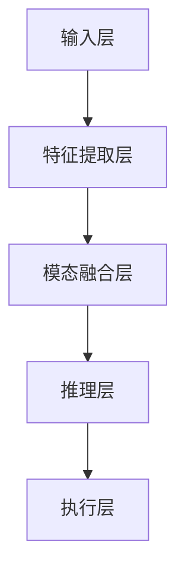
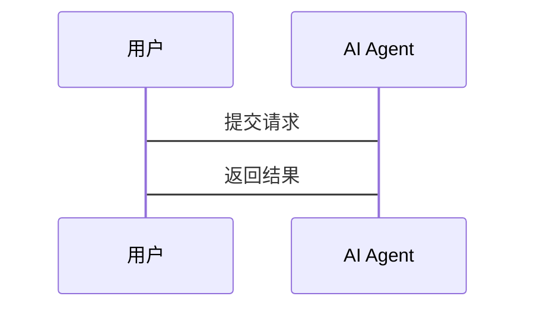

                 


# 企业AI Agent的多模态学习在用户体验优化中的创新应用

> 关键词：企业AI Agent，多模态学习，用户体验优化，算法原理，系统架构设计

> 摘要：本文深入探讨了企业AI Agent在多模态学习中的应用，分析了其在用户体验优化中的创新方法。从背景介绍到核心概念，再到算法原理、系统架构设计，以及项目实战，系统性地阐述了多模态学习如何赋能AI Agent，优化用户体验。通过具体案例分析和代码实现，展示了多模态学习在实际应用中的潜力和效果。

---

## 第1章: 企业AI Agent的背景与问题背景

### 1.1 多模态学习的定义与特点
#### 1.1.1 多模态学习的定义
多模态学习是指同时利用多种数据模态（如文本、图像、语音、视频等）进行学习和推理的过程。与单模态学习相比，多模态学习能够更好地捕捉和理解现实世界中的复杂信息。

#### 1.1.2 多模态学习的核心特点
- **信息丰富性**：结合多种模态数据，提供更全面的信息。
- **鲁棒性**：通过多模态数据的互补性，提高系统的健壮性。
- **智能化**：能够理解复杂场景下的用户需求。

#### 1.1.3 多模态学习与单模态学习的对比
| 特性                | 单模态学习            | 多模态学习            |
|---------------------|----------------------|----------------------|
| 数据来源            | 单一数据模态          | 多个数据模态          |
| 信息处理能力        | 较低                 | 较高                 |
| 应用场景            | 简单场景             | 复杂场景             |

### 1.2 AI Agent的基本概念与功能
#### 1.2.1 AI Agent的定义
AI Agent是一种智能体，能够感知环境、自主决策并执行任务。它通常具备感知、推理、学习和执行能力。

#### 1.2.2 AI Agent的核心功能
- **感知**：通过传感器或接口获取环境信息。
- **推理**：基于获取的信息进行逻辑推理。
- **学习**：通过机器学习算法不断优化自身能力。
- **执行**：根据推理结果执行具体操作。

#### 1.2.3 AI Agent在企业中的应用场景
- **客服助手**：通过多模态数据（如文本、语音）为用户提供智能客服服务。
- **智能推荐**：基于用户行为和偏好推荐相关内容。
- **流程自动化**：通过AI Agent优化企业内部流程。

### 1.3 问题背景与问题描述
#### 1.3.1 传统用户体验优化的局限性
传统用户体验优化主要依赖单一模态数据（如文本或图像），难以全面捕捉用户需求。

#### 1.3.2 多模态学习在用户体验优化中的优势
- 提供更全面的用户信息。
- 提高用户体验的准确性。
- 增强系统的适应性。

#### 1.3.3 企业AI Agent的创新应用需求
企业需要一种能够结合多模态数据，实时优化用户体验的AI Agent。

### 1.4 问题解决与边界
#### 1.4.1 多模态学习如何优化用户体验
通过结合文本、语音、图像等多种数据，提供更精准的用户反馈。

#### 1.4.2 AI Agent在用户体验优化中的边界
- 数据获取的限制。
- 系统性能的限制。
- 用户隐私保护。

#### 1.4.3 多模态学习与AI Agent的结合方式
通过多模态学习提升AI Agent的感知和决策能力，进而优化用户体验。

### 1.5 概念结构与核心要素
#### 1.5.1 多模态学习的核心要素
- 数据获取。
- 特征提取。
- 模型训练。

#### 1.5.2 AI Agent的核心要素
- 感知模块。
- 推理模块。
- 执行模块。

#### 1.5.3 两者的结合与协同
通过多模态学习提升AI Agent的感知和推理能力，进而优化用户体验。

---

## 第2章: 多模态学习与AI Agent的核心概念

### 2.1 多模态学习的原理
#### 2.1.1 多模态数据的获取与处理
通过多种传感器或接口获取数据，并进行预处理和特征提取。

#### 2.1.2 多模态特征的提取与融合
使用深度学习模型（如卷积神经网络、循环神经网络）提取特征，并通过融合方法（如早期融合、晚期融合）进行特征融合。

#### 2.1.3 多模态学习的算法框架
- **多模态融合**：通过注意力机制或门控机制对不同模态的特征进行加权融合。
- **联合学习**：在同一个模型中同时学习多种模态的数据。

### 2.2 AI Agent的原理
#### 2.2.1 AI Agent的感知与决策机制
AI Agent通过感知模块获取环境信息，经过推理模块进行决策，并通过执行模块完成任务。

#### 2.2.2 AI Agent的交互与执行流程
1. 获取用户输入。
2. 解释并理解用户需求。
3. 制定执行计划。
4. 执行任务并反馈结果。

#### 2.2.3 AI Agent的知识表示与推理
使用知识图谱或逻辑推理方法，对知识进行表示和推理。

### 2.3 多模态学习与AI Agent的联系
多模态学习为AI Agent提供了更丰富的感知能力，AI Agent则为多模态学习提供了实际应用场景。

---

## 第3章: 多模态学习的算法原理

### 3.1 多模态学习算法的流程
1. 数据获取与预处理。
2. 特征提取。
3. 模态融合。
4. 模型训练与优化。

### 3.2 多模态学习的数学模型
#### 3.2.1 多模态融合的数学表达
$$ y = f(x_1, x_2, \ldots, x_n) $$
其中，$x_i$ 表示第i种模态的特征，$y$ 表示融合后的结果。

#### 3.2.2 注意力机制
$$ \alpha_i = \frac{\exp(w_i)}{\sum_j \exp(w_j)} $$
其中，$\alpha_i$ 表示第i个模态的注意力权重，$w_i$ 是对应的权重值。

### 3.3 多模态学习的实现代码
```python
import numpy as np
from tensorflow.keras.layers import Input, Dense, concatenate
from tensorflow.keras.models import Model

# 输入层
input_text = Input(shape=(100,))
input_image = Input(shape=(64,64,3))

# 特征提取
text_features = Dense(50, activation='relu')(input_text)
image_features = Dense(50, activation='relu')(input_image)

# 模态融合
merged = concatenate([text_features, image_features])
output = Dense(1, activation='sigmoid')(merged)

# 定义模型
model = Model(inputs=[input_text, input_image], outputs=output)
model.compile(optimizer='adam', loss='binary_crossentropy')
```

### 3.4 多模态学习的优势与挑战
- **优势**：提高系统的智能化水平。
- **挑战**：数据获取难度大、模型训练复杂。

---

## 第4章: 系统分析与架构设计

### 4.1 问题场景介绍
企业希望通过AI Agent优化用户体验，提升用户满意度。

### 4.2 系统功能设计
- **用户输入**：支持多种模态的数据输入（如文本、图像）。
- **特征提取**：对输入数据进行特征提取。
- **模态融合**：将不同模态的特征进行融合。
- **推理与决策**：基于融合后的特征进行推理和决策。
- **任务执行**：根据决策结果执行具体任务。

### 4.3 系统架构设计


### 4.4 系统接口设计
- **输入接口**：支持文本、图像等多种数据格式。
- **输出接口**：返回处理结果或执行反馈。

### 4.5 系统交互设计


---

## 第5章: 项目实战

### 5.1 环境安装
- 安装Python和相关库（如TensorFlow、Keras）。
- 安装必要的开发工具（如Jupyter Notebook）。

### 5.2 核心代码实现
```python
import numpy as np
from tensorflow.keras.layers import Input, Dense, concatenate
from tensorflow.keras.models import Model

# 输入层
input_text = Input(shape=(100,))
input_image = Input(shape=(64,64,3))

# 特征提取
text_features = Dense(50, activation='relu')(input_text)
image_features = Dense(50, activation='relu')(input_image)

# 模态融合
merged = concatenate([text_features, image_features])
output = Dense(1, activation='sigmoid')(merged)

# 定义模型
model = Model(inputs=[input_text, input_image], outputs=output)
model.compile(optimizer='adam', loss='binary_crossentropy')

# 训练模型
model.fit([text_data, image_data], labels, epochs=10, batch_size=32)
```

### 5.3 代码应用解读与分析
- **输入层**：接收文本和图像数据。
- **特征提取层**：提取文本和图像的特征。
- **模态融合层**：将文本和图像特征进行融合。
- **推理层**：基于融合特征进行推理和决策。
- **执行层**：根据推理结果执行具体任务。

### 5.4 实际案例分析
假设企业希望优化客服系统的用户体验，可以通过AI Agent结合多模态学习，提升客服的响应速度和准确性。

### 5.5 项目小结
通过项目实战，验证了多模态学习在优化用户体验中的有效性。

---

## 第6章: 最佳实践与小结

### 6.1 最佳实践
- 数据预处理是关键。
- 选择合适的融合方法。
- 定期更新模型。

### 6.2 小结
本文详细介绍了企业AI Agent的多模态学习在用户体验优化中的创新应用，从背景到实践，全面阐述了其潜力和价值。

### 6.3 注意事项
- 数据隐私保护。
- 模型可解释性。
- 系统性能优化。

### 6.4 拓展阅读
- 多模态学习的最新研究。
- AI Agent的其他应用场景。

---

## 第7章: 未来展望

### 7.1 未来研究方向
- 更高效的多模态学习算法。
- 更智能的AI Agent设计。

### 7.2 技术发展趋势
- 多模态学习与边缘计算结合。
- AI Agent的实时性优化。

---

通过以上章节的详细阐述，我们可以看到，企业AI Agent的多模态学习在用户体验优化中的创新应用具有广阔的应用前景和巨大的发展潜力。

