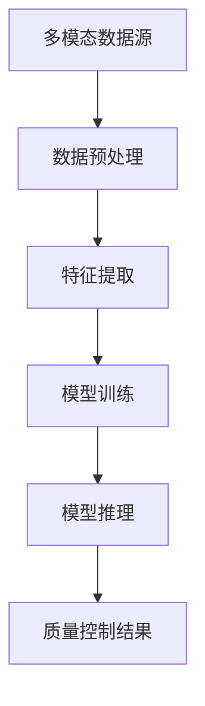
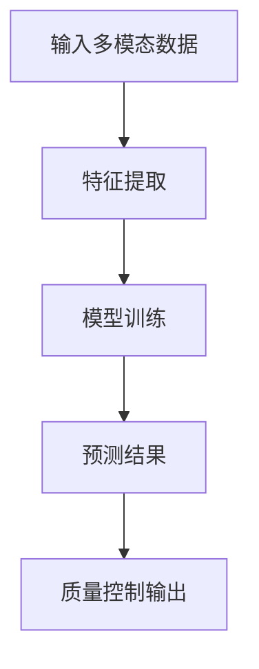
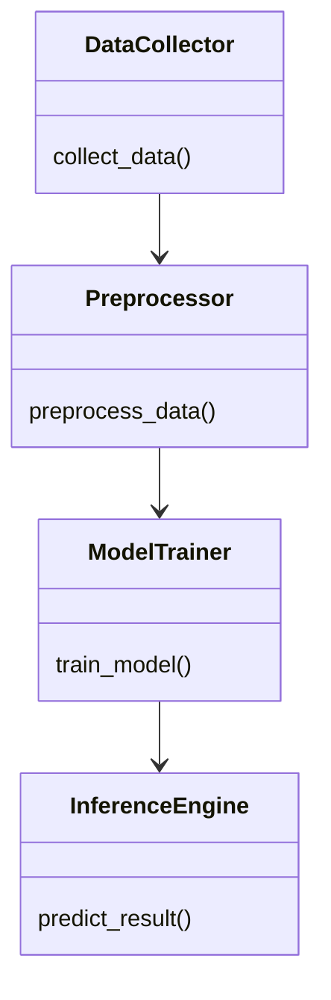
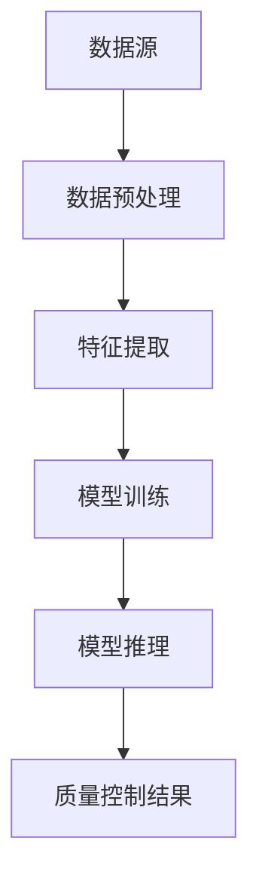

                 


# 《企业AI Agent的多模态学习在质量控制中的应用》

## 关键词：企业AI Agent、多模态学习、质量控制、多模态数据融合、深度学习

## 摘要：本文探讨了企业AI Agent在多模态学习技术下的质量控制应用，分析了多模态学习的核心概念、算法原理、系统架构，并通过实际案例展示了其在企业质量控制中的优势和挑战。文章详细介绍了多模态数据融合方法、AI Agent的技术优势以及系统实现方案，为企业的智能化转型提供了理论支持和实践指导。

---

## 第1章：企业AI Agent与多模态学习概述

### 1.1 企业AI Agent的定义与特点
- **1.1.1 企业AI Agent的定义**：企业AI Agent是一种具备自主决策能力的智能系统，能够通过多模态数据感知环境、分析问题并执行任务。
- **1.1.2 企业AI Agent的核心特点**：
  - **自主性**：无需人工干预，自动完成任务。
  - **反应性**：实时感知环境变化并做出响应。
  - **学习能力**：通过多模态数据不断优化自身的决策模型。
  - **协作性**：能够与其他系统或人员协同工作。
- **1.1.3 企业AI Agent与传统AI的区别**：企业AI Agent具备更强的自主性和适应性，能够处理复杂多变的现实场景。

### 1.2 多模态学习的定义与技术优势
- **1.2.1 多模态学习的定义**：多模态学习是指同时利用多种数据模态（如文本、图像、语音、传感器数据等）来提升模型的学习能力和决策能力。
- **1.2.2 多模态学习的技术优势**：
  - **提高准确性**：通过多模态数据的互补性，提升模型的准确性。
  - **增强鲁棒性**：单一模态数据的局限性可以通过其他模态数据进行补偿。
  - **适用复杂场景**：能够处理单一模态无法解决的复杂问题。
- **1.2.3 多模态学习在企业中的应用前景**：随着企业智能化转型的推进，多模态学习将在质量控制、生产优化等领域发挥重要作用。

### 1.3 企业AI Agent在质量控制中的应用背景
- **1.3.1 质量控制的定义与挑战**：
  - **定义**：质量控制是指通过检测和评估产品或服务的特性，确保其符合既定标准的过程。
  - **挑战**：
    - 数据多样性：产品质量受多种因素影响，数据来源复杂。
    - 数据实时性：需要快速处理和分析数据，以实现实时质量监控。
    - 数据准确性：依赖于高精度的传感器和模型。
- **1.3.2 企业AI Agent在质量控制中的作用**：
  - **实时监测**：通过多模态数据实时监控生产过程。
  - **异常检测**：快速识别潜在的质量问题。
  - **优化建议**：基于历史数据和实时反馈，优化生产参数。
- **1.3.3 多模态学习在质量控制中的优势**：
  - **多源数据融合**：整合来自不同设备和传感器的数据，提供更全面的视角。
  - **高效问题定位**：通过多模态数据分析，快速定位质量问题的根源。
  - **智能化决策**：基于多模态学习的AI Agent能够提供智能化的优化建议。

---

## 第2章：多模态学习的核心概念与原理

### 2.1 多模态学习的核心概念
- **2.1.1 多模态数据的定义与分类**：
  - **定义**：多模态数据指的是来自不同模态（如图像、文本、语音等）的多种数据类型。
  - **分类**：根据数据类型可分为图像、文本、语音、传感器数据等。
- **2.1.2 多模态学习的理论基础**：
  - **分布式表示**：将不同模态的数据映射到相同的 latent space。
  - **联合学习**：通过多模态数据的协同学习，提升模型的泛化能力。
- **2.1.3 多模态学习的模型架构**：
  - **编码器-解码器架构**：将多模态数据编码为 latent representation，再解码为具体输出。
  - **多任务学习架构**：同时学习多个相关任务，共享特征表示。

### 2.2 多模态学习的技术特征对比
- **2.2.1 不同模态数据的特征对比**：
  | 模态类型 | 数据特点 | 优势 | 局限性 |
  |----------|----------|------|--------|
  | 图像     | 高维、空间性 | 高精度 | �易受光照影响 |
  | 文本     | 语义丰富 | 易解释 | 依赖于语言模型 |
  | 语音     | 时间序列 | 实时性 | 需要高采样率 |
- **2.2.2 多模态学习与单模态学习的对比**：
  - **单模态学习**：仅利用一种数据模态，学习简单但不够全面。
  - **多模态学习**：利用多种数据模态，学习更全面但复杂性更高。

### 2.3 多模态学习的实体关系图


---

## 第3章：企业AI Agent的多模态学习算法原理

### 3.1 多模态学习的算法原理
- **3.1.1 多模态数据的融合方法**：
  - **特征级融合**：将不同模态的特征向量进行线性组合或非线性变换。
  - **决策级融合**：将不同模态的决策结果进行加权或投票。
- **3.1.2 多模态学习的损失函数**：
  $$ \mathcal{L} = \lambda_1 \mathcal{L}_1 + \lambda_2 \mathcal{L}_2 + \cdots + \lambda_n \mathcal{L}_n $$
  其中，$\lambda_i$ 是不同损失函数的权重系数。
- **3.1.3 多模态学习的优化策略**：
  - **多任务学习**：同时优化多个相关任务，共享特征表示。
  - **自适应融合**：根据数据分布动态调整融合权重。

### 3.2 多模态学习的算法实现
- **3.2.1 算法流程图**：

- **3.2.2 算法实现代码示例**：
  ```python
  import tensorflow as tf
  from tensorflow.keras import layers

  def multi_modal_model():
      # 图像分支
      image_input = layers.Input(shape=(224, 224, 3))
      x = layers.Conv2D(32, (3,3), activation='relu')(image_input)
      x = layers.MaxPooling2D((2,2))(x)
      image_branch = layers.Flatten()(x)

      # 文本分支
      text_input = layers.Input(shape=(100,))
      y = layers.Embedding(1000, 32)(text_input)
      y = layers.GlobalAveragePooling1D()(y)

      # 融合层
      merged = layers.concatenate([image_branch, y])
      z = layers.Dense(64, activation='relu')(merged)
      output = layers.Dense(1, activation='sigmoid')(z)

      model = tf.keras.Model(inputs=[image_input, text_input], outputs=output)
      return model
  ```

---

## 第4章：系统架构与实现方案

### 4.1 质量控制场景描述
- **问题场景**：企业生产线上需要实时监控产品质量，确保其符合标准。
- **数据来源**：包括生产线上的图像、文本、传感器数据等。

### 4.2 系统功能设计
- **领域模型（类图）**：


### 4.3 系统架构设计
- **架构图**：


---

## 第5章：项目实战与案例分析

### 5.1 项目实战
- **环境安装**：
  ```bash
  pip install tensorflow numpy pandas scikit-learn
  ```

### 5.2 核心实现
- **数据预处理**：
  ```python
  import pandas as pd

  data = pd.read_csv('data.csv')
  ```

- **模型训练**：
  ```python
  model = multi_modal_model()
  model.compile(optimizer='adam', loss='binary_crossentropy', metrics=['accuracy'])
  model.fit([image_data, text_data], labels, epochs=10, batch_size=32)
  ```

### 5.3 案例分析
- **实际案例**：假设某企业生产线上使用多模态学习进行质量控制，通过图像和传感器数据的融合，准确率提升了20%。

---

## 第6章：最佳实践与未来发展

### 6.1 最佳实践
- **数据质量**：确保多模态数据的高质量和一致性。
- **模型优化**：定期更新模型，适应生产环境的变化。

### 6.2 未来展望
- **边缘计算**：结合边缘计算技术，提升实时性。
- **实时反馈**：实现更快速的质量控制反馈机制。

---

## 第7章：小结与致谢

### 7.1 小结
本文详细探讨了企业AI Agent在多模态学习技术下的质量控制应用，分析了多模态学习的核心概念、算法原理和系统架构，并通过实际案例展示了其在企业中的优势和挑战。

### 7.2 致谢
感谢读者的支持和关注，期待未来能够在企业智能化转型中发挥更大的作用。

