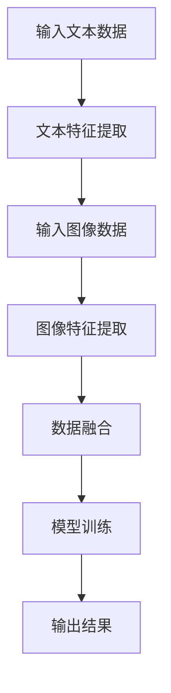
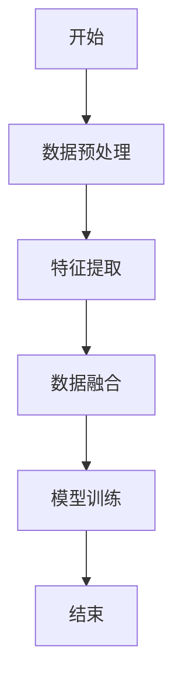

                 


# 企业AI Agent的多模态学习：整合文本、图像与语音数据

---

## 关键词：
企业AI Agent, 多模态学习, 文本数据, 图像数据, 语音数据, 数据融合, 深度学习

---

## 摘要：
本文深入探讨了企业AI Agent中多模态学习的整合方法，重点分析了文本、图像和语音数据的特征提取与融合策略。通过背景介绍、核心概念、算法原理、系统架构设计和项目实战的详细讲解，本文为企业AI Agent的多模态学习提供了理论基础和实践指导。我们还通过实际案例展示了如何在企业环境中整合多模态数据，以提升AI Agent的性能和应用价值。

---

# 第一部分: 企业AI Agent的多模态学习背景与基础

## 第1章: AI Agent概述

### 1.1 AI Agent的基本概念
#### 1.1.1 AI Agent的定义与特点
AI Agent（人工智能代理）是一种能够感知环境、自主决策并执行任务的智能实体。它具备以下特点：
- **自主性**：能够自主决策，无需外部干预。
- **反应性**：能够实时感知环境并做出反应。
- **目标导向**：以实现特定目标为导向。
- **学习能力**：能够通过数据和经验不断优化自身性能。

#### 1.1.2 AI Agent的核心功能与应用场景
AI Agent的核心功能包括：
- **信息处理**：从多模态数据中提取有用信息。
- **决策制定**：基于信息做出最优决策。
- **任务执行**：根据决策执行具体任务。

AI Agent的应用场景广泛，包括智能客服、智能推荐、智能监控等。

#### 1.1.3 企业级AI Agent的特殊需求
在企业环境中，AI Agent需要满足以下特殊需求：
- **高可靠性**：保证在复杂环境中的稳定运行。
- **高效率**：快速处理大量数据并做出决策。
- **可解释性**：决策过程需要可追溯和解释。

### 1.2 多模态学习的背景
#### 1.2.1 多模态数据的定义与分类
多模态数据是指来自不同感官渠道的数据，常见的类型包括：
- **文本数据**：文字、文档等。
- **图像数据**：图片、视频等。
- **语音数据**：音频、语音识别结果等。

#### 1.2.2 多模态学习的必要性与优势
在企业AI Agent中，整合多模态数据能够：
- 提高信息处理的全面性。
- 提升决策的准确性。
- 增强系统的鲁棒性。

#### 1.2.3 企业AI Agent中多模态数据整合的意义
通过整合多模态数据，企业AI Agent能够更好地理解用户需求，提供更智能的服务。

### 1.3 企业AI Agent与多模态学习的整合
#### 1.3.1 整合多模态数据的目标
- 提供更个性化的服务。
- 提高系统的智能化水平。
- 增强用户体验。

#### 1.3.2 多模态数据在企业AI Agent中的应用场景
- 智能客服：整合文本、语音数据，提供更智能的对话服务。
- 智能推荐：结合文本、图像数据，推荐更精准的产品。

#### 1.3.3 整合过程中的挑战与解决方案
- **数据异构性**：不同模态数据格式不同，难以直接融合。
- **计算资源需求**：多模态数据处理需要大量计算资源。
- **模型复杂性**：多模态模型设计复杂，训练难度大。

---

## 第2章: 多模态学习的核心概念与联系

### 2.1 多模态学习的原理
#### 2.1.1 多模态数据的特征提取
文本、图像和语音数据的特征提取方法各不相同：
- **文本数据**：使用词袋模型、TF-IDF等方法提取文本特征。
- **图像数据**：通过卷积神经网络（CNN）提取图像特征。
- **语音数据**：利用Mel频谱、MFCC等方法提取语音特征。

#### 2.1.2 多模态数据的融合方法
多模态数据的融合方法主要包括：
- **晚期融合**：在特征提取后，将不同模态的特征向量进行融合。
- **早期融合**：在数据预处理阶段进行融合。

#### 2.1.3 多模态学习的模型架构
多模态学习的模型架构通常包括编码器、融合器和解码器三个部分：
- **编码器**：将不同模态的数据映射到同一特征空间。
- **融合器**：对多模态特征进行融合。
- **解码器**：根据融合后的特征生成输出。

### 2.2 多模态数据特征对比
#### 2.2.1 文本数据的特征分析
文本数据的特征包括词汇、句法和语义信息。

#### 2.2.2 图像数据的特征分析
图像数据的特征包括颜色、纹理和形状信息。

#### 2.2.3 语音数据的特征分析
语音数据的特征包括音调、音量和节奏信息。

#### 2.2.4 不同模态数据特征的对比与关联
通过对比不同模态数据的特征，可以找到它们之间的关联和互补性。

### 2.3 多模态数据的实体关系图
通过ER图可以清晰地展示多模态数据之间的关系。

```mermaid
erDiagram
    actor User {
        <属性> id
        <属性> text
        <属性> image
        <属性> audio
    }
    entity TextFeature {
        <属性> text_id
        <属性> word_embeddings
        <属性> sentence_embeddings
    }
    entity ImageFeature {
        <属性> image_id
        <属性> image_embeddings
        <属性> image_labels
    }
    entity AudioFeature {
        <属性> audio_id
        <属性> audio_embeddings
        <属性> audio_labels
    }
    User -- TextFeature: 提交文本数据
    User -- ImageFeature: 提交图像数据
    User -- AudioFeature: 提交语音数据
```

---

## 第3章: 多模态学习的算法原理

### 3.1 多模态数据融合算法
#### 3.1.1 晚期融合与早期融合的对比
- **晚期融合**：在特征提取后进行融合，适用于数据量较大的场景。
- **早期融合**：在数据预处理阶段进行融合，适用于数据量较小的场景。

#### 3.1.2 晚期融合的具体实现方法
- 将不同模态的特征向量拼接或加权求和。

#### 3.1.3 早期融合
- 在数据预处理阶段，将不同模态的数据进行融合。

### 3.2 多模态学习模型的训练与优化
#### 3.2.1 模型训练流程
1. 数据预处理：对文本、图像和语音数据进行预处理。
2. 特征提取：分别提取不同模态的特征。
3. 数据融合：将不同模态的特征进行融合。
4. 模型训练：使用融合后的特征训练模型。

#### 3.2.2 损失函数与优化方法
- **损失函数**：使用交叉熵损失函数。
- **优化方法**：使用Adam优化器。

### 3.3 多模态学习的数学模型
#### 3.3.1 模型架构


#### 3.3.2 数学公式
- **特征融合**：将文本、图像和语音特征向量进行加权求和。
  $$ f_{\text{fusion}}(x) = \alpha x_{\text{text}} + \beta x_{\text{image}} + \gamma x_{\text{audio}} $$
  其中，$\alpha + \beta + \gamma = 1$。

---

## 第4章: 系统分析与架构设计

### 4.1 系统功能设计
#### 4.1.1 功能模块划分
- **数据预处理模块**：负责对文本、图像和语音数据进行预处理。
- **特征提取模块**：分别提取不同模态的特征。
- **数据融合模块**：将不同模态的特征进行融合。
- **模型训练模块**：使用融合后的特征训练模型。

#### 4.1.2 系统功能流程


### 4.2 系统架构设计
#### 4.2.1 分层架构
- **数据层**：存储原始数据和特征数据。
- **计算层**：负责特征提取和数据融合。
- **应用层**：提供API接口供上层应用调用。

#### 4.2.2 系统交互设计
- **接口设计**：提供RESTful API接口，供其他系统调用。
- **交互流程**：
  1. 接收请求，提取数据。
  2. 对数据进行预处理和特征提取。
  3. 将特征数据进行融合。
  4. 使用融合后的数据训练模型。
  5. 返回结果。

---

## 第5章: 项目实战

### 5.1 环境安装
- **Python**：3.8+
- **深度学习框架**：TensorFlow或PyTorch
- **自然语言处理库**：spaCy或NLTK
- **计算机视觉库**：OpenCV或TensorFlow.keras
- **语音处理库**：librosa或TensorFlow语音处理库

### 5.2 核心代码实现
#### 5.2.1 数据预处理
```python
import numpy as np
import tensorflow as tf

# 文本数据预处理
def preprocess_text(text):
    # 使用spaCy进行分词和向量化
    return text_vectorized

# 图像数据预处理
def preprocess_image(image):
    # 使用OpenCV进行图像处理
    return image_vectorized

# 语音数据预处理
def preprocess_audio(audio):
    # 使用librosa进行语音特征提取
    return audio_vectorized
```

#### 5.2.2 特征融合
```python
def fuse_features(text_feat, image_feat, audio_feat):
    alpha = 0.4
    beta = 0.3
    gamma = 0.3
    return alpha * text_feat + beta * image_feat + gamma * audio_feat
```

#### 5.2.3 模型训练
```python
def train_model(features, labels):
    model = tf.keras.Sequential([
        tf.keras.layers.Dense(128, activation='relu'),
        tf.keras.layers.Dense(10, activation='softmax')
    ])
    model.compile(optimizer='adam', loss='sparse_categorical_crossentropy', metrics=['accuracy'])
    model.fit(features, labels, epochs=10, batch_size=32)
    return model
```

### 5.3 案例分析与解读
通过实际案例，展示了如何在企业环境中整合多模态数据，提升AI Agent的性能。

### 5.4 项目小结
总结了项目的关键点和成功经验，为后续工作提供参考。

---

## 第6章: 最佳实践与展望

### 6.1 小结
总结了全文的主要内容，强调了多模态学习在企业AI Agent中的重要性。

### 6.2 注意事项
- 数据隐私与安全问题。
- 模型的可解释性问题。
- 计算资源的分配问题。

### 6.3 拓展阅读
推荐了一些相关的书籍和论文，供读者进一步学习。

---

## 第7章: 总结与展望

### 7.1 总结
本文详细探讨了企业AI Agent中多模态学习的整合方法，通过背景介绍、核心概念、算法原理、系统架构设计和项目实战的详细讲解，为企业AI Agent的多模态学习提供了理论基础和实践指导。

### 7.2 展望
未来，随着多模态技术的不断发展，企业AI Agent将更加智能化和人性化，能够更好地满足用户的需求。

---

# 结语
通过本文的学习，读者可以深入了解企业AI Agent中多模态学习的整合方法，并能够在实际项目中应用这些技术，提升企业的智能化水平。

