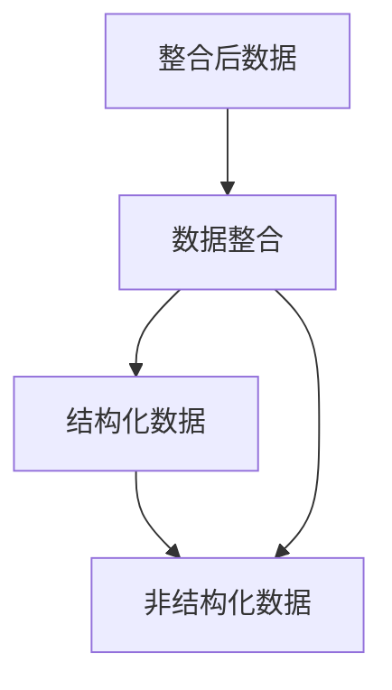
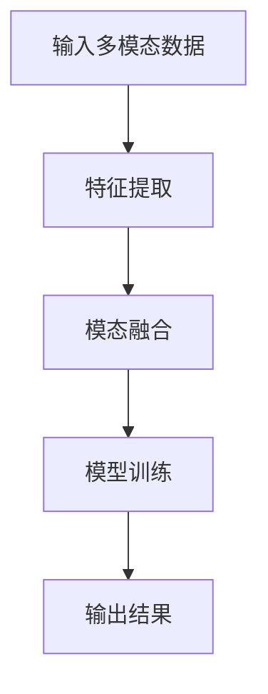
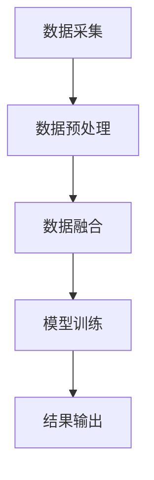
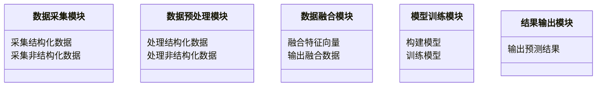
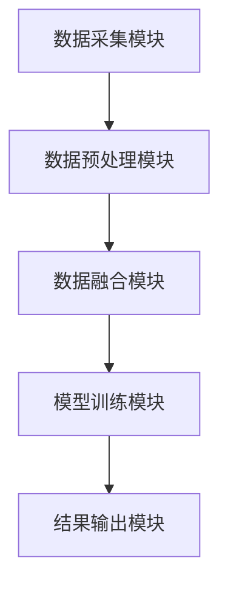

                 


# 企业AI Agent的多模态学习：整合结构化与非结构化数据

## 关键词
- 企业AI Agent
- 多模态学习
- 结构化数据
- 非结构化数据
- 数据整合
- 系统架构设计
- 项目实战

## 摘要
本文系统地探讨了企业AI Agent在多模态学习中的应用，重点分析了如何整合结构化与非结构化数据以提升AI Agent的性能。文章从多模态学习的基本概念出发，详细讲解了其核心原理、算法流程，并通过实际案例展示了如何将这些理论应用于企业场景中。通过本文的阅读，读者将能够理解多模态学习的核心概念，掌握数据整合的方法，并能够实际操作相关技术。

## 第一部分: 企业AI Agent的多模态学习基础

## 第1章: 多模态学习与企业AI Agent概述

### 1.1 多模态学习的背景与概念
#### 1.1.1 多模态数据的定义与特点
多模态数据是指来自不同模态（如文本、图像、语音等）的数据。这些数据具有多样性、互补性和复杂性的特点。多样性体现在不同模态的数据类型不同；互补性体现在不同模态的数据可以相互补充，提供更全面的信息；复杂性体现在多模态数据的处理需要综合考虑多种因素。

#### 1.1.2 多模态学习的核心概念
多模态学习是一种机器学习方法，旨在通过多个模态的数据来提高模型的性能。核心概念包括模态融合、模态对齐、跨模态推理等。模态融合是指将多个模态的数据整合到一个统一的表示空间中；模态对齐是指将不同模态的数据对齐到相同的语义空间；跨模态推理是指在不同模态之间进行信息推理。

#### 1.1.3 企业AI Agent的定义与特点
企业AI Agent是一种能够自主感知环境、理解需求、执行任务的智能体。其特点是智能化、自主化、实时性和个性化。智能化体现在能够理解多模态数据并进行智能决策；自主化体现在能够在没有人工干预的情况下完成任务；实时性体现在能够实时响应用户需求；个性化体现在能够根据用户需求提供定制化服务。

### 1.2 结构化与非结构化数据的整合
#### 1.2.1 结构化数据的定义与特点
结构化数据是指可以被组织到表格、数据库等结构化形式中的数据。其特点包括明确性、一致性和可查询性。明确性体现在数据的含义清晰明确；一致性体现在数据格式统一；可查询性体现在可以通过数据库查询语言快速检索数据。

#### 1.2.2 非结构化数据的定义与特点
非结构化数据是指没有固定结构，无法直接放入数据库中的数据。其特点包括多样性、复杂性和语义丰富性。多样性体现在数据类型多样，可以是文本、图像、语音等；复杂性体现在数据的语义难以直接提取；语义丰富性体现在数据中包含大量隐含的信息。

#### 1.2.3 结构化与非结构化数据的整合方法
结构化与非结构化数据的整合方法包括基于特征的对齐、基于语义的对齐和基于表示的对齐。基于特征的对齐是指通过提取特征将不同模态的数据对齐到同一个空间；基于语义的对齐是指通过语义分析将不同模态的数据对齐到同一个语义空间；基于表示的对齐是指通过深度学习模型将不同模态的数据映射到同一个表示空间。

### 1.3 企业AI Agent的应用场景
#### 1.3.1 客户服务与支持
企业AI Agent可以通过整合结构化和非结构化数据，提供更智能的客户服务与支持。例如，通过整合客户的文本聊天记录和数据库中的客户信息，AI Agent可以更好地理解客户需求并提供个性化的解决方案。

#### 1.3.2 企业内部流程优化
企业AI Agent可以通过整合结构化和非结构化数据，优化企业内部流程。例如，通过整合员工的工作日志和任务完成情况，AI Agent可以识别瓶颈并提出优化建议。

#### 1.3.3 数据分析与决策支持
企业AI Agent可以通过整合结构化和非结构化数据，提供更精准的数据分析与决策支持。例如，通过整合销售数据和市场报告，AI Agent可以预测销售趋势并提供建议。

## 第2章: 多模态学习的核心概念与联系

### 2.1 多模态学习的原理
#### 2.1.1 多模态数据的融合方法
多模态数据的融合方法包括早期融合和晚期融合。早期融合是指在特征提取阶段将不同模态的数据进行融合；晚期融合是指在特征提取之后将不同模态的数据进行融合。早期融合适用于数据量小、计算资源充足的场景；晚期融合适用于数据量大、计算资源有限的场景。

#### 2.1.2 多模态学习的数学模型
多模态学习的数学模型包括基于统计的方法、基于深度学习的方法和基于图神经网络的方法。基于统计的方法包括隐式语义分析、潜在语义索引等；基于深度学习的方法包括卷积神经网络、循环神经网络等；基于图神经网络的方法包括图注意力网络、图卷积网络等。

#### 2.1.3 多模态学习的优缺点对比
多模态学习的优点包括提高模型的准确性和鲁棒性，增强模型的语义理解和表达能力。缺点包括数据获取难度大、计算复杂度高、模型设计难度大等。

### 2.2 数据整合的实体关系图


### 2.3 多模态学习的优缺点对比
| 优点 | 缺点 |
|------|------|
| 提高模型的准确性和鲁棒性 | 数据获取难度大 |
| 增强模型的语义理解和表达能力 | 计算复杂度高 |
| 适用于复杂场景 | 模型设计难度大 |

## 第3章: 多模态学习的算法原理

### 3.1 多模态学习的算法流程
#### 3.1.1 算法流程图


#### 3.1.2 算法步骤
1. 输入多模态数据：包括文本、图像、语音等多种数据类型。
2. 特征提取：对每种模态的数据进行特征提取，得到特征向量。
3. 模态融合：将不同模态的特征向量进行融合，得到融合特征向量。
4. 模型训练：基于融合特征向量进行模型训练，得到最终的模型。
5. 输出结果：模型输出结果，供企业AI Agent使用。

### 3.2 多模态学习的数学模型
#### 3.2.1 概率分布模型
$$P(x|y) = \prod_{i=1}^{n} P(x_i|y)$$

#### 3.2.2 神经网络模型
$$y = f(x) = \sigma(Wx + b)$$

### 3.3 多模态学习的算法实现
#### 3.3.1 数据预处理
```python
def preprocess_data(data):
    # 处理结构化数据
    processed_structured_data = data['structured']
    # 处理非结构化数据
    processed_unstructured_data = data['unstructured']
    return processed_structured_data, processed_unstructured_data
```

#### 3.3.2 模型训练
```python
def train_model(structured_data, unstructured_data):
    # 构建模型
    model = build_model()
    # 训练模型
    model.fit(structured_data, unstructured_data)
    return model
```

## 第4章: 企业AI Agent的系统架构设计

### 4.1 系统功能设计
#### 4.1.1 系统功能模块
- 数据采集模块：负责采集多模态数据。
- 数据预处理模块：负责对数据进行预处理，提取特征。
- 数据融合模块：负责将不同模态的数据进行融合。
- 模型训练模块：负责基于融合数据进行模型训练。
- 结果输出模块：负责输出模型的预测结果。

#### 4.1.2 系统功能流程


### 4.2 系统架构设计
#### 4.2.1 系统架构图


#### 4.2.2 系统接口设计
- 数据采集模块接口：负责采集数据并传递给数据预处理模块。
- 数据预处理模块接口：负责处理数据并传递给数据融合模块。
- 数据融合模块接口：负责融合数据并传递给模型训练模块。
- 模型训练模块接口：负责训练模型并传递结果给结果输出模块。
- 结果输出模块接口：负责输出最终结果。

### 4.3 系统交互流程
#### 4.3.1 系统交互图


## 第5章: 项目实战与案例分析

### 5.1 环境安装与配置
#### 5.1.1 Python环境安装
```bash
python --version
pip install --upgrade pip
```

#### 5.1.2 依赖库安装
```bash
pip install numpy
pip install pandas
pip install scikit-learn
pip install tensorflow
```

#### 5.1.3 开发环境配置
```bash
jupyter notebook
```

### 5.2 核心代码实现
#### 5.2.1 数据预处理代码
```python
import numpy as np
import pandas as pd

def preprocess_data(data):
    # 处理结构化数据
    structured_data = pd.DataFrame(data['structured'])
    processed_structured_data = structured_data.dropna()
    # 处理非结构化数据
    unstructured_data = data['unstructured']
    processed_unstructured_data = [text.lower() for text in unstructured_data]
    return processed_structured_data, processed_unstructured_data
```

#### 5.2.2 模型训练代码
```python
import tensorflow as tf
from tensorflow.keras import layers

def build_model():
    # 构建模型
    input_a = layers.Input(shape=(100,))
    input_b = layers.Input(shape=(100,))
    # 特征提取
    encoded_a = layers.Dense(64, activation='relu')(input_a)
    encoded_b = layers.Dense(64, activation='relu')(input_b)
    # 模态融合
    merged = layers.concatenate([encoded_a, encoded_b])
    # 分类器
    dense = layers.Dense(64, activation='relu')(merged)
    output = layers.Dense(1, activation='sigmoid')(dense)
    model = tf.keras.Model(inputs=[input_a, input_b], outputs=output)
    return model

def train_model(structured_data, unstructured_data):
    # 构建模型
    model = build_model()
    # 编译模型
    model.compile(optimizer='adam', loss='binary_crossentropy', metrics=['accuracy'])
    # 训练模型
    history = model.fit([structured_data, unstructured_data], labels, epochs=10, batch_size=32)
    return model, history
```

### 5.3 案例分析与结果解读
#### 5.3.1 案例背景
假设我们有一个企业客户支持场景，我们需要整合客户的聊天记录（文本数据）和客户的基本信息（结构化数据）来训练一个分类模型，预测客户满意度。

#### 5.3.2 数据准备
```python
data = {
    'structured': [[1, 2, 3], [4, 5, 6], [7, 8, 9]],
    'unstructured': ['positive feedback', 'negative feedback', 'neutral feedback']
}
processed_structured_data, processed_unstructured_data = preprocess_data(data)
```

#### 5.3.3 模型训练
```python
model, history = train_model(processed_structured_data, processed_unstructured_data)
```

#### 5.3.4 结果分析
```python
print("训练完成，准确率为：", history.history['accuracy'][-1])
```

## 第6章: 最佳实践与小结

### 6.1 小结
通过本文的介绍，我们详细探讨了企业AI Agent的多模态学习方法，重点分析了如何整合结构化与非结构化数据以提升AI Agent的性能。我们从多模态学习的基本概念出发，详细讲解了其核心原理、算法流程，并通过实际案例展示了如何将这些理论应用于企业场景中。

### 6.2 注意事项
在实际应用中，需要注意以下几点：
1. 数据质量：确保数据的准确性和完整性。
2. 模型选择：根据具体场景选择合适的模型和算法。
3. 系统设计：合理设计系统架构，确保系统的可扩展性和可维护性。

### 6.3 拓展阅读
1. 多模态学习的经典论文：如“Multimodal Learning via Deep Neural Networks”。
2. 企业AI Agent的相关书籍：如《Enterprise AI: The Business Playbook for Implementing AI at Scale》。

通过本文的阅读和实践，读者将能够更好地理解企业AI Agent的多模态学习方法，并能够将其应用到实际的企业场景中。

