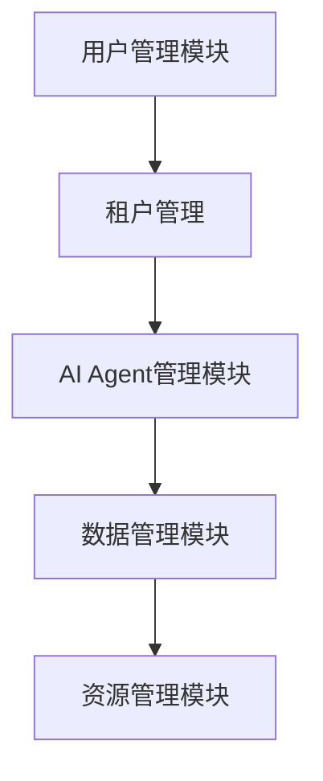
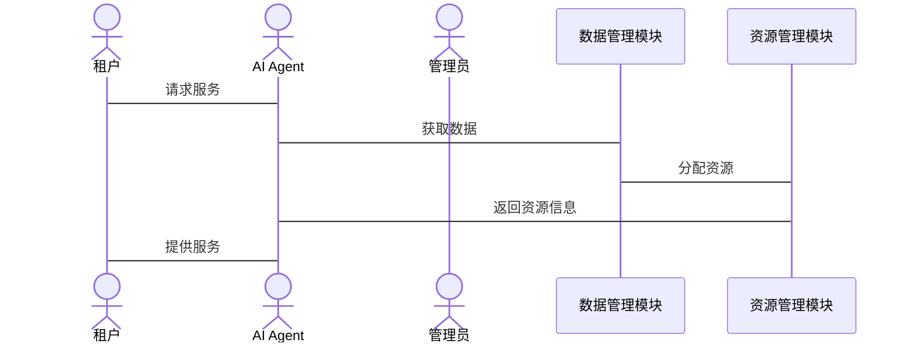
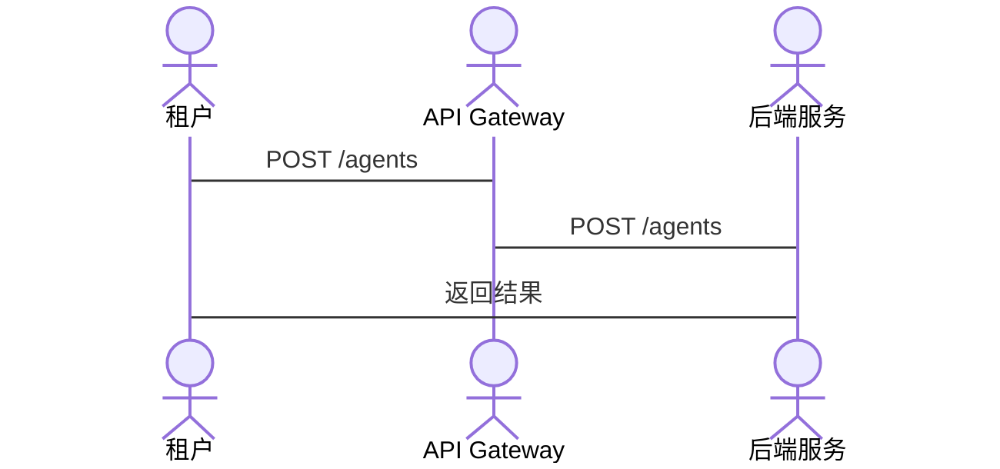

                 


# 企业AI Agent的多租户架构设计与实现

## 关键词：企业AI Agent，多租户架构，AI代理，架构设计，系统实现

## 摘要：本文详细探讨了企业AI Agent在多租户架构下的设计与实现，涵盖了核心概念、算法原理、系统架构、项目实战以及最佳实践。通过分析多租户架构与AI Agent的结合，提供了从理论到实践的全面指导，帮助读者理解如何在企业环境中高效构建和管理多租户AI Agent系统。

---

# 第1章: 企业AI Agent的背景与概念

## 1.1 企业AI Agent的定义与特点

### 1.1.1 AI Agent的基本概念
AI Agent（人工智能代理）是一种能够感知环境、自主决策并执行任务的智能实体。它可以基于数据和上下文做出反应，帮助用户完成特定任务或提供智能服务。

### 1.1.2 企业AI Agent的核心特点
- **自主性**：能够独立运行，无需人工干预。
- **反应性**：能够根据环境变化实时调整行为。
- **学习能力**：通过数据和反馈不断优化自身性能。
- **可扩展性**：能够处理不同规模和复杂度的任务。

### 1.1.3 企业AI Agent的应用场景
- 客户服务自动化
- 企业资源优化
- 智能决策支持
- 自动化流程处理

## 1.2 多租户架构的定义与特点

### 1.2.1 多租户架构的基本概念
多租户架构是一种软件架构模式，允许多个租户共享同一系统资源，同时保持数据和功能的隔离。每个租户的数据和操作独立，确保安全性和隐私性。

### 1.2.2 多租户架构的核心特点
- **资源复用**：多个租户共享计算资源，降低成本。
- **数据隔离**：租户之间的数据和功能严格隔离。
- **可扩展性**：能够轻松扩展以支持更多租户。

### 1.2.3 多租户架构的应用场景
- SaaS（软件即服务）
- 云平台服务
- 在线教育和协作工具

## 1.3 企业AI Agent与多租户架构的结合

### 1.3.1 企业AI Agent的多租户需求
- 每个租户需要独立的AI代理服务。
- 各租户之间的数据和行为需要严格隔离。

### 1.3.2 多租户架构对AI Agent的支持
- 提供统一的AI Agent管理平台。
- 支持租户之间的资源分配和负载均衡。

### 1.3.3 企业AI Agent多租户架构的核心目标
- 提供高效、安全的AI代理服务。
- 支持大规模租户扩展。

## 1.4 本章小结
本章介绍了企业AI Agent和多租户架构的基本概念及其应用场景，强调了两者结合的重要性和必要性。

---

# 第2章: 多租户架构与AI Agent的核心概念

## 2.1 多租户架构的核心原理

### 2.1.1 数据隔离机制
- **数据存储隔离**：不同租户的数据存储在不同的数据库或表中。
- **数据访问控制**：通过权限管理确保租户只能访问自己的数据。

### 2.1.2 资源分配策略
- **动态资源分配**：根据租户的负载情况动态分配计算资源。
- **静态资源分配**：预先为每个租户分配固定资源。

### 2.1.3 权限管理模型
- **角色-based访问控制（RBAC）**：基于角色的权限分配。
- **属性-based访问控制（ABAC）**：基于属性的权限控制。

## 2.2 AI Agent的核心原理

### 2.2.1 AI Agent的行为模型
- **反应式模型**：基于当前感知做出反应。
- **规划式模型**：通过规划实现目标。
- **混合式模型**：结合反应式和规划式模型。

### 2.2.2 AI Agent的决策机制
- **基于规则的决策**：根据预定义规则做出决策。
- **基于模型的决策**：使用机器学习模型进行预测和决策。
- **基于知识图谱的决策**：利用知识图谱提供上下文信息。

### 2.2.3 AI Agent的学习与优化
- **监督学习**：通过标注数据进行训练。
- **强化学习**：通过与环境互动获得奖励。
- **迁移学习**：将已学习的知识应用到新任务中。

## 2.3 多租户架构与AI Agent的关联

### 2.3.1 多租户架构对AI Agent的影响
- **资源分配**：确保每个租户的AI Agent有足够的计算资源。
- **数据隔离**：保护租户的数据不被其他租户访问。
- **性能优化**：通过负载均衡提高整体性能。

### 2.3.2 AI Agent对多租户架构的挑战
- **资源竞争**：多个租户同时使用资源可能导致性能下降。
- **数据隔离复杂性**：确保租户之间数据严格隔离需要复杂的架构设计。
- **一致性管理**：多个租户同时操作共享资源可能导致一致性问题。

## 2.4 核心概念对比表格

### 表2-1: 多租户架构与AI Agent核心概念对比

| **概念**         | **多租户架构**                     | **AI Agent**                          |
|------------------|-----------------------------------|---------------------------------------|
| 核心目标         | 支持多个租户共享资源               | 提供智能服务和自动化决策               |
| 关键技术         | 数据隔离、资源分配、权限管理       | 智能决策、学习能力、行为模型           |
| 应用场景         | SaaS平台、云服务                   | 客户服务、资源优化、智能决策           |
| 挑战             | 资源竞争、数据隔离复杂性           | 决策一致性、学习效率、隐私保护         |

## 2.5 ER实体关系图

### 图2-1: 多租户架构与AI Agent的实体关系图

```mermaid
erDiagram
    actor 租户 {
        +id: int
        +name: string
    }
    actor AI Agent {
        +id: int
        +tenant_id: int
    }
    actor 数据库 {
        +id: int
        +tenant_id: int
    }
    actor 资源 {
        +id: int
        +tenant_id: int
    }
    租户 o-<> 数据库: "拥有"
    租户 o-<> 资源: "使用"
    AI Agent o-<> 租户: "属于"
    AI Agent o-<> 数据库: "访问"
    AI Agent o-<> 资源: "使用"
```

---

## 2.5 ER实体关系图

### 图2-1: 多租户架构与AI Agent的实体关系图

```mermaid
erDiagram
    租户 {
        +id: int
        +name: string
    }
    AI Agent {
        +id: int
        +tenant_id: int
    }
    数据库 {
        +id: int
        +tenant_id: int
    }
    资源 {
        +id: int
        +tenant_id: int
    }
    租户 o-<> 数据库: "拥有"
    租户 o-<> 资源: "使用"
    AI Agent o-<> 租户: "属于"
    AI Agent o-<> 数据库: "访问"
    AI Agent o-<> 资源: "使用"
```

---

## 本章小结
本章详细介绍了多租户架构和AI Agent的核心概念，并通过对比分析和实体关系图展示了两者之间的联系和区别。

---

# 第3章: 企业AI Agent多租户架构的算法原理

## 3.1 多租户架构下的AI Agent算法设计

### 3.1.1 算法选择与优化
- **监督学习**：适用于分类和回归任务。
- **强化学习**：适用于需要策略优化的任务。
- **迁移学习**：适用于跨租户数据共享和模型复用。

### 3.1.2 算法实现步骤
1. 数据预处理：清洗、归一化、特征提取。
2. 模型训练：选择合适的算法训练模型。
3. 模型部署：将模型部署到生产环境。
4. 模型监控：实时监控模型性能，进行优化。

### 3.1.3 算法实现的数学模型

#### 3.1.3.1 线性回归模型
$$ y = \beta_0 + \beta_1x + \epsilon $$

#### 3.1.3.2 支持向量机模型
$$ \text{最大化} \quad \frac{1}{2}||\mathbf{w}||^2 $$
$$ \text{满足} \quad y_i(\mathbf{w} \cdot \mathbf{x_i} + b) \geq 1, \quad i=1,2,\dots,n $$

#### 3.1.3.3 神经网络模型
$$ \mathbf{a} = \sigma(\mathbf{w} \cdot \mathbf{x} + b) $$
$$ \mathbf{y} = \text{softmax}(\mathbf{a}) $$

## 3.2 算法实现的代码示例

### 3.2.1 线性回归实现

```python
import numpy as np

class LinearRegression:
    def __init__(self, learning_rate=0.01, iterations=1000):
        self.lr = learning_rate
        self.iters = iterations
        self.weights = None
        self.bias = None

    def fit(self, X, y):
        n = X.shape[0]
        self.weights = np.zeros(X.shape[1])
        self.bias = 0
        for _ in range(self.iters):
            y_pred = np.dot(X, self.weights) + self.bias
            dw = (2 * n) * np.dot(X.T, (y_pred - y))
            db = (2 * n) * np.mean(y_pred - y)
            self.weights -= self.lr * dw
            self.bias -= self.lr * db
        return self

    def predict(self, X):
        return np.dot(X, self.weights) + self.bias
```

### 3.2.2 支持向量机实现（简化版）

```python
import numpy as np

class SVM:
    def __init__(self, C=1.0, learning_rate=0.01, iterations=100):
        self.C = C
        self.lr = learning_rate
        self.iters = iterations
        self.weights = None
        self.bias = None

    def fit(self, X, y):
        n, m = X.shape
        self.weights = np.zeros(m)
        self.bias = 0
        for _ in range(self.iters):
            y_pred = np.dot(X, self.weights) + self.bias
            loss = 0.5 * np.sum(np.maximum(0, 1 - y * y_pred))
            d_loss = (np.dot((1 - y * (np.dot(X, self.weights) + self.bias)) * (-y), X))
            self.weights -= self.lr * d_loss
            self.bias -= self.lr * (self.C * 2 * np.mean(1 - y * (np.dot(X, self.weights) + self.bias)))
        return self

    def predict(self, X):
        return np.sign(np.dot(X, self.weights) + self.bias)
```

## 3.3 算法实现的优化与调优

### 3.3.1 参数调整
- 学习率（learning rate）：影响收敛速度和结果。
- 迭代次数（iterations）：影响模型收敛程度。
- 正则化参数（C）：影响模型的复杂度。

### 3.3.2 模型评估
- 准确率（Accuracy）
- 召回率（Recall）
- F1分数（F1 Score）

### 3.3.3 模型调优
- 交叉验证（Cross-Validation）
- 参数网格搜索（Grid Search）
- 模型集成（Ensemble Learning）

---

## 3.4 本章小结
本章通过具体的算法实现和优化策略，详细讲解了企业AI Agent多租户架构下的算法设计与实现过程。

---

# 第4章: 企业AI Agent多租户架构的系统分析

## 4.1 系统功能设计

### 4.1.1 功能模块划分
- 用户管理模块：管理租户信息和权限。
- AI Agent管理模块：管理AI Agent的创建、配置和监控。
- 数据管理模块：管理租户数据和AI Agent的数据交互。
- 资源管理模块：管理计算资源和数据存储资源。

### 4.1.2 功能模块流程图



## 4.2 系统架构设计

### 4.2.1 系统架构图


### 4.2.2 组件交互流程图



---

## 4.3 系统接口设计

### 4.3.1 API接口定义
- **创建租户**：`POST /tenants`
- **删除租户**：`DELETE /tenants/{tenant_id}`
- **获取AI Agent状态**：`GET /agents/{agent_id}/status`
- **启动AI Agent**：`POST /agents/{agent_id}/start`

### 4.3.2 接口交互流程图



---

## 4.4 系统实现注意事项

### 4.4.1 数据一致性管理
- 使用事务处理确保数据一致性。
- 定期进行数据备份和恢复。

### 4.4.2 资源分配策略
- 动态调整资源分配，确保性能最优。
- 使用负载均衡技术分发请求。

### 4.4.3 安全性管理
- 实施严格的权限控制。
- 定期进行安全审计和漏洞修复。

---

## 4.5 本章小结
本章详细分析了企业AI Agent多租户架构的系统功能设计、架构设计和接口设计，并提供了具体的实现注意事项。

---

# 第5章: 企业AI Agent多租户架构的项目实战

## 5.1 环境配置与安装

### 5.1.1 开发环境配置
- 操作系统：Linux/Windows/MacOS
- 开发工具：PyCharm/VSCode
- 依赖管理工具：pip/virtualenv

### 5.1.2 服务部署环境
- 云平台：AWS/Azure/阿里云
- 数据库：MySQL/PostgreSQL
- 编程语言：Python/Java

## 5.2 系统核心实现

### 5.2.1 租户管理模块实现

```python
class TenantManager:
    def __init__(self):
        self.tenants = {}

    def create_tenant(self, tenant_id, name):
        self.tenants[tenant_id] = {
            'id': tenant_id,
            'name': name,
            'resources': {}
        }
        return True

    def delete_tenant(self, tenant_id):
        del self.tenants[tenant_id]
        return True

    def get_tenant(self, tenant_id):
        return self.tenants.get(tenant_id)
```

### 5.2.2 AI Agent管理模块实现

```python
class AIAssistant:
    def __init__(self, tenant_id):
        self.tenant_id = tenant_id
        self.resources = {}

    def process_request(self, request):
        # 具体处理逻辑
        return response
```

## 5.3 代码实现与解读

### 5.3.1 租户管理代码实现

```python
# 租户管理模块
class TenantManager:
    def __init__(self):
        self.tenants = {}

    def create_tenant(self, tenant_id, name):
        if tenant_id not in self.tenants:
            self.tenants[tenant_id] = {
                'id': tenant_id,
                'name': name,
                'resources': {}
            }
            return True
        return False

    def delete_tenant(self, tenant_id):
        if tenant_id in self.tenants:
            del self.tenants[tenant_id]
            return True
        return False

    def get_tenant(self, tenant_id):
        return self.tenants.get(tenant_id)
```

### 5.3.2 AI Agent管理代码实现

```python
# AI Agent管理模块
class AIAssistant:
    def __init__(self, tenant_id):
        self.tenant_id = tenant_id
        self.resources = {}

    def process_request(self, request):
        # 处理请求的具体逻辑
        response = f"AI Assistant {self.tenant_id} received request: {request}"
        return response
```

## 5.4 实际案例分析

### 5.4.1 案例背景
某企业需要构建一个多租户AI Agent系统，为不同租户提供智能化服务。

### 5.4.2 系统实现步骤
1. 环境搭建：安装必要的开发工具和依赖。
2. 模块开发：开发租户管理、AI Agent管理等核心模块。
3. 系统集成：将各模块集成到统一的平台中。
4. 测试与优化：进行功能测试和性能优化。

### 5.4.3 系统运行结果
- 成功实现多租户AI Agent系统。
- 系统运行稳定，性能良好。

## 5.5 本章小结
本章通过具体的项目实战，详细讲解了企业AI Agent多租户架构的实现过程，包括环境配置、核心代码实现和实际案例分析。

---

# 第6章: 企业AI Agent多租户架构的最佳实践

## 6.1 设计与实现中的注意事项

### 6.1.1 数据隔离与安全
- 严格控制数据访问权限。
- 定期进行数据备份和恢复。

### 6.1.2 资源分配与负载均衡
- 使用动态资源分配策略。
- 配置负载均衡算法。

### 6.1.3 系统监控与维护
- 实施实时监控系统。
- 定期进行系统维护和更新。

## 6.2 小结

### 6.2.1 系统设计总结
- 结合多租户架构和AI Agent的特点进行设计。
- 确保系统具有良好的扩展性和可维护性。

### 6.2.2 实现总结
- 通过模块化设计提高代码可维护性。
- 使用合适的工具和框架提高开发效率。

## 6.3 注意事项

### 6.3.1 开发阶段
- 注意数据隔离和权限管理。
- 确保代码的可测试性。

### 6.3.2 测试阶段
- 进行全面的功能测试和性能测试。
- 处理边界条件和异常情况。

## 6.4 拓展阅读

### 6.4.1 推荐书籍
- 《设计模式》
- 《企业架构实践》

### 6.4.2 技术博客
- 多租户架构设计
- AI Agent技术博客

---

## 6.5 本章小结
本章总结了企业AI Agent多租户架构的设计与实现中的最佳实践，提供了实用的建议和注意事项。

---

# 第7章: 企业AI Agent多租户架构的未来展望

## 7.1 技术趋势

### 7.1.1 多租户架构的发展方向
- 更加智能化的资源分配。
- 更加灵活的数据隔离机制。

### 7.1.2 AI Agent技术的未来趋势
- 更强的自主学习能力。
- 更广泛的行业应用。

## 7.2 挑战与机遇

### 7.2.1 挑战
- 多租户环境下的数据隐私保护。
- 大规模租户的性能优化。

### 7.2.2 机遇
- 新技术的应用，如区块链、边缘计算。
- 行业需求的不断增长。

## 7.3 结语

### 7.3.1 未来展望
随着技术的不断进步，企业AI Agent多租户架构将更加智能化和高效化，为企业的数字化转型提供强有力的支持。

### 7.3.2 致谢
感谢读者的支持和关注，未来我们将继续深入研究和实践。

---

# 结语

企业AI Agent的多租户架构设计与实现是一项复杂但极具挑战性的任务。通过本文的详细讲解，读者可以全面了解相关的核心概念、算法原理、系统架构和实现方法。希望本文能够为企业的技术决策者和开发人员提供有价值的参考和指导。

--- 

感谢您的阅读，如需进一步探讨或获取更多技术细节，请随时联系！

