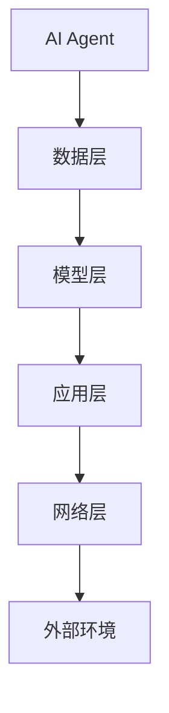
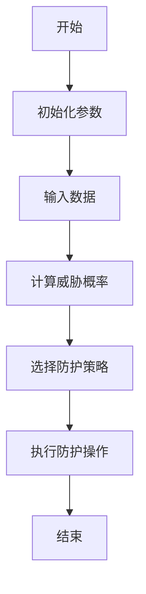
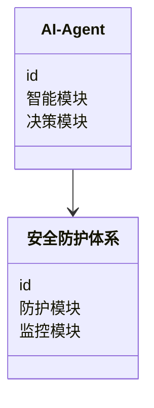
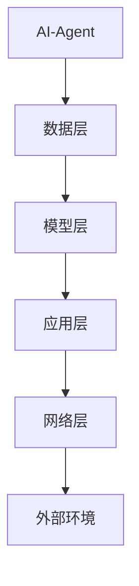
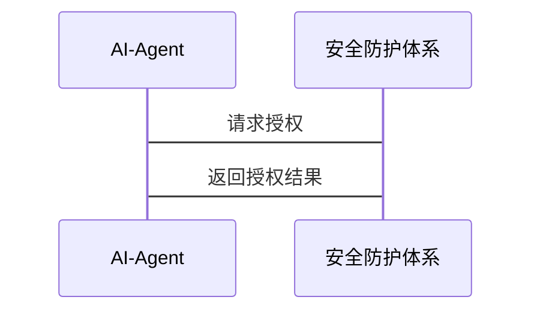
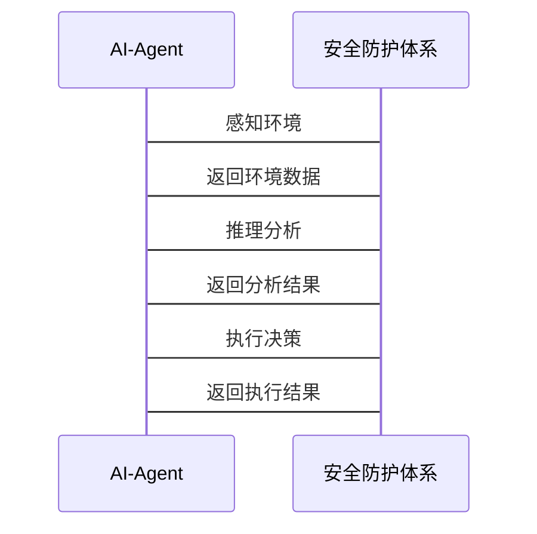

                 


# 企业AI Agent的多维安全防护体系设计与实现

## 关键词：企业AI Agent, 多维安全防护, 人工智能代理, 安全体系架构, 算法原理

## 摘要：本文深入探讨企业AI Agent的多维安全防护体系，从背景、核心概念、算法原理到系统架构和项目实战，全面解析如何构建一个安全可靠的AI代理系统，确保企业在智能化转型中的数据和系统安全。

---

# 第一部分: 企业AI Agent的多维安全防护体系概述

## 第1章: 企业AI Agent的背景与概念

### 1.1 人工智能代理的基本概念

#### 1.1.1 人工智能代理的定义
人工智能代理（AI Agent）是指能够感知环境并采取行动以实现目标的智能实体。它通过传感器获取信息，利用推理机制做出决策，并通过执行器与环境交互。

#### 1.1.2 AI Agent的核心特征
AI Agent具备以下核心特征：
- **自主性**：能够自主决策和行动。
- **反应性**：能实时感知环境变化并做出反应。
- **目标导向**：所有行为都围绕实现特定目标展开。
- **学习能力**：通过经验改进自身性能。

#### 1.1.3 企业AI Agent的应用场景
AI Agent在企业中的应用场景包括：
- **智能客服**：提供24/7的客户支持服务。
- **自动化运维**：监控系统状态并自动修复问题。
- **智能推荐**：为用户提供个性化的产品推荐。
- **风险管理**：实时监控并防范金融风险。

### 1.2 多维安全防护体系的背景

#### 1.2.1 当前企业AI系统的安全挑战
随着AI技术的广泛应用，企业AI系统面临的安全威胁日益增多：
- **数据泄露**：敏感数据被非法获取。
- **模型攻击**：通过对模型的攻击破坏系统稳定性。
- **恶意行为**：AI Agent被恶意操控进行攻击。

#### 1.2.2 多维安全防护的必要性
传统的单点安全防护已无法应对复杂的威胁，多维安全防护通过多层次、多维度的防护策略，提升整体安全性。

#### 1.2.3 体系化安全防护的目标
体系化安全防护的目标是：
- **保护数据**：确保数据的机密性、完整性和可用性。
- **防御攻击**：防范针对AI系统的各种攻击行为。
- **提高韧性**：增强系统在遭受攻击后的恢复能力。

### 1.3 企业AI Agent的体系结构

#### 1.3.1 AI Agent的基本组成
AI Agent的基本组成包括：
- **感知模块**：负责收集环境数据。
- **推理模块**：对数据进行分析和推理。
- **决策模块**：基于推理结果做出决策。
- **执行模块**：将决策转化为具体行动。

#### 1.3.2 多维安全防护的层次划分
多维安全防护体系包括：
- **数据层**：保护数据的安全。
- **模型层**：防止模型被攻击。
- **应用层**：确保应用的安全运行。
- **网络层**：保护网络通信的安全。

#### 1.3.3 体系结构的可视化展示
以下是企业AI Agent多维安全防护体系的架构图：



---

## 第2章: 企业AI Agent的核心概念与联系

### 2.1 AI Agent与多维安全防护的关系

#### 2.1.1 AI Agent的功能模块分析
AI Agent的功能模块包括：
- **感知模块**：接收输入数据。
- **推理模块**：分析数据并得出结论。
- **决策模块**：基于推理结果做出决策。
- **执行模块**：执行决策并输出结果。

#### 2.1.2 多维安全防护的实现机制
多维安全防护的实现机制包括：
- **数据加密**：对数据进行加密处理。
- **访问控制**：限制未经授权的访问。
- **入侵检测**：实时监控系统异常行为。
- **安全审计**：记录和分析系统日志。

#### 2.1.3 两者之间的协同作用
AI Agent与多维安全防护协同作用，确保AI Agent在安全环境下运行，同时通过AI Agent增强安全防护的智能化水平。

### 2.2 核心概念的原理分析

#### 2.2.1 代理行为的安全性评估
代理行为的安全性评估包括：
- **行为合法性**：判断行为是否符合企业政策。
- **行为一致性**：检查行为是否与预期目标一致。
- **行为可追溯性**：记录行为以备查证。

#### 2.2.2 多维防护的数学模型
多维防护的数学模型可以表示为：
$$
S = \{s_1, s_2, \dots, s_n\}
$$
其中，$S$ 表示安全防护体系，$s_i$ 表示第$i$个防护维度。

#### 2.2.3 代理决策的安全性保障
代理决策的安全性保障包括：
- **决策验证**：验证决策的合法性和正确性。
- **决策优化**：通过优化算法提高决策的安全性。
- **决策恢复**：在决策错误时及时恢复系统状态。

### 2.3 概念属性特征对比表格

| 概念     | 属性       | 特征                       |
|----------|------------|----------------------------|
| AI Agent | 智能性     | 自主决策、学习能力       |
| 多维安全防护 | 综合性 | 全方位防护、多层次防护   |

### 2.4 ER实体关系图

```mermaid
erd
  entity AI Agent {
    id
    智能模块
    决策模块
  }
  entity 安全防护体系 {
    id
    防护模块
    监控模块
  }
  AI Agent -[1:N] 安全防护体系
```

---

## 第3章: 多维安全防护体系的算法原理

### 3.1 算法原理概述

#### 3.1.1 基于强化学习的防护策略
强化学习是一种通过试错方式来优化决策策略的方法。在安全防护中，可以使用强化学习来动态调整防护策略。

#### 3.1.2 基于图论的威胁分析
图论可以用来建模威胁的传播路径，帮助识别系统中的关键节点和潜在攻击路径。

#### 3.1.3 基于概率论的安全评估
概率论可以用来评估系统在不同条件下的安全风险，从而制定相应的防护措施。

### 3.2 算法流程图



### 3.3 算法实现

#### 3.3.1 强化学习算法

```python
class AI-Agent:
    def __init__(self):
        self.state = None
        self.action = None
        self奖励 = 0

    def感知(self):
        # 获取环境数据
        pass

    def推理(self):
        # 分析数据并得出结论
        pass

    def决策(self):
        # 基于推理结果做出决策
        pass

    def执行(self):
        # 执行决策并输出结果
        pass
```

#### 3.3.2 威胁分析算法

```python
def �威肋分析(self):
    for node in 图的节点:
        if node.被攻击:
            return node.威胁级别
    return 无威胁
```

---

## 第4章: 系统分析与架构设计

### 4.1 问题场景介绍

#### 4.1.1 项目背景
随着企业智能化转型的推进，AI Agent在企业中的应用越来越广泛，但同时也面临更多的安全威胁。

#### 4.1.2 项目介绍
本项目旨在设计一个企业AI Agent的多维安全防护体系，确保AI Agent在企业中的安全运行。

### 4.2 系统功能设计

#### 4.2.1 领域模型类图



#### 4.2.2 系统架构设计



#### 4.2.3 系统接口设计



### 4.3 系统交互序列图



---

## 第5章: 项目实战

### 5.1 环境安装

#### 5.1.1 安装Python环境
```bash
python --version
pip install --upgrade pip
```

#### 5.1.2 安装依赖库
```bash
pip install numpy matplotlib scikit-learn
```

### 5.2 系统核心实现

#### 5.2.1 AI Agent实现

```python
class AI-Agent:
    def __init__(self):
        self.id = None
        self.智能模块 = None
        self.决策模块 = None

    def 感知(self, 数据):
        # 处理数据
        pass

    def 推理(self):
        # 分析数据
        pass

    def 决策(self):
        # 做出决策
        pass

    def 执行(self):
        # 执行决策
        pass
```

#### 5.2.2 安全防护体系实现

```python
class 安全防护体系:
    def __init__(self):
        self.id = None
        self.防护模块 = None
        self.监控模块 = None

    def 监控(self):
        # 监控系统
        pass

    def 防护(self):
        # 实施防护
        pass
```

### 5.3 案例分析

#### 5.3.1 安装环境
```bash
pip install numpy scikit-learn
```

#### 5.3.2 实现代码

```python
import numpy as np
from sklearn import svm

class AI-Agent:
    def __init__(self):
        self.clf = svm.SVC()

    def 训练(self, 数据, 标签):
        self.clf.fit(数据, 标签)

    def 预测(self, 数据):
        return self.clf.predict(数据)
```

#### 5.3.3 应用场景
AI Agent可以在企业中用于智能推荐系统，通过机器学习算法对用户行为进行分析，推荐相关产品。

### 5.4 小结

---

## 第6章: 最佳实践

### 6.1 小结

### 6.2 注意事项

### 6.3 拓展阅读

---

## 结语

企业AI Agent的多维安全防护体系设计与实现是一个复杂而重要的任务，需要从多个维度进行全面考虑。通过本文的分析和实践，我们可以为企业AI Agent的安全防护提供有效的解决方案，确保企业在智能化转型中的安全和稳定。

---

**参考文献**
1. [书籍] AI Agent安全防护体系设计
2. [书籍] 企业智能化转型中的安全挑战
3. [论文] 基于强化学习的安全防护策略研究
4. [网址] https://www.example.com

