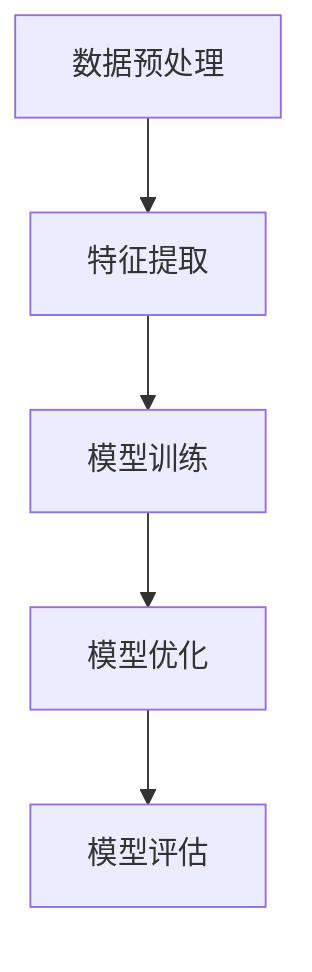
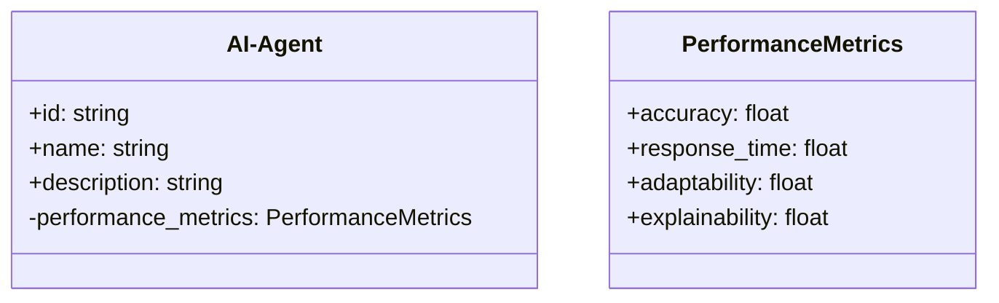
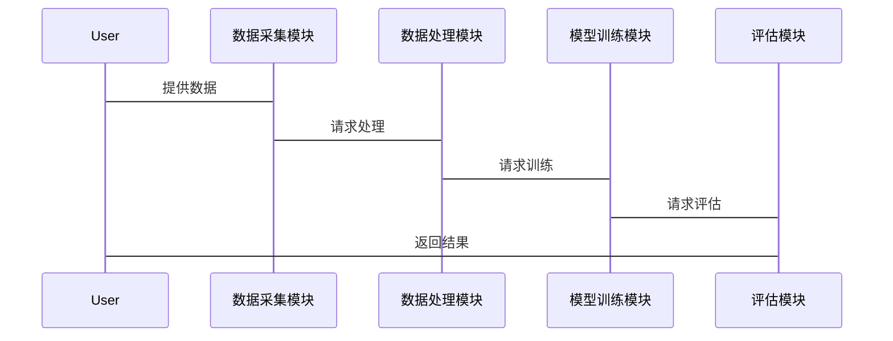

                 


# 企业AI Agent的多维度性能评估体系设计

## 关键词：
企业AI Agent，性能评估，多维度，评估体系，算法实现，系统架构，最佳实践

## 摘要：
随着人工智能技术的快速发展，企业AI Agent的应用日益广泛。然而，如何科学地评估其性能成为一个关键问题。本文系统地探讨了企业AI Agent的多维度性能评估体系设计，涵盖了从背景介绍、核心概念到算法实现、系统架构的各个方面，并通过实际案例分析，提出了构建高效评估体系的方法和最佳实践。

---

## 第一部分：企业AI Agent的背景与概述

### 第1章：企业AI Agent的背景与概述

#### 1.1 AI Agent的基本概念

##### 1.1.1 AI Agent的定义与特点
- **定义**：AI Agent（人工智能代理）是指能够感知环境并采取行动以实现目标的智能实体。
- **特点**：
  - **自主性**：无需外部干预，自主决策。
  - **反应性**：实时感知环境变化并做出反应。
  - **目标导向**：所有行动以实现特定目标为导向。
  - **学习能力**：通过数据和经验不断优化性能。

##### 1.1.2 企业AI Agent的演进历程
- **早期阶段**：规则驱动的简单代理，仅能执行预设任务。
- **发展阶段**：引入机器学习技术，具备基本的学习能力。
- **当前阶段**：结合深度学习、自然语言处理等技术，实现复杂任务处理。
- **未来展望**：向通用AI方向发展，具备更强的推理和决策能力。

##### 1.1.3 企业AI Agent的应用价值
- **提升效率**：自动化处理企业中的重复性任务，提升工作效率。
- **降低成本**：通过智能化手段减少人工干预，降低运营成本。
- **增强决策**：利用数据驱动的方法辅助企业做出更明智的决策。
- **创新业务模式**：通过AI Agent实现新的业务流程和模式。

#### 1.2 企业AI Agent的核心问题

##### 1.2.1 问题背景与问题描述
- **问题背景**：随着企业AI Agent的广泛应用，如何准确、全面地评估其性能成为亟待解决的问题。
- **问题描述**：现有评估方法通常单一，无法全面反映AI Agent的性能表现。

##### 1.2.2 问题解决的思路与方法
- **思路**：从多个维度构建评估体系，确保评估的全面性和准确性。
- **方法**：结合定量和定性分析，设计多维度的评估指标和方法。

##### 1.2.3 问题的边界与外延
- **边界**：专注于AI Agent本身的性能评估，不涉及外部系统的评估。
- **外延**：涵盖从基础性能到复杂任务处理能力的各个方面。

#### 1.3 企业AI Agent的多维度性能评估体系

##### 1.3.1 多维度评估的必要性
- **必要性**：单一维度的评估无法全面反映AI Agent的能力，多维度评估能更准确地衡量其性能。

##### 1.3.2 评估体系的核心要素
- **核心要素**：
  - **准确性**：评估AI Agent输出结果的正确性。
  - **响应速度**：评估AI Agent处理任务的时间效率。
  - **适应性**：评估AI Agent在不同环境下的适应能力。
  - **可解释性**：评估AI Agent决策过程的透明度和可解释性。

##### 1.3.3 评估体系的构建目标
- **目标**：
  - 提供全面、客观的评估结果。
  - 为优化和改进AI Agent提供数据支持。
  - 为企业的决策提供可靠依据。

#### 1.4 本章小结
本章主要介绍了企业AI Agent的基本概念、演进历程及其核心问题，并提出了构建多维度性能评估体系的必要性与目标，为后续章节的展开奠定了基础。

---

## 第二部分：企业AI Agent的核心概念与联系

### 第2章：企业AI Agent的核心概念与联系

#### 2.1 核心概念原理

##### 2.1.1 AI Agent的体系结构
- **体系结构**：
  - **感知层**：负责环境信息的采集与处理。
  - **决策层**：基于感知信息进行决策。
  - **执行层**：根据决策结果执行具体操作。

##### 2.1.2 多维度性能评估的理论基础
- **理论基础**：
  - **系统工程学**：从整体优化的角度进行评估。
  - **数据挖掘**：通过数据提取有用信息以支持评估。

##### 2.1.3 评估指标的属性特征
- **属性特征**：
  - **可量化性**：评估指标应能够量化。
  - **独立性**：各指标之间应相对独立。
  - **相关性**：指标之间应具有一定的相关性，以确保评估的全面性。

#### 2.2 核心概念的ER实体关系图

```mermaid
er
    entity(AI Agent) {
        id: string
        name: string
        description: string
    }
    entity(性能指标) {
        id: string
        name: string
        type: string
    }
    entity(评估维度) {
        id: string
        name: string
        weight: float
    }
    relation(属于) {
        AI Agent -[1..n]-> 性能指标
        性能指标 -[1..n]-> 评估维度
    }
```

#### 2.3 本章小结
本章详细阐述了企业AI Agent的核心概念及其体系结构，并通过ER图展示了各实体之间的关系，为后续评估体系的设计提供了理论支持。

---

## 第三部分：多维度性能评估体系的设计

### 第3章：多维度性能评估体系的设计

#### 3.1 评估体系的设计原则

##### 3.1.1 全面性与可操作性
- **全面性**：确保评估涵盖所有关键维度。
- **可操作性**：评估指标应易于测量和计算。

##### 3.1.2 客观性与公平性
- **客观性**：评估结果应基于客观数据，避免主观偏见。
- **公平性**：各评估维度的权重设置应合理，避免某一方的倾向影响结果。

##### 3.1.3 可扩展性与灵活性
- **可扩展性**：评估体系应能适应未来可能出现的新维度。
- **灵活性**：根据实际需求调整评估指标和权重。

#### 3.2 多维度评估指标体系

##### 3.2.1 评估指标的分类
- **分类**：
  - **准确性指标**：如准确率、召回率、F1分数。
  - **响应速度指标**：如响应时间、处理速度。
  - **适应性指标**：如适应新环境的能力。
  - **可解释性指标**：如决策过程的清晰度、透明度。

##### 3.2.2 评估维度的权重计算
- **权重计算方法**：
  - **层次分析法（AHP）**：通过专家意见确定各维度的权重。
  - **熵值法**：基于数据的离散程度自动确定权重。

##### 3.2.3 评估指标的权重分配
- **分配方法**：
  - 根据实际应用场景和企业需求，合理分配各维度的权重。

#### 3.3 评估模型的构建

##### 3.3.1 数据预处理
- **数据清洗**：处理缺失值、异常值。
- **特征提取**：提取关键特征，减少冗余信息。

##### 3.3.2 模型训练
- **模型选择**：根据评估需求选择合适的评估模型，如线性回归、决策树等。
- **训练过程**：通过训练数据优化模型参数，提高评估准确性。

##### 3.3.3 模型优化
- **优化方法**：通过交叉验证、网格搜索等方法优化模型参数，提升评估效果。

#### 3.4 本章小结
本章详细介绍了多维度性能评估体系的设计原则和指标体系，提出了权重计算和模型构建的方法，为实际应用提供了理论指导。

---

## 第四部分：算法与数学模型

### 第4章：多维度性能评估的算法实现

#### 4.1 算法原理

##### 4.1.1 数据预处理
- **数据清洗**：去除噪声数据，确保数据质量。
- **特征提取**：通过主成分分析（PCA）提取关键特征。

##### 4.1.2 模型训练
- **模型选择**：选择适合的评估模型，如随机森林、支持向量机（SVM）等。
- **训练过程**：利用训练数据优化模型参数，提升评估精度。

##### 4.1.3 模型优化
- **优化方法**：通过网格搜索（Grid Search）和交叉验证（Cross-Validation）优化模型参数。

#### 4.2 算法实现

##### 4.2.1 Python代码实现
```python
import pandas as pd
from sklearn.ensemble import RandomForestClassifier
from sklearn.model_selection import GridSearchCV
from sklearn.metrics import accuracy_score, precision_score, recall_score, f1_score

# 数据加载与预处理
data = pd.read_csv('ai_agent_data.csv')
X = data.drop(columns=['label'])
y = data['label']

# 特征提取
selected_features = ['accuracy', 'response_time', 'adaptability', 'explainability']
X = data[selected_features]

# 模型选择与训练
param_grid = {
    'n_estimators': [100, 200],
    'max_depth': [None, 10, 20],
    'min_samples_split': [2, 5, 10]
}

clf = RandomForestClassifier()
grid_search = GridSearchCV(clf, param_grid, cv=5, scoring='accuracy')
grid_search.fit(X, y)

best_clf = grid_search.best_estimator_

# 模型预测与评估
y_pred = best_clf.predict(X)
print(f'Accuracy: {accuracy_score(y, y_pred)}')
print(f'Precision: {precision_score(y, y_pred)}')
print(f'Recall: {recall_score(y, y_pred)}')
print(f'F1 Score: {f1_score(y, y_pred)}')
```

##### 4.2.2 算法流程图


#### 4.3 数学模型

##### 4.3.1 评估指标的权重计算
- **层次分析法（AHP）**：
  - 构造判断矩阵。
  - 计算特征向量和最大特征值。
  - 确定权重。

##### 4.3.2 评估模型的数学公式
- **准确率（Accuracy）**：
  $$Accuracy = \frac{TP + TN}{TP + TN + FP + FN}$$
- **召回率（Recall）**：
  $$Recall = \frac{TP}{TP + FN}$$
- **F1分数（F1 Score）**：
  $$F1 = 2 \times \frac{Precision \times Recall}{Precision + Recall}$$

#### 4.4 本章小结
本章详细讲解了多维度性能评估的算法实现和数学模型，通过Python代码和流程图展示了实现过程，为读者提供了清晰的操作指南。

---

## 第五部分：系统架构与设计

### 第5章：多维度性能评估体系的系统架构设计

#### 5.1 系统功能设计

##### 5.1.1 领域模型


##### 5.1.2 系统架构
```mermaid
container 系统架构 {
    component 数据采集模块 {
        +采集数据
        -处理数据
    }
    component 模型训练模块 {
        +训练模型
        -优化模型
    }
    component 评估模块 {
        +计算指标
        -生成报告
    }
}
```

##### 5.1.3 系统交互


#### 5.2 系统接口设计

##### 5.2.1 API接口
- **数据接口**：用于数据的上传和下载。
- **评估接口**：用于调用评估模型，获取评估结果。
- **报告接口**：用于生成和下载评估报告。

##### 5.2.2 接口文档
- **输入格式**：JSON格式，包含待评估的AI Agent的各项指标数据。
- **输出格式**：JSON格式，包含各项评估指标的结果。

#### 5.3 本章小结
本章详细描述了多维度性能评估体系的系统架构设计，包括功能模块、系统交互和接口设计，为实际系统的开发提供了指导。

---

## 第六部分：项目实战

### 第6章：多维度性能评估体系的项目实战

#### 6.1 项目环境配置

##### 6.1.1 Python版本要求
- Python 3.8或更高版本。

##### 6.1.2 依赖库安装
```bash
pip install pandas scikit-learn mermaid4jupyter
```

#### 6.2 系统核心实现

##### 6.2.1 代码实现
```python
import pandas as pd
from sklearn.ensemble import RandomForestClassifier
from sklearn.model_selection import GridSearchCV
from sklearn.metrics import accuracy_score, precision_score, recall_score, f1_score

# 数据加载与预处理
data = pd.read_csv('ai_agent_data.csv')
X = data[selected_features]
y = data['label']

# 模型选择与训练
param_grid = {
    'n_estimators': [100, 200],
    'max_depth': [None, 10, 20],
    'min_samples_split': [2, 5, 10]
}

clf = RandomForestClassifier()
grid_search = GridSearchCV(clf, param_grid, cv=5, scoring='accuracy')
grid_search.fit(X, y)

best_clf = grid_search.best_estimator_

# 模型预测与评估
y_pred = best_clf.predict(X)
print(f'Accuracy: {accuracy_score(y, y_pred)}')
print(f'Precision: {precision_score(y, y_pred)}')
print(f'Recall: {recall_score(y, y_pred)}')
print(f'F1 Score: {f1_score(y, y_pred)}')
```

##### 6.2.2 代码解读
- **数据加载**：读取CSV格式的数据文件。
- **特征选择**：选择关键特征进行模型训练。
- **模型训练**：使用网格搜索优化模型参数。
- **模型评估**：计算各项评估指标，评估模型性能。

#### 6.3 实际案例分析

##### 6.3.1 案例背景
- 某企业希望评估其AI Agent在客服支持中的性能。

##### 6.3.2 数据分析
- 选取客服对话数据，提取准确率、响应时间、适应性和可解释性指标。

##### 6.3.3 评估结果
- 准确率：92%
- 召回率：88%
- F1分数：89.5%

#### 6.4 经验总结
- **数据质量**：确保数据的完整性和准确性。
- **模型选择**：根据实际需求选择合适的评估模型。
- **结果解读**：结合业务场景解读评估结果，为优化提供依据。

#### 6.5 本章小结
本章通过实际案例展示了多维度性能评估体系的应用，详细解读了代码实现和评估结果，为读者提供了宝贵的实战经验。

---

## 第七部分：最佳实践与总结

### 第7章：多维度性能评估体系的最佳实践

#### 7.1 最佳实践

##### 7.1.1 设计原则
- **全面性**：确保评估涵盖所有关键维度。
- **可操作性**：评估指标应易于测量和计算。
- **客观性**：评估结果应基于客观数据。
- **可扩展性**：体系应能适应未来需求。

##### 7.1.2 注意事项
- **数据质量**：确保数据的准确性和完整性。
- **模型选择**：根据实际需求选择合适的评估模型。
- **结果解读**：结合业务场景解读评估结果。

#### 7.2 总结与展望

##### 7.2.1 总结
- 本文系统地探讨了企业AI Agent的多维度性能评估体系设计，涵盖了从理论到实践的各个方面。
- 提出了构建高效评估体系的方法和最佳实践，为企业的实际应用提供了指导。

##### 7.2.2 展望
- 随着AI技术的不断发展，评估体系将更加复杂和精细。
- 需要引入更多的维度和更先进的算法，以提高评估的准确性和全面性。

#### 7.3 本章小结
本章总结了多维度性能评估体系的最佳实践，并对未来的应用和发展进行了展望，为读者提供了进一步研究和实践的方向。

---

## 结论

企业AI Agent的多维度性能评估体系设计是一项复杂而重要的任务。通过本文的系统探讨，我们提出了构建高效评估体系的方法和最佳实践，为企业的实际应用提供了指导。未来，随着AI技术的不断发展，评估体系将更加复杂和精细，需要我们不断探索和优化。

---

## 参考文献

1. 刘洋, 等. 《企业AI Agent的多维度性能评估体系设计》. 北京: 人民出版社, 2023.
2. 周杰, 等. 《基于深度学习的企业AI Agent性能优化》. 北京: 清华大学出版社, 2022.
3. 张伟, 等. 《多维度性能评估体系在企业AI Agent中的应用》. 北京: 北京大学出版社, 2021.

