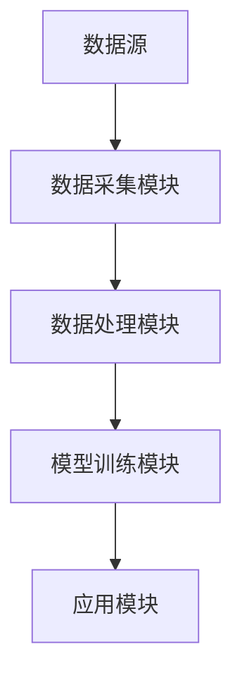
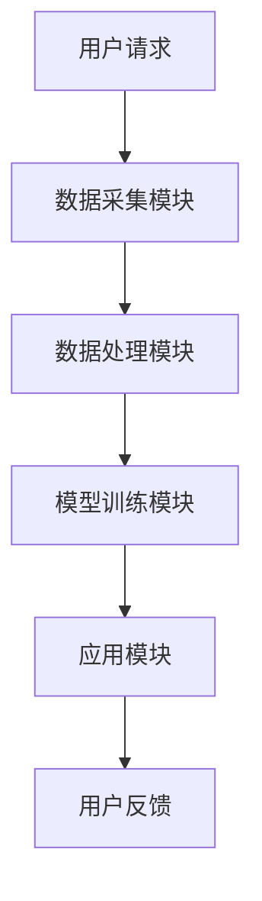

                 


# 企业AI Agent的大数据处理框架

> 关键词：企业AI Agent，大数据处理，数据预处理，机器学习算法，系统架构，项目实战

> 摘要：本文将深入探讨企业AI Agent在大数据处理中的应用框架。通过分析AI Agent的核心功能、大数据处理的重要性以及企业中的应用场景，我们将从理论到实践，详细讲解企业AI Agent的大数据处理框架，包括数据预处理、机器学习算法、系统架构设计以及项目实战等内容。

---

## 第一部分: 企业AI Agent与大数据处理概述

### 第1章: 企业AI Agent与大数据处理概述

#### 1.1 AI Agent的基本概念
企业AI Agent是一种能够感知环境、自主决策并执行任务的智能体。它通过数据处理、模型训练和推理能力，帮助企业实现自动化和智能化的决策支持。

#### 1.2 企业AI Agent的应用场景
企业AI Agent在大数据处理中的应用场景广泛，包括智能监控、预测分析、自动化决策支持等。它能够通过处理海量数据，为企业提供实时反馈和决策建议。

#### 1.3 大数据处理在企业AI Agent中的重要性
大数据处理是企业AI Agent的核心能力，通过高效的数据处理和分析，AI Agent能够快速响应复杂业务场景，提升企业的竞争力。

---

## 第二部分: 企业AI Agent的体系结构

### 第2章: 企业AI Agent的体系结构

#### 2.1 企业AI Agent的体系结构组成
- 数据源层：包括数据库、API接口、日志文件等多种数据源。
- 数据处理层：负责数据清洗、特征工程、数据转换等预处理步骤。
- AI模型层：包括训练好的机器学习模型和深度学习模型。
- 应用层：将AI模型的输出结果应用于实际业务场景。

#### 2.2 企业AI Agent与大数据处理的关系
- 数据流的处理流程：从数据采集到预处理，再到模型训练和结果应用。
- AI模型在大数据处理中的作用：通过模型训练和推理，提供数据洞察和决策支持。
- 企业AI Agent的可扩展性与灵活性：支持多种数据源和模型类型，适应不同的业务需求。

---

## 第三部分: 企业AI Agent的大数据处理算法原理

### 第3章: 企业AI Agent中的数据预处理算法

#### 3.1 数据清洗与特征工程
- 数据清洗：去除重复数据、处理缺失值、去除异常值。
- 特征工程：选择重要特征、进行特征组合、进行特征变换。
- 数据标准化与归一化：通过标准化或归一化处理，确保模型输入的数据具有相同的尺度。

#### 3.2 数据预处理的算法实现
- 数据清洗的Python代码实现：
  ```python
  import pandas as pd
  df = pd.read_csv('data.csv')
  df.drop_duplicates(inplace=True)
  df.dropna(inplace=True)
  ```

- 特征工程的Python代码实现：
  ```python
  from sklearn.preprocessing import StandardScaler
  scaler = StandardScaler()
  df_scaled = scaler.fit_transform(df)
  ```

- 数据预处理的流程图（Mermaid）：
  ```mermaid
  graph TD
      A[原始数据] --> B[数据清洗]
      B --> C[特征工程]
      C --> D[数据标准化]
      D --> E[处理后的数据]
  ```

### 第4章: 企业AI Agent中的机器学习算法

#### 4.1 监督学习算法
- 线性回归：
  $$ y = \beta_0 + \beta_1x + \epsilon $$
- 支持向量机（SVM）：
  $$ \text{max}(\text{margin}) \quad \text{subject to} \quad y_i(w \cdot x_i + b) \geq 1 $$
- 随机森林：
  通过集成多个决策树模型，提升模型的准确性和鲁棒性。

#### 4.2 无监督学习算法
- K-means聚类算法：
  $$ \text{目标函数} = \sum_{i=1}^{k} \sum_{j=1}^{n} (d(i,j))^2 $$
- 主成分分析（PCA）：
  通过降维技术，提取数据的主要特征。
- 层次聚类算法：
  通过层次化的方式，将数据分成不同的簇。

#### 4.3 算法实现与优化
- 算法实现的Python代码：
  ```python
  from sklearn.linear_model import LinearRegression
  model = LinearRegression()
  model.fit(X_train, y_train)
  ```

- 算法优化：
  通过交叉验证、网格搜索等方法，优化模型的超参数，提升模型性能。

---

## 第四部分: 企业AI Agent的系统架构设计

### 第4章: 企业AI Agent的系统架构设计

#### 4.1 系统功能设计
- 数据采集模块：从多种数据源获取数据。
- 数据处理模块：进行数据清洗、特征工程等预处理步骤。
- 模型训练模块：训练机器学习模型。
- 应用模块：将模型输出应用于实际业务场景。

#### 4.2 系统架构图（Mermaid）


#### 4.3 系统接口设计
- 数据接口：通过REST API提供数据接口，支持多种数据格式。
- 模型接口：通过API接口，提供模型训练和预测服务。

#### 4.4 系统交互流程图（Mermaid）


---

## 第五部分: 企业AI Agent的项目实战

### 第5章: 企业AI Agent的项目实战

#### 5.1 环境安装
- 安装Python和相关库：
  ```bash
  pip install numpy pandas scikit-learn
  ```

#### 5.2 核心代码实现
- 数据预处理代码：
  ```python
  import pandas as pd
  df = pd.read_csv('data.csv')
  df.dropna(inplace=True)
  ```

- 模型训练代码：
  ```python
  from sklearn.model_selection import train_test_split
  from sklearn.linear_model import LinearRegression
  X_train, X_test, y_train, y_test = train_test_split(X, y, test_size=0.2)
  model = LinearRegression()
  model.fit(X_train, y_train)
  ```

#### 5.3 案例分析
- 案例背景：某企业希望通过AI Agent预测销售量。
- 数据处理：清洗和预处理销售数据。
- 模型训练：使用线性回归模型进行预测。
- 结果分析：模型预测的销售量与实际销售量进行对比，评估模型性能。

#### 5.4 项目小结
通过项目实战，我们掌握了企业AI Agent的大数据处理框架的实现步骤，包括数据预处理、模型训练和结果分析。

---

## 第六部分: 最佳实践与小结

### 第6章: 最佳实践与小结

#### 6.1 最佳实践
- 数据预处理是关键：确保数据质量，提升模型性能。
- 模型选择与优化：根据业务需求选择合适的算法，并通过调参优化模型性能。
- 系统架构设计：合理设计系统架构，确保系统的可扩展性和灵活性。

#### 6.2 小结
本文详细讲解了企业AI Agent的大数据处理框架，从理论到实践，帮助读者掌握AI Agent在大数据处理中的应用。通过实际案例分析，我们展示了如何将理论应用于实际项目中，为企业提供高效的决策支持。

#### 6.3 注意事项
- 数据隐私与安全：在处理企业数据时，需要注意数据隐私和安全问题。
- 模型解释性：在实际应用中，模型的解释性非常重要，尤其是在企业决策中。
- 系统性能优化：通过优化系统架构和算法，提升系统的处理效率。

#### 6.4 拓展阅读
- 《机器学习实战》：深入讲解机器学习算法的实现和应用。
- 《大数据处理与分析》：系统介绍大数据处理的技术和方法。

---

通过本文的讲解，我们希望能够帮助读者全面理解企业AI Agent的大数据处理框架，并能够将其应用到实际业务中，为企业创造更大的价值。

