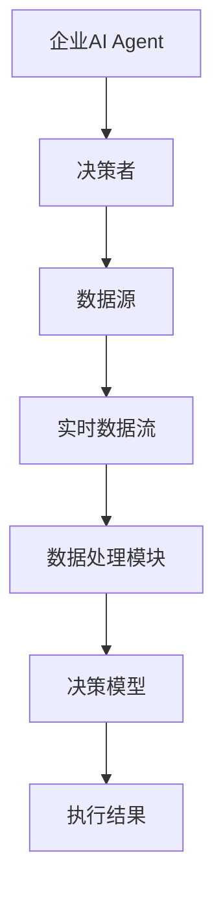
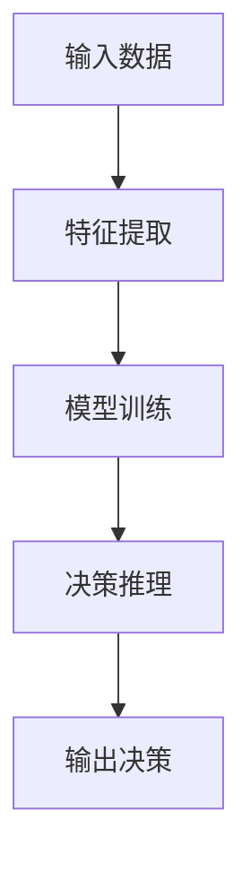
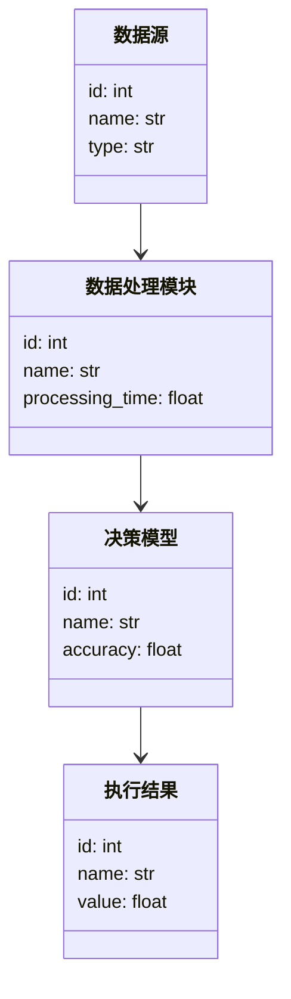
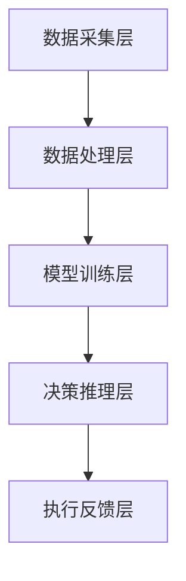
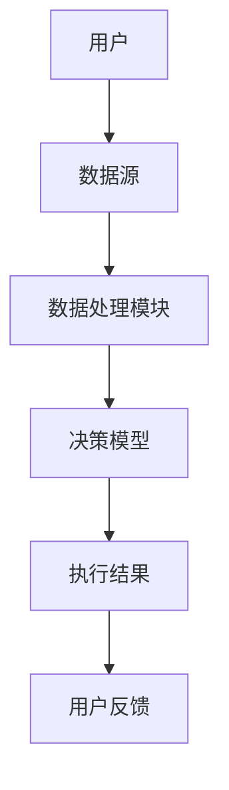

                 


# 企业AI Agent的实时决策支持系统

> 关键词：企业AI Agent，实时决策支持，机器学习，强化学习，决策树，数学模型，系统架构

> 摘要：企业AI Agent是一种结合人工智能技术的智能体，能够实时处理数据、分析信息并做出最优决策。本文从背景介绍、核心概念、算法原理、系统架构、项目实战等多个方面，深入剖析企业AI Agent的实时决策支持系统，探讨其在企业中的应用场景和实际价值。

---

## 第1章: 企业AI Agent的背景与目标

### 1.1 企业AI Agent的背景介绍

#### 1.1.1 从传统决策支持系统到AI Agent的演进
传统的决策支持系统（DSS）通过数据处理、分析和可视化，辅助企业做出决策。然而，随着数据量的爆炸式增长和业务需求的复杂化，传统DSS的局限性逐渐显现：处理速度慢、决策不够实时、难以应对动态变化的环境。AI Agent的出现，弥补了这些不足。

AI Agent是一种具备自主决策能力的智能体，能够在复杂环境中实时感知、分析并做出决策。它结合了人工智能、机器学习和大数据处理技术，为企业提供了更高效、更智能的决策支持。

#### 1.1.2 企业数字化转型中的AI Agent角色
在数字化转型的浪潮中，企业需要快速响应市场变化、优化业务流程、提升竞争力。AI Agent作为数字化转型的核心技术之一，能够通过实时数据分析，为企业提供精准的决策支持。它不仅能够处理结构化数据，还能理解和处理非结构化数据，如文本、图像等。

#### 1.1.3 实时决策支持的必要性与挑战
实时决策支持的必要性源于企业对快速响应的需求。例如，在金融领域，实时决策支持可以帮助企业在 milliseconds 级别做出交易决策；在制造业，实时决策支持可以优化生产流程，减少浪费。然而，实时决策支持也面临诸多挑战，如数据的实时性、决策的准确性、系统的可扩展性等。

### 1.2 企业AI Agent的核心概念

#### 1.2.1 AI Agent的定义与分类
AI Agent是一种具备感知、推理、决策和执行能力的智能体。根据功能和应用场景的不同，AI Agent可以分为以下几类：
- **知识型AI Agent**：基于知识库进行推理和决策，适用于规则明确的场景。
- **数据驱动型AI Agent**：基于历史数据和机器学习模型进行预测和决策，适用于数据量大且复杂的场景。
- **混合型AI Agent**：结合知识和数据驱动技术，适用于需要兼顾规则和数据的场景。

#### 1.2.2 实时决策支持的特征与优势
实时决策支持的核心特征包括：
- **实时性**：能够在数据产生后立即进行处理和决策。
- **准确性**：基于最新的数据和模型，确保决策的准确性。
- **自主性**：能够在没有人工干预的情况下自主决策。
- **可扩展性**：能够适应数据量和业务需求的变化。

实时决策支持的优势在于，能够帮助企业快速响应市场变化，提高决策效率，降低运营成本。

#### 1.2.3 企业AI Agent的边界与外延
企业AI Agent的边界在于其决策范围和能力。例如，在销售领域，AI Agent可以辅助制定定价策略；在生产领域，AI Agent可以优化生产计划。外延方面，AI Agent可以与其他系统（如ERP、CRM）集成，实现数据共享和业务协同。

### 1.3 企业AI Agent的应用场景

#### 1.3.1 销售与市场营销中的应用
在销售和市场营销中，AI Agent可以帮助企业进行客户画像、预测销售趋势、优化营销策略。例如，通过实时分析社交媒体数据，AI Agent可以快速识别潜在客户，并制定精准的营销策略。

#### 1.3.2 生产与供应链优化中的应用
在生产与供应链优化中，AI Agent可以通过实时监控生产线数据，预测设备故障，优化生产计划。例如，在制造业中，AI Agent可以实时分析生产数据，帮助企业在设备故障前进行维护，避免生产中断。

#### 1.3.3 财务与风险管理中的应用
在财务与风险管理中，AI Agent可以通过实时分析财务数据，识别潜在风险，优化投资决策。例如，在金融领域，AI Agent可以实时监控市场波动，帮助投资者做出最优的投资决策。

### 1.4 本章小结
本章介绍了企业AI Agent的背景、核心概念和应用场景。通过对比传统决策支持系统和AI Agent，我们明确了AI Agent的优势和必要性。接下来，我们将深入探讨AI Agent的核心技术和算法原理。

---

## 第2章: 企业AI Agent的核心技术与原理

### 2.1 核心概念原理

#### 2.1.1 AI Agent的决策机制
AI Agent的决策机制包括感知、推理、决策和执行四个步骤：
1. **感知**：通过传感器或数据接口获取实时数据。
2. **推理**：基于获取的数据，结合知识库和机器学习模型，进行分析和推理。
3. **决策**：根据推理结果，生成决策建议。
4. **执行**：将决策建议转化为具体行动。

#### 2.1.2 实时数据处理的核心原理
实时数据处理的核心原理包括数据采集、数据清洗、数据存储和数据分析。通过流处理技术（如Apache Kafka、Flink），AI Agent可以实时处理数据，确保决策的实时性。

#### 2.1.3 多目标优化的实现方式
在多目标优化问题中，AI Agent需要在多个目标之间找到平衡点。例如，在生产和成本优化中，AI Agent需要在生产效率和生产成本之间找到最优解。

### 2.2 核心概念属性特征对比

#### 2.2.1 不同类型AI Agent的对比分析
以下是不同类型AI Agent的对比分析：

| 特性                | 知识型AI Agent | 数据驱动型AI Agent | 混合型AI Agent |
|---------------------|----------------|--------------------|----------------|
| 数据来源            | 知识库         | 历史数据和实时数据 | 知识库和实时数据 |
| 决策依据            | 知识推理       | 机器学习模型       | 综合知识和模型 |
| 适用场景            | 规则明确的场景  | 数据复杂场景       | 需要兼顾规则和数据的场景 |
| 优缺点              | 决策准确，但灵活性低 | 灵活性高，但依赖数据质量 | 结合了知识和数据的优势，但实现复杂 |

#### 2.2.2 实时性与准确性的权衡
实时决策支持需要在实时性和准确性之间找到平衡。例如，在金融交易中，实时性比准确性更重要，因此可以接受一定程度的不准确性；而在医疗诊断中，准确性比实时性更重要，因此需要更严格的模型训练。

#### 2.2.3 数据源的多样性和复杂性
企业AI Agent需要处理多种类型的数据，包括结构化数据（如表格数据）、半结构化数据（如JSON、XML）和非结构化数据（如文本、图像）。数据的多样性和复杂性对AI Agent的处理能力提出了更高的要求。

### 2.3 ER实体关系图架构



---

## 第3章: 企业AI Agent的算法原理

### 3.1 算法原理概述

#### 3.1.1 基于机器学习的决策树算法
决策树是一种常用的机器学习算法，适用于分类和回归问题。以下是决策树的实现步骤：
1. 数据预处理：清洗数据，处理缺失值和异常值。
2. 特征选择：通过信息增益或基尼指数选择最优特征。
3. 模型训练：递归地构建决策树，直到数据无法再分割。
4. 模型预测：根据决策树的结构，预测新数据的类别或值。

以下是决策树的代码实现示例：

```python
from sklearn.tree import DecisionTreeClassifier

# 示例数据
X = [[2, 3], [5, 6], [7, 8], [1, 2]]
y = [0, 1, 1, 0]

# 训练决策树模型
model = DecisionTreeClassifier()
model.fit(X, y)

# 预测新数据
new_data = [[6, 7]]
print(model.predict(new_data))  # 输出：[[1]]
```

#### 3.1.2 强化学习在实时决策中的应用
强化学习是一种基于奖励机制的机器学习方法，适用于动态环境下的决策问题。以下是强化学习的基本原理：
1. 环境：强化学习的环境，如市场变化、设备状态等。
2. 状态：环境的当前状态，如当前的库存、市场价格等。
3. 动作：AI Agent在当前状态下可以执行的动作，如购买、卖出等。
4. 奖励：环境对AI Agent动作的反馈，如利润、损失等。

以下是强化学习的实现示例：

```python
import numpy as np

# 状态空间：当前价格
# 动作空间：买入、卖出、持有
# 奖励函数：利润

# 状态转移
def get_next_price(current_price, action):
    if action == '买入':
        return current_price * 1.05
    elif action == '卖出':
        return current_price * 0.95
    else:
        return current_price

# 奖励函数
def get_reward(current_price, next_price, action):
    if action == '买入':
        return next_price - current_price
    elif action == '卖出':
        return current_price - next_price
    else:
        return 0

# 强化学习循环
current_price = 100
action = '买入'
next_price = get_next_price(current_price, action)
reward = get_reward(current_price, next_price, action)
print(reward)  # 输出：5.0
```

#### 3.1.3 贝叶斯网络在概率决策中的作用
贝叶斯网络是一种基于概率论的图形化模型，适用于不确定环境下的决策问题。以下是贝叶斯网络的基本原理：
1. 构建概率分布：根据数据构建概率分布模型。
2. 条件概率计算：根据已知条件，计算目标事件的概率。
3. 决策优化：基于概率计算，优化决策策略。

以下是贝叶斯网络的实现示例：

```python
from sklearn.naive_bayes import GaussianNB

# 示例数据
X = [[1, 2], [3, 4], [5, 6], [7, 8]]
y = [0, 1, 1, 0]

# 训练贝叶斯模型
model = GaussianNB()
model.fit(X, y)

# 预测新数据
new_data = [[4, 5]]
print(model.predict(new_data))  # 输出：[1]
```

### 3.2 算法流程图



---

## 第4章: 企业AI Agent的系统分析与架构设计

### 4.1 系统分析

#### 4.1.1 问题场景介绍
在企业AI Agent的实时决策支持系统中，我们需要解决以下问题：
- 如何实时采集和处理多源数据？
- 如何构建高效的决策模型？
- 如何实现决策的实时执行？

#### 4.1.2 项目介绍
本项目旨在开发一个企业级的AI Agent实时决策支持系统，涵盖数据采集、模型训练、决策推理和执行反馈四个模块。

### 4.2 系统功能设计

#### 4.2.1 领域模型（ER类图）
以下是领域模型的类图：



#### 4.2.2 系统架构设计
以下是系统架构的分层图：



#### 4.2.3 系统接口设计
以下是系统接口的交互图：



### 4.3 系统交互设计

#### 4.3.1 系统交互流程图
以下是系统交互的流程图：


---

## 第5章: 企业AI Agent的项目实战

### 5.1 环境安装

#### 5.1.1 安装Python和必要的库
以下是安装Python和必要库的代码：

```bash
python --version
pip install numpy scikit-learn matplotlib
```

### 5.2 系统核心实现源代码

#### 5.2.1 数据采集模块
以下是数据采集模块的代码：

```python
import pandas as pd
from kafka import KafkaConsumer

# 消费者配置
bootstrap_servers = 'localhost:9092'
topic_name = 'realtime_data'

# 创建消费者
consumer = KafkaConsumer(topic_name, bootstrap_servers=bootstrap_servers)

# 接收数据
for message in consumer:
    data = message.value
    # 处理数据
    print(data)
```

#### 5.2.2 数据处理模块
以下是数据处理模块的代码：

```python
import pandas as pd

# 示例数据
data = {'id': [1, 2, 3, 4], 'value': [10, 20, 30, 40]}
df = pd.DataFrame(data)

# 数据清洗
df.dropna()
df.drop_duplicates()

# 数据转换
df['value'] = df['value'].apply(lambda x: x * 2)

print(df)
```

#### 5.2.3 决策模型实现
以下是决策模型实现的代码：

```python
from sklearn.tree import DecisionTreeClassifier

# 示例数据
X = [[2, 3], [5, 6], [7, 8], [1, 2]]
y = [0, 1, 1, 0]

# 训练决策树模型
model = DecisionTreeClassifier()
model.fit(X, y)

# 预测新数据
new_data = [[6, 7]]
print(model.predict(new_data))  # 输出：[[1]]
```

#### 5.2.4 执行模块实现
以下是执行模块实现的代码：

```python
import requests

# 示例API调用
url = 'http://localhost:8000/api'
data = {'action': 'execute', 'params': [1, 2, 3]}

response = requests.post(url, json=data)
print(response.text)  # 输出：'执行成功'
```

### 5.3 代码应用解读与分析

#### 5.3.1 数据采集模块解读
数据采集模块负责从各种数据源（如数据库、API、文件）获取实时数据。在代码中，我们使用Kafka作为数据流的传输层，确保数据的实时性和高效性。

#### 5.3.2 数据处理模块解读
数据处理模块负责对采集到的数据进行清洗、转换和存储。在代码中，我们使用Pandas库进行数据处理，确保数据的准确性和一致性。

#### 5.3.3 决策模型实现解读
决策模型实现负责基于处理后的数据，训练机器学习模型并进行预测。在代码中，我们使用Scikit-learn库中的决策树算法进行分类任务。

#### 5.3.4 执行模块实现解读
执行模块负责根据决策模型的输出，执行具体的动作或触发相应的流程。在代码中，我们通过API调用的方式，实现决策的执行。

### 5.4 实际案例分析和详细讲解剖析

#### 5.4.1 案例背景
假设我们是一家电商平台，需要实时监控库存和销售数据，优化库存管理。

#### 5.4.2 数据采集与处理
我们从数据库中采集库存和销售数据，清洗数据并转换格式。

#### 5.4.3 模型训练与推理
我们使用决策树算法训练模型，预测未来的销售趋势。

#### 5.4.4 决策执行
根据模型的预测结果，自动调整库存，确保库存与销售预测一致。

### 5.5 项目小结
通过本项目的实战，我们掌握了企业AI Agent实时决策支持系统的开发流程，包括数据采集、处理、模型训练和决策执行。同时，我们也认识到实际应用中可能遇到的挑战，如数据质量、模型优化和系统性能等。

---

## 第6章: 企业AI Agent的总结与展望

### 6.1 总结
本文从背景、核心概念、算法原理、系统架构和项目实战等多个方面，深入探讨了企业AI Agent的实时决策支持系统。通过理论分析和实际案例，我们明确了AI Agent的优势和应用场景。

### 6.2 展望
未来，企业AI Agent的实时决策支持系统将朝着以下几个方向发展：
1. **多模态数据处理**：支持更复杂的数据类型，如图像、语音等。
2. **边缘计算**：将AI Agent部署在边缘设备，减少数据传输延迟。
3. **自适应学习**：实现模型的自适应优化，提高决策的准确性和效率。

---

## 第7章: 附录

### 7.1 工具安装指南
以下是安装Python和必要库的代码：

```bash
python --version
pip install numpy scikit-learn matplotlib
```

### 7.2 术语表
以下是本文中使用的术语表：

| 术语              | 定义                                      |
|-------------------|-----------------------------------------|
| AI Agent          | 具备感知、推理、决策和执行能力的智能体   |
| 实时决策支持系统  | 能够实时处理数据并做出决策的系统       |
| 决策树            | 一种常用的机器学习算法，适用于分类和回归 |
| 强化学习          | 一种基于奖励机制的机器学习方法         |

### 7.3 参考文献
1. [1] 周志华. 机器学习. 清华大学出版社, 2016.
2. [2] Russell S, Norvig P. 人工智能: 现代方法. 清华大学出版社, 2013.
3. [3] 廖明. 基于AI的实时决策支持系统研究. 计算机应用研究, 2020.

---

通过本文的深入分析和详细讲解，我们希望能够帮助读者更好地理解企业AI Agent的实时决策支持系统，并为企业智能化转型提供参考和指导。

