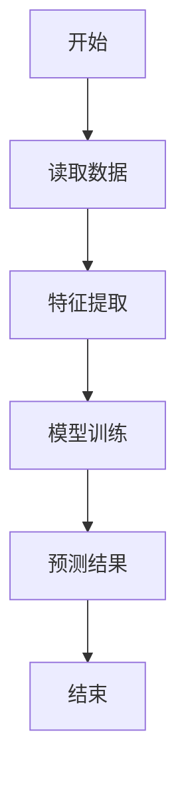
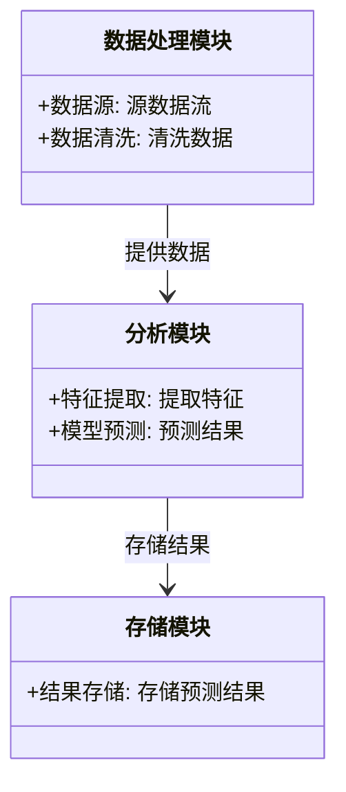
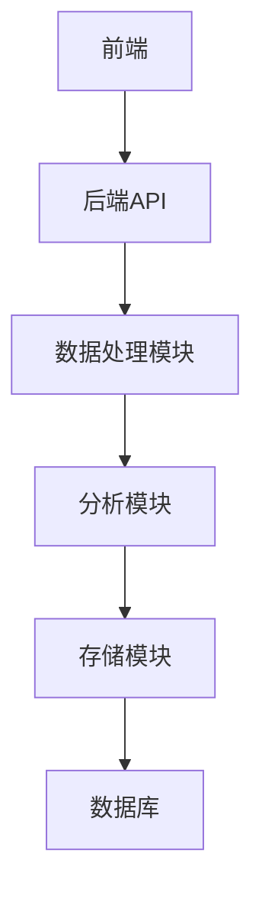

                 


# 企业AI Agent的实时大数据分析平台

---

## 关键词：
企业AI Agent、实时大数据分析平台、流数据处理、机器学习、系统架构

---

## 摘要：
本文详细探讨了企业AI Agent与实时大数据分析平台的结合，从背景、核心概念、算法原理到系统架构和项目实战，全面分析了其实现方式和应用价值。通过实际案例和代码示例，展示了如何构建高效、可靠的实时大数据分析系统。

---

## 目录大纲：

1. 企业AI Agent与实时大数据分析平台概述
2. 核心概念与技术原理
3. 算法原理与数学模型
4. 系统架构设计
5. 项目实战与案例分析
6. 最佳实践与未来展望

---

### 第1章: 企业AI Agent与实时大数据分析平台概述

#### 1.1 问题背景与定义
- **企业AI Agent的定义与特点**：介绍AI Agent在企业中的角色，强调其实时响应和自主决策能力。
- **实时大数据分析平台的核心概念**：讨论实时数据处理的高效性和准确性。
- **问题背景与需求分析**：分析企业在数据处理中的痛点，如延迟、数据量大等。

#### 1.2 企业AI Agent与实时大数据分析的联系
- **功能与作用对比**：通过对比表格展示AI Agent和传统数据处理的区别。
- **技术基础与应用场景**：举例说明AI Agent在实时数据分析中的应用，如金融交易监控。

#### 1.3 本章小结
总结企业AI Agent与实时大数据分析平台的重要性和结合方式。

---

### 第2章: 核心概念与技术原理

#### 2.1 核心概念原理
- **AI Agent的原理**：详细讲解AI Agent如何通过感知和决策进行数据处理。
- **实时大数据分析的技术基础**：介绍流数据处理和分布式计算的核心技术。

#### 2.2 核心概念对比分析
- **对比表格**：展示AI Agent与传统数据处理在响应速度、数据量、处理方式等方面的差异。
- **ER实体关系图**：使用Mermaid绘制系统实体关系图，展示各模块的交互。

```mermaid
er
actor: 用户
agt: AI Agent
data_stream: 数据流
database: 数据库

actor --> agt: 请求处理
agt --> data_stream: 读取数据
agt --> database: 存储结果
```

#### 2.3 本章小结
强调理解核心概念对构建实时分析平台的重要性。

---

### 第3章: 算法原理与数学模型

#### 3.1 算法原理讲解
- **流数据处理算法**：介绍Flink的处理流程，使用Mermaid展示。
- **机器学习算法**：讲解线性回归模型，使用Python代码实现。



#### 3.2 数学模型与公式
- **流数据处理模型**：公式说明数据窗口的滑动机制。
- **线性回归模型**：公式推导并举例说明。

公式：
$$y = \beta_0 + \beta_1 x + \epsilon$$

代码示例：
```python
import pandas as pd
from sklearn.linear_model import LinearRegression

# 数据预处理
data = pd.read_csv('data.csv')
X = data[['x']]
y = data['y']

# 模型训练
model = LinearRegression()
model.fit(X, y)
print(model.coef_)
```

---

### 第4章: 系统架构设计

#### 4.1 问题场景介绍
- **应用场景**：如企业销售预测、舆情监控等。
- **系统目标**：高效处理实时数据，快速生成决策支持。

#### 4.2 系统功能设计
- **领域模型Mermaid类图**：展示数据处理、分析、存储等功能模块。



#### 4.3 系统架构设计
- **Mermaid架构图**：展示前端、后端、数据流等模块的交互。



---

### 第5章: 项目实战与案例分析

#### 5.1 环境安装
- 安装Python、Flink、Kafka等工具，配置开发环境。

#### 5.2 核心代码实现
- **数据处理代码**：使用Flink处理实时数据流。
- **模型训练代码**：使用机器学习模型进行预测。

代码示例：
```python
from pyflink.datastream import StreamExecutionEnvironment
from pyflink.table import *

env = StreamExecutionEnvironment.get_execution_environment()
env.set_parallelism(4)

# 创建数据流
data_stream = env.from_source(...)

# 数据处理
t_env = TableEnvironment.get_default()
t_env.register_source(...)
t_env.register_sink(...)
t_env.execute_job()
```

#### 5.3 案例分析
- **案例背景**：企业销售数据分析。
- **数据处理流程**：从数据采集到预测结果展示的全过程。
- **结果展示**：通过图表展示预测结果，如折线图。

---

### 第6章: 最佳实践与未来展望

#### 6.1 最佳实践
- **性能优化**：如分布式计算、流处理优化。
- **数据安全**：数据加密、访问控制。

#### 6.2 小结与注意事项
- 强调系统设计的合理性，避免过度复杂化。
- 提供未来研究方向，如更高效的数据处理算法和模型优化。

---

### 结语：
企业AI Agent与实时大数据分析平台的结合为企业提供了强大的数据处理能力，未来随着技术的发展，其应用将更加广泛和深入。

