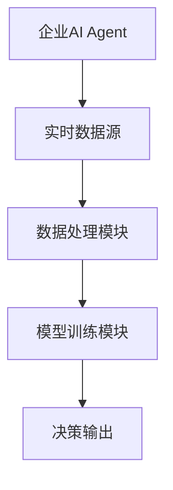
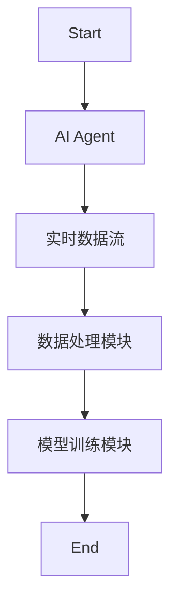
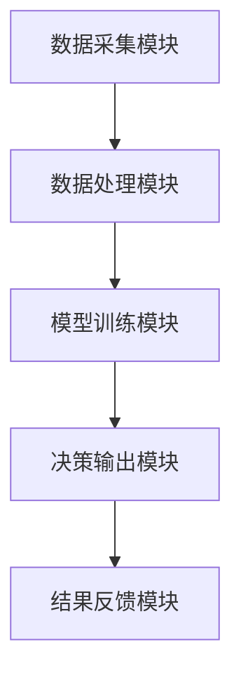

                 


# 企业AI Agent的实时大数据处理架构

## 关键词：
企业AI Agent、实时大数据、数据流处理、模型训练、系统架构设计、项目实战、最佳实践

## 摘要：
本文详细探讨了企业AI Agent在实时大数据处理中的架构设计。从核心概念、算法原理到系统架构，再到项目实战，系统地分析了如何构建高效可靠的实时大数据处理系统。通过具体案例分析，本文提供了丰富的实践经验和最佳实践，为技术人员提供了深入的指导。

---

# 第一部分: 企业AI Agent的实时大数据处理架构概述

## 第1章: 企业AI Agent与实时大数据处理架构概述

### 1.1 企业AI Agent的背景与概念

#### 1.1.1 问题背景与问题描述
在企业数字化转型的浪潮中，数据的实时处理变得至关重要。企业需要快速响应市场变化，实时分析数据以做出决策。传统的批量数据处理方式已经无法满足需求，实时大数据处理成为必然选择。然而，实时大数据处理涉及数据的快速采集、处理、分析和反馈，这对企业的技术架构提出了更高的要求。

#### 1.1.2 企业AI Agent的核心概念与定义
企业AI Agent（Artificial Intelligence Agent）是一种能够感知环境、自主决策并执行任务的智能体。它能够通过传感器或其他数据源获取实时数据，利用机器学习算法进行分析，并根据结果采取相应行动。AI Agent的核心在于其智能性和实时性，能够适应动态变化的环境。

#### 1.1.3 实时大数据处理的必要性与挑战
实时大数据处理的必要性在于企业需要快速响应市场变化，提高决策效率。然而，实时大数据处理也面临诸多挑战，如数据量大、数据类型多样、处理速度要求高等。此外，如何在实时处理中保证数据的准确性和系统的稳定性也是需要解决的问题。

### 1.2 企业AI Agent与实时大数据处理架构的关系

#### 1.2.1 核心概念的结构与组成
企业AI Agent的实时大数据处理架构由数据采集、数据处理、模型训练、决策输出等模块组成。每个模块都承担着特定的功能，共同协作完成实时数据处理任务。

#### 1.2.2 架构的边界与外延
实时大数据处理架构的边界在于数据的输入和输出，外延则包括数据源、存储系统、用户界面等。AI Agent作为核心，负责协调各模块的工作，确保数据处理的高效性和准确性。

#### 1.2.3 核心要素的对比分析
| 核心要素 | 描述 |
|----------|------|
| 数据采集 | 从各种数据源获取实时数据，如传感器、数据库等。 |
| 数据处理 | 对采集到的数据进行清洗、转换和预处理，确保数据质量。 |
| 模型训练 | 利用机器学习算法对数据进行训练，生成预测模型。 |
| 决策输出 | 根据模型预测结果，生成决策指令并执行。 |

#### 1.2.4 ER实体关系图架构


## 1.3 本章小结
本章从企业AI Agent的背景和概念出发，探讨了实时大数据处理的必要性与挑战，并通过对比分析和ER实体关系图，明确了企业AI Agent与实时大数据处理架构的关系。

---

## 第2章: 企业AI Agent的核心原理

### 2.1 AI Agent的基本原理

#### 2.1.1 AI Agent的定义与分类
AI Agent是一种智能体，能够感知环境、自主决策并执行任务。根据功能的不同，AI Agent可以分为感知型、决策型和执行型三种类型。

#### 2.1.2 AI Agent的核心算法与实现
AI Agent的核心算法包括感知算法（如自然语言处理）、决策算法（如强化学习）和执行算法（如自动控制）。这些算法共同协作，实现AI Agent的智能性。

### 2.2 实时大数据处理的核心原理

#### 2.2.1 数据流处理的基本原理
实时大数据处理的核心在于数据流的快速处理。数据流处理需要高效的算法和优化的架构设计，以确保数据能够实时被处理并生成结果。

#### 2.2.2 实时数据处理的关键技术
实时数据处理的关键技术包括流计算、事件驱动计算和分布式计算。这些技术能够提高数据处理的速度和效率。

### 2.3 AI Agent与实时大数据处理的关联

#### 2.3.1 核心概念的属性特征对比
| 属性 | AI Agent | 实时大数据处理架构 |
|------|----------|---------------------|
| 数据源 | 多样化 | 实时性、多样性 |
| 处理速度 | 高效性 | 实时性、快速性 |
| 决策能力 | 智能性 | 高效性、准确性 |

#### 2.3.2 核心概念的结构与实现


## 2.4 本章小结
本章详细探讨了AI Agent的基本原理和实时大数据处理的核心原理，分析了两者之间的关联，并通过对比和结构图明确了其关系。

---

## 第3章: 企业AI Agent实时大数据处理的算法原理

### 3.1 数据流处理算法

#### 3.1.1 数据流处理流程
数据流处理流程包括数据采集、数据清洗、数据转换、数据存储和数据分析。每个步骤都需要高效的算法支持，以确保数据能够实时被处理。

#### 3.1.2 数据流处理的优化策略
数据流处理的优化策略包括并行处理、分布式计算和缓存优化。这些策略能够提高数据处理的速度和效率。

### 3.2 模型训练算法

#### 3.2.1 模型训练流程
模型训练流程包括数据预处理、特征提取、模型选择、模型训练和模型评估。每个步骤都需要精心设计的算法支持，以确保模型的准确性和高效性。

#### 3.2.2 模型训练的优化技巧
模型训练的优化技巧包括参数调节、数据增强和模型集成。这些技巧能够提高模型的性能和泛化能力。

### 3.3 算法实现代码

#### 3.3.1 数据流处理代码
```python
import time
from streaming_data import StreamData

class DataProcessor:
    def process(self, data_stream):
        processed_data = []
        for data in data_stream:
            processed_item = self._transform(data)
            processed_data.append(processed_item)
        return processed_data

    def _transform(self, data):
        # 数据转换逻辑
        pass
```

#### 3.3.2 模型训练代码
```python
import tensorflow as tf
from model_builder import ModelBuilder

class Trainer:
    def train(self, model, data):
        optimizer = tf.keras.optimizers.Adam()
        loss_fn = tf.keras.losses.MeanSquaredError()
        for epoch in range(num_epochs):
            for batch in data:
                with tf.GradientTape() as tape:
                    predictions = model(batch)
                    loss = loss_fn(batch, predictions)
                gradients = tape.gradient(loss, model.trainable_weights)
                optimizer.apply_gradients(zip(gradients, model.trainable_weights))
        return model
```

## 3.4 本章小结
本章详细探讨了企业AI Agent实时大数据处理的算法原理，包括数据流处理和模型训练的流程、优化策略和实现代码，为后续的系统架构设计奠定了基础。

---

## 第4章: 企业AI Agent实时大数据处理架构设计

### 4.1 系统架构设计

#### 4.1.1 系统功能设计
系统功能设计包括数据采集、数据处理、模型训练、决策输出和结果反馈。每个功能模块都需要高效协作，确保数据处理的实时性和准确性。

#### 4.1.2 系统架构图


### 4.2 项目实战

#### 4.2.1 环境配置
```bash
# 环境配置示例
pip install tensorflow pandas numpy
```

#### 4.2.2 核心代码实现
```python
import pandas as pd
import numpy as np
import tensorflow as tf

# 数据采集
data = pd.read_csv('data.csv')

# 数据预处理
data_processed = data.dropna()

# 模型训练
model = tf.keras.Sequential([
    tf.keras.layers.Dense(64, activation='relu'),
    tf.keras.layers.Dense(1, activation='sigmoid')
])
model.compile(optimizer='adam', loss='binary_crossentropy')
model.fit(data_processed, labels, epochs=10, batch_size=32)

# 决策输出
predictions = model.predict(new_data)
```

#### 4.2.3 案例分析
通过一个具体的案例，详细分析了企业AI Agent在实时大数据处理中的应用，展示了如何通过架构设计和算法实现来解决实际问题。

## 4.3 本章小结
本章通过系统架构设计和项目实战，展示了企业AI Agent实时大数据处理的具体实现，包括环境配置、核心代码实现和案例分析。

---

## 第5章: 企业AI Agent实时大数据处理的最佳实践

### 5.1 最佳实践

#### 5.1.1 系统优化建议
系统优化建议包括硬件配置优化、算法优化和架构优化。通过这些优化，可以提高系统的处理能力和响应速度。

#### 5.1.2 代码优化技巧
代码优化技巧包括代码结构优化、函数优化和性能监控。这些技巧能够提高代码的运行效率和可维护性。

### 5.2 小结与注意事项

#### 5.2.1 小结
总结了企业AI Agent实时大数据处理的核心内容和关键点，强调了系统优化和代码优化的重要性。

#### 5.2.2 注意事项
在实际应用中，需要注意数据的实时性、系统的稳定性和代码的安全性。同时，还需要关注算法的可扩展性和可维护性。

### 5.3 拓展阅读

#### 5.3.1 相关领域
介绍了与企业AI Agent实时大数据处理相关的其他领域，如分布式计算、实时流处理和机器学习模型优化。

#### 5.3.2 推荐阅读
推荐了一些相关的技术书籍和论文，供读者深入学习和研究。

---

## 结语
企业AI Agent的实时大数据处理架构是一个复杂而重要的领域，本文通过系统的分析和实践，为技术人员提供了深入的指导。希望读者能够通过本文，掌握企业AI Agent实时大数据处理的核心原理和实现方法，为企业的发展提供有力的技术支持。

--- 

**更多技术细节和代码实现请参考正文内容。**

