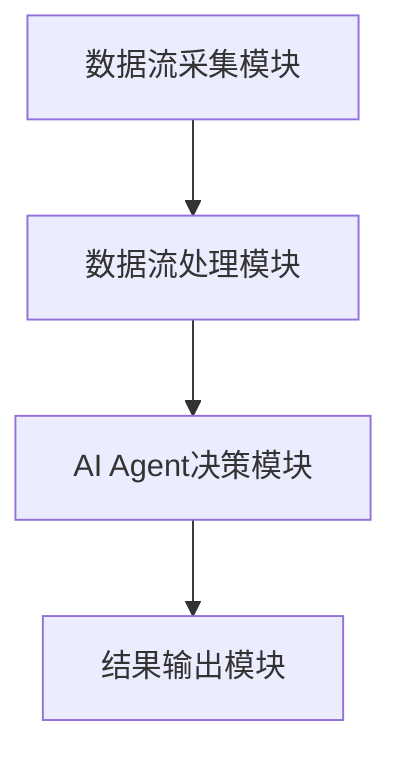
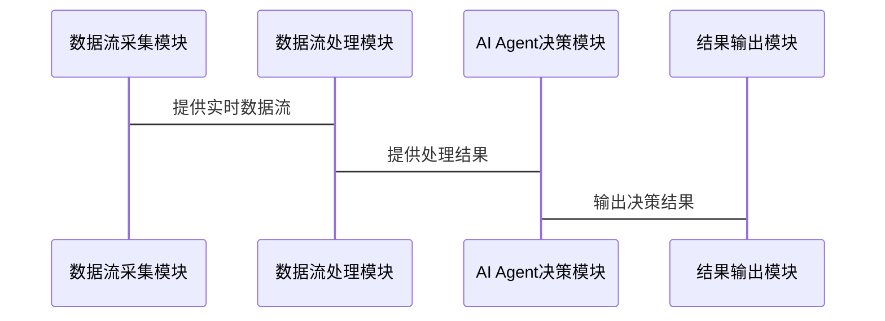

                 


# 企业AI Agent的实时数据流处理与分析架构

**关键词：** AI Agent, 实时数据流, 流处理, 系统架构, 技术实现

**摘要：** 本文详细探讨了企业AI Agent在实时数据流处理与分析中的架构设计。从核心概念、算法原理到系统架构，再到项目实战，全面解析了企业AI Agent如何高效处理实时数据流，构建了完整的分析架构。通过理论与实践结合，为读者提供了从技术原理到实现方案的全面指导。

---

## 第1章: 企业AI Agent与实时数据流处理概述

### 1.1 企业AI Agent的定义与背景

#### 1.1.1 企业AI Agent的基本概念
企业AI Agent是一种智能代理系统，能够自主感知环境、执行任务并做出决策，广泛应用于企业自动化、数据处理等领域。AI Agent的核心能力在于实时数据处理和智能决策，为企业的高效运营提供支持。

#### 1.1.2 实时数据流处理的必要性
实时数据流处理是企业AI Agent的关键能力，能够快速响应数据变化，提升决策效率。在金融、物流等行业，实时数据处理更是不可或缺，帮助企业及时应对市场变化。

#### 1.1.3 企业AI Agent的应用场景
企业AI Agent在实时监控、自动化运维、智能客服等领域有广泛应用。例如，在金融领域，AI Agent可以实时监控市场数据，及时发出交易信号；在物流领域，AI Agent可以实时跟踪订单状态，优化配送路径。

### 1.2 数据流处理的核心问题

#### 1.2.1 数据流的特性与挑战
数据流具有实时性、快速性和不可预知性等特点。实时数据流处理需要解决数据量大、处理速度快、系统稳定性高等挑战。

#### 1.2.2 实时处理的关键技术
实时数据流处理涉及流计算框架（如Flink）、分布式计算、事件驱动架构等技术。这些技术能够高效处理海量数据，确保实时性。

#### 1.2.3 企业AI Agent与数据流的关系
AI Agent通过实时处理数据流，获取环境信息并做出决策。数据流是AI Agent感知世界的桥梁，AI Agent则是数据流处理的智能引擎。

### 1.3 本章小结
本章介绍了企业AI Agent的定义、实时数据流处理的重要性以及AI Agent的应用场景。强调了数据流处理对企业AI Agent的关键作用。

---

## 第2章: 数据流处理与分析的核心概念

### 2.1 数据流处理的基本原理

#### 2.1.1 数据流的生命周期
数据流从生成、传输到处理，最终被消费，形成一个完整的生命周期。了解数据流的生命周期有助于优化处理流程。

#### 2.1.2 数据流的分类与特征
数据流可以分为批量流和实时流，每个类型有其特点。实时流处理要求快速响应，而批量流处理则注重数据的全面性。

#### 2.1.3 数据流处理的模式对比
对比批量处理和流处理的优缺点，流处理适用于实时性要求高的场景，而批量处理适用于数据完整性要求高的场景。

### 2.2 AI Agent的核心原理

#### 2.2.1 AI Agent的决策机制
AI Agent通过感知数据流，利用机器学习模型做出决策。决策机制包括数据采集、特征提取、模型预测等步骤。

#### 2.2.2 实时数据流处理流程
数据流处理流程包括数据采集、预处理、特征提取、模型推理和结果输出。AI Agent在每一步都发挥作用，确保处理高效准确。

#### 2.2.3 数据流与AI Agent的交互模式
AI Agent与数据流的交互模式包括订阅式、发布式和事件驱动式。每种模式适应不同的应用场景。

### 2.3 数据流处理的系统架构

#### 2.3.1 数据流处理的分层架构
分层架构包括数据采集层、数据处理层、AI决策层和结果输出层。每一层负责不同的功能，确保系统高效运行。

#### 2.3.2 AI Agent的模块化设计
AI Agent由数据采集模块、处理模块、决策模块和执行模块组成。模块化设计便于功能扩展和维护。

#### 2.3.3 数据流处理的性能优化
通过分布式计算、流计算框架优化和缓存机制，提升数据流处理的性能，确保实时性。

### 2.4 本章小结
本章详细讲解了数据流处理的基本原理和AI Agent的核心机制，分析了系统的架构设计，为后续实现打下基础。

---

## 第3章: 数据流处理的算法原理

### 3.1 流数据处理算法概述

#### 3.1.1 流数据处理的基本算法
包括滑动窗口算法、事件驱动算法和增量计算算法。这些算法适用于不同场景的数据流处理。

#### 3.1.2 流数据处理的优化算法
优化算法如分布式流处理算法和异步处理算法，能够提升处理效率和系统性能。

#### 3.1.3 流数据处理的数学模型
流数据处理涉及概率论和统计学模型，如马尔可夫链和贝叶斯模型，用于预测和分类。

### 3.2 AI Agent的决策算法

#### 3.2.1 基于流数据的决策树算法
决策树算法通过实时数据流构建动态决策树，实现快速决策。

#### 3.2.2 基于流数据的聚类算法
聚类算法用于实时数据流的模式识别，帮助AI Agent发现潜在的规律。

#### 3.2.3 基于流数据的分类算法
分类算法如SVM和随机森林，用于实时数据流的分类和预测。

### 3.3 算法实现的代码示例

#### 3.3.1 数据流处理的Python代码实现
```python
import time

def process_stream():
    while True:
        data = receive_data()  # 假设receive_data()从数据流中获取数据
        preprocessed_data = preprocess(data)
        prediction = model.predict(preprocessed_data)
        output_result(prediction)
        time.sleep(1)  # 实时处理间隔
```

#### 3.3.2 AI Agent决策算法的Python代码实现
```python
from sklearn.ensemble import RandomForestClassifier

def ai_decision():
    data_stream = receive_stream()  # 假设receive_stream()返回实时数据流
    X, y = extract_features(data_stream)  # 提取特征和标签
    model = RandomForestClassifier().fit(X, y)
    while True:
        new_data = next(data_stream)
        prediction = model.predict(new_data)
        execute_action(prediction)  # 根据预测结果执行操作
```

#### 3.3.3 算法性能的对比分析
通过实验对比不同算法的处理速度、准确率和资源消耗，选择最优算法。

### 3.4 本章小结
本章详细讲解了流数据处理的算法原理，提供了具体的代码实现，帮助读者理解如何实现高效的实时数据流处理。

---

## 第4章: 数据流处理的系统架构设计

### 4.1 系统功能设计

#### 4.1.1 数据流采集模块
负责从数据源获取实时数据流，支持多种数据源类型，如数据库、API和消息队列。

#### 4.1.2 数据流处理模块
对采集到的数据进行预处理、特征提取和模型推理，生成决策结果。

#### 4.1.3 AI Agent决策模块
根据处理结果做出决策，触发相应的操作，如发送通知或调整系统参数。

#### 4.1.4 结果输出模块
将决策结果输出到目标系统或存储到数据库，供后续分析或展示。

### 4.2 系统架构设计

#### 4.2.1 系统架构图
使用Mermaid图展示系统架构：


#### 4.2.2 模块化设计
系统分为数据采集、处理、决策和输出模块，每个模块独立开发，便于维护和扩展。

#### 4.2.3 系统接口设计
定义模块之间的接口，如数据流采集模块提供API接口，供处理模块调用。

#### 4.2.4 系统交互序列图
使用Mermaid图展示系统交互流程：


### 4.3 本章小结
本章详细设计了系统的功能模块和架构，展示了模块之间的交互关系，为后续实现提供了指导。

---

## 第5章: 项目实战与最佳实践

### 5.1 环境安装与配置

#### 5.1.1 安装必要的工具
安装Python、Jupyter Notebook、Flink等工具，配置开发环境。

#### 5.1.2 安装依赖库
安装Pandas、NumPy、Scikit-learn等数据处理库，以及Flink流处理框架。

### 5.2 系统核心实现

#### 5.2.1 数据流采集实现
编写代码从Kafka消息队列中获取实时数据流：
```python
from kafka import KafkaConsumer

def consume_data():
    consumer = KafkaConsumer('data_stream_topic')
    for message in consumer:
        process_message(message.value)
```

#### 5.2.2 数据处理实现
实现数据预处理和模型推理：
```python
def preprocess(data):
    # 数据清洗和特征提取
    pass

def model_predict(features):
    # 使用训练好的模型进行预测
    pass
```

#### 5.2.3 AI Agent决策实现
根据处理结果做出决策并执行操作：
```python
def make_decision(result):
    if result['prediction'] == 'positive':
        execute_positive_action()
    else:
        execute_negative_action()
```

### 5.3 案例分析与实际应用

#### 5.3.1 案例背景介绍
以金融市场的实时股票价格监测为例，展示AI Agent如何实时处理数据流，做出交易决策。

#### 5.3.2 数据流处理与分析
展示如何通过Flink处理实时数据流，使用机器学习模型预测股票价格走势。

#### 5.3.3 项目总结
总结项目实现过程中的经验教训，优化建议和未来改进方向。

### 5.4 最佳实践与注意事项

#### 5.4.1 系统性能优化
通过分布式计算、缓存优化和异步处理提升系统性能。

#### 5.4.2 数据安全与隐私保护
确保数据流处理过程中的数据安全，遵守相关隐私保护法规。

#### 5.4.3 系统可扩展性
设计模块化的架构，方便未来功能扩展和性能升级。

### 5.5 本章小结
本章通过实际案例展示了系统的核心实现，提供了最佳实践和注意事项，帮助读者更好地理解和应用相关技术。

---

## 第6章: 总结与展望

### 6.1 全文总结
总结本文的核心内容，强调企业AI Agent在实时数据流处理中的重要性和应用价值。

### 6.2 未来展望
展望实时数据流处理技术的发展趋势，探讨AI Agent在更广泛领域的应用前景。

### 6.3 注意事项
提醒读者在实际应用中需要注意的事项，如数据安全、系统性能和可扩展性。

### 6.4 拓展阅读
推荐相关领域的书籍和资源，帮助读者深入学习实时数据流处理和AI Agent技术。

---

通过以上章节的详细讲解，本文为读者提供了从理论到实践的全面指导，帮助企业在实际应用中高效处理实时数据流，构建智能的AI Agent系统。

