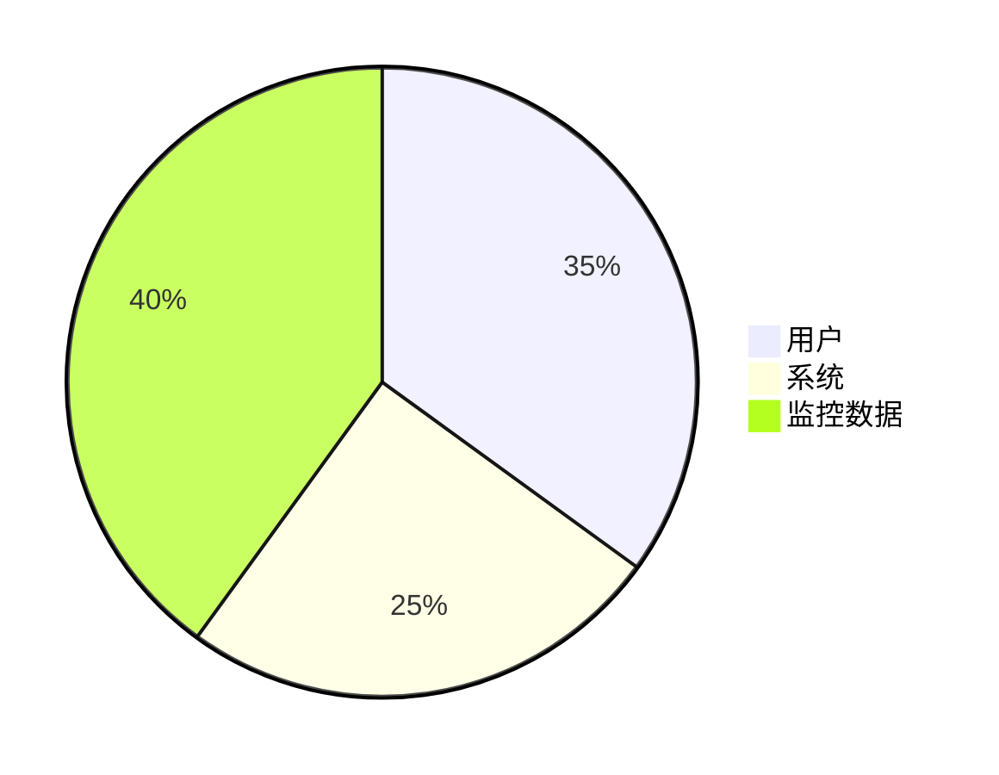

                 


# 企业AI Agent的实时监控系统

## 关键词：企业AI Agent，实时监控系统，算法原理，系统架构，项目实战

## 摘要：  
本文深入探讨了企业AI Agent的实时监控系统的构建与实现。首先，我们从企业AI Agent和实时监控系统的定义与背景出发，详细分析了其实时监控的重要性与价值。接着，我们从核心概念、算法原理、系统架构等多个维度展开，探讨了AI Agent如何与实时监控系统相结合，以实现对企业关键指标的实时监测与智能决策。通过具体案例分析和项目实战，我们展示了如何利用时间序列分析、异常检测等算法，结合系统架构设计，构建一个高效、可靠的实时监控系统。最后，我们总结了项目的实践经验，并提出了相关的注意事项与优化建议。

---

## 第一部分：企业AI Agent的实时监控系统概述

### 第1章：企业AI Agent与实时监控系统概述

#### 1.1 企业AI Agent的定义与背景
企业AI Agent是一种智能代理系统，能够根据预设规则或上下文信息，自动执行任务或做出决策。它通常用于企业内部的自动化操作，如数据处理、流程优化、异常检测等。随着企业数字化转型的深入，AI Agent的应用场景不断扩大，尤其是在实时监控系统中，它能够通过机器学习算法快速响应并处理异常情况。

#### 1.2 实时监控系统的重要性
实时监控系统是企业运营中的关键基础设施，能够帮助企业及时发现并解决问题。传统监控系统依赖人工操作，存在数据滞后、响应不及时等问题。而AI Agent的引入，使得监控系统能够实现智能化、自动化，显著提升了系统的实时性和准确性。

#### 1.3 企业AI Agent实时监控系统的价值
通过AI Agent的实时监控系统，企业能够实现以下目标：
- **提升效率**：自动化处理大量数据，减少人工干预。
- **降低风险**：及时发现潜在问题，避免重大损失。
- **优化决策**：基于实时数据提供智能决策支持。

---

### 第2章：企业AI Agent实时监控系统的背景与问题分析

#### 2.1 传统监控系统存在的问题
传统监控系统在实际应用中存在以下问题：
- **数据采集滞后**：依赖人工操作，无法实现实时监测。
- **数据分析单一**：缺乏智能化的分析能力，难以发现复杂问题。
- **系统响应缓慢**：在处理异常情况时，往往需要较长时间才能做出反应。

#### 2.2 AI技术在监控系统中的应用优势
AI技术的应用为企业实时监控系统带来了显著优势：
- **智能化数据采集**：通过AI Agent实现自动化数据采集和预处理。
- **实时数据分析与预测**：利用机器学习算法，对实时数据进行分析和预测，提前发现潜在问题。
- **自动化决策与响应**：AI Agent能够根据分析结果自动触发相应的响应机制，如报警、调整参数等。

#### 2.3 企业AI Agent实时监控系统的必要性
企业AI Agent实时监控系统的必要性体现在以下几个方面：
- **提升企业智能化水平**：通过AI技术实现监控系统的智能化升级。
- **实现全链路监控**：从数据采集到分析、再到响应，形成完整的监控闭环。
- **支持业务快速决策**：基于实时数据提供决策支持，帮助企业快速应对市场变化。

---

### 第3章：企业AI Agent实时监控系统的核心概念与联系

#### 3.1 核心概念原理
企业AI Agent实时监控系统的原理可以分为以下几个步骤：
1. **数据采集**：通过传感器、日志文件等渠道采集实时数据。
2. **数据处理**：对采集到的数据进行清洗、转换和标准化处理。
3. **数据分析**：利用机器学习算法对数据进行分析，识别异常或趋势。
4. **决策与响应**：根据分析结果，触发相应的报警或自动化操作。

#### 3.2 核心概念属性特征对比
以下是AI Agent和实时监控系统在属性特征上的对比：

| 属性 | AI Agent | 实时监控系统 |
|------|----------|--------------|
| 数据来源 | 多源异构数据 | 实时数据流 |
| 数据处理 | 自动化处理 | 实时处理 |
| 决策方式 | 基于机器学习模型 | 基于预设规则 |
| 响应时间 | 微秒级响应 | 毫秒级响应 |

#### 3.3 ER实体关系图架构
以下是企业AI Agent实时监控系统的ER实体关系图：

```mermaid
erDiagram
    actor 用户 {
        <属性> 用户ID
        <属性> 用户角色
        <属性> 用户权限
    }
    actor 系统 {
        <属性> 系统ID
        <属性> 系统名称
        <属性> 系统功能
    }
    actor 监控数据 {
        <属性> 数据ID
        <属性> 数据类型
        <属性> 数据时间
    }
    用户 --> 系统 : 使用
    用户 --> 监控数据 : 监控
    系统 --> 监控数据 : 采集
```

---

### 第4章：企业AI Agent实时监控系统的算法原理

#### 4.1 算法原理概述
企业AI Agent实时监控系统的核心算法包括时间序列分析和异常检测算法。时间序列分析用于预测未来趋势，异常检测算法用于识别异常数据点。

#### 4.2 时间序列分析算法
时间序列分析是实时监控系统中常用的一种算法，以下是几种常见的时间序列分析模型：

##### 4.2.1 ARIMA算法
ARIMA（自回归积分滑动平均模型）是一种广泛应用于时间序列预测的模型。其数学公式如下：

$$ ARIMA(p, d, q) $$

其中：
- $p$ 表示自回归的阶数。
- $d$ 表示差分的阶数。
- $q$ 表示滑动平均的阶数。

##### 4.2.2 LSTM网络
LSTM（长短期记忆网络）是一种基于深度学习的时间序列预测模型。其核心思想是通过记忆单元（Memory Cell）来捕获时间序列中的长期依赖关系。

##### 4.2.3 Prophet模型
Prophet是由Facebook开源的时间序列预测模型，适用于非频繁的时间序列数据。其数学模型如下：

$$ y(t) = \beta t + \gamma \sin\left(\frac{2\pi t}{\text{year_length}}\right) $$

---

#### 4.3 异常检测算法
异常检测算法用于实时监控系统中识别异常数据点。以下是几种常见的异常检测算法：

##### 4.3.1 Isolation Forest算法
Isolation Forest是一种基于树结构的异常检测算法。其核心思想是通过构建随机树，将数据点隔离到叶子节点，从而判断其是否为异常点。

##### 4.3.2 One-Class SVM算法
One-Class SVM是一种基于支持向量机的异常检测算法。其数学模型如下：

$$ \text{minimize} \frac{1}{2} \|\theta\|^2 + C \cdot \text{rank}(\xi) $$

---

## 第5章：企业AI Agent实时监控系统的系统分析与架构设计

### 5.1 问题场景介绍
企业AI Agent实时监控系统的应用场景包括企业内部的系统监控、业务流程监控、网络流量监控等。以下是典型的监控场景：

#### 5.1.1 系统监控
通过AI Agent实时监控系统的运行状态，包括CPU使用率、内存使用情况、磁盘使用率等。

#### 5.1.2 业务流程监控
监控企业内部的业务流程，如订单处理、物流配送等，确保业务流程的正常运行。

#### 5.1.3 网络流量监控
监控企业内部的网络流量，识别异常流量，防止网络攻击。

### 5.2 系统功能设计
以下是企业AI Agent实时监控系统的功能模块设计：

#### 5.2.1 数据采集模块
数据采集模块负责从各种数据源采集实时数据，包括：
- 传感器数据
- 系统日志
- 网络流量数据

#### 5.2.2 数据处理模块
数据处理模块对采集到的数据进行清洗、转换和标准化处理。

#### 5.2.3 数据分析模块
数据分析模块利用机器学习算法对数据进行分析，识别异常或趋势。

#### 5.2.4 决策与响应模块
决策与响应模块根据分析结果，触发相应的报警或自动化操作。

### 5.3 系统架构设计
以下是企业AI Agent实时监控系统的系统架构图：



---

## 第6章：企业AI Agent实时监控系统的项目实战

### 6.1 环境安装
以下是企业AI Agent实时监控系统的环境安装步骤：

1. **安装Python**：建议使用Python 3.8及以上版本。
2. **安装依赖库**：包括numpy、pandas、scikit-learn、tensorflow等。

### 6.2 核心代码实现
以下是企业AI Agent实时监控系统的Python核心代码实现：

#### 6.2.1 数据采集模块
```python
import pandas as pd

def collect_data():
    # 数据采集逻辑
    pass
```

#### 6.2.2 数据处理模块
```python
import numpy as np

def preprocess_data(data):
    # 数据预处理逻辑
    pass
```

#### 6.2.3 数据分析模块
```python
from sklearn.ensemble import IsolationForest

def detect_anomalies(data):
    model = IsolationForest(n_estimators=100, random_state=42)
    model.fit(data)
    return model.predict(data)
```

### 6.3 案例分析
以下是企业AI Agent实时监控系统的实际案例分析：

#### 6.3.1 案例背景
某企业希望通过AI Agent实时监控系统，实现对内部网络流量的实时监控，防止网络攻击。

#### 6.3.2 数据分析与解读
通过对网络流量数据进行分析，发现存在异常流量，触发报警机制。

#### 6.3.3 系统响应
系统自动隔离异常流量，防止网络攻击。

---

## 第7章：企业AI Agent实时监控系统的最佳实践

### 7.1 项目小结
通过本文的介绍，我们深入探讨了企业AI Agent实时监控系统的构建与实现。从核心概念到算法原理，再到系统架构设计和项目实战，我们为企业AI Agent实时监控系统的建设提供了全面的指导。

### 7.2 实用Tips
- **数据采集**：确保数据的实时性和准确性。
- **算法选择**：根据具体场景选择合适的算法。
- **系统优化**：定期优化系统架构，提升性能。

### 7.3 注意事项
- **数据安全**：确保数据的安全性，防止数据泄露。
- **系统稳定性**：确保系统的高可用性，避免因系统故障导致监控中断。

### 7.4 拓展阅读
- **相关书籍**：《机器学习实战》、《深度学习》
- **相关论文**：《基于深度学习的实时监控系统研究》

---

通过本文的详细讲解，读者可以全面了解企业AI Agent实时监控系统的构建与实现。希望本文的内容能够为企业AI Agent实时监控系统的建设提供有价值的参考和指导。

