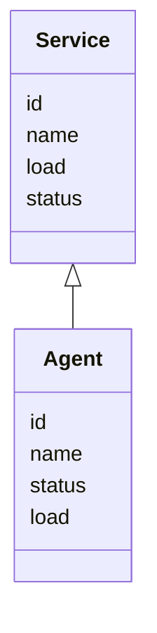
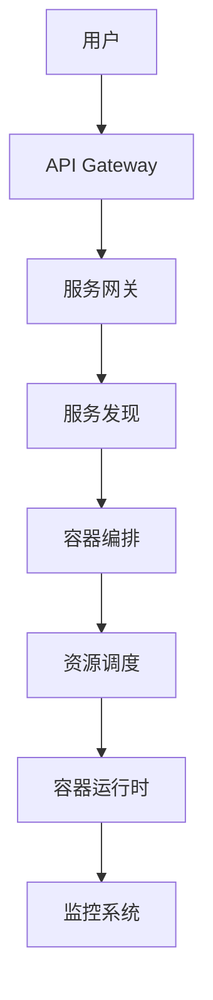
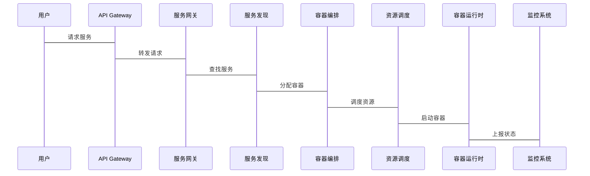

                 


# 企业AI Agent的容器化微服务编排策略

> **关键词**：企业AI Agent、容器化微服务、编排策略、算法原理、系统架构、项目实战

> **摘要**：  
> 本文深入探讨了企业AI Agent在容器化微服务环境下的编排策略，从背景介绍、核心概念、算法原理到系统架构、项目实战，全面分析了如何通过容器化技术实现AI Agent的高效管理与智能调度。文章通过具体案例和详细的技术实现，为读者提供了从理论到实践的完整指南，帮助企业在数字化转型中构建智能化的运维体系。

---

## 第1章: 企业AI Agent的背景与定义

### 1.1 企业AI Agent的背景
企业在数字化转型中面临越来越复杂的运维挑战，包括系统规模的扩大、资源利用率的提升以及智能化运维的需求。传统的人工运维方式效率低下，难以应对现代化企业的复杂场景。AI Agent作为一种智能化的自动化工具，能够通过学习和优化企业运维流程，显著提高效率和准确性。

#### 1.1.1 传统企业运维的挑战
- 系统规模不断扩大，人工运维效率低下。
- 资源利用率不均，成本居高不下。
- 运维复杂性增加，对实时性和准确性要求更高。

#### 1.1.2 AI技术对企业运维的变革
- AI技术的应用使运维从“人工经验驱动”转向“数据智能驱动”。
- 自动化运维工具的智能化升级，显著降低了运维成本。
- 提高了系统故障预测和自愈能力，保障了业务连续性。

#### 1.1.3 容器化技术的兴起与应用
- 容器化技术（如Docker）为企业提供了轻量级、高效的部署方式。
- 微服务架构通过将系统分解为小型、独立的服务，提高了系统的灵活性和可扩展性。
- 容器编排技术（如Kubernetes）为企业提供了高效的资源管理解决方案。

### 1.2 企业AI Agent的定义与特点
企业AI Agent是一种基于人工智能技术的自动化工具，用于监控、管理和优化企业IT系统。它结合了容器化技术和微服务架构，能够在复杂环境下实现智能化的运维管理。

#### 1.2.1 AI Agent的基本概念
- AI Agent通过学习历史数据和实时监控信息，能够预测系统行为并自动调整配置。
- 支持多目标优化，能够在资源约束条件下找到最优解决方案。
- 具备自适应能力，能够根据环境变化动态调整策略。

#### 1.2.2 容器化微服务的特点
- **轻量化**：容器启动速度快，资源消耗低。
- **独立性**：每个服务独立运行，互不影响。
- **可扩展性**：可以根据负载动态调整资源分配。
- **松耦合**：服务之间通过API通信，便于扩展和维护。

#### 1.2.3 企业AI Agent的核心优势
- 提高系统可用性：通过智能监控和自愈能力，减少系统故障时间。
- 优化资源利用率：通过动态调整资源分配，降低运营成本。
- 提高运维效率：自动化处理日常运维任务，减少人工干预。

### 1.3 企业AI Agent的应用场景
企业AI Agent的应用场景广泛，涵盖了企业IT系统的各个方面，包括智能监控、自动化运维、资源调度等。

#### 1.3.1 智能监控与运维
- 实时监控系统状态，预测潜在故障。
- 自动化处理告警，减少人工干预。

#### 1.3.2 自动化问题诊断
- 基于历史日志和实时数据，快速定位问题根源。
- 提供修复建议，缩短故障处理时间。

#### 1.3.3 智能资源调度
- 根据负载变化动态调整资源分配，确保系统性能。
- 在资源不足时，自动扩展服务实例。

## 第2章: 容器化微服务编排的核心概念

### 2.1 容器化技术的核心原理
容器化技术通过将应用程序及其依赖打包为轻量级容器，能够在不同的环境中一致运行。容器运行时（如Docker）负责管理容器的生命周期，包括启动、停止和销毁。

#### 2.1.1 容器与虚拟机的对比
- **容器**：基于宿主机内核，启动速度快，资源占用低。
- **虚拟机**：基于虚拟化技术，资源占用较高，启动速度较慢。

| **特性** | **容器** | **虚拟机** |
|----------|-----------|------------|
| 启动速度 | 快         | 慢         |
| 资源占用 | 低         | 高         |
| 隔离性   | 弱         | 强         |

#### 2.1.2 容器运行时的工作机制
- 容器运行时负责创建和销毁容器，管理容器内的进程和资源。
- 容器镜像包含应用程序及其依赖，运行时下载镜像并启动容器。

#### 2.1.3 容器编排的基本流程
1. **任务分配**：根据系统负载分配任务。
2. **资源调度**：为任务分配合适的资源。
3. **服务部署**：启动并配置服务。
4. **监控与调整**：实时监控服务状态，动态调整资源。

### 2.2 微服务架构的核心原理
微服务架构将系统分解为多个小型、独立的服务，每个服务负责特定的功能。服务之间通过API通信，提高了系统的灵活性和可扩展性。

#### 2.2.1 微服务的定义与特点
- **定义**：微服务是小型、独立的模块，专注于特定功能。
- **特点**：
  - **松耦合**：服务之间通过API通信，便于扩展。
  - **可扩展性**：可以根据需求动态扩展服务。
  - **独立性**：每个服务独立运行，互不影响。

#### 2.2.2 微服务之间的通信机制
- **HTTP API**：服务之间通过HTTP请求进行通信。
- **消息队列**：通过消息队列（如Kafka、RabbitMQ）实现异步通信。
- **gRPC**：高性能的通信协议，适用于复杂场景。

#### 2.2.3 微服务的生命周期管理
- **创建**：根据需求启动新服务。
- **运行**：监控服务状态，确保正常运行。
- **销毁**：当资源不再需要时，关闭服务。

### 2.3 AI Agent与容器化微服务的结合
AI Agent通过与容器化微服务编排技术结合，能够实现智能化的系统管理。

#### 2.3.1 AI Agent在容器化中的角色
- **智能调度**：根据系统负载和资源情况，动态调整容器的分配。
- **故障预测**：通过历史数据和实时监控，预测潜在故障。
- **自愈能力**：在发生故障时，自动重启或替换容器。

#### 2.3.2 容器化微服务编排对AI Agent的支持
- 提供高效的资源管理能力，支持AI Agent的运行。
- 提供灵活的服务部署方式，适应AI Agent的需求。

#### 2.3.3 容器化微服务编排的实现方式
- **基于Kubernetes的编排**：Kubernetes是一个开源的容器编排平台，支持复杂的调度和管理。
- **基于Docker Swarm的编排**：Docker Swarm是Docker官方提供的容器编排解决方案。
- **基于云平台的编排**：利用云平台（如AWS、Azure）提供的容器服务进行编排。

### 2.4 本章小结
容器化微服务编排技术为AI Agent提供了高效的资源管理和灵活的服务部署方式，是实现智能化运维的重要基础。

---

## 第3章: 容器编排算法的核心原理

### 3.1 容器编排算法的分类
容器编排算法可以根据不同的标准进行分类，主要包括基于规则的编排算法、基于负载均衡的编排算法和基于AI的自适应编排算法。

#### 3.1.1 基于规则的编排算法
基于规则的编排算法通过预定义的规则来实现容器的调度和管理。这种算法简单易懂，适用于规则明确的场景。

#### 3.1.2 基于负载均衡的编排算法
基于负载均衡的编排算法根据系统的负载情况动态调整容器的分配，确保资源的充分利用。

#### 3.1.3 基于AI的自适应编排算法
基于AI的自适应编排算法通过学习系统的运行数据，实现智能化的调度和管理。

### 3.2 容器编排算法的实现步骤
容器编排算法的实现步骤通常包括数据采集、模型训练、决策制定和执行反馈。

#### 3.2.1 数据采集
- 数据来源：系统负载、资源使用情况、历史数据等。
- 数据预处理：清洗、归一化等。

#### 3.2.2 模型训练
- 算法选择：根据需求选择合适的算法（如机器学习、深度学习）。
- 模型训练：通过训练数据生成模型。

#### 3.2.3 决策制定
- 根据模型预测结果，制定容器调度策略。
- 调度策略包括：任务分配、资源分配、服务启动和关闭等。

#### 3.2.4 执行反馈
- 执行调度策略，观察系统反馈。
- 根据反馈调整模型，优化算法。

### 3.3 容器编排算法的数学模型
容器编排算法的数学模型可以根据具体场景进行设计。以下是一个简单的资源分配模型：

$$
\text{资源分配} = \argmin_{x} \left( \text{负载} - \text{资源利用率} \times x \right)
$$

其中，x表示需要分配的资源数量，目标是最小化负载与资源利用率的乘积。

### 3.4 算法实现代码
以下是一个简单的基于负载均衡的容器编排算法的Python代码示例：

```python
import random

def load_balancing(services, load):
    # 根据负载情况分配任务
    min_load = min(load)
    selected_service = random.choice([i for i in range(len(services)) if load[i] == min_load])
    return selected_service

# 示例数据
services = ["service1", "service2", "service3"]
current_load = [50, 30, 40]

# 分配任务
selected_service = load_balancing(services, current_load)
print(f"任务分配给：{services[selected_service]}")
```

### 3.5 本章小结
容器编排算法是实现智能化运维的核心，通过合理的设计和实现，能够显著提高系统的效率和性能。

---

## 第4章: 系统分析与架构设计

### 4.1 问题场景介绍
在企业AI Agent的容器化微服务编排中，需要解决的主要问题包括：
- 如何高效地调度和管理容器资源。
- 如何实现智能化的故障预测和自愈。

### 4.2 系统功能设计
系统功能设计包括以下几个方面：
- **智能监控**：实时监控系统状态，预测潜在故障。
- **资源调度**：根据负载情况动态调整容器资源。
- **故障自愈**：在发生故障时，自动重启或替换容器。

#### 4.2.1 领域模型类图
以下是系统的领域模型类图：



### 4.3 系统架构设计
系统的架构设计包括以下几个部分：
- **数据采集层**：负责采集系统数据。
- **计算层**：负责数据处理和模型训练。
- **执行层**：负责实际的调度和管理。

#### 4.3.1 系统架构图
以下是系统的架构图：



### 4.4 系统接口设计
系统的接口设计包括以下几个方面：
- **API接口**：用于与其他系统进行通信。
- **服务接口**：用于服务之间的通信。

#### 4.4.1 系统交互序列图
以下是系统的交互序列图：



### 4.5 本章小结
通过系统的分析与设计，能够清晰地了解企业AI Agent的容器化微服务编排的整体架构和实现方式。

---

## 第5章: 项目实战

### 5.1 环境安装
项目实战需要以下环境：
- **操作系统**：Linux（推荐）或macOS。
- **工具安装**：安装Docker和Kubernetes。
- **编程语言**：Python。

#### 5.1.1 安装Docker
```bash
# 安装Docker
sudo apt-get update
sudo apt-get install docker.io
```

#### 5.1.2 安装Kubernetes
```bash
# 安装Kubernetes
sudo kubectl install
```

### 5.2 核心代码实现
以下是项目的Python代码实现：

```python
import docker

# 连接到Docker客户端
client = docker.from_env()

# 定义容器规格
def create_container(image, name):
    container = client.containers.run(image, name=name, detach=True)
    return container

# 定义资源调度算法
def resource_scheduling(services, load):
    min_load = min(load)
    selected_service = random.choice([i for i in range(len(services)) if load[i] == min_load])
    return selected_service

# 示例数据
services = ["service1", "service2", "service3"]
current_load = [50, 30, 40]

# 分配资源
selected_service = resource_scheduling(services, current_load)
print(f"资源分配给：{services[selected_service]}")

# 启动容器
container = create_container("nginx:latest", "my-nginx")
print(f"容器启动成功：{container.id}")
```

### 5.3 代码解读与分析
- **Docker客户端连接**：使用Docker Python库连接到Docker服务器。
- **资源调度算法**：基于负载均衡的算法，选择负载最低的服务进行资源分配。
- **容器启动**：根据选定的服务启动容器。

### 5.4 实际案例分析
通过实际案例分析，可以验证项目的实现效果。例如，在负载不均衡的情况下，算法能够自动将任务分配到负载较低的服务，提高系统的整体性能。

### 5.5 项目小结
通过项目的实战，能够深入理解企业AI Agent的容器化微服务编排的具体实现方式，为后续的优化和扩展奠定基础。

---

## 第6章: 总结与最佳实践

### 6.1 总结
本文详细探讨了企业AI Agent的容器化微服务编排策略，从背景、核心概念、算法原理到系统架构和项目实战，为读者提供了全面的技术指导。

### 6.2 最佳实践
- **持续优化**：根据系统运行情况，持续优化编排算法。
- **监控与日志**：加强系统监控和日志管理，及时发现和解决问题。
- **安全加固**：确保系统的安全性，防止容器逃逸等安全问题。

### 6.3 注意事项
- **资源分配**：合理分配资源，避免资源浪费。
- **算法选择**：根据具体场景选择合适的编排算法。
- **系统监控**：实时监控系统运行状态，及时调整策略。

### 6.4 拓展阅读
- **深入学习Kubernetes**：了解Kubernetes的详细使用方法。
- **研究AI算法**：进一步研究AI算法在容器编排中的应用。
- **探索新技术**：关注容器化和微服务领域的最新技术动态。

---

## 附录: 参考文献

- Kubernetes官方文档
- Docker官方文档
- 相关技术书籍和论文

---

以上是《企业AI Agent的容器化微服务编排策略》的完整目录和内容大纲，涵盖了从理论到实践的各个方面，为读者提供了全面的技术指导。通过系统化的分析和具体的案例，帮助企业在数字化转型中构建智能化的运维体系。

