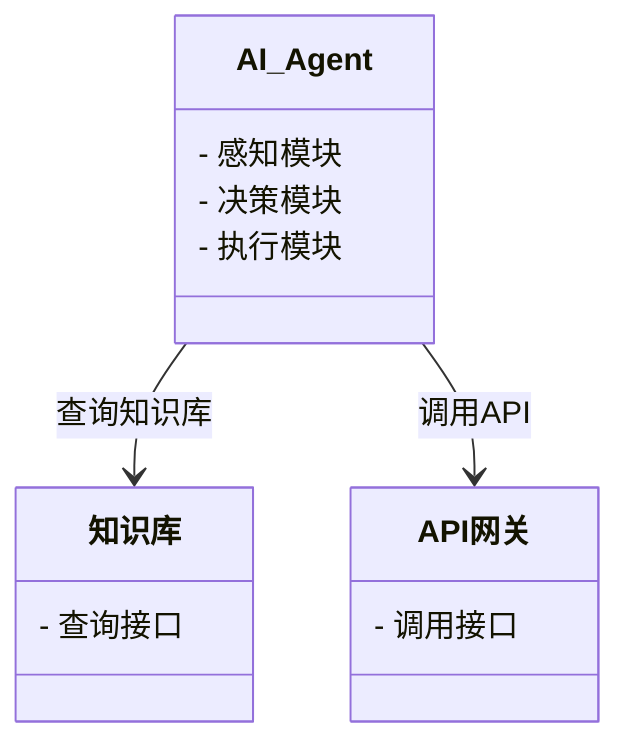
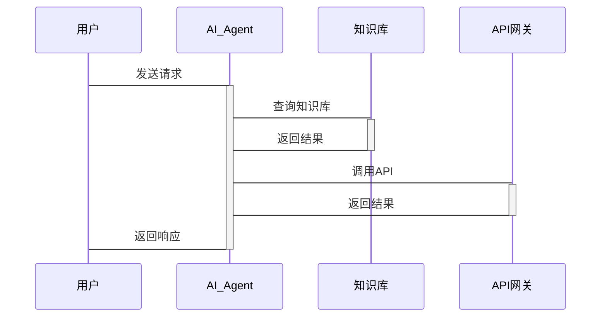

                 


# 企业AI Agent的容器化部署策略

> 关键词：企业AI Agent，容器化部署，微服务架构，Docker，Kubernetes，服务发现，负载均衡

> 摘要：随着人工智能技术的快速发展，企业AI Agent的应用场景日益广泛。为了提高AI Agent的部署效率和管理能力，容器化部署成为一种重要的策略。本文将深入探讨企业AI Agent的容器化部署策略，从核心概念到算法原理，从系统架构到项目实战，全面解析如何在企业环境中高效部署和管理AI Agent。

---

# 第1章: 企业AI Agent与容器化部署概述

## 1.1 企业AI Agent的概念与背景

### 1.1.1 什么是企业AI Agent

企业AI Agent（Artificial Intelligence Agent）是一种能够感知环境、自主决策并执行任务的智能实体。它通常由感知层、决策层和执行层组成，能够根据外部输入做出响应，并通过与外部系统的交互完成特定任务。

**企业AI Agent的核心特点：**
- **自主性**：能够自主决策，无需人工干预。
- **反应性**：能够实时感知环境变化并做出反应。
- **目标导向性**：以完成特定目标为导向，优化决策过程。

### 1.1.2 AI Agent的核心功能

1. **感知环境**：通过传感器、API或其他输入方式获取外部信息。
2. **分析决策**：基于获取的信息，利用算法进行分析和决策。
3. **执行任务**：根据决策结果，调用相关服务或触发动作。
4. **自适应优化**：根据执行结果不断优化自身行为。

### 1.1.3 企业AI Agent的应用场景

- **智能客服**：通过自然语言处理技术为用户提供智能咨询服务。
- **自动化运维**：监控系统运行状态，自动修复故障。
- **智能推荐**：根据用户行为推荐个性化服务或产品。
- **流程自动化**：自动化企业内部流程，提高效率。

## 1.2 容器化部署的背景与意义

### 1.2.1 容器化技术的发展历程

容器化技术起源于20世纪90年代，经历了从虚拟机到容器的演变。容器技术通过共享宿主操作系统的内核，大幅降低了资源消耗，提高了部署效率。

### 1.2.2 容器化部署的优势与挑战

- **优势：**
  - 资源利用率高：容器共享宿主操作系统内核，资源占用低。
  - 部署快速：容器镜像构建简单，启动时间短。
  - 环境一致性：容器提供一致的运行环境，避免环境依赖问题。
- **挑战：**
  - 容器编排复杂：需要处理服务发现、负载均衡等问题。
  - 容器间的通信与协作：需要设计高效的通信机制。
  - 容器安全性：需要考虑容器逃逸、网络隔离等问题。

### 1.2.3 企业AI Agent与容器化部署的结合

将AI Agent部署在容器化环境中，可以充分发挥容器化部署的优势，提升AI Agent的灵活性和可扩展性。容器化部署能够快速响应业务需求变化，支持AI Agent的动态扩展和弹性伸缩。

---

# 第2章: 企业AI Agent的核心概念与原理

## 2.1 AI Agent的组成与工作原理

### 2.1.1 AI Agent的组成模块

1. **感知模块**：负责收集外部环境信息。
2. **决策模块**：基于感知信息，进行分析和决策。
3. **执行模块**：根据决策结果，调用相关服务或触发动作。

### 2.1.2 AI Agent的核心算法与模型

- **决策算法**：
  - 基于强化学习的决策算法。
  - 基于监督学习的决策算法。
  - 基于规则的决策算法。

- **感知模型**：
  - 基于深度学习的感知模型。
  - 基于传统机器学习的感知模型。

### 2.1.3 AI Agent的交互机制

AI Agent通过API、消息队列或其他通信方式与外部系统进行交互。交互机制需要设计高效的通信协议和接口，确保AI Agent能够实时响应外部请求。

## 2.2 容器化部署的核心概念

### 2.2.1 容器与容器编排的基本概念

- **容器**：一种轻量级的虚拟化技术，通过沙箱机制实现资源隔离。
- **容器编排**：通过编排工具（如Kubernetes）管理容器的生命周期，包括部署、扩展、负载均衡等。

### 2.2.2 容器化部署的流程与工具

- **容器镜像构建**：使用Dockerfile构建容器镜像。
- **容器编排工具**：使用Kubernetes、Docker Swarm等工具进行容器编排。
- **容器运行时**：如Docker、Containerd等。

### 2.2.3 容器化部署的资源管理与调度

- **资源调度**：根据系统负载动态分配资源。
- **负载均衡**：通过负载均衡器分配请求到不同的容器实例。

## 2.3 企业AI Agent与容器化部署的联系

### 2.3.1 AI Agent的动态特性与容器化部署的灵活性

AI Agent需要根据环境变化动态调整行为，容器化部署提供了灵活的扩展能力，能够快速响应需求变化。

### 2.3.2 容器化部署对企业AI Agent扩展性的支持

容器化部署支持水平扩展，能够根据负载自动调整AI Agent的数量，满足高并发需求。

### 2.3.3 容器化部署在AI Agent高可用性中的作用

容器化部署通过容器编排工具实现服务的高可用性，确保AI Agent在故障时能够快速恢复。

---

# 第3章: AI Agent的核心算法与数学模型

## 3.1 AI Agent的决策算法

### 3.1.1 基于强化学习的决策算法

**强化学习算法**通过与环境的交互获得奖励，优化决策策略。数学模型如下：

$$
V(s) = \max_{a} [ r(s,a) + \gamma V(s') ]
$$

其中：
- \( V(s) \) 表示状态 \( s \) 的价值函数。
- \( r(s,a) \) 表示在状态 \( s \) 下采取动作 \( a \) 的奖励。
- \( \gamma \) 表示折扣因子，控制未来奖励的权重。
- \( s' \) 表示下一步的状态。

### 3.1.2 基于监督学习的决策算法

监督学习算法通过训练数据学习决策函数。数学模型如下：

$$
f(x) = \arg\max_{a} \text{Pr}(a|x)
$$

其中：
- \( x \) 表示输入特征。
- \( a \) 表示决策动作。
- \( \text{Pr}(a|x) \) 表示在输入 \( x \) 下选择动作 \( a \) 的概率。

### 3.1.3 基于规则的决策算法

基于规则的决策算法通过预定义的规则进行决策，规则可以是简单的条件判断或复杂的逻辑推理。

## 3.2 容器化部署中的资源调度算法

### 3.2.1 基于负载均衡的资源调度算法

负载均衡算法通过将请求分发到不同的容器实例，实现资源的均衡利用。数学模型如下：

$$
\text{Load}(i) = \text{Load}(i) + \frac{1}{n} \times \text{Task Load}
$$

其中：
- \( \text{Load}(i) \) 表示第 \( i \) 个容器实例的负载。
- \( n \) 表示容器实例的数量。
- \( \text{Task Load} \) 表示任务的负载。

### 3.2.2 基于容器编排的资源调度算法

容器编排算法通过编排工具动态调整容器实例的数量和位置。数学模型如下：

$$
N = \text{max\_replicas} \times \text{scale\_up\_policy}
$$

其中：
- \( N \) 表示容器实例的数量。
- \( \text{max\_replicas} \) 表示最大容器实例数。
- \( \text{scale\_up\_policy} \) 表示扩缩策略。

### 3.2.3 基于预测的资源调度算法

基于预测的资源调度算法通过预测系统负载，提前调整资源分配。数学模型如下：

$$
R(t) = \alpha \times R(t-1) + (1-\alpha) \times \text{Predict}(t)
$$

其中：
- \( R(t) \) 表示当前时间 \( t \) 的资源需求。
- \( \alpha \) 表示权重因子。
- \( R(t-1) \) 表示前一时间 \( t-1 \) 的资源需求。
- \( \text{Predict}(t) \) 表示对时间 \( t \) 的资源需求预测。

---

# 第4章: 企业AI Agent的系统架构设计

## 4.1 系统问题场景介绍

假设我们正在设计一个智能客服系统，用户通过网页或移动端发送请求，系统需要快速响应并提供解决方案。AI Agent负责处理用户请求，调用后端服务（如知识库查询、API调用）完成任务。

## 4.2 系统功能设计

### 4.2.1 领域模型设计

使用Mermaid绘制领域模型类图：



### 4.2.2 系统架构设计

使用Mermaid绘制系统架构图：

```mermaid
container AI-Agent-Container {
    AI_Agent
    --> 知识库
    --> API网关
    --> 监控系统
}
```

### 4.2.3 系统接口设计

系统接口设计包括：
- AI Agent与知识库的查询接口。
- AI Agent与API网关的调用接口。
- AI Agent与监控系统的监控接口。

### 4.2.4 系统交互设计

使用Mermaid绘制系统交互流程图：



---

# 第5章: 企业AI Agent的容器化部署实战

## 5.1 环境安装与配置

### 5.1.1 安装Docker

在Linux系统上安装Docker：

```bash
sudo apt-get update
sudo apt-get install docker.io
sudo docker --version
```

### 5.1.2 安装Kubernetes

使用Kubernetes作为容器编排工具：

```bash
curl -s https://get.kubernetes.io/install.sh | sudo bash
```

## 5.2 系统核心实现

### 5.2.1 AI Agent的核心代码

编写一个简单的AI Agent服务：

```python
from flask import Flask
import requests

app = Flask(__name__)

def query_knowledge_base(question):
    # 调用知识库查询接口
    response = requests.get(f"http://knowledge_base:8080/{question}")
    return response.text

@app.route("/ask", methods=["POST"])
def ask():
    # 获取用户请求
    data = request.json
    question = data["question"]
    # 查询知识库
    answer = query_knowledge_base(question)
    return jsonify({"answer": answer})

if __name__ == "__main__":
    app.run(debug=True)
```

### 5.2.2 容器化部署实现

将AI Agent服务容器化部署：

1. 编写Dockerfile：

```dockerfile
FROM python:3.8-slim
WORKDIR /app
COPY requirements.txt .
RUN pip install -r requirements.txt
COPY . .
CMD ["python", "app.py"]
```

2. 编写Kubernetes部署文件（Deployment YAML）：

```yaml
apiVersion: apps/v1
kind: Deployment
metadata:
  name: ai-agent-deployment
  labels:
    app: ai-agent
spec:
  replicas: 3
  selector:
    matchLabels:
      app: ai-agent
  template:
    metadata:
      labels:
        app: ai-agent
    spec:
      containers:
      - name: ai-agent
        image: ai-agent:v1
        ports:
        - containerPort: 5000
```

---

# 第6章: 最佳实践与小结

## 6.1 最佳实践

1. **容器化设计**：
   - 将AI Agent服务拆分为多个微服务，每个服务独立部署。
   - 使用容器编排工具（如Kubernetes）管理容器的生命周期。

2. **资源管理**：
   - 使用负载均衡器分发请求，避免单点故障。
   - 根据系统负载动态调整容器实例数量。

3. **监控与日志**：
   - 集成监控工具（如Prometheus）监控系统运行状态。
   - 使用日志收集工具（如ELK）分析日志，快速定位问题。

4. **安全性**：
   - 使用容器网络插件（如Flannel）实现网络隔离。
   - 配置容器安全策略，防止容器逃逸。

## 6.2 小结

企业AI Agent的容器化部署策略是一个复杂但值得探索的方向。通过容器化部署，企业可以快速响应业务需求变化，提高系统的灵活性和可扩展性。本文从核心概念到算法原理，从系统架构设计到项目实战，全面解析了企业AI Agent的容器化部署策略。希望本文能够为企业的技术决策者和开发人员提供有价值的参考。

---

# 结束语

企业AI Agent的容器化部署策略是一个不断发展和完善的领域。随着人工智能技术的不断进步和容器化技术的成熟，企业AI Agent的容器化部署将变得更加高效和智能。未来，我们可以期待更多创新的应用场景和部署策略，为企业创造更大的价值。

---

**注意事项：**
- 本文内容仅供参考，具体实现细节请根据实际情况调整。
- 如需进一步了解相关技术，建议参考官方文档和相关技术博客。

