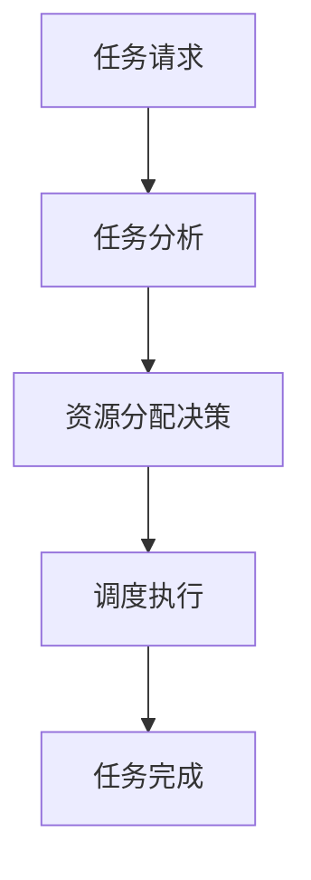
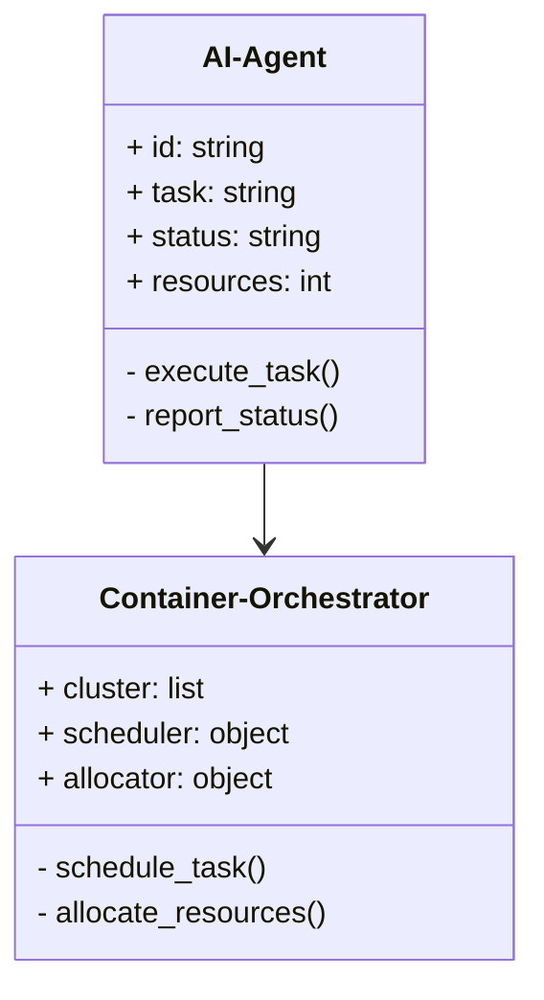
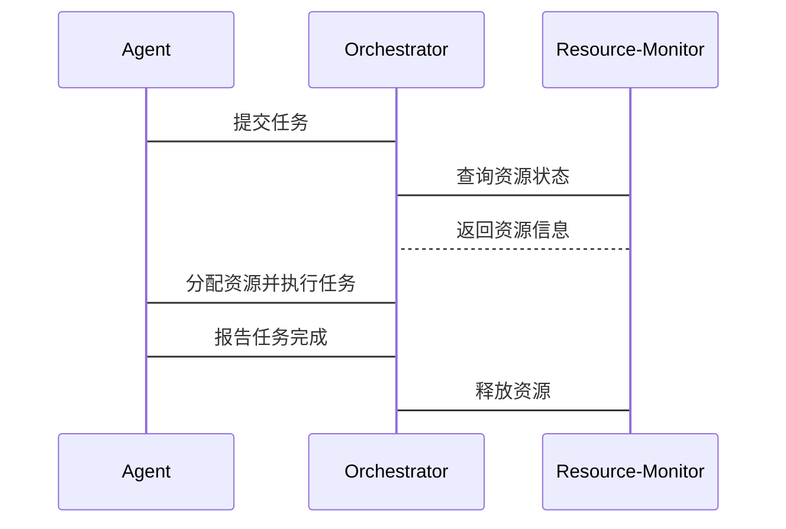

                 


---

# 《企业AI Agent的容器编排与管理策略》

---

## 关键词：
- 企业AI Agent
- 容器编排
- Kubernetes
- AI容器管理
- 自动化运维

---

## 摘要：
随着人工智能技术的快速发展，企业AI Agent（智能代理）在生产环境中的应用日益广泛。AI Agent能够自动化执行任务、优化资源利用并提高业务效率，但其复杂性和动态性对容器编排和管理提出了更高要求。本文深入探讨企业AI Agent的容器编排与管理策略，分析其核心概念、算法原理、系统架构，并结合实际案例，提供从理论到实践的全面指导。通过本文，读者将掌握如何在企业环境中高效管理和优化AI Agent，提升业务效率和系统性能。

---

# 第一部分：企业AI Agent的背景与概述

---

## 第1章：企业AI Agent的背景与核心概念

### 1.1 AI Agent的基本概念
- **定义与特点**：
  AI Agent是一种能够感知环境、自主决策并执行任务的智能实体。它具备自主性、反应性、目标导向和社交能力等核心特点。
  
- **企业中的应用场景**：
  AI Agent在企业中广泛应用于自动化任务执行、资源调度优化、实时数据分析、智能客服等领域。

- **AI Agent与传统自动化系统的区别**：
  AI Agent具备学习和适应能力，能够根据环境变化动态调整行为，而传统自动化系统依赖于预定义规则。

### 1.2 容器编排技术的背景与现状
- **容器技术的发展历程**：
  从虚拟化技术到Docker容器的崛起，容器技术已成为现代应用部署的核心工具。

- **容器编排技术的定义与特点**：
  容器编排是指通过自动化工具（如Kubernetes）管理容器的生命周期，包括部署、扩展、负载均衡和自愈合等功能。

- **企业级容器编排工具的现状与趋势**：
  Kubernetes成为主流的企业级容器编排工具，其强大的生态和扩展性使其在AI Agent管理中占据重要地位。

### 1.3 企业AI Agent与容器编排的结合
- **AI Agent在企业中的应用场景**：
  从智能监控到自动化运维，AI Agent通过容器编排技术实现了高效的任务调度和资源管理。

- **容器编排在AI Agent管理中的作用**：
  容器编排技术为AI Agent提供了动态部署、弹性扩展和高可用性的能力，确保其在复杂环境中的稳定运行。

- **企业AI Agent容器编排的挑战与机遇**：
  挑战包括动态任务调度的复杂性、资源分配的优化问题；机遇则是通过容器编排提升系统效率和可扩展性。

---

## 第2章：企业AI Agent的容器编排与管理策略概述

### 2.1 容器编排与AI Agent管理的结合
- **容器编排技术在AI Agent管理中的优势**：
  容器编排技术能够实现AI Agent的自动化部署、动态扩展和故障恢复，显著提升了管理效率。

- **AI Agent容器编排的典型应用场景**：
  包括实时数据分析、任务调度优化、动态资源分配等领域。

- **企业AI Agent容器编排的管理策略**：
  通过制定合理的任务调度策略、资源分配策略和容错机制，确保AI Agent的高效运行。

### 2.2 企业AI Agent容器编排的核心目标
- **动态任务调度**：
  根据实时任务需求，动态调整AI Agent的资源分配和任务执行顺序。

- **弹性资源管理**：
  在高负载情况下，通过弹性扩缩容确保系统性能的同时降低资源浪费。

- **高可用性保障**：
  通过容器编排技术实现AI Agent的故障自愈和高可用性，确保业务连续性。

---

## 第3章：企业AI Agent容器编排的算法原理

### 3.1 容器编排算法的概述
- **任务调度算法**：
  包括随机调度、轮询调度、优先级调度等多种策略，适用于不同场景的任务分配。

- **资源分配算法**：
  基于系统资源的实时状态，动态调整AI Agent的资源分配，确保任务高效执行。

- **负载均衡算法**：
  通过负载均衡技术实现AI Agent任务的均衡分布，避免资源浪费和性能瓶颈。

### 3.2 容器编排算法的实现步骤


### 3.3 算法实现的Python代码示例
```python
def task_scheduler(tasks, resources):
    # 任务优先级排序
    tasks.sort(key=lambda x: x['priority'])
    
    # 资源分配
    allocated = {}
    for task in tasks:
        resource_available = resources - sum(allocated.values())
        if resource_available >= task['required']:
            allocated[task['id']] = task['required']
        else:
            # 调度失败，记录日志
            print(f"Task {task['id']} failed to allocate resources.")
    return allocated
```

### 3.4 数学模型与公式
- **资源利用率公式**：
  $$ \text{资源利用率} = \frac{\text{已分配资源}}{\text{总资源}} \times 100\% $$

- **任务调度优化目标**：
  $$ \min \sum_{i=1}^{n} (t_i - s_i) $$
  其中，\( t_i \) 是任务完成时间，\( s_i \) 是任务开始时间。

---

## 第4章：企业AI Agent容器编排的系统架构

### 4.1 系统功能设计
- **AI Agent生命周期管理**：
  包括部署、运行、监控和销毁等阶段。

- **任务调度与资源管理**：
  通过容器编排工具实现任务的动态调度和资源的弹性分配。

- **监控与容错机制**：
  实时监控AI Agent的运行状态，快速响应故障并进行自愈。

### 4.2 系统架构设计


### 4.3 系统接口设计
- **任务提交接口**：
  ```http
  POST /api/v1/agent/task
  {
    "task_id": "123",
    "task_type": "data_analysis",
    "resources": 500
  }
  ```

- **资源分配接口**：
  ```http
  POST /api/v1/agent/allocate
  {
    "agent_id": "456",
    "required_resources": 300
  }
  ```

### 4.4 系统交互流程


---

## 第5章：企业AI Agent容器编排的项目实战

### 5.1 环境安装与配置
- **安装Kubernetes**：
  ```bash
  curl -s https://get.helm.sh | bash - 
  helm install my-release mychart --namespace my-namespace --create-namespace
  ```

- **配置AI Agent运行环境**：
  ```bash
  kubectl apply -f agent-deployment.yaml
  ```

### 5.2 核心代码实现
- **任务调度器代码**：
  ```python
  import kubernetes.client as k8s_client

  def schedule_task(task):
      api = k8s_client.BatchApi()
      # 创建任务 pods
      api.create_namespaced_pod(...)
  ```

- **资源分配策略实现**：
  ```python
  def allocate_resources(agent_id, required_resources):
      # 调用Kubernetes API分配资源
      pass
  ```

### 5.3 实际案例分析
- **案例背景**：
  某企业需要通过AI Agent处理大量实时数据，使用Kubernetes进行容器编排，实现了任务的动态调度和资源的弹性分配。

- **案例实现步骤**：
  1. 部署Kubernetes集群。
  2. 编写AI Agent的Docker镜像。
  3. 使用Kubernetes API进行任务调度和资源管理。

### 5.4 项目小结
- **实现成果**：
  成功实现了AI Agent的动态任务调度和弹性资源管理，显著提升了系统的效率和稳定性。

---

## 第6章：企业AI Agent容器编排的最佳实践与总结

### 6.1 最佳实践
- **合理选择容器编排工具**：
  根据企业需求选择合适的容器编排工具，Kubernetes是首选。

- **优化任务调度策略**：
  根据任务特性和资源情况选择合适的调度算法，提升系统性能。

- **加强系统监控与日志管理**：
  通过实时监控和日志分析，快速定位和解决系统问题。

### 6.2 本章小结
- **总结**：
  企业AI Agent的容器编排与管理策略是实现高效任务执行和资源管理的关键。通过合理的设计和优化，能够显著提升系统的性能和可用性。

### 6.3 注意事项
- **资源分配的动态调整**：
  定期评估系统资源使用情况，优化资源分配策略。

- **安全性和权限管理**：
  确保容器编排环境的安全性，严格控制权限，防止未授权访问。

### 6.4 拓展阅读
- **推荐书籍**：
  《Kubernetes Up and Running》、《设计模式：可扩展的系统架构》

- **推荐技术博客**：
  [Kubernetes中文社区](https://kubernetes.io/zh/)、[AI Agent技术博客](https://towardsdatascience.com/)

---

# 结语

企业AI Agent的容器编排与管理策略是一个复杂而重要的课题。通过本文的详细分析和实际案例，读者可以掌握AI Agent容器编排的核心概念、算法原理和系统架构，同时通过项目实战和最佳实践，提升自身的技术能力。未来，随着AI技术的不断发展，企业AI Agent的容器编排与管理策略将更加智能化和高效化。

---

