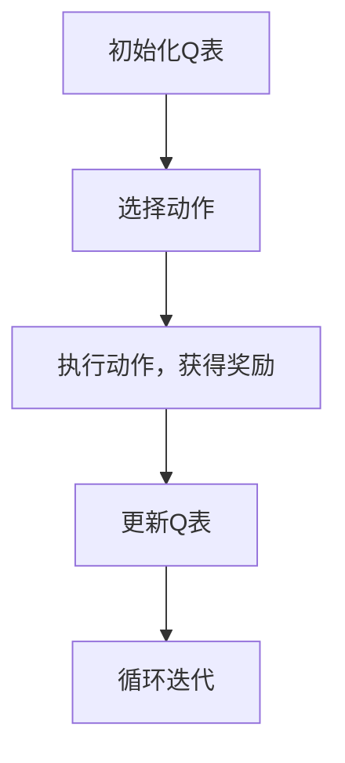
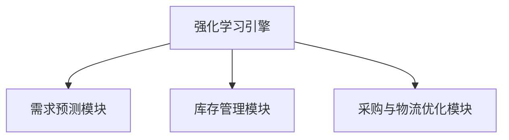
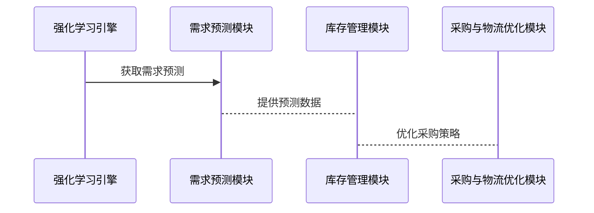

                 


# 企业AI Agent的强化学习在供应链优化中的端到端应用

## 关键词
企业AI Agent、强化学习、供应链优化、算法实现、系统架构、案例分析

## 摘要
本文深入探讨了企业AI Agent如何利用强化学习技术优化供应链管理，从理论到实践进行全面解析。通过详细分析强化学习的核心算法、供应链优化的建模方法以及系统的端到端架构，本文为读者提供了从环境搭建到代码实现的完整指南。结合实际案例，本文展示了如何通过强化学习提升供应链的效率和响应能力，为企业在复杂多变的市场环境中提供决策支持。

---

# 第1章: 强化学习基础

## 1.1 AI Agent的基本概念

### 1.1.1 AI Agent的定义与特点
AI Agent（人工智能代理）是指能够感知环境并采取行动以实现目标的智能实体。其特点包括自主性、反应性、目标导向和社会性。AI Agent可以是软件程序，也可以是机器人，广泛应用于自动驾驶、智能助手和推荐系统等领域。

### 1.1.2 强化学习的基本原理
强化学习是一种机器学习范式，通过智能体与环境的交互，学习采取最优动作以最大化累计奖励。核心要素包括状态（state）、动作（action）、奖励（reward）和策略（policy）。

### 1.1.3 企业AI Agent的应用场景
在企业场景中，AI Agent可以用于自动化决策、智能推荐和流程优化。例如，在供应链管理中，AI Agent可以通过强化学习优化库存管理、采购策略和物流路径。

---

## 1.2 强化学习的核心概念

### 1.2.1 状态、动作、奖励的定义
- **状态（State）**：环境中的当前情况，如库存水平、需求预测。
- **动作（Action）**：智能体采取的行为，如增加订单量。
- **奖励（Reward）**：环境对动作的反馈，如成本降低的奖励。

### 1.2.2 马尔可夫决策过程（MDP）
马尔可夫决策过程定义了强化学习的基本框架，包括状态空间、动作空间、转移概率和奖励函数。

### 1.2.3 策略与价值函数的定义
- **策略（Policy）**：描述智能体在状态下的动作选择概率。
- **价值函数（Value Function）**：评估状态或动作的期望奖励。

---

## 1.3 供应链优化的强化学习应用背景

### 1.3.1 供应链优化的核心问题
供应链优化涉及需求预测、库存管理和物流路径优化，目标是降低成本、提高效率。

### 1.3.2 强化学习在供应链优化中的优势
强化学习能够处理动态环境和多目标优化问题，适用于供应链中的复杂决策场景。

### 1.3.3 当前研究的不足与挑战
现有研究面临数据需求大、计算复杂度高和实际场景适配性不足的问题。

---

# 第2章: 强化学习算法原理

## 2.1 Q-learning算法

### 2.1.1 Q-learning的基本原理
Q-learning是一种基于值函数的强化学习算法，通过更新Q值表学习最优策略。

### 2.1.2 Q-learning的数学模型
$$ Q(s,a) = Q(s,a) + \alpha (r + \gamma \max Q(s',a') - Q(s,a)) $$
其中，$\alpha$是学习率，$\gamma$是折扣因子。

### 2.1.3 Q-learning的实现流程


## 2.2 策略梯度方法

### 2.2.1 策略梯度的基本原理
策略梯度方法通过优化策略参数直接最大化期望奖励。

### 2.2.2 策略梯度的数学模型
$$ \nabla \theta \leftarrow \frac{\partial}{\partial \theta} \mathbb{E}[R] $$

### 2.2.3 策略梯度的优缺点
优点是直接优化策略，缺点是计算复杂度较高。

---

# 第3章: 供应链优化的强化学习建模

## 3.1 供应链优化的核心问题

### 3.1.1 需求预测与库存管理
通过强化学习优化库存水平，降低缺货和过剩成本。

### 3.1.2 供应商选择与采购策略
智能选择供应商，优化采购成本和交货时间。

### 3.1.3 物流路径优化
通过强化学习优化物流路径，降低运输成本。

## 3.2 强化学习在供应链优化中的建模方法

### 3.2.1 状态空间的定义
状态空间包括当前库存水平、需求预测和供应商交货时间。

### 3.2.2 动作空间的定义
动作空间包括增加订单量、调整供应商和优化物流路径。

### 3.2.3 奖励函数的设计
奖励函数设计为成本降低和利润增加的综合指标。

---

# 第4章: 供应链优化的强化学习系统架构

## 4.1 系统功能设计

### 4.1.1 需求预测模块
通过强化学习模型预测未来需求，优化库存管理。

### 4.1.2 库存管理模块
根据需求预测和历史数据，优化库存水平。

### 4.1.3 采购与物流优化模块
优化供应商选择和物流路径，降低采购和运输成本。

## 4.2 系统架构设计（Mermaid架构图）



## 4.3 系统接口设计

### 4.3.1 输入接口
接收库存数据、需求预测和供应商信息。

### 4.3.2 输出接口
输出优化后的库存策略、采购订单和物流路径。

## 4.4 系统交互流程（Mermaid序列图）



---

# 第5章: 项目实战

## 5.1 环境搭建

### 5.1.1 安装Python和必要的库
安装Python 3.8及以上版本，安装库：`numpy`, `pandas`, `scikit-learn`, `tensorflow`。

### 5.1.2 安装强化学习框架
使用`stable-baselines3`框架简化实现。

## 5.2 核心代码实现

### 5.2.1 Q-learning实现
```python
import numpy as np

class QLearning:
    def __init__(self, state_space, action_space):
        self.state_space = state_space
        self.action_space = action_space
        self.Q = np.zeros((state_space, action_space))
    
    def choose_action(self, state, epsilon):
        if np.random.random() < epsilon:
            return np.random.randint(self.action_space)
        else:
            return np.argmax(self.Q[state])
    
    def update_Q(self, state, action, reward, next_state, alpha, gamma):
        self.Q[state, action] += alpha * (reward + gamma * np.max(self.Q[next_state]) - self.Q[state, action])
```

### 5.2.2 应用场景实现
```python
# 示例：库存管理
state = current_inventory_level
action = order_quantity
reward = cost_saving
next_state = updated_inventory_level
```

## 5.3 实际案例分析

### 5.3.1 案例背景
某公司希望优化库存管理，减少缺货和过剩成本。

### 5.3.2 数据准备
收集过去一年的销售数据，预测未来需求。

### 5.3.3 模型训练
使用Q-learning算法训练库存管理模型。

### 5.3.4 模型应用
根据预测需求，优化库存水平和采购订单。

## 5.4 项目小结
通过强化学习优化供应链管理，显著降低了成本，提高了效率。

---

# 第6章: 总结与展望

## 6.1 总结
本文详细介绍了企业AI Agent的强化学习在供应链优化中的应用，从算法原理到系统架构，再到实际案例，为读者提供了全面的指导。

## 6.2 当前研究的不足
现有研究在计算复杂度和数据需求方面存在挑战。

## 6.3 未来研究方向
未来研究可以结合其他机器学习技术，优化算法性能，降低计算复杂度。

## 6.4 最佳实践 Tips
- 选择合适的强化学习算法，结合具体场景。
- 优化模型参数，提高训练效率。
- 结合领域知识，设计合理的奖励函数。

---

# 附录

## A. 完整代码实现
提供完整的Q-learning算法实现和供应链优化的代码示例。

## B. 相关学术论文
推荐几篇经典的强化学习与供应链优化的学术论文。

---

通过以上结构，本文为读者提供了一个从理论到实践的完整指南，帮助读者理解并应用强化学习技术优化企业供应链管理。

