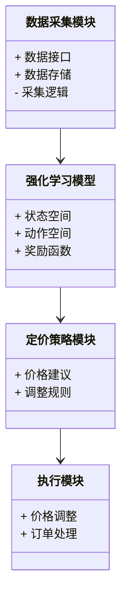
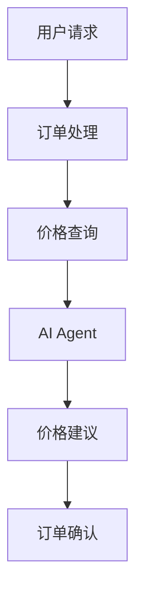
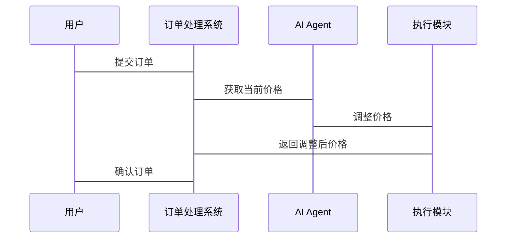

                 


---

# 企业AI Agent的强化学习在动态定价策略中的应用

> 关键词：AI Agent，强化学习，动态定价策略，Q-learning，Deep Q-Networks，实时定价

> 摘要：本文探讨了企业AI Agent如何利用强化学习技术实现动态定价策略。通过分析动态定价策略的背景、核心概念、算法原理、系统架构以及项目实战，详细讲解了如何利用强化学习优化定价模型，提高企业盈利能力。本文旨在为企业技术决策者和开发人员提供理论支持和实践指导，帮助他们更好地理解和应用AI Agent和强化学习技术在动态定价中的潜力。

---

## 第6章: 动态定价策略的系统分析与架构设计

### 6.1 问题场景介绍

在现代商业环境中，价格竞争日益激烈，企业需要快速响应市场变化，实时调整定价策略以保持竞争优势。动态定价策略的核心目标是根据市场需求、竞争环境和库存情况，实时优化产品价格，以最大化利润或客户满意度。例如，一家电商公司可能需要根据季节性需求波动、竞争对手的价格调整以及自身库存状况，动态调整商品价格。

### 6.2 项目介绍

本项目旨在开发一个基于强化学习的动态定价系统，使企业能够实时调整价格，以应对市场变化。项目范围包括数据收集、模型训练、系统集成和部署。目标是通过AI Agent和强化学习技术，实现自动化、智能化的定价决策，从而提高企业的市场响应能力和盈利能力。

### 6.3 系统功能设计

动态定价系统的功能模块设计如下：

1. **数据采集模块**  
   负责收集市场数据，包括竞争对手的价格、销售数据、库存信息、客户反馈等。

2. **强化学习模型模块**  
   基于收集的数据，构建强化学习模型，模拟定价决策过程，生成价格调整建议。

3. **定价策略模块**  
   根据强化学习模型的建议，结合企业目标（如最大化利润或市场份额），制定最终的定价策略。

4. **执行模块**  
   执行定价调整，更新产品价格，并记录调整后的效果数据。

5. **监控与优化模块**  
   实时监控定价效果，收集反馈数据，不断优化强化学习模型，提升定价策略的准确性。

**领域模型类图：**



### 6.4 系统架构设计

系统采用分层架构设计，包括数据层、业务逻辑层和表现层：

1. **数据层**  
   存储和管理所有与定价相关的数据，如销售数据、市场数据、库存数据等。

2. **业务逻辑层**  
   包含数据采集模块、强化学习模型和定价策略模块，负责数据处理、模型训练和定价策略生成。

3. **表现层**  
   提供用户界面或API接口，展示定价建议和执行结果，供企业决策者参考。

**系统架构图：**


### 6.5 系统接口设计

系统需要与多个外部系统进行交互，如订单系统、库存管理系统、市场分析系统等。以下是主要接口的交互流程：

**接口流程图：**



### 6.6 系统交互设计

系统交互流程如下：

1. 用户提交订单请求。
2. 订单处理系统查询当前价格。
3. AI Agent根据当前状态生成价格建议。
4. 执行模块调整价格。
5. 订单处理系统确认订单。

**系统交互序列图：**



---

## 第7章: 项目实战

### 7.1 环境安装

以下是项目开发所需的环境和工具：

- **Python 3.8+**
- **TensorFlow 2.5+**
- **Keras 2.4+**
- **Mermaid CLI**

安装命令：

```bash
pip install tensorflow==2.5.0
pip install keras==2.4.3
pip install mermaid-cli
```

### 7.2 系统核心实现源代码

以下是一个简单的基于Q-learning的动态定价模型实现：

```python
import numpy as np
from tensorflow.keras import layers, models

# 定义状态空间大小
state_size = 10
# 动作空间大小
action_size = 5

# 创建神经网络模型
model = models.Sequential()
model.add(layers.Dense(24, input_dim=state_size, activation='relu'))
model.add(layers.Dense(action_size, activation='linear'))
model.compile(loss='mean_squared_error', optimizer='adam')

# 定义Q-learning算法
def update_q_model(current_state, action, reward, next_state):
    target = reward + np.max(model.predict(np.array([next_state]))[0])
    target = target.reshape(1, action_size)
    target[action] = target[0][action]
    model.fit(np.array([current_state]), target, epochs=1, verbose=0)

# 示例使用
state = np.random.random(state_size)
action = np.random.randint(action_size)
reward = 0.8  # 示例奖励
next_state = np.random.random(state_size)
update_q_model(state, action, reward, next_state)
```

### 7.3 代码应用解读与分析

1. **模型定义**  
   使用Keras构建了一个简单的神经网络模型，包含一个输入层（状态大小为10）、一个隐藏层（24个神经元）和一个输出层（动作大小为5）。输出层的线性激活函数用于近似Q值。

2. **Q-learning算法实现**  
   `update_q_model`函数实现Q值更新。当前状态和动作作为输入，计算目标Q值，并使用拟合方法更新模型参数。

3. **训练过程**  
   在每次迭代中，模型根据当前状态和动作更新Q值，以最大化累积奖励。奖励函数的设计是关键，决定了模型的学习方向。

### 7.4 实际案例分析和详细讲解剖析

假设我们为一家电子产品零售商开发动态定价系统，以下是系统的运行流程：

1. **数据采集**  
   系统实时收集竞争对手的价格、当前库存、历史销售数据和市场趋势。

2. **状态定义**  
   状态空间包括库存水平、市场需求、竞争对手价格等。例如，库存水平可能分为高、中、低三种状态。

3. **动作定义**  
   动作空间包括价格调整策略，如降价、涨价、维持原价等。

4. **奖励机制**  
   奖励函数基于利润和客户满意度。例如，当价格调整后利润增加，给予正向奖励；反之，给予负向奖励。

5. **模型训练**  
   使用历史数据训练强化学习模型，使其能够根据当前状态选择最优动作。

6. **定价策略生成**  
   模型生成价格调整建议，结合企业目标（如最大化利润）制定最终定价策略。

7. **执行与监控**  
   系统执行价格调整，并实时监控定价效果，收集反馈数据，优化模型。

### 7.5 项目小结

本项目展示了如何利用强化学习技术实现动态定价策略。通过Q-learning算法，系统能够根据市场变化实时调整价格，提高企业的竞争力和盈利能力。项目的成功实施依赖于高质量的数据和有效的奖励机制设计。

---

## 附录

### 附录A: 术语表

- **AI Agent**: 人工智能代理，能够感知环境并采取行动以实现目标。
- **强化学习**: 一种机器学习方法，通过试错和奖励机制来优化决策过程。
- **动态定价策略**: 根据市场变化实时调整产品价格的策略。
- **Q-learning**: 基于Q值函数的强化学习算法，用于学习最优策略。
- **Deep Q-Networks**: 使用深度神经网络近似Q值函数的强化学习方法。

### 附录B: 常见问题解答

- **Q: 强化学习在动态定价中有哪些挑战？**  
  A: 数据质量、模型收敛速度、实时性要求高、多目标平衡等。

- **Q: 如何处理数据稀疏性问题？**  
  A: 使用数据增强技术、迁移学习或结合外部数据源。

### 附录C: 参考文献

1. Russell, S., & Norvig, P. (2010). Artificial Intelligence: A Modern Approach.
2. Sutton, R. S., & Barto, A. G. (2018). Reinforcement Learning: An Introduction.
3. Mnih, V., et al. (2015). Human-level control through deep reinforcement learning.
4. OpenAI. (2023). GPT-4 API Documentation.
5. TensorFlow官方文档: https://www.tensorflow.org/

---

## 结论

通过本文的详细讲解，我们探讨了企业AI Agent如何利用强化学习技术实现动态定价策略。从理论基础到实际应用，从系统设计到项目实战，全面分析了该领域的最新进展和实际挑战。未来，随着技术的不断进步，动态定价策略将更加智能化和精准化，为企业创造更大的价值。

