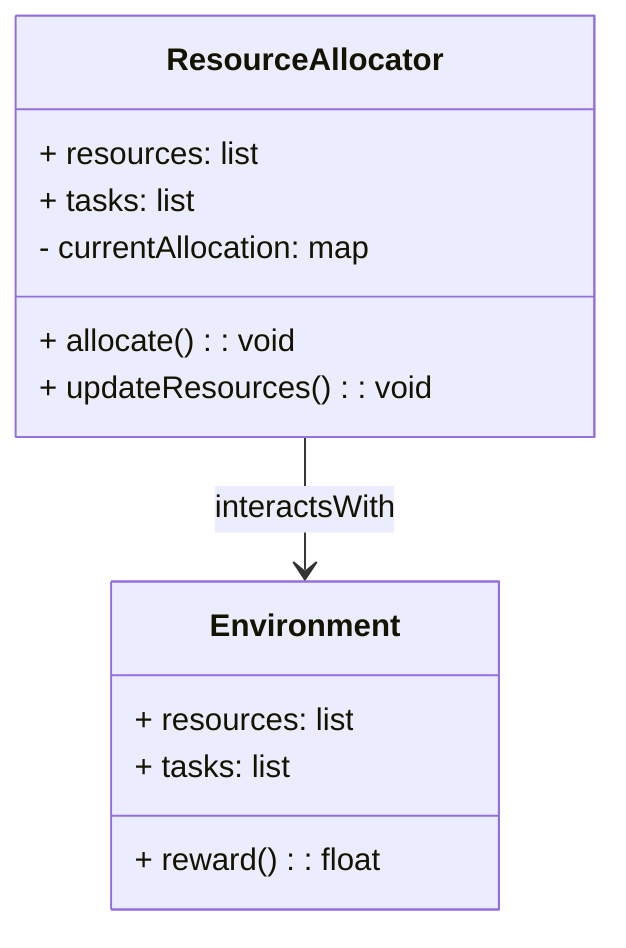
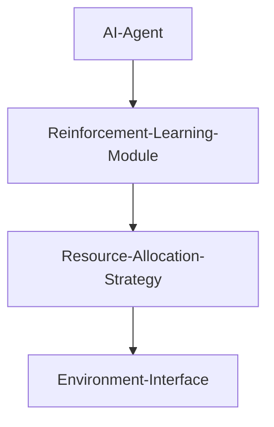
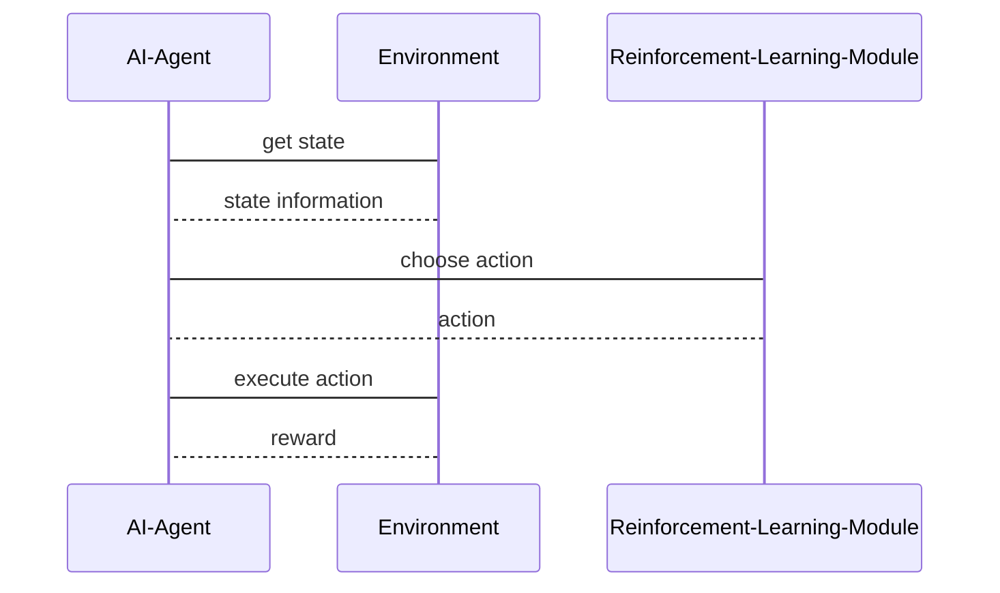

                 


# 企业AI Agent的强化学习在动态资源分配中的实时优化

> 关键词：强化学习，AI Agent，动态资源分配，实时优化，企业应用

> 摘要：本文探讨了企业AI Agent利用强化学习在动态资源分配中的实时优化方法。通过分析强化学习与AI Agent的关系，结合动态资源分配的典型场景，详细讲解了强化学习算法及其在动态资源分配中的应用。文章还包括了系统架构设计、项目实战和最佳实践等内容，旨在为企业AI Agent的动态资源分配优化提供理论支持和实践指导。

---

## 第1章: 强化学习与AI Agent基础

### 1.1 强化学习的基本概念

#### 1.1.1 强化学习的定义
强化学习（Reinforcement Learning, RL）是一种机器学习范式，通过智能体与环境的交互，学习如何采取最优行动以最大化累积奖励。与监督学习不同，强化学习不依赖于标注数据，而是通过试错和奖励机制来优化策略。

#### 1.1.2 强化学习的核心要素
- **状态（State）**：环境中的当前情况，表示智能体所处的环境状态。
- **动作（Action）**：智能体在给定状态下选择的行为。
- **奖励（Reward）**：智能体执行动作后，环境给予的反馈，用于评估动作的好坏。
- **策略（Policy）**：智能体选择动作的规则，可以是概率分布。
- **价值函数（Value Function）**：评估某状态下采取某个动作的价值。

#### 1.1.3 强化学习与监督学习的区别
- 监督学习：基于标注数据，学习输入到输出的映射。
- 强化学习：通过与环境交互，学习最优策略。

### 1.2 AI Agent的基本概念

#### 1.2.1 AI Agent的定义
AI Agent是一种智能实体，能够感知环境、自主决策并执行任务。它可以是一个软件程序或物理设备，通过传感器和执行器与环境交互。

#### 1.2.2 AI Agent的核心功能
- **感知**：通过传感器获取环境信息。
- **决策**：基于感知信息，选择最优行动。
- **执行**：通过执行器执行决策。

#### 1.2.3 AI Agent与传统算法的区别
AI Agent具有自主性、反应性和目标性，能够动态适应环境变化，而传统算法通常基于静态规则。

### 1.3 强化学习与AI Agent的关系

#### 1.3.1 强化学习在AI Agent中的应用
强化学习为AI Agent提供了一种学习策略的方法，使其能够在动态环境中做出最优决策。

#### 1.3.2 AI Agent如何利用强化学习进行决策
通过强化学习，AI Agent能够在不确定环境中，通过试错和奖励优化策略。

#### 1.3.3 强化学习与AI Agent的结合优势
强化学习提供了动态优化的能力，AI Agent提供了自主决策的能力，两者的结合使得智能体能够在复杂环境中实时优化资源分配。

---

## 第2章: 动态资源分配问题

### 2.1 动态资源分配的背景

#### 2.1.1 动态资源分配的定义
动态资源分配是指在动态变化的环境中，实时分配资源以满足任务需求。

#### 2.1.2 动态资源分配的挑战
- 资源需求的动态变化
- 资源分配的实时性要求
- 多目标优化的复杂性

#### 2.1.3 动态资源分配的典型场景
- 云计算资源分配
- 网络资源调度
- 自动驾驶中的资源优化

### 2.2 动态资源分配的强化学习建模

#### 2.2.1 状态空间的定义
- 当前资源使用情况
- 任务需求变化

#### 2.2.2 动作空间的定义
- 资源分配策略

#### 2.2.3 奖励函数的设计
- 奖励函数通常设计为资源利用率最大化、延迟最小化等目标。

### 2.3 动态资源分配的实时优化需求

#### 2.3.1 实时优化的目标
- 实时动态调整资源分配策略

#### 2.3.2 实时优化的关键挑战
- 算法的实时性
- 算法的收敛速度
- 算法的稳定性

#### 2.3.3 实时优化的实现路径
- 使用强化学习算法进行实时策略更新
- 结合反馈机制进行动态调整

---

## 第3章: 强化学习算法原理

### 3.1 Q-learning算法

#### 3.1.1 Q-learning的基本原理
Q-learning是一种经典的强化学习算法，通过更新Q值表来学习最优策略。

#### 3.1.2 Q-learning的数学模型
$$ Q(s, a) = Q(s, a) + \alpha [r + \max Q(s', a') - Q(s, a)] $$

#### 3.1.3 Q-learning的优缺点
- 优点：简单易实现
- 缺点：难以处理连续状态和动作空间

### 3.2 Deep Q-Networks (DQN)

#### 3.2.1 DQN的基本原理
DQN通过深度神经网络近似Q值函数，解决Q-learning在连续空间中的应用问题。

#### 3.2.2 DQN的网络结构
- 输入层：接收状态信息
- 隐藏层：处理状态信息
- 输出层：输出动作的Q值

#### 3.2.3 DQN的训练流程
1. 环境中获取状态
2. 神经网络预测Q值
3. 执行动作并获取奖励
4. 更新目标网络

### 3.3 强化学习算法的比较与选择

#### 3.3.1 各种强化学习算法的对比
| 算法 | 特点 | 适用场景 |
|------|------|----------|
| Q-learning | 简单，离线学习 | 离散状态和动作 |
| DQN | 处理连续空间 | 复杂环境 |
| PPO | 稳定性高 | 多智能体协作 |

#### 3.3.2 算法选择的依据
- 状态空间的复杂性
- 动作空间的维度
- 环境的实时性要求

---

## 第4章: 动态资源分配的系统设计

### 4.1 问题场景介绍

#### 4.1.1 动态资源分配的典型场景
- 云计算资源分配
- 网络资源调度

### 4.2 系统功能设计

#### 4.2.1 领域模型设计


### 4.3 系统架构设计

#### 4.3.1 系统架构图


### 4.4 系统接口设计

#### 4.4.1 系统接口设计
- `allocateResource()`: 分配资源
- `updateResources()`: 更新资源状态
- `getReward()`: 获取奖励

### 4.5 系统交互设计

#### 4.5.1 系统交互序列图


---

## 第5章: 项目实战

### 5.1 环境安装

#### 5.1.1 安装Python环境
```bash
python --version
pip install numpy
pip install gym
pip install tensorflow
```

### 5.2 系统核心实现源代码

#### 5.2.1 DQN算法实现
```python
import numpy as np
import gym
from tensorflow.keras import layers

class DQN:
    def __init__(self, state_space, action_space):
        self.state_space = state_space
        self.action_space = action_space
        self.model = self.build_model()
        self.target_model = self.build_model()
        self.gamma = 0.99
        self.epsilon = 0.1
        self.batch_size = 32

    def build_model(self):
        model = tf.keras.Sequential()
        model.add(layers.Dense(64, activation='relu', input_dim=self.state_space))
        model.add(layers.Dense(self.action_space))
        model.compile(optimizer='adam', loss='mse')
        return model

    def remember(self, state, action, reward, next_state):
        # 实现经验回放
        pass

    def act(self, state):
        # 根据当前策略选择动作
        pass

    def train(self):
        # 网络训练
        pass
```

### 5.3 代码应用解读与分析

#### 5.3.1 代码功能分析
- `build_model`：构建深度Q网络
- `remember`：存储经验
- `act`：选择动作
- `train`：训练网络

### 5.4 实际案例分析

#### 5.4.1 案例分析
假设一个云计算资源分配场景，利用DQN算法进行实时优化，通过训练得到最优资源分配策略。

### 5.5 项目小结

---

## 第6章: 总结与展望

### 6.1 重点回顾
- 强化学习与AI Agent的结合
- 动态资源分配的实时优化
- DQN算法在动态资源分配中的应用

### 6.2 优化建议
- 提高算法的收敛速度
- 提升系统的实时性

### 6.3 注意事项
- 算法的实时性
- 算法的稳定性
- 算法的可扩展性

### 6.4 拓展阅读
- 推荐相关书籍和论文

---

通过以上步骤，我们可以系统地了解企业AI Agent的强化学习在动态资源分配中的实时优化方法，为企业应用提供理论支持和实践指导。

