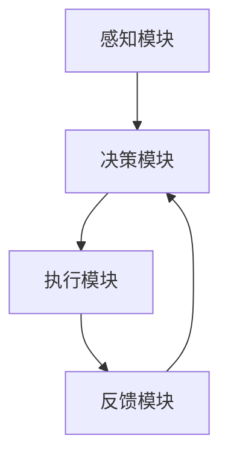

                 


# 企业AI Agent的强化学习在动态资源分配中的应用

> 关键词：企业AI Agent，强化学习，动态资源分配，DQN算法，资源分配模型

> 摘要：本文探讨了企业AI Agent如何利用强化学习技术解决动态资源分配问题。首先介绍了企业AI Agent和强化学习的基本概念，然后详细讲解了DQN算法在动态资源分配中的应用，包括数学模型、算法流程和代码实现。接着，分析了动态资源分配问题的建模方法，并通过实际案例展示了AI Agent在资源分配中的应用场景。最后，总结了强化学习在动态资源分配中的优势和未来研究方向。

---

## 第一部分: 企业AI Agent与强化学习概述

### 第1章: 企业AI Agent的定义与特点

#### 1.1 企业AI Agent的基本概念

企业AI Agent是一种具备自主决策能力的智能体，能够根据环境信息和任务目标，自主选择最优动作以实现目标。AI Agent通常具备以下特点：
- **自主性**：能够在没有外部干预的情况下自主决策。
- **反应性**：能够感知环境并实时调整行为。
- **学习能力**：通过与环境的交互不断优化决策策略。

#### 1.2 强化学习的核心原理

强化学习是一种机器学习范式，通过智能体与环境的交互，智能体学习如何采取最优动作以最大化累计奖励。核心要素包括：
- **状态空间（State Space）**：智能体所处环境的状态集合。
- **动作空间（Action Space）**：智能体可执行的动作集合。
- **奖励函数（Reward Function）**：对智能体行为的反馈，指导智能体学习优化策略。

#### 1.3 企业AI Agent的优势与应用场景

- **优势**：
  - 能够处理动态变化的环境，实时调整决策。
  - 可通过历史数据优化决策策略。
  - 能够处理复杂的非结构化问题。

- **应用场景**：
  - **资源分配**：动态分配计算资源、网络资源等。
  - **任务调度**：优化任务执行顺序和资源分配。
  - **风险管理**：在金融等领域进行风险控制和资源优化。

### 第2章: 动态资源分配的挑战与需求

#### 2.1 动态资源分配的定义

动态资源分配是指在动态变化的环境中，根据当前状态和未来预测，实时调整资源分配策略，以满足任务需求并优化资源利用率。

#### 2.2 动态资源分配的常见问题

- **资源竞争**：多个任务对同一资源的需求可能导致冲突。
- **延迟优化**：如何在满足延迟约束的情况下分配资源。
- **资源利用率**：如何在动态变化中最大化资源利用率。

#### 2.3 强化学习在动态资源分配中的作用

- **实时决策**：强化学习能够实时根据环境变化调整决策。
- **最优策略**：通过学习，智能体能够找到最优的资源分配策略。
- **适应性**：强化学习模型能够适应环境的变化，保持较好的性能。

---

## 第二部分: 强化学习的算法原理

### 第3章: 强化学习的核心算法

#### 3.1 Q-learning算法

Q-learning是一种基于值函数的强化学习算法，通过学习状态-动作值函数（Q-value）来优化决策策略。

- **算法流程**：
  1. 初始化Q表为零。
  2. 进入初始状态。
  3. 选择动作并执行，获得奖励和新状态。
  4. 更新Q表：$Q(s, a) = Q(s, a) + \alpha [r + \gamma \max Q(s', a') - Q(s, a)]$。
  5. 重复步骤2-4，直到收敛。

- **优缺点**：
  - 优点：简单易实现，适合离散状态和动作空间。
  - 缺点：收敛速度慢，难以处理连续状态和动作空间。

#### 3.2 Deep Q-Network (DQN) 算法

DQN算法将Q-learning与深度神经网络结合，能够处理高维状态空间和动作空间。

- **算法流程**：
  1. 使用经验回放缓冲区存储历史经验。
  2. 通过 minibatch 更新神经网络参数，目标网络用于稳定性。
  3. 在每一步选择动作并执行，更新经验回放缓冲区。
  4. 重复步骤2-3，直到收敛。

- **数学模型**：
  - 状态值函数：$Q(s, a; \theta)$，其中$\theta$是网络参数。
  - 目标值函数：$\hat{Q}(s, a; \theta^-)$，其中$\theta^-$是目标网络参数。
  - 更新规则：$\hat{Q}(s, a) = r + \gamma \max Q(s', a'; \theta)$。

- **代码实现（Python）**：
  ```python
  import numpy as np
  import gym
  import torch
  import torch.nn as nn

  class DQN(nn.Module):
      def __init__(self, input_dim, output_dim):
          super(DQN, self).__init__()
          self.fc1 = nn.Linear(input_dim, 64)
          self.fc2 = nn.Linear(64, output_dim)
          self.relu = nn.ReLU()
          self.softmax = nn.Softmax(dim=1)

      def forward(self, x):
          x = self.fc1(x)
          x = self.relu(x)
          x = self.fc2(x)
          return self.softmax(x)

  env = gym.make('CartPole-v1')
  input_dim = env.observation_space.shape[0]
  output_dim = env.action_space.n

  policy_net = DQN(input_dim, output_dim)
  target_net = DQN(input_dim, output_dim)
  target_net.load_state_dict(policy_net.state_dict())
  ```

---

## 第三部分: 动态资源分配的强化学习建模

### 第4章: 动态资源分配问题的建模

#### 4.1 动态资源分配的数学模型

动态资源分配问题可以建模为一个马尔可夫决策过程（MDP），包含状态、动作、奖励和转移概率。

- **状态空间**：$S = \{s_1, s_2, ..., s_n\}$，表示资源分配的当前状态。
- **动作空间**：$A = \{a_1, a_2, ..., a_m\}$，表示可执行的资源分配动作。
- **奖励函数**：$R: S \times A \rightarrow \mathbb{R}$，表示执行动作后的奖励。
- **转移概率**：$P(s' | s, a)$，表示从状态$s$执行动作$a$后转移到状态$s'$的概率。

#### 4.2 强化学习在动态资源分配中的应用

动态资源分配问题可以转化为强化学习问题，通过训练AI Agent学习最优资源分配策略。

- **资源分配模型**：
  - 输入：当前资源使用情况、任务需求。
  - 输出：资源分配决策。

- **优化目标**：
  - 最小化资源分配的延迟。
  - 最大化资源利用率。
  - 平衡资源分配的公平性。

---

## 第四部分: 系统设计与实现

### 第5章: AI Agent的系统架构设计

#### 5.1 系统功能设计

- **感知模块**：收集环境信息，如资源使用情况、任务需求。
- **决策模块**：基于强化学习算法生成资源分配决策。
- **执行模块**：将决策转化为实际的资源分配操作。
- **反馈模块**：收集执行结果，更新强化学习模型。

#### 5.2 系统架构图



#### 5.3 系统接口设计

- **输入接口**：接收资源状态、任务需求等信息。
- **输出接口**：输出资源分配决策。
- **反馈接口**：接收执行结果，更新模型参数。

---

## 第五部分: 项目实战

### 第6章: 动态资源分配的强化学习实现

#### 6.1 环境安装与配置

```bash
pip install gym numpy torch matplotlib
```

#### 6.2 核心代码实现

```python
import gym
import torch
import torch.nn as nn
import torch.optim as optim

class DQN_Agent:
    def __init__(self, state_dim, action_dim, learning_rate=0.01, gamma=0.99):
        self.state_dim = state_dim
        self.action_dim = action_dim
        self.learning_rate = learning_rate
        self.gamma = gamma
        self.model = nn.Sequential(
            nn.Linear(state_dim, 64),
            nn.ReLU(),
            nn.Linear(64, action_dim),
        )
        self.optimizer = optim.Adam(self.model.parameters(), lr=learning_rate)
    
    def get_action(self, state):
        state = torch.FloatTensor(state)
        with torch.no_grad():
            action_probs = self.model(state)
            action = torch.argmax(action_probs).item()
        return action
    
    def update_model(self, state, action, reward, next_state):
        state = torch.FloatTensor(state)
        next_state = torch.FloatTensor(next_state)
        target = reward + self.gamma * torch.max(self.model(next_state)).item()
        target = torch.tensor(target)
        loss = torch.mean((self.model(state)[:, action] - target)**2)
        self.optimizer.zero_grad()
        loss.backward()
        self.optimizer.step()

# 初始化环境和代理
env = gym.make('CartPole-v1')
agent = DQN_Agent(env.observation_space.shape[0], env.action_space.n)
```

#### 6.3 代码解读与分析

- **DQN_Agent类**：
  - 初始化：构建DQN网络，设置学习率和折扣率。
  - get_action方法：根据当前状态选择动作。
  - update_model方法：更新DQN网络参数，基于当前状态、动作、奖励和下一个状态。

#### 6.4 实际案例分析

通过训练DQN代理，可以在动态资源分配问题中实现近似最优的资源分配策略，显著提高资源利用率和任务执行效率。

---

## 第六部分: 总结与展望

### 第7章: 总结与展望

#### 7.1 最佳实践 tips

- 合理设计奖励函数，确保代理行为符合预期。
- 使用经验回放缓冲区，提高学习效率和稳定性。
- 定期更新目标网络，保持模型的稳定性。

#### 7.2 小结

本文详细探讨了企业AI Agent如何利用强化学习技术解决动态资源分配问题，通过DQN算法实现近似最优的资源分配策略。

#### 7.3 注意事项

- 强化学习模型需要大量数据支持，训练时间较长。
- 动态资源分配问题可能涉及多目标优化，需要权衡不同目标。
- 实际应用中需要考虑系统的实时性和可扩展性。

#### 7.4 未来研究方向

- 探讨多智能体强化学习在资源分配中的应用。
- 研究强化学习在动态资源分配中的鲁棒性和适应性。
- 结合其他技术（如区块链）优化资源分配过程。

---

以上是完整的文章结构和内容，涵盖了企业AI Agent的强化学习在动态资源分配中的应用的各个方面。

