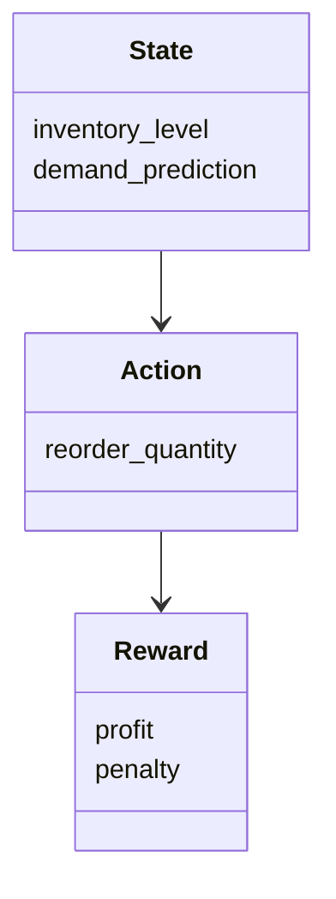
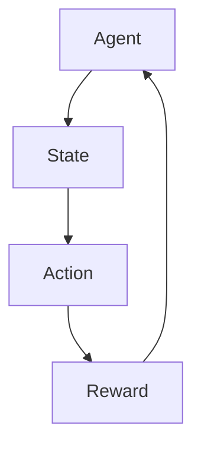
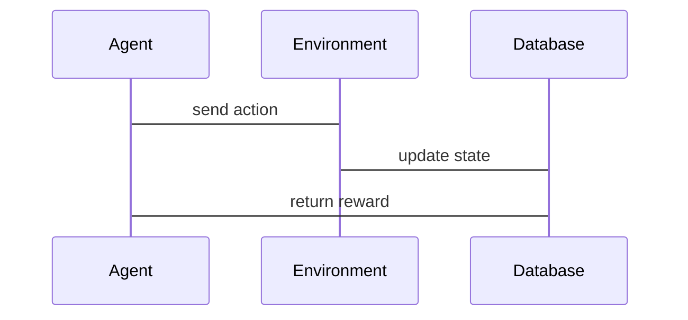

                 


# 企业AI Agent的强化学习在复杂决策场景中的实践

> **关键词**：企业AI Agent，强化学习，复杂决策，Deep Q-Networks，策略梯度，实践应用  
> 
> **摘要**：本文深入探讨了强化学习在企业AI Agent复杂决策场景中的应用，从理论基础到实践案例，详细讲解了强化学习算法（如Q-learning和DQN）的数学模型、系统架构设计以及实际应用案例。通过分析复杂决策场景的系统架构和算法实现，本文为读者提供了从理论到实践的全面指导。

---

# 第一部分: 企业AI Agent的强化学习基础

## 第1章: AI Agent与强化学习概述

### 1.1 AI Agent的基本概念

#### 1.1.1 AI Agent的定义与特点
AI Agent（人工智能代理）是指能够感知环境、自主决策并采取行动的智能体。其特点包括自主性、反应性、目标导向和社会性。

#### 1.1.2 强化学习的基本概念
强化学习是一种机器学习范式，通过智能体与环境的交互，学习最优策略以最大化累积奖励。核心要素包括状态、动作、奖励和策略。

#### 1.1.3 企业AI Agent的应用场景
企业AI Agent广泛应用于资源优化、风险控制、客户交互等领域，如供应链管理、智能客服、投资决策等。

---

## 第2章: 强化学习的数学模型与算法

### 2.1 Q-learning算法的数学模型

#### 2.1.1 Q值的更新公式
Q-learning的核心是通过更新Q值表来学习最优策略。更新公式为：
$$ Q(s, a) \leftarrow Q(s, a) + \alpha \left[r + \gamma \max Q(s', a') - Q(s, a)\right] $$

#### 2.1.2 状态转移概率矩阵
状态转移概率矩阵描述了从当前状态s到下一状态s'的概率，表示为：
$$ P(s' | s, a) $$

#### 2.1.3 奖励函数的设计
奖励函数定义了智能体在不同状态和动作下的奖励值，通常设计为：
$$ r(s, a, s') $$

### 2.2 Deep Q-Networks (DQN) 的实现

#### 2.2.1 神经网络的结构设计
DQN使用深度神经网络近似Q值函数，通常包括输入层、隐藏层和输出层。

#### 2.2.2 经验回放机制
经验回放通过存储和随机采样历史经验来提高训练效率，减少相关样本的问题。

#### 2.2.3 策略评估与优化
DQN通过分离策略评估网络和策略优化网络，实现了稳定的训练过程。

---

## 第3章: 强化学习在企业决策中的应用

### 3.1 复杂决策场景的定义

#### 3.1.1 问题背景与描述
复杂决策场景涉及多目标、多约束和不确定性，如供应链中的库存优化问题。

#### 3.1.2 决策的边界与外延
决策边界包括时间、成本和资源限制，外延则涉及长期影响和外部环境变化。

#### 3.1.3 核心要素与组成结构
复杂决策场景的核心要素包括状态、动作、奖励和策略，通常通过ER图描述实体关系。

---

## 第4章: 系统分析与架构设计

### 4.1 问题场景介绍

#### 4.1.1 企业复杂决策场景的描述
以供应链管理为例，描述需求预测、库存控制和供应商选择等复杂决策问题。

#### 4.1.2 项目目标与范围
项目目标是设计一个基于强化学习的AI Agent，优化企业的库存管理。

#### 4.1.3 需求分析与功能设计
通过用户需求分析，设计系统的功能模块，如数据采集、模型训练和决策执行。

### 4.2 系统架构设计

#### 4.2.1 领域模型类图设计
使用Mermaid绘制领域模型类图，展示状态、动作和奖励之间的关系。



#### 4.2.2 系统架构图设计
使用Mermaid绘制系统架构图，展示AI Agent与企业系统的交互。



#### 4.2.3 接口设计与交互流程
使用Mermaid绘制交互流程图，展示系统各组件之间的接口和数据流。



---

## 第5章: 强化学习算法的数学公式与实现

### 5.1 Q-learning算法的数学推导

#### 5.1.1 Q值更新的数学公式
Q值更新公式：
$$ Q(s, a) = Q(s, a) + \alpha \left[r + \gamma \max Q(s', a') - Q(s, a)\right] $$

#### 5.1.2 状态转移矩阵的计算
状态转移概率矩阵的计算：
$$ P(s' | s, a) = \text{概率从状态}s到状态$s'$，执行动作$a$。$$

#### 5.1.3 奖励函数的优化
奖励函数的优化通常通过实验和反馈进行调整，以更好地引导学习方向。

### 5.2 Deep Q-Networks的实现细节

#### 5.2.1 神经网络结构的定义
DQN的神经网络结构通常包括输入层、隐藏层和输出层，使用ReLU激活函数。

#### 5.2.2 经验回放机制的实现
经验回放通过存储$(s, a, r, s')$元组，随机采样进行训练，减少相关样本的影响。

#### 5.2.3 策略评估与优化算法
策略评估网络和策略优化网络分别更新，确保训练稳定性。

---

## 第6章: 项目实战与案例分析

### 6.1 环境搭建与数据准备

#### 6.1.1 开发环境的安装与配置
安装Python、TensorFlow和OpenAI Gym等工具，配置开发环境。

#### 6.1.2 数据集的获取与预处理
从企业系统中获取历史数据，进行清洗和特征工程。

#### 6.1.3 算法实现的代码框架
编写强化学习算法的框架，包括环境接口、智能体类和训练循环。

### 6.2 核心算法的实现与解读

#### 6.2.1 Q-learning算法的实现
编写Q-learning算法的Python代码，实现状态、动作和奖励的处理。

#### 6.2.2 DQN算法的实现
实现DQN算法，包括经验回放和神经网络训练部分。

#### 6.2.3 算法效果的评估与分析
通过实验评估算法性能，分析收敛速度和决策准确性。

### 6.3 实际案例分析

#### 6.3.1 案例背景与目标
以智能客服调度为例，目标是优化客服资源分配，提高客户满意度。

#### 6.3.2 算法实现与分析
实现基于DQN的智能客服调度系统，分析算法在不同负载下的表现。

---

## 第7章: 总结与展望

### 7.1 总结
本文详细介绍了强化学习在企业AI Agent中的应用，从理论到实践，展示了如何在复杂决策场景中应用强化学习算法。

### 7.2 未来展望
未来研究方向包括多智能体协作、强化学习与知识图谱的结合，以及更高效的算法设计。

### 7.3 最佳实践 tips

#### 7.3.1 系统设计 tips
确保系统架构清晰，模块化设计便于扩展和维护。

#### 7.3.2 算法实现 tips
选择合适的算法框架，优化超参数，确保算法高效收敛。

#### 7.3.3 项目管理 tips
制定合理的项目计划，注重团队协作和风险管理。

---

## 附录

### A. 代码实现

#### A.1 Q-learning算法的Python代码
```python
import numpy as np

class QLearning:
    def __init__(self, state_size, action_size, alpha=0.1, gamma=0.99):
        self.state_size = state_size
        self.action_size = action_size
        self.Q = np.zeros((state_size, action_size))
        self.alpha = alpha
        self.gamma = gamma

    def get_action(self, state):
        return np.argmax(self.Q[state, :])

    def update(self, state, action, reward, next_state):
        self.Q[state, action] += self.alpha * (reward + self.gamma * np.max(self.Q[next_state, :]) - self.Q[state, action])
```

#### A.2 DQN算法的Python代码
```python
import tensorflow as tf
from tensorflow.keras import layers

class DQN:
    def __init__(self, state_size, action_size, learning_rate=0.001):
        self.state_size = state_size
        self.action_size = action_size
        self.model = self.build_model()
        self.model.compile(optimizer=tf.keras.optimizers.Adam(learning_rate), loss='mse')

    def build_model(self):
        model = tf.keras.Sequential()
        model.add(layers.Dense(32, activation='relu', input_dim=self.state_size))
        model.add(layers.Dense(32, activation='relu'))
        model.add(layers.Dense(self.action_size, activation='linear'))
        return model

    def get_action(self, state, epsilon=0.1):
        if np.random.random() < epsilon:
            return np.random.randint(self.action_size)
        return np.argmax(self.model.predict(state.reshape(1, -1))[0])
```

### B. 工具与库
- Python 3.8+
- TensorFlow 2.5+
- OpenAI Gym
- Mermaid-diagram

---

通过本文的详细讲解，读者可以系统地了解强化学习在企业AI Agent中的应用，并能够将相关技术应用到实际的复杂决策场景中。

