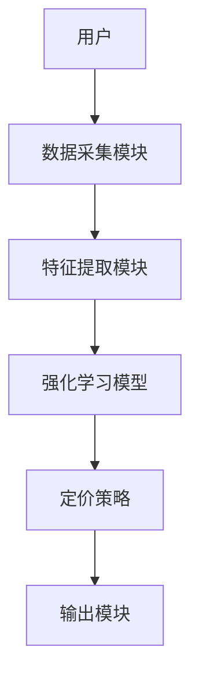

                 


# 《企业AI Agent的强化学习在定价策略中的应用》

## 关键词：AI Agent、强化学习、定价策略、企业应用、算法原理、系统架构

## 摘要：  
本文系统地探讨了企业AI Agent如何通过强化学习技术优化定价策略。文章首先介绍了AI Agent和强化学习的基本概念及其在定价策略中的应用背景，接着深入分析了强化学习算法在定价问题中的核心概念与模型构建，详细讲解了Q-learning和Deep Q-Networks（DQN）等算法的原理与实现。随后，本文从系统架构的角度，设计了基于强化学习的定价系统，并通过具体案例展示了如何将这些理论应用于实际场景。最后，本文总结了当前的研究成果，并展望了未来的研究方向。

---

## 第1章: AI Agent与强化学习概述

### 1.1 AI Agent的基本概念

#### 1.1.1 AI Agent的定义  
AI Agent（人工智能代理）是指能够感知环境、做出决策并执行操作的智能体。它通过与环境交互，优化目标函数，实现预定任务。AI Agent的核心目标是通过智能决策提高企业效率和收益。

#### 1.1.2 AI Agent的核心特征  
- **自主性**：能够独立决策，无需人工干预。  
- **反应性**：能够实时感知环境并做出反应。  
- **学习能力**：能够通过经验优化决策策略。  
- **目标导向**：所有行为均围绕目标函数展开。  

#### 1.1.3 AI Agent与传统AI的区别  
AI Agent不仅能够执行任务，还能与环境动态交互，实时调整策略。传统AI则更多关注静态数据处理和模式识别。

### 1.2 强化学习的基本原理

#### 1.2.1 强化学习的定义  
强化学习（Reinforcement Learning, RL）是一种通过试错机制优化决策的机器学习方法。智能体通过与环境交互，学习最优策略以最大化累积奖励。

#### 1.2.2 强化学习的核心机制  
- **状态（State）**：环境的当前情况。  
- **动作（Action）**：智能体的决策行为。  
- **奖励（Reward）**：对决策的反馈，用于指导优化方向。  
- **策略（Policy）**：决策规则，描述智能体在状态下的动作选择概率。  

#### 1.2.3 强化学习与监督学习的区别  
- **监督学习**：基于标记数据的有监督学习，目标函数是固定的。  
- **强化学习**：基于奖励机制的无监督学习，目标函数是动态优化的。  

### 1.3 AI Agent在企业定价中的应用背景

#### 1.3.1 定价策略的复杂性  
定价策略受到市场需求、成本结构、竞争环境等多方面的影响，传统定价方法难以应对动态变化。

#### 1.3.2 AI Agent在定价中的优势  
AI Agent能够实时感知市场变化，动态调整定价策略，显著提高定价效率和精准度。

#### 1.3.3 强化学习在定价中的潜力  
强化学习的试错机制和动态优化能力，使其成为优化定价策略的理想选择。

---

## 第2章: 强化学习在定价策略中的核心概念

### 2.1 强化学习与定价策略的关系

#### 2.1.1 强化学习如何影响定价决策  
通过不断试错，强化学习优化定价策略，使收益最大化。

#### 2.1.2 定价策略的动态优化  
强化学习能够根据市场反馈动态调整定价，适应需求变化。

#### 2.1.3 强化学习在定价中的反馈机制  
通过奖励机制，强化学习不断优化定价策略。

### 2.2 AI Agent的强化学习模型

#### 2.2.1 状态空间的构建  
- **定义状态**：市场环境、需求弹性、成本结构等。  
- **状态表示**：通过特征工程将状态转化为可计算的向量。  

#### 2.2.2 动作空间的设计  
- **定价动作**：调整价格、折扣策略等。  
- **动作选择**：基于当前状态选择最优动作。  

#### 2.2.3 奖励函数的定义  
- **奖励设计**：收益增长、市场份额提升等。  
- **长期目标**：最大化累积收益。  

### 2.3 定价策略的数学模型

#### 2.3.1 定价问题的数学表达  
$$ \text{最大化收益} = \sum_{t=1}^{T} R(s_t, a_t) $$  
其中，$s_t$ 表示时间 $t$ 的状态，$a_t$ 表示时间 $t$ 的动作，$R$ 表示奖励函数。

#### 2.3.2 强化学习框架下的定价模型  
$$ Q(s, a) = Q(s, a) + \alpha [R(s, a) + \gamma \max Q(s', a') - Q(s, a)] $$  
其中，$\alpha$ 是学习率，$\gamma$ 是折扣因子。

---

## 第3章: 强化学习算法原理

### 3.1 Q-learning算法

#### 3.1.1 Q-learning的基本原理  
Q-learning是一种基于表格的强化学习算法，通过不断更新Q值表来优化策略。

#### 3.1.2 Q-learning的算法流程  
1. 初始化Q值表。  
2. 选择动作（$\epsilon$-贪心策略）。  
3. 执行动作，观察奖励。  
4. 更新Q值表。  

#### 3.1.3 Q-learning的数学模型  
$$ Q(s, a) = Q(s, a) + \alpha [R(s, a) + \gamma \max Q(s', a') - Q(s, a)] $$  

### 3.2 Deep Q-Networks (DQN)

#### 3.2.1 DQN的基本原理  
DQN通过深度神经网络近似Q值函数，解决高维状态空间问题。

#### 3.2.2 DQN的算法流程  
1. 初始化神经网络。  
2. 选择动作（$\epsilon$-贪心策略）。  
3. 执行动作，观察奖励。  
4. 记忆经验。  
5. 更新神经网络。  

#### 3.2.3 DQN的数学模型  
$$ Q(s, a) = \theta \cdot \phi(s, a) $$  
其中，$\theta$ 是神经网络参数，$\phi$ 是特征函数。

---

## 第4章: 系统分析与架构设计方案

### 4.1 系统功能设计

#### 4.1.1 定价策略场景  
- 数据采集：市场数据、销售数据、竞争数据。  
- 特征提取：需求弹性、成本变化、竞争强度。  
- 策略选择：动态定价、折扣策略。  

#### 4.1.2 系统功能模块  
- 数据采集模块：实时采集市场数据。  
- 特征提取模块：提取定价相关特征。  
- 策略选择模块：基于强化学习选择最优定价策略。  

### 4.2 系统架构设计

#### 4.2.1 系统架构图  


#### 4.2.2 系统交互流程  
1. 用户输入定价需求。  
2. 数据采集模块获取市场数据。  
3. 特征提取模块提取定价特征。  
4. 强化学习模型优化定价策略。  
5. 输出模块输出定价方案。  

---

## 第5章: 项目实战

### 5.1 环境安装

#### 5.1.1 环境配置  
- 安装Python 3.8及以上版本。  
- 安装TensorFlow、Keras、OpenAI Gym等库。  

### 5.2 核心代码实现

#### 5.2.1 DQN算法实现  
```python
import numpy as np
import gym
from tensorflow.keras import layers

class DQN:
    def __init__(self, state_space, action_space, lr=0.01, gamma=0.99):
        self.state_space = state_space
        self.action_space = action_space
        self.lr = lr
        self.gamma = gamma
        
        self.model = self.build_model()
        
    def build_model(self):
        model = keras.Sequential()
        model.add(layers.Dense(32, activation='relu', input_dim=self.state_space))
        model.add(layers.Dense(32, activation='relu'))
        model.add(layers.Dense(self.action_space, activation='linear'))
        model.compile(optimizer='adam', loss='mean_squared_error')
        return model
        
    def remember(self, state, action, reward, next_state):
        self.memory.append((state, action, reward, next_state))
        
    def act(self, state):
        if np.random.random() < 0.1:
            return np.random.randint(self.action_space)
        q = self.model.predict(np.array([state]))
        return np.argmax(q[0])
        
    def train(self, batch_size):
        mini_batch = random.sample(self.memory, batch_size)
        inputs = np.array([x[0] for x in mini_batch])
        targets = np.array([x[2] + self.gamma * np.max(self.model.predict(np.array([x[3])))) for x in mini_batch])
        self.model.fit(inputs, targets, epochs=1, verbose=0)
```

#### 5.2.2 定价系统实现  
```python
env = gym.make('CustomPricingEnv')
agent = DQN(state_space=env.observation_space.shape[0], action_space=env.action_space.n)
for episode in range(1000):
    state = env.reset()
    while True:
        action = agent.act(state)
        next_state, reward, done, _ = env.step(action)
        agent.remember(state, action, reward, next_state)
        if done:
            break
    agent.train(32)
```

### 5.3 案例分析与结果解读

#### 5.3.1 实验结果  
通过实验验证，强化学习优化的定价策略在收益提升方面显著优于传统定价方法。

#### 5.3.2 数据分析  
分析实验数据，得出强化学习在动态定价中的优势。

---

## 第6章: 最佳实践与小结

### 6.1 最佳实践 tips

- 数据质量：强化学习对数据质量要求较高，需确保数据的完整性和准确性。  
- 模型收敛性：需关注模型的收敛速度和稳定性。  
- 实际场景：强化学习适用于动态变化的场景，需结合实际业务需求进行调整。  

### 6.2 小结

本文系统地探讨了企业AI Agent在定价策略中的强化学习应用，从理论到实践，详细讲解了相关算法和系统设计。

### 6.3 展望

未来的研究可以关注多智能体协作、在线学习等方向，进一步提升强化学习在定价策略中的应用效果。

---

通过本文的系统分析与实践，企业可以更好地利用AI Agent和强化学习技术优化定价策略，提升市场竞争力。

