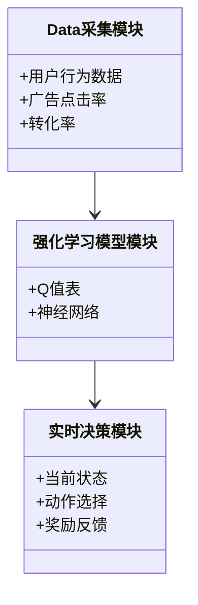
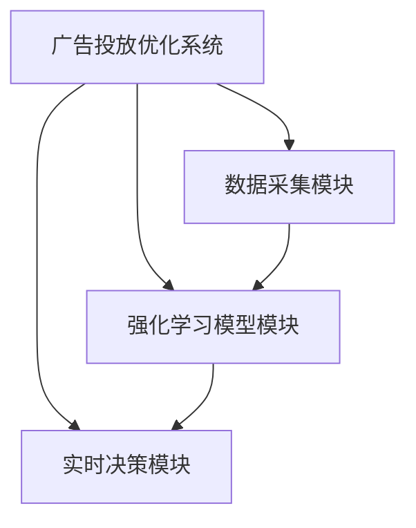
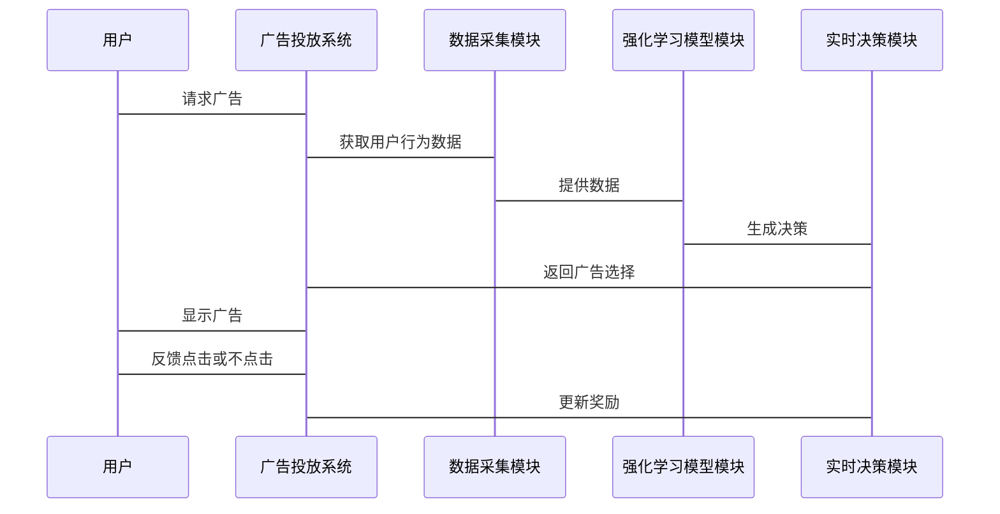

                 


# 企业AI Agent的强化学习在广告投放优化中的实时决策实践

## 关键词：企业AI Agent、强化学习、广告投放优化、实时决策、机器学习实战

## 摘要：  
本文将探讨如何利用企业AI Agent的强化学习技术实现广告投放优化中的实时决策。通过分析广告投放优化的核心问题，结合强化学习的基本原理和算法实现，构建高效的广告投放优化系统。文章从理论到实践，详细讲解如何设计和实现基于强化学习的广告投放优化系统，涵盖系统架构设计、算法实现、项目实战等内容，为读者提供全面的技术指导。

---

## 第一部分：企业AI Agent与强化学习概述

### 第1章：AI Agent的基本概念与强化学习原理

#### 1.1 AI Agent的核心特征
- **智能性**：能够感知环境并做出决策。
- **自主性**：无需外部干预，自主完成任务。
- **反应性**：能够实时响应环境变化。
- **学习能力**：通过数据和经验不断优化决策。

#### 1.2 强化学习的基本原理
- **状态（State）**：当前环境的描述，例如用户点击行为、广告点击率等。
- **动作（Action）**：AI Agent采取的行动，例如选择展示哪个广告。
- **奖励（Reward）**：对动作的反馈，通常以点击率或转化率来衡量。
- **策略（Policy）**：决定动作选择的规则，例如贪心策略或随机策略。

#### 1.3 AI Agent与强化学习的结合
- **目标**：通过强化学习优化AI Agent的决策能力。
- **应用场景**：广告投放优化中的实时决策，例如动态调整广告投放策略。

### 第2章：强化学习在广告投放优化中的应用

#### 2.1 广告投放优化的核心问题
- **实时决策**：如何在短时间内做出最优广告投放决策。
- **数据驱动**：利用用户行为数据和历史数据优化广告策略。
- **动态调整**：根据实时反馈动态优化广告投放策略。

#### 2.2 强化学习与广告投放优化的结合
- **状态空间**：用户行为、广告点击率、用户反馈等。
- **动作空间**：选择展示的广告、调整广告预算、优化广告文案。
- **奖励机制**：点击率、转化率、收益最大化。

---

## 第二部分：强化学习算法的实现与优化

### 第3章：Q-learning算法的实现

#### 3.1 Q-learning算法的基本原理
- **Q值更新公式**：
  $$ Q(s, a) = Q(s, a) + \alpha (r + \gamma \max Q(s', a') - Q(s, a)) $$
- **状态转移概率**：
  $$ P(s' | s, a) $$
- **奖励函数**：
  $$ R(s, a) $$

#### 3.2 Q-learning算法的实现步骤
1. 初始化Q值表。
2. 与环境交互，获取状态、动作和奖励。
3. 更新Q值表。
4. 重复上述步骤，直到收敛。

### 第4章：DQN算法的改进

#### 4.1 DQN算法的基本原理
- **网络结构**：双层神经网络，分别用于价值评估和目标网络。
- **经验回放机制**：通过存储历史经验，减少策略的贪婪性。

#### 4.2 DQN算法的优化
- **目标网络**：通过逐步更新目标网络，稳定Q值的计算。
- **经验回放**：通过随机抽取历史经验，减少数据偏差。

---

## 第三部分：系统分析与架构设计

### 第5章：广告投放优化系统的功能设计

#### 5.1 系统功能模块划分
- **数据采集模块**：收集用户行为数据、广告点击率、转化率等。
- **强化学习模型模块**：实现Q-learning或DQN算法，优化广告投放策略。
- **实时决策模块**：根据当前状态，实时调整广告投放策略。

#### 5.2 系统功能设计的类图


### 第6章：系统架构设计

#### 6.1 系统架构设计


#### 6.2 系统交互设计


---

## 第四部分：项目实战

### 第7章：环境安装与代码实现

#### 7.1 环境安装
- **Python版本**：建议使用Python 3.8及以上。
- **依赖库安装**：
  ```bash
  pip install numpy matplotlib tensorflow
  ```

#### 7.2 核心代码实现
```python
import numpy as np
import random

class AI-Agent:
    def __init__(self, state_space, action_space):
        self.state_space = state_space
        self.action_space = action_space
        self.Q = np.zeros((state_space, action_space))

    def take_action(self, state):
        if random.random() < 0.9:  # 探索与利用
            return np.argmax(self.Q[state, :])
        else:
            return random.randint(0, self.action_space - 1)

    def update_Q(self, state, action, reward, next_state):
        alpha = 0.1
        gamma = 0.9
        self.Q[state, action] += alpha * (reward + gamma * np.max(self.Q[next_state, :]) - self.Q[state, action])

# 示例环境
state_space = 10
action_space = 5
agent = AI-Agent(state_space, action_space)
```

### 第8章：案例分析与优化

#### 8.1 案例分析
- **数据输入**：用户点击率、广告点击率、转化率等。
- **模型训练**：通过Q-learning算法优化广告投放策略。
- **效果评估**：通过A/B测试比较传统策略与强化学习策略的效果。

#### 8.2 优化建议
- **动态调整学习率**：根据训练进度自动调整alpha值。
- **引入多目标优化**：平衡点击率和转化率之间的关系。
- **实时反馈机制**：根据用户实时行为动态调整广告投放策略。

---

## 第五部分：最佳实践与总结

### 第9章：小结与注意事项

#### 9.1 小结
- 强化学习在广告投放优化中的实时决策实践是一种高效的方法。
- 通过构建合理的系统架构和优化算法，可以显著提升广告投放效果。

#### 9.2 注意事项
- 数据质量对模型性能影响重大，需确保数据的准确性和完整性。
- 模型的实时性要求较高，需优化算法和系统架构以减少延迟。

### 第10章：拓展阅读与参考文献

#### 10.1 拓展阅读
- 《强化学习入门：基于Python的数学基础与算法实战》
- 《广告投放优化：从传统方法到机器学习》

#### 10.2 参考文献
- Mnih, V., et al. "Playing atari with deep reinforcement learning." arXiv preprint arXiv:1312.5602 (2013).

---

## 总结
本文详细讲解了企业AI Agent的强化学习在广告投放优化中的实时决策实践，从理论到实践，涵盖算法实现、系统设计和项目实战。通过本文的学习，读者可以掌握如何利用强化学习优化广告投放策略，提升广告投放效果。

