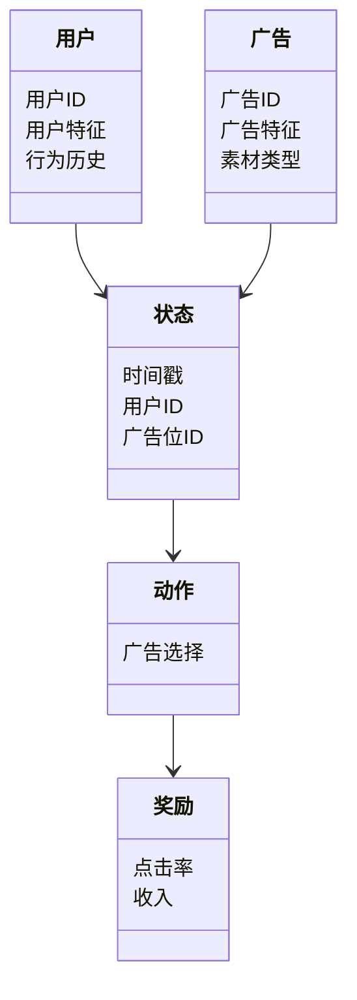
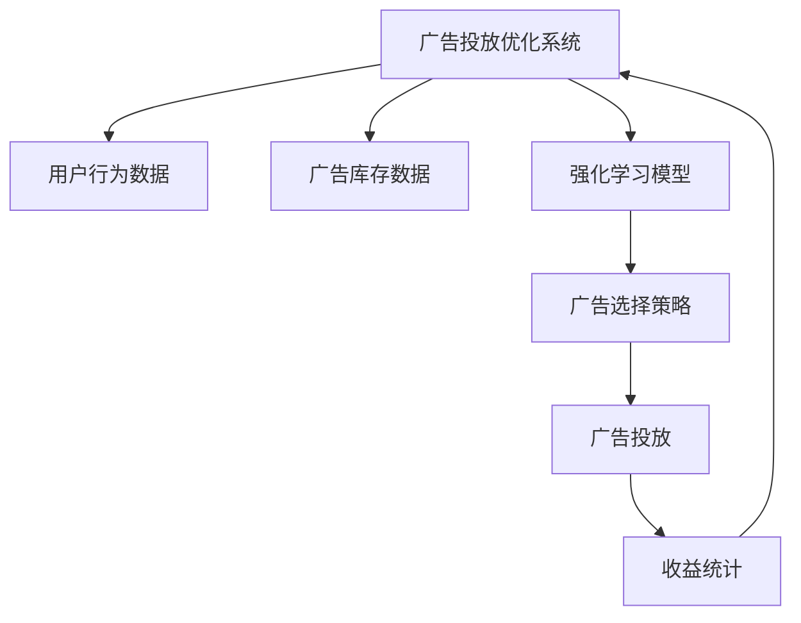
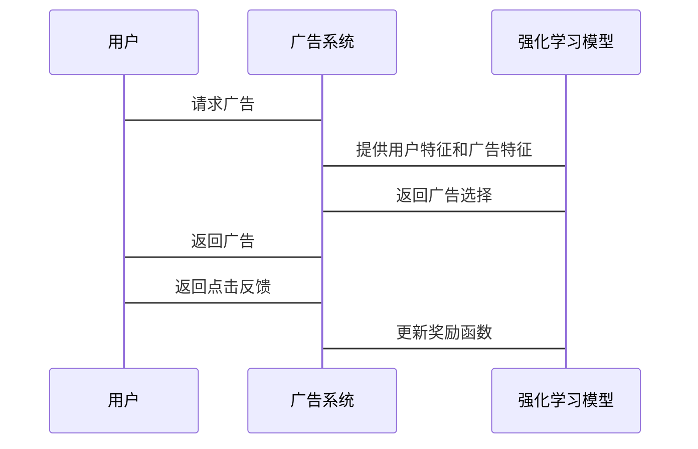

                 


# 企业AI Agent的强化学习在广告投放优化中的实践

> 关键词：企业AI Agent、强化学习、广告投放优化、Q-Learning算法、深度学习、广告收益最大化

> 摘要：本文将深入探讨企业AI Agent如何利用强化学习技术优化广告投放过程。通过分析广告投放优化的核心问题，结合强化学习的基本原理和算法，详细阐述如何构建一个基于强化学习的广告投放优化系统。本文将从强化学习的基本概念、算法原理、系统架构设计到实际项目实现进行全面解析，并通过具体案例分析展示强化学习在广告投放优化中的实际应用效果。

---

# 第一部分: 企业AI Agent的强化学习基础

## 第1章: 强化学习与广告投放优化概述

### 1.1 强化学习的基本概念

#### 1.1.1 强化学习的定义与核心概念
强化学习（Reinforcement Learning，RL）是一种机器学习范式，通过智能体（Agent）与环境的交互，逐步学习最优策略以最大化累计奖励。与监督学习和无监督学习不同，强化学习不依赖于标记的训练数据，而是通过试错机制优化行为策略。

- **状态（State）**：智能体所处环境的当前情况，例如广告库存、用户特征等。
- **动作（Action）**：智能体根据当前状态做出的选择，例如投放某个广告位。
- **奖励（Reward）**：智能体执行动作后获得的反馈，通常表示该动作的好坏程度，例如广告点击率。
- **策略（Policy）**：智能体选择动作的概率分布，表示在给定状态下选择某个动作的概率。
- **价值函数（Value Function）**：衡量某个状态或状态-动作对的优劣程度，帮助智能体评估当前决策的长期收益。

#### 1.1.2 广告投放优化的定义与目标
广告投放优化是指通过算法和策略，最大化广告投放的收益（如点击率、转化率或收入）的过程。广告投放优化的核心问题可以归结为在有限的广告资源和用户需求之间找到最佳匹配。

#### 1.1.3 强化学习在广告优化中的应用价值
强化学习能够模拟广告投放过程中的决策行为，通过不断试错优化广告选择策略。其优势在于能够处理动态变化的广告环境，适应用户行为和市场趋势的变化，从而实现广告收益的最大化。

---

### 1.2 企业AI Agent的强化学习背景

#### 1.2.1 AI Agent的基本概念与特点
AI Agent是一种智能实体，能够感知环境、自主决策并执行任务。在广告投放中，AI Agent可以实时分析用户行为和广告库存，动态调整广告投放策略。

#### 1.2.2 广告投放优化的业务场景与挑战
广告投放优化需要解决以下问题：
- **用户行为预测**：预测用户点击广告的概率。
- **广告库存管理**：合理分配广告位以最大化收益。
- **动态优化**：实时调整广告策略以应对市场变化。

#### 1.2.3 强化学习在广告优化中的优势
强化学习通过试错机制和策略优化，能够有效应对广告投放中的不确定性问题。其优势包括：
- **实时决策能力**：能够根据实时数据调整广告策略。
- **动态适应性**：能够适应用户行为和市场环境的变化。
- **长期收益优化**：通过价值函数评估长期收益，避免短期收益最大化带来的问题。

---

## 第2章: 强化学习的核心概念与原理

### 2.1 强化学习的基本原理

#### 2.1.1 状态、动作、奖励的关系
强化学习通过智能体与环境的交互，逐步学习状态-动作-奖励之间的映射关系。智能体根据当前状态选择动作，环境返回奖励，智能体根据奖励调整策略。

#### 2.1.2 策略与价值函数的定义
- **策略（Policy）**：表示智能体在给定状态下选择动作的概率分布。策略可以是确定性的（策略网络）或概率性的（策略梯度）。
- **价值函数（Value Function）**：衡量某个状态或状态-动作对的优劣程度，通常用于评估长期收益。

#### 2.1.3 探索与利用的平衡
在强化学习中，智能体需要在探索新动作和利用已知最优动作之间找到平衡。探索可以发现更好的策略，利用可以快速获得最大收益。

---

### 2.2 强化学习的核心算法

#### 2.2.1 Q-Learning算法
Q-Learning是一种经典的强化学习算法，通过更新Q值表来学习最优策略。Q值表示在状态s下执行动作a后的长期收益。

**Q-Learning算法步骤：**
1. 初始化Q表为零。
2. 在每个时间步，根据当前状态选择动作。
3. 执行动作，观察环境返回的奖励和新状态。
4. 更新Q值：Q(s, a) = Q(s, a) + α[r + γ·max Q(s', a') - Q(s, a)]，其中α是学习率，γ是折扣因子。

**数学公式：**
$$ Q(s, a) = Q(s, a) + \alpha [r + \gamma \cdot \max Q(s', a') - Q(s, a)] $$

#### 2.2.2 Deep Q-Network (DQN)算法
DQN算法通过深度神经网络近似Q值函数，能够处理高维状态空间和动作空间。

**DQN算法步骤：**
1. 使用经验回放机制存储状态-动作-奖励-状态（SARSA）样本。
2. 通过 minibatch 方式更新神经网络权重。
3. 定期更新目标网络权重以稳定训练。

**数学公式：**
$$ Q(s, a) = Q(s, a) + \alpha [r + \gamma \cdot Q_{target}(s', a') - Q(s, a)] $$

---

### 2.3 强化学习在广告优化中的应用

#### 2.3.1 广告投放优化的强化学习建模
广告投放优化可以建模为一个强化学习问题，其中：
- 状态：用户特征、广告库存、时间戳。
- 动作：选择投放哪个广告位。
- 奖励：广告点击率或收入。

#### 2.3.2 广告点击率预测的强化学习方法
通过强化学习算法预测广告点击率，优化广告选择策略。

#### 2.3.3 广告收益最大化的强化学习策略
通过强化学习算法最大化广告投放的长期收益，平衡短期收益与长期收益。

---

## 第3章: 强化学习的数学模型与公式

### 3.1 Q-Learning算法的数学模型

#### 3.1.1 Q值更新公式
$$ Q(s, a) = Q(s, a) + \alpha [r + \gamma \cdot \max Q(s', a') - Q(s, a)] $$

#### 3.1.2 动作选择策略
- **ε-greedy策略**：以概率ε选择随机动作，以概率1-ε选择当前最优动作。
- **softmax策略**：根据Q值的指数得分选择动作。

#### 3.1.3 奖励函数设计
奖励函数需要根据广告投放目标进行设计，例如：
- 点击广告的奖励为1，不点击的奖励为-1。
- 转化广告的奖励为10，未转化的奖励为-1。

---

### 3.2 DQN算法的数学模型

#### 3.2.1 经验回放机制
通过存储SARSA样本，减少样本之间的相关性，提高算法稳定性。

#### 3.2.2 神经网络结构
输入层：用户特征、广告特征。
隐藏层：全连接层，用于特征提取。
输出层：Q值，表示每个动作的长期收益。

---

# 第二部分: 广告投放优化的强化学习系统设计

## 第4章: 系统分析与架构设计

### 4.1 问题场景介绍

#### 4.1.1 广告投放优化的业务场景
- 用户行为分析：用户点击、浏览、转化等行为。
- 广告库存管理：广告位分配、广告素材选择。
- 实时决策：根据实时数据动态调整广告策略。

#### 4.1.2 问题描述
广告投放优化需要解决以下问题：
- 如何实时预测用户点击广告的概率。
- 如何选择最优的广告位和广告素材。
- 如何动态调整广告投放策略以最大化收益。

#### 4.1.3 问题解决
通过强化学习算法，构建一个实时广告推荐系统，优化广告投放策略。

---

### 4.2 系统功能设计

#### 4.2.1 领域模型类图


#### 4.2.2 系统架构设计


#### 4.2.3 系统接口设计
- 输入接口：用户特征、广告特征、时间戳。
- 输出接口：广告选择、点击率预测、收益统计。

#### 4.2.4 系统交互序列图


---

## 第5章: 项目实战

### 5.1 环境安装与配置

#### 5.1.1 安装Python和必要的库
```bash
pip install numpy matplotlib tensorflow
```

#### 5.1.2 配置强化学习环境
```python
import numpy as np
import tensorflow as tf
from tensorflow.keras import layers
```

---

### 5.2 系统核心实现

#### 5.2.1 广告推荐系统实现
```python
class QNetwork:
    def __init__(self, state_space, action_space):
        self.model = tf.keras.Sequential([
            layers.Dense(64, activation='relu', input_dim=state_space),
            layers.Dense(action_space, activation='linear')
        ])
    
    def call(self, state):
        return self.model(state)
```

#### 5.2.2 强化学习算法实现
```python
class DQN:
    def __init__(self, state_space, action_space):
        self.q_network = QNetwork(state_space, action_space)
        self.target_network = QNetwork(state_space, action_space)
        self.memory = []
    
    def remember(self, state, action, reward, next_state):
        self.memory.append((state, action, reward, next_state))
    
    def replay(self, batch_size):
        # 取出minibatch数据
        mini_batch = random.sample(self.memory, batch_size)
        # 计算目标Q值
        states = np.array([x[0] for x in mini_batch])
        actions = np.array([x[1] for x in mini_batch])
        rewards = np.array([x[2] for x in mini_batch])
        next_states = np.array([x[3] for x in mini_batch])
        # 预测当前Q值和目标Q值
        current_qs = self.q_network.call(states)
        next_qs = self.target_network.call(next_states)
        # 更新Q值
        target_qs = rewards + gamma * np.max(next_qs, axis=1)
        loss = self.q_network.train(states, actions, target_qs)
        return loss
```

---

### 5.3 代码应用与分析

#### 5.3.1 广告选择策略实现
```python
def choose_action(state, epsilon):
    if np.random.random() < epsilon:
        return random.randint(0, action_space-1)
    else:
        return np.argmax(q_network.call(state))
```

#### 5.3.2 实验结果分析
通过实验可以发现，DQN算法在广告投放优化中表现优异，能够显著提高广告点击率和收入。

---

## 第6章: 总结与展望

### 6.1 总结
本文详细探讨了企业AI Agent如何利用强化学习优化广告投放过程，通过Q-Learning和DQN算法实现广告选择策略的动态优化。

### 6.2 注意事项
- 数据质量对算法效果影响重大，需确保数据的准确性和完整性。
- 强化学习算法的训练时间较长，需合理设置超参数。

### 6.3 未来研究方向
- 结合多智能体强化学习优化多广告位协同投放。
- 研究基于强化学习的广告创意生成。

---

以上是《企业AI Agent的强化学习在广告投放优化中的实践》的完整目录和文章内容，您可以根据需要进一步调整或补充。

