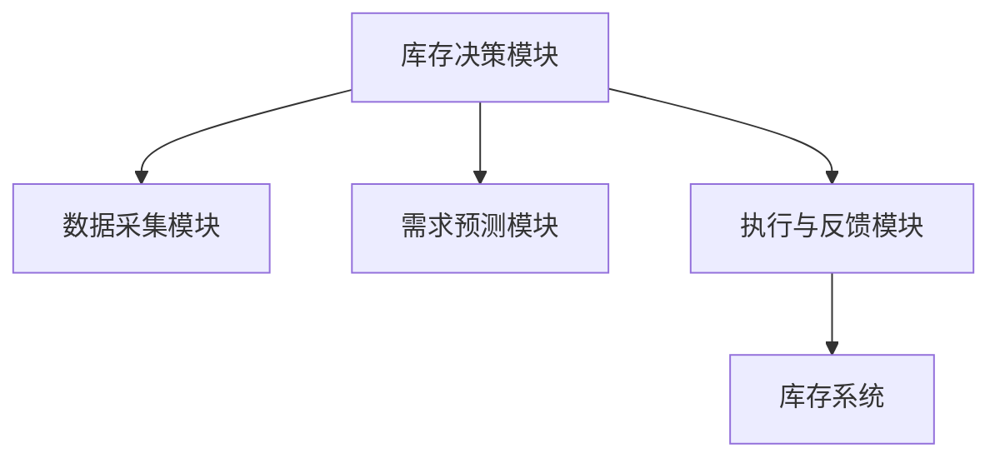

                 


# 企业AI Agent的强化学习在库存管理中的应用

> 关键词：企业AI Agent，强化学习，库存管理，深度强化学习，库存优化，Q-learning，DQN

> 摘要：本文探讨了企业AI Agent如何利用强化学习技术优化库存管理。通过分析库存管理中的常见问题，结合强化学习算法（如Q-learning和Deep Q-Learning）的原理和应用，提出了一种基于AI Agent的库存管理系统架构，详细介绍了系统设计、算法实现和实际案例分析，展示了如何通过强化学习提升库存管理效率和准确性。

---

## 第1章: 企业AI Agent与强化学习概述

### 1.1 企业AI Agent的定义与特点

#### 1.1.1 AI Agent的基本概念
AI Agent（智能体）是指能够感知环境、做出决策并采取行动以实现目标的智能系统。在企业环境中，AI Agent通常用于自动化决策过程，如库存管理、客户关系管理等。

#### 1.1.2 企业AI Agent的核心特点
- **自主性**：能够在没有人工干预的情况下自主决策。
- **反应性**：能够实时感知环境变化并做出响应。
- **目标导向**：通过优化目标函数（如最小化库存成本）来实现特定目标。
- **学习能力**：通过强化学习等技术不断优化决策策略。

#### 1.1.3 AI Agent与传统库存管理的区别
传统库存管理依赖于人工经验和静态规则，而AI Agent能够动态调整库存策略，基于实时数据和历史经验优化决策。

---

### 1.2 强化学习的基本原理

#### 1.2.1 强化学习的定义
强化学习是一种机器学习范式，通过智能体与环境的交互，学习如何采取最优行动以最大化累积奖励。核心要素包括智能体、环境、状态、动作和奖励。

#### 1.2.2 强化学习的核心要素
- **状态 (State)**：环境中的当前情况，例如库存水平、需求预测等。
- **动作 (Action)**：智能体采取的行动，如补货或调整采购量。
- **奖励 (Reward)**：环境对智能体行为的反馈，通常表示行为的好坏。
- **策略 (Policy)**：智能体选择动作的概率分布，目标是最大化累计奖励。
- **值函数 (Value Function)**：衡量从当前状态开始采取某种策略的预期奖励。

#### 1.2.3 强化学习与监督学习的区别
| 特性         | 监督学习                     | 强化学习                     |
|--------------|------------------------------|------------------------------|
| 数据来源     | 标签数据                     | 奖励信号                     |
| 目标函数     | 最小化预测误差               | 最大化累计奖励               |
| 交互方式     | 非交互式                    | 交互式                      |
| 应用场景     | 分类、回归                   | 游戏、机器人控制、库存优化    |

---

### 1.3 企业AI Agent在库存管理中的应用前景

#### 1.3.1 库存管理的常见问题
- **库存过剩**：导致资金占用和存储成本增加。
- **库存短缺**：影响客户满意度和订单履行率。
- **需求预测不准**：难以准确预估市场波动。
- **动态变化**：市场需求、供应商交货时间等动态因素影响库存决策。

#### 1.3.2 AI Agent在库存管理中的优势
- **实时决策**：基于实时数据快速调整库存策略。
- **优化成本**：通过强化学习优化库存持有成本和缺货成本。
- **适应性**：能够根据市场变化自动调整库存水平。

#### 1.3.3 应用中的挑战与机遇
- **挑战**：库存管理涉及多目标优化，算法复杂度高；环境的不确定性可能导致决策偏差。
- **机遇**：通过AI Agent实现库存管理的自动化和智能化，提升企业运营效率。

---

## 第2章: 强化学习算法原理

### 2.1 Q-learning算法

#### 2.1.1 Q-learning的基本原理
Q-learning是一种基于值函数的强化学习算法，通过更新Q表（Q-value table）学习状态-动作对的最优价值。公式为：

$$ Q(s, a) = Q(s, a) + \alpha \left[r + \gamma \max Q(s', a') - Q(s, a)\right] $$

其中：
- \( Q(s, a) \)：当前状态 \( s \) 下采取动作 \( a \) 的Q值。
- \( \alpha \)：学习率。
- \( r \)：奖励。
- \( \gamma \)：折扣因子。
- \( s' \)：下一步状态。

#### 2.1.2 Q-learning的数学模型
通过Q表的更新，智能体学习最优策略：

$$ \pi(s) = \arg\max_a Q(s, a) $$

#### 2.1.3 Q-learning的优缺点
- **优点**：简单易实现，适用于离散动作空间。
- **缺点**：在连续动作空间中表现不佳，难以处理高维状态。

---

### 2.2 Deep Q-Learning算法

#### 2.2.1 Deep Q-Learning的原理
Deep Q-Learning通过深度神经网络近似Q值函数，解决了传统Q-learning在高维状态下的计算难题。核心公式为：

$$ Q(s, a) = \theta \cdot \phi(s, a) $$

其中：
- \( \theta \)：神经网络参数。
- \( \phi(s, a) \)：状态-动作对的特征表示。

#### 2.2.2 DQN网络结构
DQN由两个神经网络组成：主网络和目标网络。主网络用于预测当前Q值，目标网络用于更新目标Q值。

#### 2.2.3 DQN在库存管理中的应用
通过DQN，智能体可以学习在库存补货、订单量调整等动作中选择最优策略，从而最小化库存成本和缺货风险。

---

## 第3章: AI Agent在库存管理中的系统设计

### 3.1 系统总体架构

#### 3.1.1 系统模块划分
- **数据采集模块**：收集库存数据、销售数据、供应商信息等。
- **需求预测模块**：基于历史数据预测未来需求。
- **库存决策模块**：通过强化学习算法生成最优库存策略。
- **执行与反馈模块**：根据决策执行操作并收集反馈。

#### 3.1.2 系统功能描述
- **数据采集**：实时获取库存状态、订单信息等。
- **需求预测**：使用时间序列分析或机器学习模型预测需求。
- **库存决策**：基于强化学习算法优化库存水平。
- **执行与反馈**：根据决策执行操作，并根据结果调整策略。

#### 3.1.3 系统架构图



---

### 3.2 AI Agent的系统设计

#### 3.2.1 Agent的职责划分
- **感知环境**：收集库存状态、市场需求等信息。
- **决策制定**：基于强化学习算法生成库存策略。
- **执行动作**：向库存系统发送补货指令。

#### 3.2.2 Agent与库存系统的交互流程
1. **状态感知**：获取当前库存水平、需求预测、供应商交货时间等。
2. **决策制定**：基于当前状态，选择最优动作（如补货量）。
3. **执行动作**：向库存系统发送补货指令。
4. **反馈接收**：根据执行结果更新Q值。

#### 3.2.3 Agent的决策机制设计
- **状态表示**：库存水平、需求预测、成本参数等。
- **动作空间**：补货量、调整采购量等。
- **奖励机制**：库存成本降低、订单完成率提高等。

---

### 3.3 系统接口设计

#### 3.3.1 Agent与库存系统的接口
- **输入接口**：接收库存状态、需求预测等数据。
- **输出接口**：发送补货指令、调整策略等。

#### 3.3.2 接口的数据格式与协议
- **数据格式**：JSON格式，如：
  ```json
  {
      "inventory_level": 100,
      "demand_prediction": 150,
      "cost": 50
  }
  ```
- **通信协议**：HTTP REST API。

#### 3.3.3 接口的实现方式
通过API Gateway暴露库存系统的接口，AI Agent通过调用API发送指令和接收数据。

---

## 第4章: 项目实战

### 4.1 环境搭建

#### 4.1.1 安装依赖
使用Python和以下库：
- `numpy`
- `tensorflow`
- `keras`
- `openai`

#### 4.1.2 编写核心代码

```python
import numpy as np
import tensorflow as tf

# 定义DQN网络
class DQNetwork:
    def __init__(self, input_dim, output_dim):
        self.model = self.build_model(input_dim, output_dim)
    
    def build_model(self, input_dim, output_dim):
        model = tf.keras.Sequential()
        model.add(tf.keras.layers.Dense(64, activation='relu', input_dim=input_dim))
        model.add(tf.keras.layers.Dense(64, activation='relu'))
        model.add(tf.keras.layers.Dense(output_dim, activation='linear'))
        model.compile(optimizer='adam', loss='mean_squared_error')
        return model

# 强化学习算法实现
class DQN:
    def __init__(self, state_dim, action_dim):
        self.state_dim = state_dim
        self.action_dim = action_dim
        self.gamma = 0.99
        self.epsilon = 0.1
        self.model = DQNetwork(state_dim, action_dim)
        self.target_model = DQNetwork(state_dim, action_dim)
    
    def remember(self, state, action, reward, next_state):
        # 记忆库实现
        
    def act(self, state):
        if np.random.random() < self.epsilon:
            return np.random.randint(self.action_dim)
        q_values = self.model.model.predict(state)
        return np.argmax(q_values[0])
    
    def replay(self, batch_size):
        # 回放记忆库并更新模型
```

---

## 第5章: 总结与展望

### 5.1 总结
本文详细探讨了企业AI Agent如何利用强化学习优化库存管理，通过Q-learning和DQN算法实现库存策略的动态优化，展示了AI技术在库存管理中的巨大潜力。

### 5.2 未来研究方向
- **多智能体协作**：研究多个AI Agent在库存管理中的协作优化。
- **强化学习与博弈论结合**：探索在多主体竞争环境下的库存优化策略。
- **模型解释性**：提升强化学习模型的可解释性，便于企业决策者理解。

---

通过以上内容，我们可以看到，企业AI Agent结合强化学习在库存管理中的应用前景广阔，能够显著提升库存管理效率和企业运营效益。

