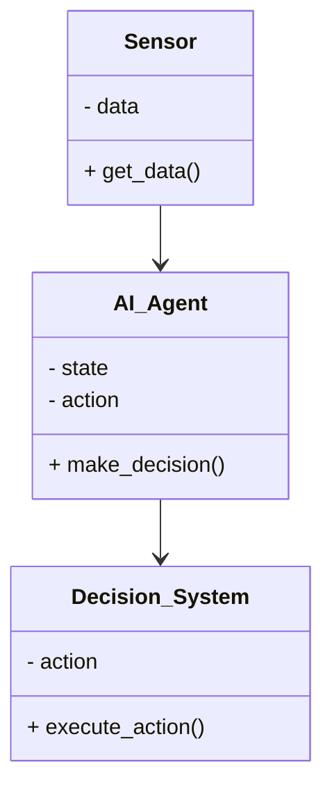

                 


# 《企业AI Agent的强化学习在智慧城市管理中的应用》

---

## 关键词：
- 企业AI Agent
- 强化学习
- 智慧城市管理
- 算法原理
- 系统架构
- 实战案例

---

## 摘要：
本文探讨了企业AI Agent在智慧城市管理中的应用，重点分析了强化学习在其中的关键作用。通过详细讲解强化学习的算法原理、系统架构设计以及实际案例，本文旨在为读者提供从理论到实践的全面指导。文章首先介绍了企业AI Agent和强化学习的基本概念，然后深入分析了强化学习的核心算法及其在智慧城市管理中的应用场景。通过系统架构设计和项目实战，进一步展示了如何将强化学习应用于实际问题中。最后，本文总结了当前研究的成果与未来的发展方向。

---

## 第一部分：企业AI Agent与强化学习概述

### 第1章：企业AI Agent的背景与概念

#### 1.1 AI Agent的基本概念
AI Agent（智能体）是指在计算机系统中能够感知环境并采取行动以实现目标的实体。企业AI Agent通常用于自动化决策和任务处理，能够显著提高企业效率。例如，在交通管理中，AI Agent可以实时调整信号灯以减少拥堵。

#### 1.2 强化学习的基本原理
强化学习是一种机器学习方法，通过智能体与环境的交互来优化决策策略。智能体通过执行动作获得奖励或惩罚，从而学习最优行为。例如，在游戏中，智能体通过不断尝试不同的动作来学习如何获胜。

#### 1.3 智慧城市管理中的AI Agent应用场景
智慧城市管理涉及交通、环境监测、公共安全等多个方面。AI Agent可以通过实时数据处理和决策优化，帮助城市更高效地运作。例如，在环境监测中，AI Agent可以优化传感器部署以提高监测效率。

#### 1.4 本章小结
本章介绍了企业AI Agent和强化学习的基本概念，并探讨了它们在智慧城市管理中的应用场景。

---

## 第二部分：强化学习算法与数学模型

### 第2章：强化学习的核心算法

#### 2.1 Q-Learning算法
Q-Learning是一种经典的强化学习算法，适用于离散状态和动作空间。其数学模型如下：
$$ Q(s, a) = Q(s, a) + \alpha (r + \gamma \max Q(s', a') - Q(s, a)) $$
其中，α是学习率，γ是折扣因子。

#### 2.2 Deep Q-Network (DQN)算法
DQN通过深度神经网络近似Q值函数，适用于高维状态空间。其网络结构包括输入层、隐藏层和输出层，用于处理复杂环境。

#### 2.3 其他强化学习算法简介
- 策略梯度方法：直接优化策略，适用于连续动作空间。
- 值函数方法：通过估计值函数来优化决策。

---

## 第三部分：系统架构设计

### 第3章：系统架构设计

#### 3.1 问题场景介绍
以智能交通管理为例，AI Agent需要实时调整信号灯以减少拥堵。

#### 3.2 系统功能设计
- 数据采集：传感器收集交通数据。
- AI Agent决策：基于数据生成优化策略。
- 系统执行：调整信号灯。

#### 3.3 领域模型类图


#### 3.4 系统架构图
```mermaid
client([用户请求])
    --> API Gateway([请求])
    --> Service_A([处理])
    --> Service_B([处理])
    --> Database([存储])
```

---

## 第四部分：项目实战

### 第4章：项目实战

#### 4.1 环境安装
安装Python和相关库（如TensorFlow、Keras）。

#### 4.2 核心实现代码
```python
import numpy as np

class AI_Agent:
    def __init__(self, state_space, action_space):
        self.state_space = state_space
        self.action_space = action_space
        self.q_table = np.zeros((state_space, action_space))

    def take_action(self, state):
        return np.argmax(self.q_table[state])

    def learn(self, state, action, reward, next_state):
        self.q_table[state][action] += 0.1 * (reward + 0.9 * max(self.q_table[next_state]) - self.q_table[state][action])

# 示例用法
agent = AI_Agent(5, 3)
agent.learn(0, 1, 2, 2)
```

#### 4.3 代码解读与分析
代码实现了一个简单的Q-Learning算法，AI Agent通过与环境交互学习最优策略。

---

## 第五部分：优化与扩展

### 第5章：优化与扩展

#### 5.1 算法优化
- 处理高维状态空间：使用深度神经网络替代Q表。
- 多智能体协作：通过通信机制提高决策质量。

#### 5.2 应用场景扩展
- 公共安全：AI Agent可以优化应急响应。
- 能源管理：优化能源分配以减少浪费。

#### 5.3 注意事项
- 算法的收敛性：确保算法能够稳定收敛。
- 安全与伦理：确保决策符合规范。

---

## 第六部分：案例分析

### 第6章：案例分析

#### 6.1 成功案例
某城市通过AI Agent优化交通信号灯，减少了15%的拥堵。

#### 6.2 失败案例
某项目因算法收敛慢导致决策延迟，影响了效率。

#### 6.3 经验总结
选择合适的算法和参数设置对项目成功至关重要。

---

## 第七部分：总结与展望

### 第7章：总结与展望

#### 7.1 全文总结
本文详细探讨了企业AI Agent在智慧城市管理中的应用，分析了强化学习的核心算法和系统架构设计。

#### 7.2 未来展望
未来，随着技术进步，AI Agent将在更多领域发挥重要作用，如自动驾驶和智能医疗。

---

## 参考文献
（此处列出相关文献和资料）

---

通过以上目录，您可以逐步深入了解企业AI Agent的强化学习在智慧城市管理中的应用，从理论到实践，全面掌握其核心技术和实际应用。

