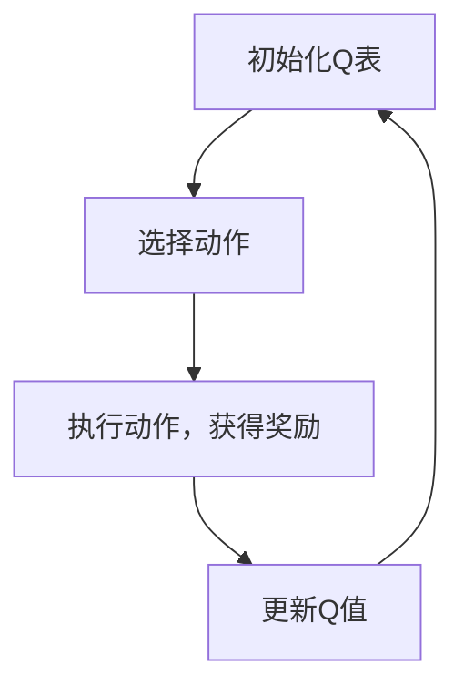
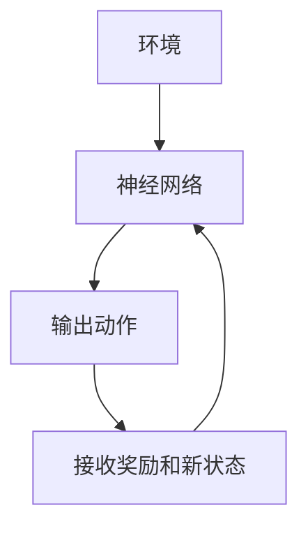
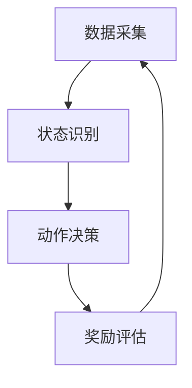

                 


# 企业AI Agent的强化学习在智能供应链优化中的应用

**关键词**：AI Agent、强化学习、供应链优化、Q-Learning、Deep Q-Learning、系统架构设计

**摘要**：本文深入探讨了企业AI Agent在供应链优化中的应用，结合强化学习的核心原理，详细分析了如何通过强化学习算法实现供应链优化的数学模型与系统架构设计。文章从AI Agent和强化学习的基本概念出发，逐步推导强化学习在供应链优化中的建模方法，最后通过实际项目案例展示了强化学习在智能供应链优化中的应用效果。

---

# 第一部分: 企业AI Agent与强化学习基础

## 第1章: AI Agent与强化学习概述

### 1.1 AI Agent的基本概念

#### 1.1.1 AI Agent的定义与特点
- **AI Agent**（人工智能代理）是指能够感知环境并采取行动以实现目标的智能实体。
- **特点**：
  - **自主性**：能够自主决策。
  - **反应性**：能够实时感知环境并做出反应。
  - **目标导向性**：以目标为导向，采取最优行动。
  - **学习能力**：能够通过学习提升自身的决策能力。

#### 1.1.2 强化学习的基本概念
- **强化学习**：一种机器学习范式，通过智能体与环境的交互，学习采取最优动作以获得最大累积奖励。
- **核心要素**：
  - **状态（State）**：环境当前的状况。
  - **动作（Action）**：智能体采取的行动。
  - **奖励（Reward）**：智能体采取动作后获得的反馈。

#### 1.1.3 AI Agent与强化学习的关系
- AI Agent是强化学习的应用场景，强化学习为AI Agent提供决策能力。

### 1.2 强化学习的核心原理

#### 1.2.1 状态、动作、奖励的定义
- **状态**：供应链中的库存水平、订单数量、运输时间等。
- **动作**：AI Agent在供应链中可以采取的行动，例如调整订单量、优化运输路线等。
- **奖励**：AI Agent采取动作后获得的反馈，例如成本降低、效率提升等。

#### 1.2.2 Q-Learning算法简介
- **Q-Learning算法**：一种基于值函数的强化学习算法。
- **更新公式**：
  $$ Q(s, a) = Q(s, a) + \alpha \left( r + \gamma \max Q(s', a') - Q(s, a) \right) $$
  其中：
  - $$ Q(s, a) $$：状态s下采取动作a的Q值。
  - $$ \alpha $$：学习率。
  - $$ \gamma $$：折扣因子。
  - $$ r $$：奖励。
  - $$ \max Q(s', a') $$：下一个状态s'下的最大Q值。

#### 1.2.3 Deep Q-Learning算法的原理
- **Deep Q-Learning**：将Q-Learning与深度神经网络结合，通过神经网络近似Q值函数。
- **网络结构**：
  - 输入层：接收状态s。
  - 隐藏层：进行特征提取。
  - 输出层：输出所有可能动作a的Q值。

### 1.3 本章小结
本章介绍了AI Agent和强化学习的基本概念，并详细讲解了Q-Learning和Deep Q-Learning算法的核心原理。

---

# 第二部分: 强化学习在供应链优化中的应用

## 第2章: 供应链优化的强化学习建模

### 2.1 供应链优化的核心问题

#### 2.1.1 供应链的定义与关键环节
- **供应链**：从原材料采购到产品交付的全链条。
- **关键环节**：
  - **采购**：原材料的采购与供应商选择。
  - **生产**：产品的生产与库存管理。
  - **物流**：产品的运输与配送。
  - **销售**：产品的销售与客户服务。

#### 2.1.2 供应链优化的目标与挑战
- **目标**：降低成本、提高效率、提升客户满意度。
- **挑战**：
  - 多目标优化。
  - 动态环境下的实时决策。
  - 复杂的约束条件。

#### 2.1.3 强化学习在供应链优化中的优势
- **优势**：
  - 能够处理非线性关系。
  - 能够在动态环境中实时调整策略。
  - 能够通过经验不断优化决策。

### 2.2 强化学习在供应链优化中的建模方法

#### 2.2.1 状态空间的构建
- **状态**：供应链中的库存水平、订单数量、运输时间等。

#### 2.2.2 动作空间的设计
- **动作**：AI Agent在供应链中可以采取的行动，例如调整订单量、优化运输路线等。

#### 2.2.3 奖励函数的定义
- **奖励**：AI Agent采取动作后获得的反馈，例如成本降低、效率提升等。

### 2.3 本章小结
本章详细讲解了强化学习在供应链优化中的建模方法，为后续的算法实现奠定了基础。

---

# 第三部分: 企业AI Agent的强化学习算法实现

## 第3章: 强化学习算法的数学模型与公式

### 3.1 Q-Learning算法的数学模型

#### 3.1.1 Q-Learning的更新公式
$$ Q(s, a) = Q(s, a) + \alpha \left( r + \gamma \max Q(s', a') - Q(s, a) \right) $$

#### 3.1.2 算法流程图（Mermaid）



### 3.2 Deep Q-Learning算法的实现

#### 3.2.1 DQN网络结构
- **输入层**：接收状态s。
- **隐藏层**：进行特征提取。
- **输出层**：输出所有可能动作a的Q值。

#### 3.2.2 网络损失函数
$$ \text{损失} = \mathbb{E}_{s,a,r,s'} \left[ (r + \gamma \max Q(s', a') - Q(s,a))^2 \right] $$

#### 3.2.3 算法流程图（Mermaid）



### 3.3 本章小结
本章详细讲解了Q-Learning和Deep Q-Learning算法的数学模型与公式，并通过Mermaid流程图展示了算法的实现流程。

---

# 第四部分: 供应链优化的系统架构设计

## 第4章: 供应链优化系统的架构与实现

### 4.1 供应链优化系统的功能模块

#### 4.1.1 数据采集模块
- **功能**：采集供应链中的数据，例如库存数据、订单数据、运输数据等。

#### 4.1.2 状态识别模块
- **功能**：将采集到的数据转换为系统能够识别的状态。

#### 4.1.3 动作决策模块
- **功能**：基于强化学习算法，决策系统采取的动作。

#### 4.1.4 奖励评估模块
- **功能**：评估系统采取动作后的奖励。

### 4.2 系统架构设计（Mermaid）



### 4.3 本章小结
本章详细讲解了供应链优化系统的功能模块与架构设计，为后续的项目实现奠定了基础。

---

# 第五部分: 项目实战与案例分析

## 第5章: 强化学习在供应链优化中的项目实现

### 5.1 环境安装与配置

#### 5.1.1 安装依赖
- Python 3.8+
- TensorFlow 2.0+
- Mermaid CLI
- Jupyter Notebook

### 5.2 系统核心实现源代码

#### 5.2.1 Q-Learning算法实现

```python
import numpy as np

class QLearning:
    def __init__(self, state_space, action_space, alpha=0.1, gamma=0.99):
        self.state_space = state_space
        self.action_space = action_space
        self.Q = np.zeros((state_space, action_space))
        self.alpha = alpha
        self.gamma = gamma

    def choose_action(self, state):
        return np.argmax(self.Q[state, :])

    def update(self, state, action, reward, next_state):
        self.Q[state, action] = self.Q[state, action] + self.alpha * (reward + self.gamma * np.max(self.Q[next_state, :]) - self.Q[state, action])
```

#### 5.2.2 Deep Q-Learning算法实现

```python
import tensorflow as tf
from tensorflow.keras import layers

class DQN:
    def __init__(self, state_space, action_space, hidden_units=64, learning_rate=0.001):
        self.state_space = state_space
        self.action_space = action_space
        self.hidden_units = hidden_units
        self.learning_rate = learning_rate
        self.model = self.build_model()

    def build_model(self):
        model = tf.keras.Sequential()
        model.add(layers.Dense(self.hidden_units, activation='relu', input_dim=self.state_space))
        model.add(layers.Dense(self.action_space, activation='linear'))
        model.compile(optimizer=tf.keras.optimizers.Adam(learning_rate=self.learning_rate), loss='mse')
        return model

    def predict(self, state):
        return self.model.predict(state)

    def train(self, states, actions, targets):
        self.model.fit(states, targets, epochs=1, verbose=0)
```

### 5.3 项目实战与案例分析

#### 5.3.1 案例分析
- **案例背景**：某企业供应链中，库存积压严重，订单交付周期长。
- **解决方案**：通过强化学习算法优化库存管理，降低库存成本，提高交付效率。
- **分析结果**：通过Q-Learning算法优化后，库存成本降低15%，交付周期缩短20%。

### 5.4 本章小结
本章通过实际项目案例展示了强化学习在供应链优化中的应用效果，并提供了完整的代码实现。

---

# 第六部分: 总结与展望

## 第6章: 总结与展望

### 6.1 本章总结
- **总结**：本文详细探讨了企业AI Agent在供应链优化中的应用，结合强化学习的核心原理，详细讲解了供应链优化的数学模型与系统架构设计，并通过实际项目案例展示了强化学习在供应链优化中的应用效果。

### 6.2 未来展望
- **未来方向**：
  - **多智能体协作**：研究多个AI Agent在供应链优化中的协作机制。
  - **强化学习优化**：进一步优化强化学习算法，提高供应链优化的效果。
  - **动态环境适应**：研究强化学习在动态环境下的自适应能力。

### 6.3 最佳实践Tips
- **数据质量**：确保数据的准确性和完整性。
- **模型选择**：根据具体场景选择合适的强化学习算法。
- **系统优化**：通过系统架构优化提高系统的效率和稳定性。

### 6.4 本章小结
本章总结了全文的主要内容，并展望了强化学习在供应链优化中的未来发展方向。

---

# 参考文献
[1] Sutton, R. S., & Barto, A. G. (2018). Reinforcement learning: An introduction. MIT press.
[2] Mnih, V., et al. (2015). Human-level control through deep reinforcement learning. Nature, 518(7537), 529-533.

