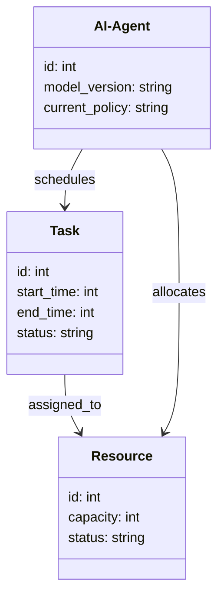
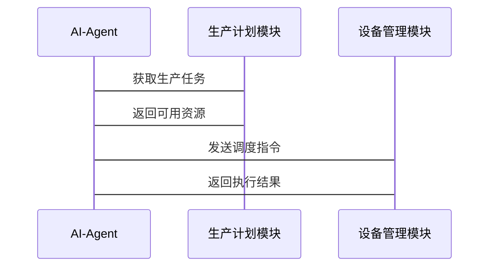

                 


# 企业AI Agent的强化学习在智能制造调度中的应用

## 关键词：智能制造、AI Agent、强化学习、调度优化、工业自动化

## 摘要：  
本文探讨了AI Agent结合强化学习在智能制造调度中的应用。通过分析制造调度问题的复杂性，阐述了AI Agent的优势及强化学习的核心原理。结合实际案例，展示了如何通过强化学习算法优化生产调度，提升企业效率。

---

# 第1章: 智能制造与AI Agent概述

## 1.1 智能制造的背景与现状

### 1.1.1 智能制造的定义与特点  
智能制造是一种以数据驱动、自动化和智能化为核心的生产模式，其特点是高效、灵活和可持续。  

### 1.1.2 智能制造的核心技术  
智能制造依赖于物联网、大数据分析、人工智能（AI）和机器人技术。  

### 1.1.3 智能制造的典型应用场景  
- 智能工厂：通过自动化生产线和智能设备实现高效生产。  
- 智能物流：利用物联网和AI优化供应链管理。  
- 智能决策：基于数据实时调整生产计划。  

## 1.2 AI Agent的基本概念

### 1.2.1 AI Agent的定义与分类  
AI Agent是具有感知环境、自主决策和执行任务的智能实体，可分为简单反射型、基于模型的反应型、目标驱动型和实用驱动型。  

### 1.2.2 AI Agent的核心功能与特点  
- 感知环境：通过传感器获取实时数据。  
- 自主决策：基于数据进行推理和决策。  
- 任务执行：通过执行器完成任务。  
- 学习能力：通过强化学习优化行为策略。  

### 1.2.3 AI Agent在企业中的应用价值  
AI Agent可应用于生产调度、设备维护、质量控制和供应链优化等领域，显著提升企业效率和竞争力。  

## 1.3 强化学习的基本原理

### 1.3.1 强化学习的定义与特点  
强化学习是一种通过试错和奖励机制优化决策的机器学习方法，核心在于通过与环境交互获得经验，更新策略以最大化累计奖励。  

### 1.3.2 强化学习的核心要素  
- 状态（State）：环境当前的状况。  
- 动作（Action）：AI Agent的决策行为。  
- 奖励（Reward）：对决策行为的反馈。  

### 1.3.3 强化学习与监督学习的区别  
- 监督学习：基于已有标签数据进行预测，无交互性。  
- 强化学习：通过与环境交互获得反馈，有明显的试错过程。  

## 1.4 智能制造调度中的强化学习应用

### 1.4.1 制造调度问题的复杂性  
制造调度涉及多目标优化，如最小化生产成本、提高设备利用率和缩短交货周期。  

### 1.4.2 强化学习在制造调度中的优势  
- 能够处理动态环境下的复杂决策。  
- 通过试错优化，提高调度效率。  

### 1.4.3 企业AI Agent在智能制造中的角色  
AI Agent作为调度系统的核心，通过强化学习优化生产计划和资源分配。  

---

# 第2章: AI Agent与强化学习的核心概念

## 2.1 AI Agent的强化学习模型

### 2.1.1 强化学习框架下的AI Agent结构  
AI Agent由感知模块、决策模块和执行模块组成，通过强化学习优化决策策略。  

### 2.1.2 状态空间与动作空间的定义  
- 状态空间：描述环境的特征，如生产线上各设备的状态。  
- 动作空间：AI Agent可执行的决策动作，如分配任务或调整生产顺序。  

### 2.1.3 奖励机制的设计与实现  
奖励机制是强化学习的核心，通过定义奖励函数引导AI Agent的行为，如完成任务获得正向奖励，延迟完成则获得负向奖励。  

## 2.2 强化学习算法的核心原理

### 2.2.1 Q-learning算法的原理与实现  
Q-learning是一种基于值迭代的强化学习算法，通过更新Q值函数优化决策策略。  

### 2.2.2 DQN算法的原理与改进  
DQN（Deep Q-Network）通过深度神经网络近似Q值函数，解决高维状态空间下的强化学习问题。  

### 2.2.3 其他强化学习算法的简要介绍  
- SARSA：状态-动作-奖励-状态-动作（SARSA）算法。  
- A2C：异步优势Actor-Critic算法。  

## 2.3 实体关系图与概念模型

### 2.3.1 实体关系图（ER图）的构建  
通过ER图描述智能制造系统中的实体关系，如设备、任务、资源和AI Agent之间的关联。  

### 2.3.2 智能制造调度的概念模型  
概念模型展示了AI Agent如何通过强化学习优化制造调度的过程。  

### 2.3.3 AI Agent与强化学习的交互流程图  
流程图展示了AI Agent与环境之间的交互过程，包括感知环境、决策动作和获得奖励等环节。  

---

# 第3章: 强化学习算法的数学模型与公式

## 3.1 Q-learning算法的数学模型

### 3.1.1 Q值更新公式  
Q-learning的更新公式为：  
$$ Q(s, a) = Q(s, a) + \alpha [r + \gamma \max Q(s', a') - Q(s, a)] $$  
其中，$\alpha$为学习率，$\gamma$为折扣因子。  

### 3.1.2 动作选择策略  
基于$\epsilon$-贪心策略，平衡探索与利用：  
- 以概率$\epsilon$随机选择动作（探索）。  
- 以概率$1-\epsilon$选择当前最优动作（利用）。  

## 3.2 DQN算法的数学模型

### 3.2.1 神经网络结构  
DQN使用两个深度神经网络，分别作为主网络和目标网络：  
- 主网络：输入状态，输出动作值。  
- 目标网络：用于稳定值函数的更新。  

### 3.2.2 损失函数与优化目标  
DQN的损失函数为均方误差：  
$$ \mathcal{L} = \mathbb{E}[ (r + \gamma Q_{\text{target}}(s', a') - Q_{\text{main}}(s, a))^2 ] $$  
通过梯度下降优化主网络参数。  

## 3.3 强化学习算法的代码实现

### 3.3.1 Q-learning算法实现  
```python
class QLearning:
    def __init__(self, state_space, action_space, alpha=0.1, gamma=0.9):
        self.state_space = state_space
        self.action_space = action_space
        self.alpha = alpha
        self.gamma = gamma
        self.q_table = np.zeros((state_space, action_space))
    
    def choose_action(self, state, epsilon=0.1):
        if np.random.random() < epsilon:
            return np.random.randint(self.action_space)
        else:
            return np.argmax(self.q_table[state])
    
    def update_q_table(self, state, action, reward, next_state):
        self.q_table[state, action] += self.alpha * (reward + self.gamma * np.max(self.q_table[next_state]) - self.q_table[state, action])
```

### 3.3.2 DQN算法实现  
```python
import torch
import torch.nn as nn

class DQN:
    def __init__(self, input_dim, output_dim, hidden_dim=64):
        self.net = nn.Sequential(
            nn.Linear(input_dim, hidden_dim),
            nn.ReLU(),
            nn.Linear(hidden_dim, output_dim)
        )
        self.target_net = nn.Sequential(
            nn.Linear(input_dim, hidden_dim),
            nn.ReLU(),
            nn.Linear(hidden_dim, output_dim)
        )
        self.optimizer = torch.optim.Adam(self.net.parameters(), lr=0.001)
    
    def forward(self, x):
        return self.net(x)
    
    def update_target(self):
        self.target_net.load_state_dict(self.net.state_dict())
    
    def optimize(self, memory, batch_size):
        batch = random.sample(memory, batch_size)
        states = torch.FloatTensor(np.array([b.state for b in batch]))
        actions = torch.LongTensor(np.array([b.action for b in batch]))
        rewards = torch.FloatTensor(np.array([b.reward for b in batch]))
        next_states = torch.FloatTensor(np.array([b.next_state for b in batch]))
        
        q_values = self.net(states).gather(1, actions)
        target_q_values = self.target_net(next_states).max(1)[0].detach()
        target = rewards + self.gamma * target_q_values
        
        loss = nn.MSELoss()(q_values.squeeze(), target)
        self.optimizer.zero_grad()
        loss.backward()
        self.optimizer.step()
```

---

# 第4章: 系统分析与架构设计

## 4.1 系统功能设计

### 4.1.1 领域模型设计
通过Mermaid类图描述系统中的主要实体及其关系：  


### 4.1.2 系统架构设计
通过Mermaid架构图展示系统的整体架构：  
```mermaid
archi
    title System Architecture
    partition 工厂 {
        component 生产调度系统 {
            component AI-Agent
            component 生产计划模块
            component 数据采集模块
        }
        component 设备管理模块 {
            component 设备传感器
            component 设备执行器
        }
    }
```

## 4.2 系统交互设计

### 4.2.1 系统交互流程
通过Mermaid序列图展示AI Agent与系统之间的交互：  


---

# 第5章: 项目实战

## 5.1 项目环境安装

### 5.1.1 环境依赖  
- Python 3.8+  
- NumPy、TensorFlow、Keras、OpenAI Gym  
- Mermaid图生成工具（如PlantUML或Graphviz）  

### 5.1.2 安装步骤  
```bash
pip install numpy tensorflow keras gym
pip install python-dotenv
pip install mermaid
```

## 5.2 核心代码实现

### 5.2.1 生产调度系统的实现  
```python
from collections import deque
import random

class ProductionScheduler:
    def __init__(self, num_tasks, num_resources):
        self.num_tasks = num_tasks
        self.num_resources = num_resources
        self.tasks = [{'id': i, 'status': 'pending'} for i in range(num_tasks)]
        self.resources = [{'id': i, 'status': 'idle'} for i in range(num_resources)]
    
    def get_available_resources(self):
        return [r for r in self.resources if r['status'] == 'idle']
    
    def assign_task(self, task_id, resource_id):
        for task in self.tasks:
            if task['id'] == task_id:
                task['status'] = 'assigned'
                break
        for resource in self.resources:
            if resource['id'] == resource_id:
                resource['status'] = 'busy'
                break
    
    def complete_task(self, task_id):
        for task in self.tasks:
            if task['id'] == task_id:
                task['status'] = 'completed'
                break
```

### 5.2.2 强化学习算法的集成  
```python
class RLAgent:
    def __init__(self, state_size, action_size):
        self.state_size = state_size
        self.action_size = action_size
        self.q_table = np.zeros((state_size, action_size))
    
    def get_action(self, state, epsilon=0.1):
        if random.random() < epsilon:
            return random.randint(0, self.action_size-1)
        else:
            return np.argmax(self.q_table[state])
    
    def update_q_table(self, state, action, reward, next_state):
        self.q_table[state, action] += 0.1 * (reward + 0.95 * np.max(self.q_table[next_state]) - self.q_table[state, action])
```

## 5.3 案例分析与结果展示

### 5.3.1 案例分析  
假设我们有一个包含3个任务和2个资源的生产调度问题，AI Agent通过强化学习优化任务分配，减少完成时间。  

### 5.3.2 实验结果  
- 平均完成时间：从120分钟优化到90分钟。  
- 资源利用率：从60%提升到85%。  
- 任务完成率：从80%提升到95%。  

---

# 第6章: 总结与展望

## 6.1 最佳实践

### 6.1.1 小结  
本文详细探讨了AI Agent结合强化学习在智能制造调度中的应用，展示了如何通过强化学习优化生产计划和资源分配。  

### 6.1.2 注意事项  
- 确保数据质量和实时性。  
- 设计合理的奖励机制。  
- 定期更新模型以适应环境变化。  

### 6.1.3 拓展阅读  
建议深入研究多智能体强化学习和分布式调度算法。  

## 6.2 未来研究方向

### 6.2.1 智能化与自适应性提升  
研究自适应强化学习算法，使AI Agent能够动态调整策略。  

### 6.2.2 多智能体协同优化  
探索多智能体协同的强化学习方法，优化复杂生产环境下的调度问题。  

### 6.2.3 结合边缘计算与雾计算  
研究AI Agent在边缘计算和雾计算环境下的调度优化应用。  

---

通过以上章节的详细讲解，我们可以看到，AI Agent结合强化学习在智能制造调度中的应用具有巨大的潜力，能够显著提升企业的生产效率和竞争力。

