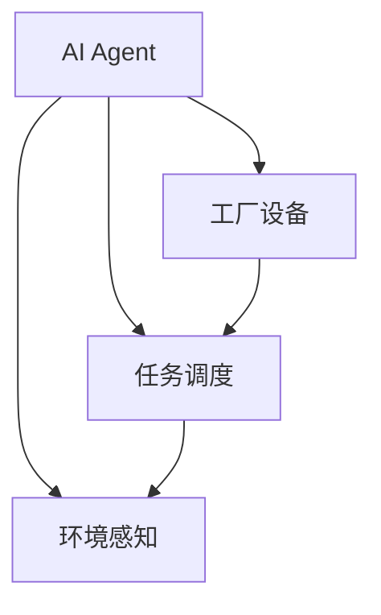
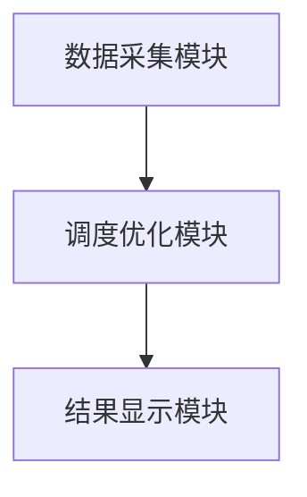
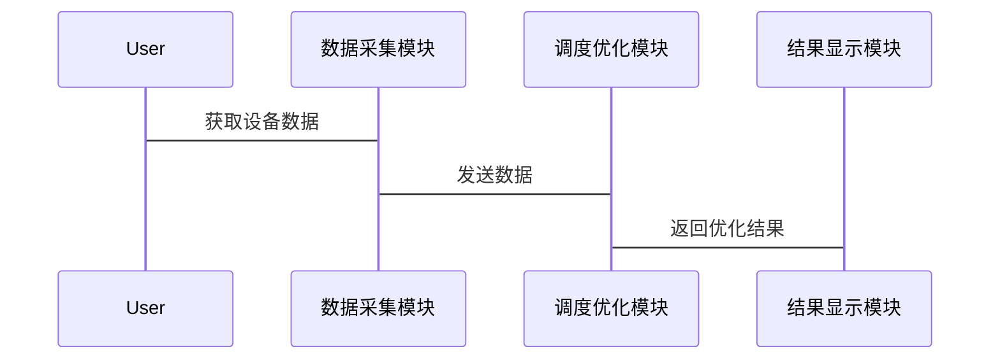

                 


# 企业AI Agent的强化学习在智能工厂调度优化中的实践

## 关键词：强化学习，AI Agent，智能工厂，调度优化，数学模型，系统架构，项目实战

## 摘要：本文详细探讨了强化学习在智能工厂调度优化中的应用，特别是AI Agent的强化学习技术。通过分析强化学习的基本原理、算法实现、系统架构设计以及实际项目案例，展示了如何利用强化学习优化工厂调度流程，提高生产效率和资源利用率。本文旨在为企业技术决策者和研发人员提供实践指导和理论支持。

---

# 第一部分：企业AI Agent的强化学习基础

## 第1章：强化学习与AI Agent概述

### 1.1 强化学习的基本概念
#### 1.1.1 强化学习的定义与特点
强化学习是一种机器学习范式，通过智能体在环境中采取动作来最大化累积奖励。其特点是：
- **试错性**：通过不断尝试和错误来优化策略。
- **延迟奖励**：奖励可能在动作之后延迟出现。
- **策略优化**：通过优化策略（行为选择机制）来最大化期望奖励。

#### 1.1.2 AI Agent的定义与类型
AI Agent是指在环境中感知并自主决策的智能体。类型包括：
- **简单反射型Agent**：基于当前状态直接做出反应。
- **基于模型的规划型Agent**：使用环境模型进行决策。
- **基于学习的Agent**：通过强化学习等方法从经验中学习策略。

#### 1.1.3 强化学习与AI Agent的关系
强化学习为AI Agent提供了决策机制，使其能够通过与环境交互来优化行为策略。AI Agent则是强化学习技术的应用载体。

### 1.2 智能工厂调度优化的背景
#### 1.2.1 智能工厂的定义与特点
智能工厂是利用物联网、大数据和人工智能技术，实现生产过程智能化、自动化和高效化的现代工厂。

#### 1.2.2 工厂调度优化的必要性
- **资源浪费**：设备和人力资源未被充分利用。
- **生产延误**：任务调度不合理导致生产延迟。
- **成本增加**：低效调度导致运营成本上升。

#### 1.2.3 强化学习在调度优化中的应用
强化学习能够处理动态和复杂的调度问题，通过不断试错优化调度策略，提高生产效率。

---

## 第2章：强化学习的核心概念与数学模型

### 2.1 强化学习的基本原理
#### 2.1.1 状态、动作、奖励的定义
- **状态（State）**：环境中的当前情况，如设备状态、任务优先级。
- **动作（Action）**：智能体在状态下的决策，如分配任务、调整设备。
- **奖励（Reward）**：智能体行为的反馈，如完成任务的时间缩短。

#### 2.1.2 策略与价值函数
- **策略（Policy）**：描述智能体在状态下的动作选择概率。
- **价值函数（Value Function）**：评估状态或动作的价值，帮助选择最优策略。

#### 2.1.3 探索与利用的平衡
- **探索**：尝试未访问或较少访问的状态，以发现更好的策略。
- **利用**：根据当前最优策略采取行动，以最大化累积奖励。

### 2.2 Q-learning算法详解
#### 2.2.1 Q-learning的数学模型
Q-learning的目标是学习状态-动作对的Q值，公式为：
$$ Q(s, a) = r + \gamma \max_{a'} Q(s', a') $$

#### 2.2.2 Q-learning的更新公式
Q值更新公式：
$$ Q(s, a) \leftarrow Q(s, a) + \alpha [r + \gamma \max Q(s', a') - Q(s, a)] $$

#### 2.2.3 Q-learning的收敛性分析
在无限时间步骤下，Q-learning算法在离散环境和策略中可以收敛到最优Q值。

---

## 第3章：AI Agent在智能工厂中的应用

### 3.1 AI Agent的分类与特点
通过对比表格和Mermaid图展示AI Agent的分类和应用场景。

#### AI Agent分类对比表
| 类型            | 描述                                                                 |
|-----------------|----------------------------------------------------------------------|
| 简单反射型Agent | 基于当前状态直接反应，无内部状态或模型。                                  |
| 基于模型的Agent | 使用环境模型进行规划，适用于复杂环境。                                    |
| 基于学习的Agent | 通过强化学习等技术从经验中学习策略，适用于动态环境。                  |

#### Mermaid图：AI Agent在智能工厂中的实体关系


### 3.2 强化学习在工厂调度中的应用
#### 3.2.1 调度优化问题的建模
调度优化问题可以建模为马尔可夫决策过程（MDP），包括状态、动作、奖励和转移概率。

#### 3.2.2 动作空间与状态空间的设计
- **状态空间**：设备状态、任务优先级、时间等。
- **动作空间**：分配任务、调整设备参数等。

#### 3.2.3 奖励函数的设计与优化
奖励函数应反映调度优化的目标，如完成时间、资源利用率等。例如：
$$ r = -t + \frac{1}{u} $$
其中，t是完成时间，u是资源利用率。

---

## 第4章：强化学习算法的实现与优化

### 4.1 算法实现的基础
#### 4.1.1 状态空间的构建
状态空间应包含所有可能影响调度决策的因素，如设备状态、任务数量等。

#### 4.1.2 动作空间的定义
动作空间应明确所有可能的调度动作，如分配任务到设备、调整设备速度等。

#### 4.1.3 奖励函数的设计
奖励函数应清晰反映调度优化的目标，如缩短完成时间、提高资源利用率。

### 4.2 算法优化策略
#### 4.2.1 ε-greedy策略
ε-greedy策略平衡探索与利用，公式为：
$$ P(\text{探索}) = \epsilon $$
$$ P(\text{利用}) = 1 - \epsilon $$

#### 4.2.2 Q值更新的加速方法
使用经验回放和目标网络加速Q值更新。

#### 4.2.3 状态转移概率的估计
通过历史数据估计状态转移概率，优化策略选择。

---

## 第5章：系统架构与接口设计

### 5.1 系统架构设计
#### 5.1.1 系统功能模块划分
- **数据采集模块**：采集设备和任务数据。
- **调度优化模块**：应用强化学习算法进行调度优化。
- **结果显示模块**：展示优化结果和性能指标。

#### 5.1.2 系统架构的Mermaid图


#### 5.1.3 系统模块之间的交互关系
模块间通过API接口进行数据传递和通信。

### 5.2 接口设计
#### 5.2.1 接口定义
- 数据采集接口：`GET /api/data`
- 调度优化接口：`POST /api/schedule`

#### 5.2.2 接口交互流程图


---

## 第6章：项目实战

### 6.1 环境安装
安装Python、强化学习库（如TensorFlow、Keras）和调度优化工具。

### 6.2 核心代码实现
#### 6.2.1 Q-learning算法实现
```python
import numpy as np

class QLearning:
    def __init__(self, state_space, action_space, gamma=0.99, epsilon=0.1):
        self.state_space = state_space
        self.action_space = action_space
        self.gamma = gamma
        self.epsilon = epsilon
        self.q_table = np.zeros((state_space, action_space))

    def get_action(self, state):
        if np.random.random() < self.epsilon:
            return np.random.randint(self.action_space)
        else:
            return np.argmax(self.q_table[state])

    def update_q_table(self, state, action, reward, next_state):
        self.q_table[state, action] = reward + self.gamma * np.max(self.q_table[next_state])
```

#### 6.2.2 调度优化实现
```python
def factory_scheduling(q_learning, tasks, devices):
    for task in tasks:
        state = get_current_state(devices)
        action = q_learning.get_action(state)
        next_state, reward = perform_action(state, action, devices)
        q_learning.update_q_table(state, action, reward, next_state)
```

### 6.3 代码解读与分析
解释代码的功能和实现细节，展示如何通过强化学习优化调度策略。

### 6.4 实际案例分析
分析一个具体的调度优化案例，展示强化学习的应用效果和优化结果。

### 6.5 项目小结
总结项目实现的关键点和经验教训，强调强化学习在调度优化中的优势。

---

## 第7章：最佳实践与未来展望

### 7.1 最佳实践
- **数据质量**：确保数据的完整性和准确性。
- **算法选择**：根据问题特点选择合适的强化学习算法。
- **系统优化**：通过经验回放和目标网络加速训练。

### 7.2 小结
强化学习为智能工厂调度优化提供了有效解决方案，通过不断优化策略，提高了生产效率和资源利用率。

### 7.3 注意事项
- **算法收敛性**：确保算法在合理时间内收敛。
- **环境复杂性**：考虑环境的动态变化和不确定性。

### 7.4 未来展望
未来研究可以集中在多智能体协同调度、复杂环境下的强化学习应用，以及结合其他技术（如深度学习）提升调度优化效果。

---

# 结语

本文详细探讨了企业AI Agent的强化学习在智能工厂调度优化中的实践，通过理论分析和项目案例展示了如何利用强化学习优化生产调度，提升工厂效率。希望本文能够为企业技术决策者和研发人员提供实践指导和理论支持。

---

感谢您的阅读！如需进一步探讨或获取更多资料，请随时联系。

