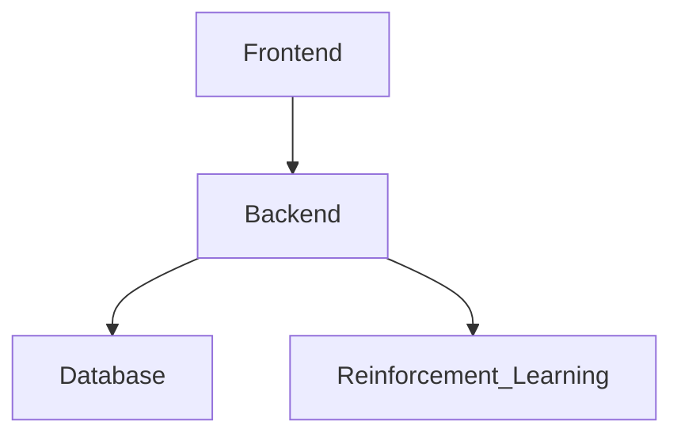
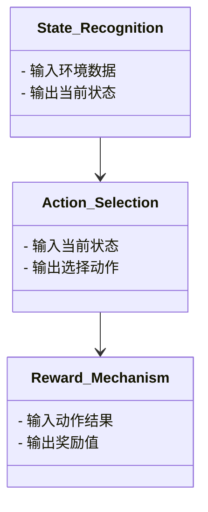
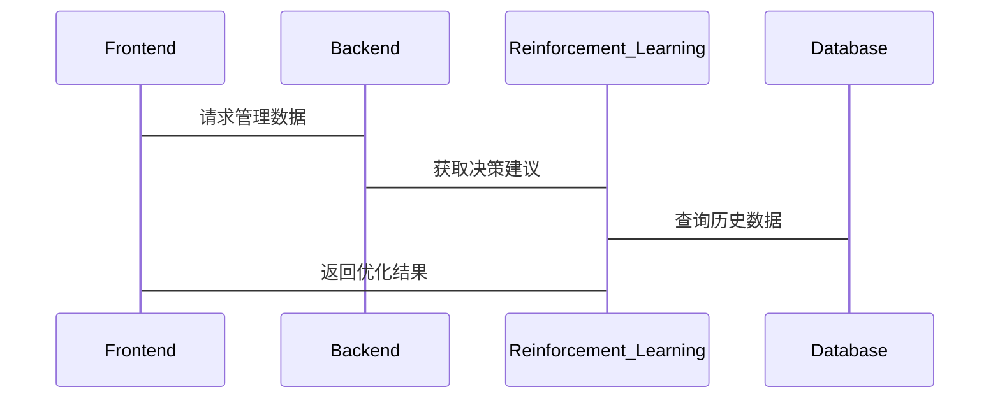

                 


# 企业AI Agent的强化学习在智能建筑管理中的应用

## 关键词：AI Agent，强化学习，智能建筑管理，系统架构设计，项目实战

## 摘要：  
本文详细探讨了企业AI Agent在智能建筑管理中的应用，重点分析了强化学习在优化建筑管理中的作用。通过系统架构设计、算法实现和项目实战，展示了AI Agent如何通过强化学习实现智能建筑管理的高效性和智能化。文章还提供了实际案例分析和最佳实践，帮助读者更好地理解和应用相关技术。

---

## 第1章：强化学习概述

### 1.1 强化学习的基本概念

强化学习（Reinforcement Learning，RL）是一种机器学习范式，其中智能体通过与环境交互来学习如何做出决策。与监督学习和无监督学习不同，强化学习强调通过试错过程，基于环境反馈（奖励或惩罚）来优化决策策略。

**对比传统机器学习：**
- **监督学习**：基于有标签的数据进行学习，适用于分类、回归等问题。
- **无监督学习**：基于无标签的数据进行学习，适用于聚类、降维等问题。
- **强化学习**：基于与环境的交互进行学习，适用于动态环境中的决策问题。

### 1.2 AI Agent的基本概念

AI Agent（人工智能代理）是指在环境中能够感知并自主行动以实现目标的实体。AI Agent可以是软件程序或物理设备，能够根据环境反馈做出决策。

**AI Agent的分类：**
1. **基于规则的AI Agent**：通过预定义规则进行决策，适用于简单、静态环境。
2. **基于模型的AI Agent**：通过建立环境模型进行决策，适用于复杂、动态环境。
3. **基于学习的AI Agent**：通过机器学习技术（如强化学习）进行决策，适用于高度动态、复杂的环境。

### 1.3 强化学习在AI Agent中的应用

强化学习驱动的AI Agent能够通过试错和环境反馈不断优化决策策略。这种结合使得AI Agent在复杂环境中能够实现自适应和高效决策。

---

## 第2章：强化学习的核心概念与原理

### 2.1 强化学习的基本原理

强化学习的核心概念包括状态（State）、动作（Action）、奖励（Reward）、策略（Policy）和价值函数（Value Function）。

**数学模型：**  
- 状态：环境中的当前情况，用$S$表示。
- 动作：智能体在状态$S$下采取的行动，用$A$表示。
- 奖励：智能体在状态$S$采取动作$A$后获得的反馈，用$r$表示。
- 策略：智能体选择动作的规则，用$\pi$表示。
- 价值函数：评估状态-动作对的预期收益，用$Q(s, a)$或$V(s)$表示。

### 2.2 强化学习的核心算法

1. **Q-learning算法：**  
   Q-learning是一种基于价值函数的强化学习算法，通过更新$Q(s, a)$表来学习最优策略。

   **算法流程：**
   1. 初始化$Q$表。
   2. 重复以下步骤直到终止条件满足：
      a. 选择当前状态下的动作。
      b. 执行动作，获得奖励和新状态。
      c. 更新$Q$表：$Q(s, a) = Q(s, a) + \alpha [r + \gamma Q(s', a') - Q(s, a)]$。

2. **Deep Q-Networks（DQN）算法：**  
   DQN通过神经网络近似$Q$函数，适用于高维状态空间和动作空间。

   **算法流程：**
   1. 初始化两个DQN网络（主网络和目标网络）。
   2. 重复以下步骤直到终止条件满足：
      a. 从经验回放缓存中随机抽取一批样本。
      b. 训练主网络以最小化损失函数：$\mathcal{L} = \mathbb{E}[ (r + \gamma Q_{target}(s', a') - Q_{main}(s, a))^2 ]$。
      c. 定期更新目标网络：$Q_{target} = \tau Q_{main} + (1 - \tau) Q_{target}$。

### 2.3 强化学习的数学模型与公式

1. **Q-learning的更新公式：**  
   $$ Q(s, a) = Q(s, a) + \alpha (r + \gamma \max Q(s', a') - Q(s, a)) $$

2. **DQN的损失函数：**  
   $$ \mathcal{L} = \mathbb{E}[(r + \gamma Q_{target}(s', a') - Q_{main}(s, a))^2] $$

---

## 第3章：AI Agent在智能建筑管理中的应用背景

### 3.1 智能建筑管理的现状与挑战

智能建筑管理涉及能源管理、设备调度、安全监控等多个方面，传统的管理方式存在以下问题：
- **能源浪费**：设备运行不优化，导致能源浪费。
- **设备调度低效**：设备调度缺乏智能化，影响管理效率。
- **安全监控不足**：安全监控系统不够智能，无法实时应对突发事件。

### 3.2 强化学习在智能建筑管理中的应用场景

1. **能源管理：**  
   AI Agent可以通过强化学习优化能源使用，协调不同设备的调度，降低能耗。

2. **设备调度：**  
   AI Agent能够根据实时数据和环境状态，优化设备的调度策略，提高管理效率。

3. **安全监控：**  
   AI Agent能够实时分析安全监控数据，识别潜在威胁，并采取最优应对措施。

### 3.3 企业级AI Agent的应用价值

AI Agent通过强化学习能够实现：
- **高效决策：** 在复杂环境中快速做出最优决策。
- **自适应性：** 根据环境变化自动调整策略。
- **智能化管理：** 提高建筑管理的智能化水平，降低成本，提升效率。

---

## 第4章：强化学习算法实现与优化

### 4.1 强化学习算法实现基础

在智能建筑管理中，强化学习算法的实现需要考虑：
- **状态空间设计：** 如设备状态、环境参数等。
- **动作空间设计：** 如开启设备、关闭设备等。
- **奖励函数设计：** 如能耗降低、管理效率提升等。

**案例：智能建筑设备调度**
- 状态：设备当前状态（运行/关闭）。
- 动作：开启/关闭设备。
- 奖励：能耗降低带来的奖励。

### 4.2 强化学习的算法优化

1. **经验回放：** 通过存储历史经验，减少样本偏差，提高学习效率。
2. **目标网络：** 使用目标网络稳定价值函数的更新，避免频繁更新主网络带来的不稳定。
3. **渐近下降：** 通过调整学习率，逐步降低更新步长，确保收敛。

### 4.3 强化学习算法的数学实现

1. **Q-learning算法实现：**  
   ```python
   import numpy as np

   class QLearning:
       def __init__(self, state_space, action_space, alpha=0.1, gamma=0.9):
           self.Q = np.zeros((state_space, action_space))
           self.alpha = alpha
           self.gamma = gamma

       def choose_action(self, state, epsilon=0.1):
           if np.random.random() < epsilon:
               return np.random.randint(action_space)
           return np.argmax(self.Q[state, :])

       def update_Q(self, state, action, reward, next_state):
           self.Q[state, action] += self.alpha * (reward + self.gamma * np.max(self.Q[next_state, :]) - self.Q[state, action])
   ```

2. **DQN算法实现：**  
   ```python
   import torch
   import torch.nn as nn

   class DQN(nn.Module):
       def __init__(self, input_dim, output_dim):
           super(DQN, self).__init__()
           self.fc1 = nn.Linear(input_dim, 64)
           self.fc2 = nn.Linear(64, output_dim)

       def forward(self, x):
           x = torch.relu(self.fc1(x))
           return torch.relu(self.fc2(x))
   ```

---

## 第5章：AI Agent在智能建筑管理中的系统设计

### 5.1 系统架构设计

AI Agent在智能建筑管理中的系统架构包括：
- **前端：** 用户界面，展示建筑管理信息。
- **后端：** AI Agent和强化学习算法，处理数据和决策。
- **数据库：** 存储建筑管理数据和学习模型。

**系统架构图：**


### 5.2 系统功能设计

系统功能模块包括：
- **状态识别：** 识别建筑环境的状态。
- **动作选择：** 根据状态选择最优动作。
- **奖励机制：** 根据结果给予奖励或惩罚。

**功能模块图：**


### 5.3 系统接口设计

系统接口包括：
- **设备接口：** 与智能设备交互。
- **用户接口：** 与用户交互。
- **数据接口：** 与数据库交互。

**交互流程图：**


---

## 第6章：项目实战与案例分析

### 6.1 项目实战

**环境安装：**
- Python 3.8+
- NumPy、PyTorch、OpenAI Gym等库。

**核心代码实现：**
```python
import gym
from gym import spaces
from gym.utils import seeding
import numpy as np

class Building_Management_Env(gym.Env):
    def __init__(self):
        self.action_space = spaces.Discrete(2)  # 开启/关闭设备
        self.observation_space = spaces.Discrete(2)  # 设备当前状态
        self.reward_range = (-float('inf'), float('inf'))
        self.seed()

    def seed(self, seed=None):
        self.np_random, seed = seeding.np_random(seed)
        return seed

    def reset(self):
        self.state = 0  # 初始状态：设备关闭
        return self.state

    def step(self, action):
        # 状态转移逻辑
        if action == 1:  # 开启设备
            new_state = 1
            reward = 1  # 假设开启设备带来正向奖励
        else:  # 保持关闭
            new_state = 0
            reward = 0
        return new_state, reward, False, {}

        return new_state, reward, done, info
```

### 6.2 案例分析

**案例：智能建筑设备调度优化**

通过强化学习优化设备调度策略，降低能耗。通过训练AI Agent，使其在不同状态下选择最优动作，实现能耗的最优分配。

**结果分析：**
- **收敛性：** 算法是否能够收敛到最优策略。
- **效率提升：** 设备调度效率是否提高。
- **能耗降低：** 是否实现了能耗的显著降低。

### 6.3 实际案例解读

详细解读案例中的关键点，如状态空间的设计、动作的选择、奖励函数的定义等。讨论案例中的挑战和解决方案，总结经验教训。

---

## 第7章：总结与展望

### 7.1 全文总结

本文详细探讨了企业AI Agent在智能建筑管理中的应用，重点分析了强化学习在优化建筑管理中的作用。通过系统架构设计、算法实现和项目实战，展示了AI Agent如何通过强化学习实现智能建筑管理的高效性和智能化。

### 7.2 未来展望

未来，强化学习和AI Agent在智能建筑管理中的发展方向包括：
- **多智能体协同：** 实现多设备的协同管理。
- **边缘计算：** 结合边缘计算，提高决策效率。
- **强化学习与其他技术结合：** 如与物联网、大数据等技术的深度融合，进一步提升智能建筑管理的智能化水平。

---

通过本文的分析，读者可以全面了解强化学习在智能建筑管理中的应用，掌握AI Agent的系统设计和实际实现方法，为后续的研究和实践提供坚实的基础。

