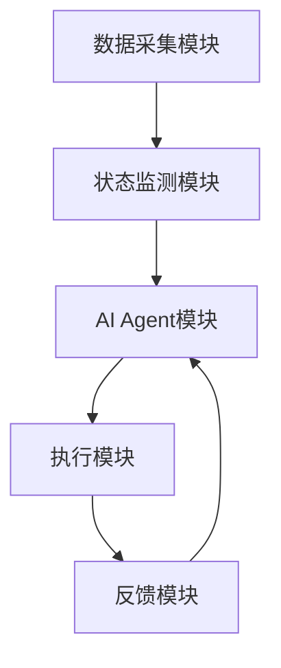

                 


# 企业AI Agent的强化学习在智能建筑能源管理中的应用

## 关键词：AI Agent, 强化学习, 智能建筑, 能源管理, 系统架构, Python实现, 数学模型

## 摘要：  
本文探讨了AI Agent结合强化学习在智能建筑能源管理中的应用，重点分析了强化学习的数学模型和算法原理，详细讲解了系统架构设计和项目实现过程，最后通过案例分析展示了实际应用效果。文章内容涵盖背景介绍、核心概念、算法实现、系统设计、项目实战等多方面，为读者提供全面的技术指导和实践参考。

---

# 第一部分: 强化学习与AI Agent的基础理论

## 第1章: 强化学习的基本概念与应用

### 1.1 强化学习的定义与特点
强化学习（Reinforcement Learning, RL）是一种机器学习范式，其中智能体通过与环境交互来学习策略，以最大化累积奖励。其核心在于通过试错学习找到最优动作序列。

#### 1.1.1 强化学习的基本要素
- **状态（State）**：智能体所处的环境状况，例如当前的能源消耗数据。
- **动作（Action）**：智能体采取的具体行动，例如调整设备的功率。
- **奖励（Reward）**：智能体行为的价值反馈，例如能耗降低带来的奖励。
- **策略（Policy）**：智能体选择动作的规则，目标是最大化累积奖励。

#### 1.1.2 强化学习的特点
- 延时反馈：奖励通常在动作之后才给出。
- 非监督性：智能体通过与环境互动学习，而非依赖于标注数据。
- 探索与利用：平衡探索新策略和利用已知最优策略。

### 1.2 AI Agent的基本原理
AI Agent是一种能够感知环境、执行任务并做出决策的智能实体。在智能建筑能源管理中，AI Agent负责协调和优化各种设备的运行，以实现节能减排的目标。

#### 1.2.1 AI Agent的分类
- **简单反射型Agent**：基于当前状态直接执行预定义动作。
- **基于模型的规划型Agent**：维护环境模型，用于预测未来状态。
- **强化学习型Agent**：通过强化学习不断优化策略。

### 1.3 强化学习在AI Agent中的应用
强化学习为AI Agent提供了动态优化的能力，使其能够在复杂多变的环境中做出最优决策。例如，在智能建筑中，AI Agent可以通过强化学习优化 HVAC（暖通空调）系统的运行，以最小化能源消耗。

---

## 第2章: 强化学习的数学模型与算法原理

### 2.1 Q-learning算法的数学模型
Q-learning是一种经典的强化学习算法，适用于离散动作空间的问题。其核心思想是通过更新Q表（Q-value table）来学习最优策略。

#### 2.1.1 Q-learning的更新公式
$$ Q(s, a) \leftarrow Q(s, a) + \alpha [r + \gamma \max Q(s', a') - Q(s, a)] $$
其中：
- $s$：当前状态
- $a$：当前动作
- $r$：奖励
- $s'$：下一个状态
- $\alpha$：学习率（$0 < \alpha \leq 1$）
- $\gamma$：折扣因子（$0 \leq \gamma \leq 1$）

#### 2.1.2 Q-learning的实现步骤
1. 初始化Q表，所有Q值为0。
2. 在每一步中选择动作（$\epsilon$-贪心策略）。
3. 执行动作，观察奖励和下一个状态。
4. 更新Q表中的对应值。
5. 重复上述步骤，直到收敛。

### 2.2 深度强化学习的数学模型
深度强化学习（Deep Reinforcement Learning）结合了深度学习和强化学习的优势，能够处理高维状态空间和动作空间的问题。

#### 2.2.1 DQN算法的数学模型
DQN（Deep Q-Network）通过神经网络近似Q函数，其核心组件包括：
- 神经网络模型（DQN）：输入状态，输出Q值。
- 目标网络（Target Network）：用于稳定训练，定期更新权重。

#### 2.2.2 DQN的训练流程
1. 从经验回放池中随机抽取一批样本。
2. 计算当前Q值和目标Q值。
3. 使用梯度下降优化神经网络参数。
4. 更新经验回放池。

### 2.3 强化学习算法的Python实现
以下是Q-learning算法的Python实现示例：

```python
import numpy as np

class QLearning:
    def __init__(self, state_space, action_space, alpha=0.1, gamma=0.9):
        self.state_space = state_space
        self.action_space = action_space
        self.alpha = alpha
        self.gamma = gamma
        self.q_table = np.zeros((state_space, action_space))

    def choose_action(self, state, epsilon=0.1):
        if np.random.random() < epsilon:
            return np.random.randint(self.action_space)
        else:
            return np.argmax(self.q_table[state])

    def update_q_table(self, state, action, reward, next_state):
        current_q = self.q_table[state, action]
        next_max_q = np.max(self.q_table[next_state])
        target = reward + self.gamma * next_max_q
        self.q_table[state, action] = current_q + self.alpha * (target - current_q)
```

---

## 第3章: 智能建筑能源管理系统的架构设计

### 3.1 系统整体架构
智能建筑能源管理系统通常由以下模块组成：
1. **数据采集模块**：采集建筑内的能耗数据。
2. **状态监测模块**：监控设备运行状态。
3. **AI Agent模块**：基于强化学习算法优化能源管理策略。
4. **执行模块**：根据AI Agent的决策执行具体操作。
5. **反馈模块**：将执行结果反馈给AI Agent。

#### 3.1.1 系统架构图


### 3.2 系统的功能模块设计

#### 3.2.1 数据采集模块
数据采集模块负责收集建筑内的各种能耗数据，例如：
- 电力消耗
- 水资源消耗
- 热能消耗

这些数据通常通过传感器和智能设备进行采集，并传输到中央控制系统。

#### 3.2.2 AI Agent模块
AI Agent模块是系统的核心部分，负责根据当前状态和历史数据，通过强化学习算法生成最优决策。

#### 3.2.3 执行模块
执行模块根据AI Agent的决策，控制建筑内的设备运行，例如：
- 调整 HVAC 系统的功率
- 开启或关闭照明设备
- 调节智能家电的运行状态

---

## 第4章: 强化学习在智能建筑中的应用案例

### 4.1 案例背景
某智能建筑希望通过强化学习优化 HVAC 系统的运行，以降低能源消耗。

### 4.2 系统实现
1. **环境搭建**：使用Python搭建模拟环境，模拟 HVAC 系统的运行状态。
2. **算法实现**：基于Q-learning算法实现AI Agent。
3. **训练过程**：通过模拟环境训练AI Agent，使其在不同状态下做出最优决策。

### 4.3 实验结果
通过实验可以发现，基于强化学习的AI Agent能够在不同时间段内优化 HVAC 系统的运行，显著降低能源消耗。

---

## 第5章: 系统优化与未来展望

### 5.1 系统优化方向
1. **算法优化**：进一步优化强化学习算法，提高训练效率和效果。
2. **硬件优化**：通过边缘计算等技术，提升系统的实时性和响应速度。
3. **多目标优化**：在能源管理中，不仅要考虑能源消耗，还要考虑舒适度等因素。

### 5.2 未来展望
随着人工智能和物联网技术的不断发展，智能建筑能源管理将更加智能化和自动化。未来的研究方向包括：
1. 结合边缘计算和雾计算，实现更高效的能源管理。
2. 探索更先进的强化学习算法，如多智能体强化学习，以应对更复杂的能源管理问题。

---

## 第6章: 总结与展望

### 6.1 总结
本文详细探讨了AI Agent结合强化学习在智能建筑能源管理中的应用，从理论基础到实际应用进行了全面的分析和探讨。通过具体的案例分析，展示了强化学习在能源管理中的巨大潜力。

### 6.2 展望
未来，随着技术的不断进步，AI Agent和强化学习将在智能建筑能源管理中发挥越来越重要的作用。研究人员需要进一步探索更高效、更智能的算法，以应对更加复杂的能源管理挑战。

---

## 参考文献
1. Mnih, V., et al. "Human-level control through deep reinforcement learning." Nature, 2015.
2. Sutton, R. S., and A. G. Barto. "Reinforcement learning: An introduction." MIT Press, 2018.
3. Levine, S. "Learning complex Dexterous manipulation with deep reinforcement learning." International Conference on Robotics and Automation, 2018.

---

# 结语

本文通过理论分析和实践案例，全面探讨了企业AI Agent的强化学习在智能建筑能源管理中的应用。从基础概念到算法实现，从系统设计到案例分析，为读者提供了一套完整的解决方案。希望本文能够为相关领域的研究人员和实践者提供有价值的参考。

