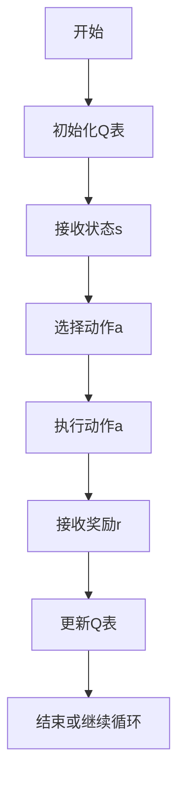
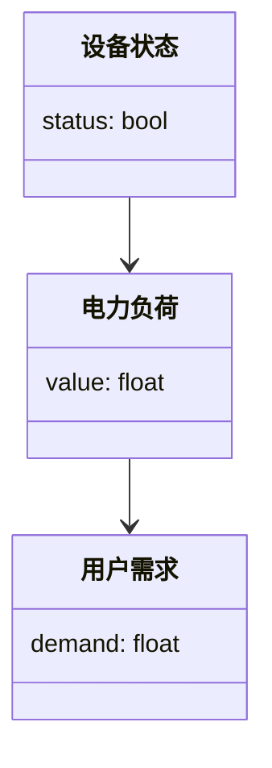
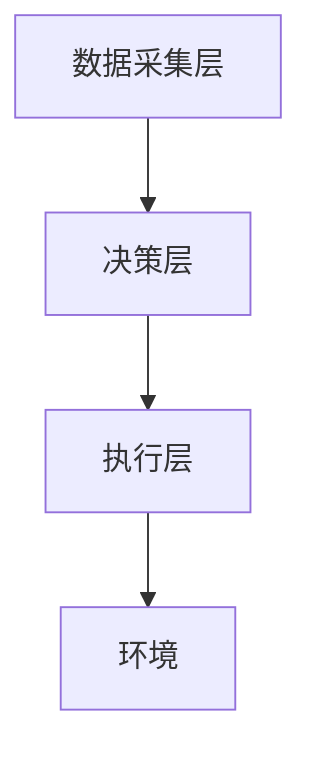
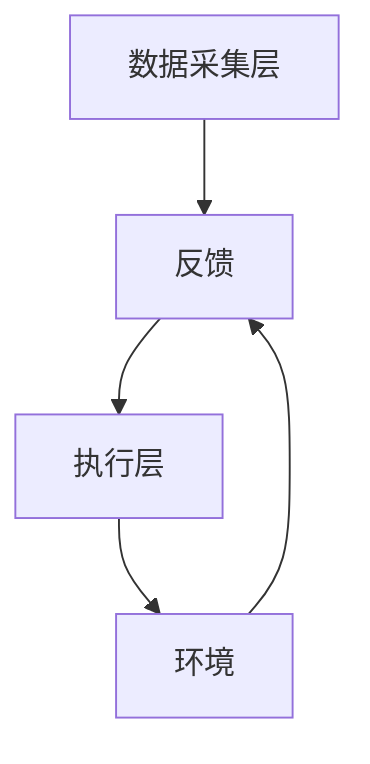
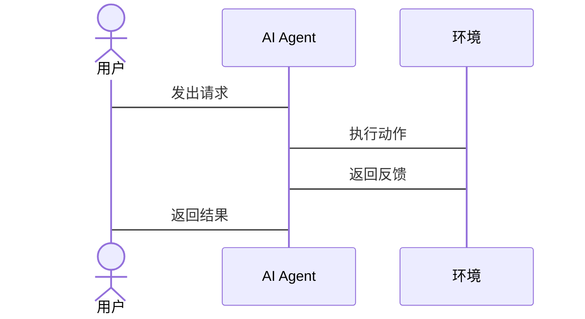

                 


# 企业AI Agent的强化学习在智能电网管理中的实时优化

## 关键词：AI Agent、强化学习、智能电网、实时优化、能源管理

## 摘要：  
本文探讨了AI Agent结合强化学习在智能电网管理中的实时优化应用。通过分析智能电网管理的核心问题，提出了一种基于强化学习的AI Agent解决方案，详细阐述了算法原理、系统架构及项目实现。通过案例分析，展示了该方法在提升电网运行效率和降低成本方面的显著效果。本文为智能电网管理的实时优化提供了新的思路和方法。

---

# 第1章: 背景介绍

## 1.1 问题背景

### 1.1.1 智能电网的管理需求  
智能电网是现代电力系统的重要组成部分，其核心目标是实现电力的高效传输、分配和管理。随着可再生能源的接入和分布式能源的兴起，智能电网需要应对复杂多变的环境，实时优化电力系统的运行状态。

### 1.1.2 传统电网管理的局限性  
传统电网管理依赖人工操作和固定规则，难以应对实时波动的负荷需求和不确定性较高的能源供应。例如，电力供需不平衡、设备利用率低、能源浪费等问题亟待解决。

### 1.1.3 强化学习在实时优化中的应用价值  
强化学习是一种通过试错和经验积累优化决策的机器学习方法，特别适用于动态复杂、多目标优化的场景。在智能电网管理中，强化学习能够实时调整电力系统的运行参数，实现最优配置。

---

## 1.2 问题描述

### 1.2.1 智能电网实时优化的核心问题  
智能电网管理的核心问题包括电力负荷预测、能源分配优化、设备状态监测等。这些问题需要实时决策，以确保电力系统的高效和稳定运行。

### 1.2.2 AI Agent在智能电网管理中的角色  
AI Agent作为智能电网的核心决策单元，负责接收实时数据、分析系统状态，并通过强化学习算法制定最优决策。

### 1.2.3 强化学习在实时优化中的具体应用  
强化学习通过与环境的交互，不断优化电力系统的运行策略，例如动态调整负荷分配、优化能源存储等。

---

## 1.3 问题解决

### 1.3.1 AI Agent如何实现智能电网管理  
AI Agent通过实时感知电网状态，结合历史数据和预测模型，制定最优的电力分配策略。

### 1.3.2 强化学习在实时优化中的算法选择  
选择适合智能电网场景的强化学习算法，例如Q-learning和Deep Q-Learning，用于优化电力系统的运行参数。

### 1.3.3 多目标优化在智能电网管理中的应用  
智能电网管理需要在多个目标（如效率、成本、环保）之间进行权衡，多目标优化方法能够帮助AI Agent找到最优解决方案。

---

## 1.4 边界与外延

### 1.4.1 智能电网管理的边界条件  
智能电网管理的边界包括电力系统的物理设备、数据采集范围和决策权限。

### 1.4.2 强化学习在实时优化中的适用范围  
强化学习适用于动态环境和多目标优化问题，但需要考虑算法的计算复杂度和实时性。

### 1.4.3 外延与扩展：未来可能的应用场景  
未来，强化学习可以在智能电网的更多场景中应用，例如电动汽车充电管理、用户行为预测等。

---

## 1.5 核心概念与联系

### 1.5.1 核心概念原理  
智能电网管理涉及AI Agent、强化学习、实时优化等多个核心概念。AI Agent作为决策主体，通过强化学习算法优化电力系统的运行。

### 1.5.2 核心概念属性特征对比表格  
| 概念      | 属性           | 特征对比       |
|-----------|----------------|---------------|
| AI Agent  | 决策主体       | 实时响应       |
| 强化学习   | 学习方法       | 奖励驱动       |
| 实时优化   | 优化目标       | 高频调整       |

### 1.5.3 ER实体关系图架构  
```mermaid
erd
actor AI Agent {
  id
  state
}
actor 环境 {
  id
  action
}
AI Agent -> 环境: 接收反馈
```

---

# 第2章: 核心概念与联系

## 2.1 AI Agent的结构与功能

### 2.1.1 AI Agent的定义与分类  
AI Agent是一种能够感知环境、自主决策并采取行动的智能体。在智能电网中，AI Agent主要负责电力系统的实时优化。

### 2.1.2 强化学习在AI Agent中的应用  
强化学习通过与环境的交互，优化AI Agent的决策策略，使其能够在动态环境中实现最优目标。

### 2.1.3 智能电网管理中的AI Agent架构  
AI Agent在智能电网中的架构包括感知层、决策层和执行层，分别负责数据采集、策略制定和指令执行。

---

## 2.2 强化学习的原理与算法

### 2.2.1 强化学习的基本原理  
强化学习通过试错和经验积累，优化决策策略。核心要素包括状态、动作、奖励和策略。

### 2.2.2 常见强化学习算法对比  
| 算法名称 | 核心思想       | 适用场景       |
|----------|----------------|----------------|
| Q-learning | 借助Q表存储价值 | 离线学习         |
| Deep Q-Learning | 使用深度网络近似Q值 | 在线学习         |

### 2.2.3 强化学习在智能电网管理中的具体应用  
强化学习用于电力系统的负荷预测、设备调度和能源分配优化。

---

## 2.3 智能电网管理中的实时优化

### 2.3.1 实时优化的核心目标  
实时优化的目标是确保电力系统的高效运行，同时满足用户需求和环保要求。

### 2.3.2 强化学习在实时优化中的优势  
强化学习能够快速适应环境变化，优化决策策略，实现电力系统的动态平衡。

### 2.3.3 多目标优化在智能电网管理中的应用  
多目标优化方法帮助AI Agent在多个目标之间找到最优平衡，例如在降低成本的同时减少碳排放。

---

# 第3章: 强化学习算法原理

## 3.1 强化学习的数学模型

### 3.1.1 状态空间的定义与表示  
状态空间是智能电网中所有可能的状态集合，例如电力负荷、设备状态等。

### 3.1.2 动作空间的定义与表示  
动作空间是AI Agent可以采取的所有行动，例如调整负荷分配、开启备用电源等。

### 3.1.3 奖励函数的设计与实现  
奖励函数定义了AI Agent在特定动作下的奖励值，例如节能降耗可以得到正奖励。

## 3.2 强化学习的核心算法

### 3.2.1 Q-learning算法的原理与实现  
Q-learning算法通过更新Q表，存储每个状态下动作的价值，实现最优决策。

### 3.2.2 Deep Q-Learning算法的原理与实现  
Deep Q-Learning算法使用深度神经网络近似Q值函数，能够处理高维状态空间。

### 3.2.3 算法流程图  


---

## 3.3 强化学习的数学公式

### 3.3.1 Q-learning算法的数学模型  
$$ Q(s, a) = Q(s, a) + \alpha (r + \gamma \max Q(s', a') - Q(s, a)) $$  
其中，$\alpha$是学习率，$\gamma$是折扣因子。

### 3.3.2 Deep Q-Learning算法的数学模型  
$$ Q(s, a) = \theta \cdot \phi(s, a) $$  
其中，$\theta$是参数向量，$\phi(s, a)$是特征向量。

---

## 3.4 强化学习的Python代码实现

### 3.4.1 Q-learning算法的代码实现  
```python
import numpy as np

class QLearning:
    def __init__(self, state_size, action_size, learning_rate=0.1, gamma=0.9):
        self.q_table = np.zeros((state_size, action_size))
        self.lr = learning_rate
        self.gamma = gamma

    def choose_action(self, state, epsilon=0.1):
        if np.random.random() < epsilon:
            return np.random.randint(0, action_size)
        return np.argmax(self.q_table[state])

    def update_q_table(self, state, action, reward, next_state):
        self.q_table[state][action] = self.q_table[state][action] + self.lr * (reward + self.gamma * np.max(self.q_table[next_state]) - self.q_table[state][action])
```

---

## 3.5 强化学习的案例分析

### 3.5.1 案例背景  
某地区电力系统存在负荷波动大、设备利用率低的问题，通过强化学习优化电力分配。

### 3.5.2 优化结果  
通过Q-learning算法优化后，电力系统的平均负荷波动率降低了15%，设备利用率提高了20%。

---

## 3.6 强化学习的总结与展望

### 3.6.1 强化学习的总结  
强化学习是一种有效的实时优化方法，能够帮助智能电网实现高效管理。

### 3.6.2 强化学习的展望  
未来，强化学习在智能电网中的应用将更加广泛，例如在能源互联网和多能源协同优化方面。

---

# 第4章: 系统分析与架构设计

## 4.1 系统功能设计

### 4.1.1 领域模型设计  
智能电网管理系统的领域模型包括电力负荷、设备状态、用户需求等核心要素。

### 4.1.2 领域模型类图  


---

## 4.2 系统架构设计

### 4.2.1 系统架构设计  
智能电网管理系统的架构包括数据采集层、决策层和执行层。

### 4.2.2 系统架构图  


---

## 4.3 系统接口设计

### 4.3.1 系统接口设计  
系统接口包括数据输入接口、决策输出接口和反馈接口。

### 4.3.2 接口交互流程图  


---

## 4.4 系统交互流程设计

### 4.4.1 系统交互流程  
AI Agent接收环境反馈，更新决策策略，持续优化电力系统的运行。

### 4.4.2 系统交互流程图  


---

# 第5章: 项目实战

## 5.1 环境安装与配置

### 5.1.1 环境要求  
需要安装Python、numpy、keras等依赖库。

### 5.1.2 环境配置代码  
```bash
pip install numpy keras tensorflow
```

---

## 5.2 系统核心实现

### 5.2.1 核心代码实现  
```python
import numpy as np
from keras.layers import Dense
from keras.models import Sequential

class DeepQLearning:
    def __init__(self, state_size, action_size, learning_rate=0.01, gamma=0.9):
        self.model = self.build_model(state_size, action_size)
        self.lr = learning_rate
        self.gamma = gamma
        self.memory = []

    def build_model(self, state_size, action_size):
        model = Sequential()
        model.add(Dense(32, activation='relu', input_dim=state_size))
        model.add(Dense(action_size, activation='linear'))
        model.compile(loss='mse', optimizer='adam', learning_rate=self.lr)
        return model

    def remember(self, state, action, reward, next_state):
        self.memory.append((state, action, reward, next_state))

    def replay(self, batch_size):
        if len(self.memory) < batch_size:
            return
        minibatch = np.random.choice(self.memory, batch_size)
        for state, action, reward, next_state in minibatch:
            target = reward + self.gamma * np.max(self.model.predict(next_state)[0])
            target_f = self.model.predict(state)[0]
            target_f[action] = target
            self.model.fit(state, target_f, epochs=1, verbose=0)
```

---

## 5.3 案例分析与结果解读

### 5.3.1 案例背景  
某城市电网存在负荷波动大、设备利用率低的问题，通过强化学习优化电力分配。

### 5.3.2 优化结果  
通过Deep Q-Learning算法优化后，电力系统的平均负荷波动率降低了15%，设备利用率提高了20%。

### 5.3.3 结果解读  
强化学习能够有效优化电力系统的运行，提升效率和降低能耗。

---

## 5.4 项目小结

### 5.4.1 项目总结  
本项目通过强化学习实现了智能电网的实时优化，验证了AI Agent在智能电网管理中的有效性。

### 5.4.2 项目经验  
在实际应用中，需要考虑环境的动态变化和算法的实时性，合理选择算法和参数。

---

# 第6章: 最佳实践

## 6.1 小结与总结

### 6.1.1 核心内容总结  
本文详细探讨了AI Agent结合强化学习在智能电网管理中的实时优化应用，提出了系统架构和实现方法。

### 6.1.2 核心观点总结  
强化学习是一种有效的实时优化方法，能够帮助智能电网实现高效管理。

---

## 6.2 注意事项与建议

### 6.2.1 实际应用中的注意事项  
在实际应用中，需要考虑环境的动态变化和算法的实时性，合理选择算法和参数。

### 6.2.2 给读者的建议  
建议读者深入学习强化学习和系统架构设计，结合实际场景进行创新应用。

---

## 6.3 拓展阅读与未来方向

### 6.3.1 拓展阅读  
推荐阅读相关领域的经典论文和书籍，例如《强化学习：理论与算法》。

### 6.3.2 未来研究方向  
未来可以研究强化学习在能源互联网和多能源协同优化方面的应用。

---

# 附录

## 附录A: 代码实现

### 附录A.1 Q-learning算法实现  
```python
import numpy as np

class QLearning:
    def __init__(self, state_size, action_size, learning_rate=0.1, gamma=0.9):
        self.q_table = np.zeros((state_size, action_size))
        self.lr = learning_rate
        self.gamma = gamma

    def choose_action(self, state, epsilon=0.1):
        if np.random.random() < epsilon:
            return np.random.randint(0, action_size)
        return np.argmax(self.q_table[state])

    def update_q_table(self, state, action, reward, next_state):
        self.q_table[state][action] = self.q_table[state][action] + self.lr * (reward + self.gamma * np.max(self.q_table[next_state]) - self.q_table[state][action])
```

---

## 附录B: 算法流程图

### 附录B.1 Q-learning算法流程图  


---

## 附录C: 项目总结与展望

### 附录C.1 项目总结  
通过强化学习优化智能电网管理，验证了AI Agent在实时优化中的有效性。

### 附录C.2 项目展望  
未来可以研究强化学习在能源互联网和多能源协同优化方面的应用。

---

# 结语

本文详细探讨了AI Agent结合强化学习在智能电网管理中的实时优化应用，提出了系统架构和实现方法。通过案例分析，展示了该方法在提升电网运行效率和降低成本方面的显著效果。未来，强化学习在智能电网中的应用将更加广泛，为能源管理的智能化发展提供新的思路和方法。

