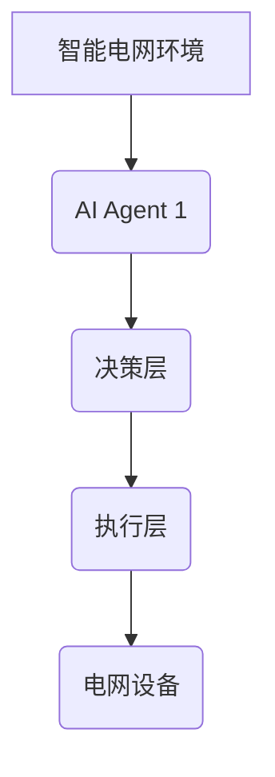

                 


# 企业AI Agent的强化学习在智能电网负载均衡与调度中的应用

---

## 关键词：智能电网，AI Agent，强化学习，负载均衡，调度，多智能体协作

---

## 摘要：

本文探讨了在智能电网中利用AI Agent和强化学习技术实现负载均衡与调度的应用。通过分析智能电网的特点和挑战，结合强化学习的核心原理，设计了一种基于强化学习的AI Agent模型，用于优化智能电网中的负载分配和调度策略。文章详细介绍了强化学习算法在智能电网中的实现，包括状态空间、动作空间和奖励函数的设计，并通过实际案例分析验证了模型的有效性。最后，本文总结了研究成果，并展望了未来的研究方向。

---

## 第1章: 智能电网与AI Agent概述

### 1.1 智能电网的基本概念

智能电网是指通过智能化技术实现电力系统各个环节（发电、输电、配电、用电）的高效协调运行的系统。其核心目标是实现电力资源的优化配置、提高电网运行效率、降低能源浪费，并支持可再生能源的接入与管理。

智能电网的特点包括：
- **智能化**：通过传感器、通信技术和数据处理技术实现电网的实时监控和智能决策。
- **分布式**：电力资源的生产和消费可以分布在整个电网中，支持分布式能源的接入。
- **动态性**：电网负荷和运行状态会随时间变化，需要实时调整和优化。

### 1.2 AI Agent的基本概念

AI Agent（智能体）是指能够感知环境、做出决策并执行操作的智能实体。在智能电网中，AI Agent可以用于监测电网状态、优化能源分配、协调多个设备的运行。

AI Agent的核心功能包括：
- **感知**：通过传感器和其他数据源获取电网的实时状态信息。
- **决策**：基于感知到的信息，利用算法进行分析和决策。
- **执行**：根据决策结果，执行相应的操作，如调节电力输出、调整负载分配等。

### 1.3 强化学习的基本概念

强化学习是一种机器学习方法，通过智能体与环境的交互，学习最优策略以最大化累积奖励。其核心要素包括：
- **状态（State）**：智能体所处的环境状态。
- **动作（Action）**：智能体在特定状态下采取的行为。
- **奖励（Reward）**：智能体行为后获得的反馈，用于指导学习方向。

### 1.4 智能电网中的AI Agent应用

在智能电网中，AI Agent可以用于以下场景：
- **负载均衡**：通过优化负载分配，减少电网瓶颈，提高电力利用效率。
- **调度优化**：协调发电、输电和配电资源，确保电力供需平衡。
- **故障恢复**：在电网出现故障时，快速调整运行状态，恢复供电。

---

## 第2章: 强化学习的核心概念与原理

### 2.1 强化学习的基本原理

强化学习的核心是通过试错学习，智能体在与环境的交互中逐步优化策略。具体步骤如下：
1. **观察状态**：智能体感知当前环境状态。
2. **选择动作**：基于当前策略，选择一个动作。
3. **执行动作**：智能体执行选择的动作，观察环境状态的变化。
4. **获得奖励**：根据动作的结果，获得奖励或惩罚。
5. **更新策略**：基于奖励，调整策略以提高未来奖励。

### 2.2 强化学习的核心算法

常用的强化学习算法包括Q-learning、Deep Q-Networks（DQN）等。

#### 2.2.1 Q-learning算法

Q-learning是一种基于值函数的强化学习算法，通过更新Q值表来学习最优策略。其核心公式为：
$$ Q(s, a) = Q(s, a) + \alpha (r + \gamma \max Q(s', a') - Q(s, a)) $$
其中：
- $s$：当前状态
- $a$：当前动作
- $r$：获得的奖励
- $s'$：下一个状态
- $\alpha$：学习率
- $\gamma$：折扣因子

#### 2.2.2 Deep Q-Networks (DQN)

DQN通过神经网络近似Q值函数，解决了Q-learning在高维状态空间中的计算问题。其核心思想是将Q值函数表示为深度神经网络，并通过经验回放和目标网络优化。

### 2.3 强化学习在智能电网中的应用挑战

智能电网环境复杂，存在动态变化、多目标优化等问题，对强化学习算法提出了更高的要求：
- **动态性**：电网负荷和设备状态会实时变化，需要快速调整策略。
- **多目标优化**：需要在能源效率、经济成本、用户满意度等多个目标之间进行权衡。
- **不确定性**： renewable energy的不稳定性增加了调度的难度。

---

## 第3章: 智能电网负载均衡与调度的强化学习模型设计

### 3.1 负载均衡与调度的数学模型

#### 3.1.1 负载均衡的目标函数

负载均衡的目标是最小化系统最大负载，同时平衡各个设备的负载。数学模型可以表示为：
$$ \min \max_{i} L_i $$
其中，$L_i$ 表示第$i$个设备的负载。

#### 3.1.2 调度问题的数学建模

调度问题需要考虑电力资源的分配和时间维度的协调。数学模型可以表示为：
$$ \min \sum_{t=1}^{T} C_t $$
其中，$C_t$ 表示第$t$个时间点的调度成本。

### 3.2 强化学习模型的设计与实现

#### 3.2.1 状态空间的定义

在智能电网中，状态空间可以包括以下指标：
- 当前时间点
- 各个设备的负载状态
- 可用电力资源
- 用户需求

#### 3.2.2 动作空间的定义

动作空间包括：
- 调整设备的负载
- 启用或关闭设备
- 调节电力输出

#### 3.2.3 奖励函数的设计

奖励函数需要考虑多个因素，例如：
- 负载均衡程度
- 经济成本
- 用户满意度

奖励函数可以设计为：
$$ R = -\max(L_i) + \alpha \cdot \text{经济成本} - \beta \cdot \text{用户不满意次数} $$
其中，$\alpha$ 和 $\beta$ 是权重系数。

### 3.3 智能电网环境的构建

#### 3.3.1 智能电网环境的模拟与仿真

可以通过仿真工具（如MATLAB、Python模拟）构建智能电网环境，模拟电力资源的分配和设备的运行状态。

#### 3.3.2 多智能体协作的实现

在智能电网中，需要多个AI Agent协作完成任务。例如，一个Agent负责负载分配，另一个负责电力输出调整。

#### 3.3.3 动态环境的处理

为了处理动态环境，可以采用滚动优化策略，定期重新优化调度方案。

---

## 第4章: 基于强化学习的AI Agent设计与实现

### 4.1 AI Agent的设计目标

AI Agent的目标是实现智能电网中的负载均衡与调度优化，具体包括：
- 实时监测电网状态
- 智能调整负载分配
- 最大化能源利用效率

### 4.2 AI Agent的架构设计

#### 4.2.1 基于强化学习的Agent架构

AI Agent的架构包括感知层、决策层和执行层：
- **感知层**：通过传感器获取电网状态数据。
- **决策层**：基于强化学习算法进行决策。
- **执行层**：根据决策结果执行操作。

#### 4.2.2 多智能体协作的实现

在智能电网中，需要多个AI Agent协作，例如：
- 负载分配Agent
- 调度优化Agent
- 故障恢复Agent

### 4.3 系统架构设计

#### 4.3.1 系统功能设计

系统功能包括：
- 实时监控
- 负载分配
- 调度优化
- 故障处理

#### 4.3.2 系统架构图



---

## 第5章: 实际案例分析与实现

### 5.1 环境安装

需要安装Python、TensorFlow、Keras等工具，并搭建智能电网仿真环境。

### 5.2 核心代码实现

以下是强化学习算法的Python代码示例：

```python
import numpy as np
import gym
from gym import spaces

class GridEnv(gym.Env):
    def __init__(self):
        super().__init__()
        self.state = 0
        self.action_space = spaces.Discrete(3)  # 动作空间：0,1,2
        self.observation_space = spaces.Discrete(5)  # 状态空间：0,1,2,3,4

    def step(self, action):
        # 状态转移逻辑
        next_state = self.state + action
        if next_state >= 5:
            next_state = 4
        # 奖励计算
        reward = -abs(4 - next_state) + (action == 2)*10
        done = next_state == 4
        info = {}
        self.state = next_state
        return next_state, reward, done, info

    def reset(self):
        self.state = 0
        return self.state
```

### 5.3 案例分析

通过实际案例分析，验证AI Agent在智能电网中的负载均衡与调度效果。例如，在负荷高峰期，AI Agent能够智能调整负载分配，确保电网稳定运行。

---

## 第6章: 总结与展望

### 6.1 总结

本文提出了基于强化学习的AI Agent在智能电网负载均衡与调度中的应用方案，详细介绍了算法设计、系统架构和实际实现。通过案例分析，验证了方案的有效性。

### 6.2 展望

未来的研究方向包括：
- 更复杂的多智能体协作
- 更高效的强化学习算法
- 更精确的电网状态预测

---

## 第7章: 最佳实践与注意事项

### 7.1 最佳实践

- 在实际应用中，建议结合具体场景调整算法参数。
- 定期更新模型以适应环境变化。
- 多智能体协作需要合理的通信机制。

### 7.2 注意事项

- 强化学习算法需要大量数据支持，数据质量至关重要。
- 动态环境下，模型的适应性需要重点关注。
- 多目标优化需要合理设置权重，避免目标冲突。

---

## 第8章: 参考文献与拓展阅读

### 8.1 参考文献

- 强化学习的经典论文
- 智能电网相关的技术文献
- 多智能体协作的研究成果

### 8.2 拓展阅读

- 探索其他AI技术在智能电网中的应用
- 研究更高效的强化学习算法
- 关注智能电网的最新发展动态

---

以上是《企业AI Agent的强化学习在智能电网负载均衡与调度中的应用》的技术博客文章的完整目录大纲和部分具体内容。

