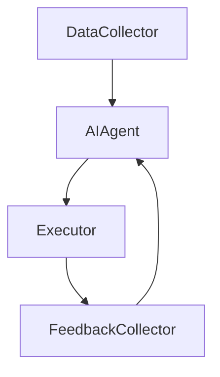

                 


# 《企业AI Agent的强化学习在智能电网负载均衡中的应用》

## 关键词：AI Agent，强化学习，智能电网，负载均衡，算法，系统架构

## 摘要：本文探讨了AI Agent结合强化学习在智能电网负载均衡中的应用。首先，介绍了智能电网和负载均衡的基本概念，以及AI Agent和强化学习的原理。然后，详细分析了强化学习算法（如Q-learning和DQN）的数学模型和系统架构设计。最后，通过实际案例展示了AI Agent在智能电网中的应用，并总结了研究结果与未来方向。

---

# 第一部分: 背景介绍与核心概念

## 第1章: 智能电网与负载均衡概述

### 1.1 智能电网的基本概念
智能电网是一种通过先进技术和信息通信技术来实现电力系统高效管理的现代化电网。它能够实时监测、分析和优化电力的产生、传输和消耗，以提高能源利用效率和供电可靠性。

#### 1.1.1 智能电网的定义与特点
- **定义**：智能电网是整合了信息技术和可再生能源的电力系统，能够实现双向通信和智能控制。
- **特点**：高效性、智能化、可持续性、可扩展性。

#### 1.1.2 智能电网中的负载均衡问题
负载均衡是智能电网中的关键问题，涉及电力资源的合理分配，以避免过载和能源浪费。

### 1.2 AI Agent与强化学习的定义
AI Agent是一种智能体，能够感知环境并采取行动以实现目标。强化学习是一种机器学习方法，通过试错机制优化决策过程。

#### 1.2.1 AI Agent的基本概念
- **定义**：AI Agent是具有感知和行动能力的智能实体，能够自主决策。
- **特点**：自主性、反应性、目标导向。

#### 1.2.2 强化学习的定义与特点
- **定义**：强化学习是一种通过试错学习策略的方法，通过与环境交互获得奖励，优化决策。
- **特点**：基于经验、在线学习、目标导向。

### 1.3 问题背景与应用前景
智能电网的负载均衡问题复杂，传统方法难以应对，而AI Agent结合强化学习提供了一种高效的解决方案。

---

## 第2章: 企业AI Agent的强化学习核心概念

### 2.1 强化学习在智能电网中的优势
强化学习能够适应动态环境，优化决策过程，非常适合智能电网的复杂场景。

---

# 第二部分: 算法原理与系统架构

## 第3章: 强化学习算法的数学模型与公式

### 3.1 状态空间与动作空间
- **状态空间**：系统在某一时刻的状态集合，如电力负荷、电压等。
- **动作空间**：AI Agent可采取的行动，如调整功率分配。

#### 3.1.1 状态空间的定义与表示
状态空间由系统中的变量组成，例如：
$$ s = [P_1, P_2, \ldots, P_n] $$
其中，$P_i$ 表示第i个节点的功率。

#### 3.1.2 动作空间的定义与表示
动作空间由可能的行动组成，例如：
$$ a = [a_1, a_2, \ldots, a_m] $$
其中，$a_j$ 表示第j个可能的行动。

### 3.2 Q-learning算法
Q-learning是一种经典强化学习算法，通过更新Q值表来学习最优策略。

#### 3.2.1 Q-learning的基本原理
Q-learning通过以下步骤更新Q值：
$$ Q(s, a) = Q(s, a) + \alpha [r + \gamma \max Q(s', a') - Q(s, a)] $$
其中，$\alpha$ 是学习率，$\gamma$ 是折扣因子。

### 3.3 DQN算法
DQN结合了深度神经网络和强化学习，通过经验回放和目标网络提高学习效率。

#### 3.3.1 DQN的基本原理
DQN使用两个网络：主网络和目标网络，通过经验回放更新主网络：
$$ \theta \leftarrow \theta' + \epsilon \nabla J(\theta) $$

---

## 第4章: 强化学习在智能电网中的应用架构

### 4.1 系统功能设计
AI Agent通过感知环境、决策、执行和反馈循环优化电力分配。

#### 4.1.1 负载均衡的领域模型
领域模型包括电力网络、负载节点和电源节点。

#### 4.1.2 AI Agent的功能模块
功能模块包括感知模块、决策模块和执行模块。

### 4.2 系统架构设计
系统架构包括数据采集、AI Agent、执行机构和反馈机制。

#### 4.2.1 系统架构的总体设计
系统架构由以下模块组成：
- 数据采集模块：收集电力系统数据。
- AI Agent模块：处理数据并生成决策。
- 执行模块：执行决策并调整系统状态。

#### 4.2.2 系统架构的详细设计
使用mermaid图展示系统架构：


---

## 第5章: 项目实战与案例分析

### 5.1 项目环境安装
安装Python、TensorFlow和Keras等工具。

#### 5.1.1 环境需求与安装步骤
安装Python 3.8及以上版本，安装TensorFlow和Keras。

#### 5.1.2 开发工具的配置
配置Jupyter Notebook和PyCharm。

### 5.2 系统核心实现
实现AI Agent和强化学习算法。

#### 5.2.1 AI Agent的实现代码
```python
class AIAgent:
    def __init__(self, state_space, action_space):
        self.state_space = state_space
        self.action_space = action_space
        self.Q_table = defaultdict(lambda: np.zeros(len(action_space)))
```

#### 5.2.2 强化学习算法的实现代码
```python
def Q_learning():
    Q = defaultdict(lambda: np.zeros(len(actions)))
    episodes = 1000
    for episode in range(episodes):
        state = env.reset()
        while True:
            action = choose_action(Q, state)
            next_state, reward, done = env.step(action)
            Q[state][action] += learning_rate * (reward + gamma * np.max(Q[next_state]) - Q[state][action])
            state = next_state
            if done:
                break
```

### 5.3 代码应用解读与分析
解释代码实现和优化策略。

#### 5.3.1 代码实现解读
代码实现了Q-learning算法，通过不断迭代优化Q值表。

#### 5.3.2 优化策略分析
使用经验回放和目标网络优化算法，提高学习效率。

---

## 第6章: 总结与展望

### 6.1 总结
本文详细介绍了AI Agent结合强化学习在智能电网负载均衡中的应用，展示了其优势和潜力。

### 6.2 未来展望
未来研究可以探索多智能体协作、强化学习与博弈论结合等方向。

---

# 结语

通过本文的探讨，我们看到AI Agent结合强化学习为智能电网负载均衡提供了一种高效解决方案。未来，随着技术进步，AI Agent在智能电网中的应用将更加广泛和深入。

