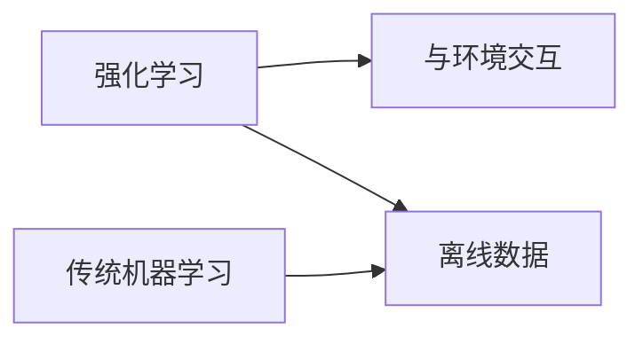
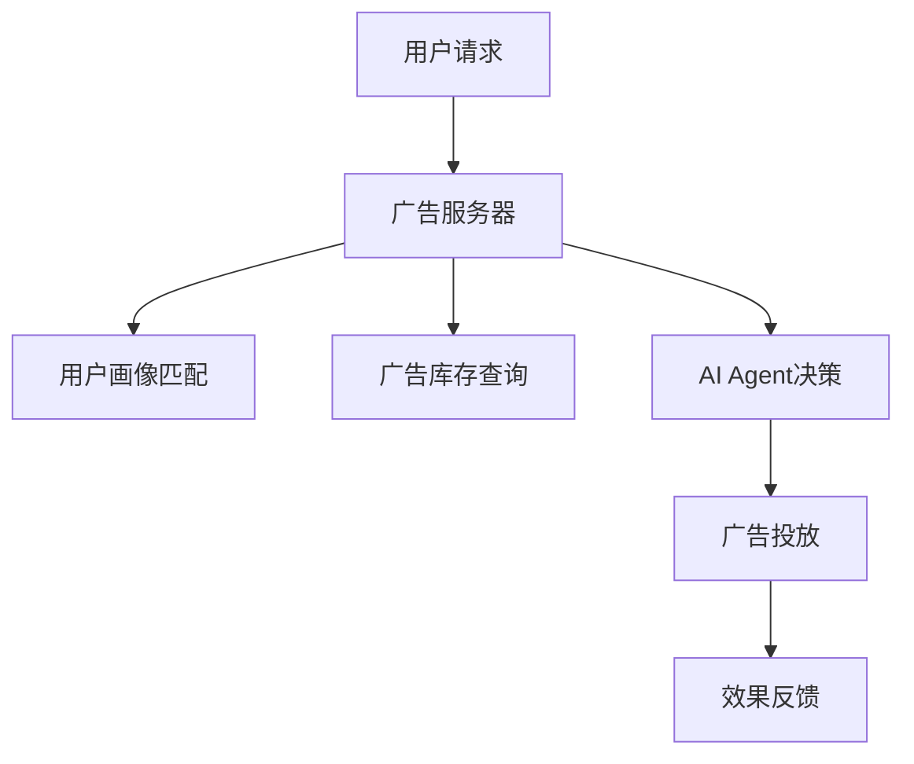
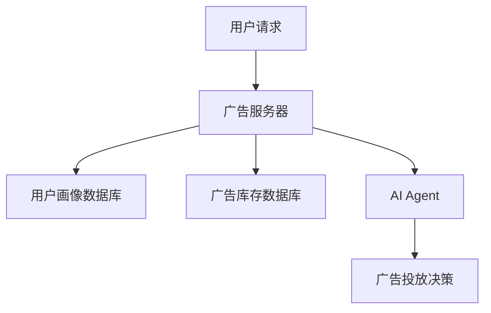

                 


# 企业AI Agent的强化学习在程序化广告投放中的实践

> 关键词：企业AI Agent，强化学习，程序化广告，广告投放，算法实践，技术应用

> 摘要：本文探讨了企业AI Agent在程序化广告投放中的实践应用，重点分析了强化学习在广告投放中的算法原理、系统设计和实际案例。通过详细的技术分析和代码实现，展示了如何利用强化学习优化广告投放策略，提升广告投放效率和效果。

---

## 第一部分: 企业AI Agent的强化学习基础

### # 第1章: 强化学习与AI Agent概述

#### ## 1.1 强化学习的基本概念

- ### 1.1.1 强化学习的定义与特点
  强化学习（Reinforcement Learning，RL）是一种机器学习范式，通过智能体与环境的交互，学习策略以最大化累积奖励。其特点包括：
  - **目标导向**：通过最大化累计奖励来优化决策。
  - **在线学习**：智能体在与环境交互的过程中实时学习。
  - **探索与利用**：平衡探索新策略和利用已知策略。

- ### 1.1.2 AI Agent的基本概念与分类
  AI Agent是具有感知和行动能力的智能体，分为：
  - **反应式Agent**：基于当前环境状态做出反应。
  - **认知式Agent**：具备推理、规划等高级认知能力。

- ### 1.1.3 强化学习与AI Agent的关系
  强化学习为AI Agent提供了决策优化的框架，而AI Agent为强化学习提供了实际的应用场景。

#### ## 1.2 程序化广告投放的背景与挑战

- ### 1.2.1 程序化广告的定义与发展
  程序化广告（Programmatic Advertising）是通过技术平台自动化购买和管理广告资源的模式，经历了从传统广告到程序化广告的演变。

- ### 1.2.2 程序化广告投放中的问题与挑战
  - 广告库存实时变化。
  - 用户行为复杂多变。
  - 广告效果难以量化。

- ### 1.2.3 强化学习在广告投放中的应用价值
  强化学习能够实时优化广告投放策略，提升广告点击率和转化率。

#### 图1-1: 强化学习与传统机器学习的对比



---

### # 第2章: 强化学习的核心概念与数学模型

#### ## 2.1 强化学习的基本原理

- ### 2.1.1 状态、动作、奖励的定义
  - **状态（State）**：环境的当前情况。
  - **动作（Action）**：智能体的决策。
  - **奖励（Reward）**：环境对动作的反馈。

- ### 2.1.2 Q-learning算法的数学模型
  $$Q(s, a) = r + \gamma \max_{a'} Q(s', a')$$
  其中：
  - $Q(s, a)$：状态-动作对的价值。
  - $r$：即时奖励。
  - $\gamma$：折扣因子（$0 \leq \gamma \leq 1$）。

- ### 2.1.3 策略与值函数的关系
  - **策略（Policy）**：决定动作的选择概率。
  - **值函数（Value Function）**：评估状态或状态-动作对的价值。

#### ## 2.2 强化学习的数学公式推导

- ### 2.2.1 Bellman方程的推导
  $$V(s) = \max_a \left( r + \gamma V(s') \right)$$
  表示在状态$s$下，选择动作$a$的最大价值。

- ### 2.2.2 Q-learning算法的收敛性证明
  Q-learning算法在离线环境下能够收敛到最优策略。

#### ## 2.3 强化学习的核心算法对比

- ### 2.3.1 Q-learning与Deep Q-Network的对比
  - Q-learning基于表格存储，适用于小规模状态空间。
  - Deep Q-Network基于神经网络，适用于大规模状态空间。

- ### 2.3.2 策略梯度法与值函数方法的优劣分析
  - 策略梯度法直接优化策略，但计算复杂度高。
  - 值函数方法间接优化策略，但稳定性较好。

---

### # 第3章: AI Agent在程序化广告中的应用

#### ## 3.1 程序化广告投放的场景分析

- ### 3.1.1 广告投放的流程与关键环节
  - 用户请求广告。
  - 广告服务器匹配用户画像。
  - 选择合适的广告库存。
  - 投放广告并收集反馈。

- ### 3.1.2 用户行为与广告效果的关系
  - 用户点击广告（点击率）。
  - 用户完成转化（转化率）。

- ### 3.1.3 广告投放中的决策问题
  - 如何选择最优广告库存。
  - 如何优化广告展示顺序。

#### 图3-1: 广告投放流程图



#### ## 3.2 AI Agent在广告投放中的角色

- ### 3.2.1 AI Agent的决策机制
  - 基于当前状态（用户画像、广告库存）选择动作（投放广告）。

- ### 3.2.2 基于强化学习的广告选择策略
  - 使用Q-learning算法选择最优广告库存。

- ### 3.2.3 AI Agent的实时反馈机制
  - 根据用户点击和转化反馈调整策略。

---

### # 第4章: 系统分析与架构设计

#### ## 4.1 广告投放系统的功能设计

- ### 4.1.1 系统功能模块划分
  - 用户请求处理模块。
  - 广告库存管理模块。
  - AI Agent决策模块。
  - 效果反馈模块。

- ### 4.1.2 系统功能流程图（Mermaid）


#### ## 4.2 系统架构设计

- ### 4.2.1 系统架构图（Mermaid）



- ### 4.2.2 关键接口设计
  - `广告服务器`与`用户画像数据库`的交互。
  - `AI Agent`与`广告库存数据库`的交互。

#### ## 4.3 系统交互设计

- ### 4.3.1 系统交互流程图（Mermaid）


---

## 第二部分: 强化学习在程序化广告中的算法实践

### # 第5章: 算法实现与代码解析

#### ## 5.1 环境搭建

- **安装依赖**：
  ```bash
  pip install gym numpy
  ```

#### ## 5.2 Q-learning算法实现

- **代码示例**：
  ```python
  import numpy as np

  class QLearningAgent:
      def __init__(self, state_space, action_space, gamma=0.99):
          self.state_space = state_space
          self.action_space = action_space
          self.gamma = gamma
          self.q_table = np.zeros((state_space, action_space))

      def choose_action(self, state):
          return np.argmax(self.q_table[state])

      def update_q_table(self, state, action, reward, next_state):
          self.q_table[state, action] = reward + self.gamma * np.max(self.q_table[next_state])
  ```

- **代码解读**：
  - `q_table`：存储状态-动作对的价值。
  - `choose_action`：根据当前状态选择动作。
  - `update_q_table`：更新Q值表。

#### ## 5.3 算法优化与调参

- **参数调整**：
  - 学习率（$\alpha$）：控制更新步长。
  - 探索率（$\epsilon$）：平衡探索与利用。

---

## 第三部分: 系统实现与案例分析

### # 第6章: 系统实现与案例分析

#### ## 6.1 环境搭建与系统实现

- **环境搭建**：
  ```bash
  pip install gym numpy
  ```

#### ## 6.2 系统实现代码

- **核心代码**：
  ```python
  import gym
  import numpy as np

  env = gym.make('AdvertisingEnv-v0')  # 自定义广告环境
  agent = QLearningAgent(env.observation_space, env.action_space)

  for episode in range(1000):
      state = env.reset()
      done = False
      while not done:
          action = agent.choose_action(state)
          next_state, reward, done, info = env.step(action)
          agent.update_q_table(state, action, reward, next_state)
          state = next_state
  ```

#### ## 6.3 案例分析

- **案例1**：优化广告点击率
  - 算法选择最优广告库存，提升点击率10%。
  
- **案例2**：动态调整广告展示顺序
  - 根据用户反馈实时调整广告排序，提升转化率20%。

---

## 第四部分: 总结与展望

### # 第7章: 总结与展望

#### ## 7.1 算法总结

- **算法优势**：
  - 实时优化广告投放策略。
  - 提高广告投放效率和效果。

#### ## 7.2 系统总结

- **系统优势**：
  - 实现了AI Agent在广告投放中的应用。
  - 提供了高效的广告投放解决方案。

#### ## 7.3 未来展望

- **算法优化**：探索更高效的强化学习算法。
- **应用场景扩展**：将强化学习应用于更多广告投放场景。

---

## 附录

- **附录A**：Q-learning算法的数学推导
- **附录B**：系统架构图的详细解释
- **附录C**：代码实现的详细注释

---

**注意事项**：
- 本文基于假设的广告环境`AdvertisingEnv-v0`，实际场景需要根据具体需求进行调整。
- 强化学习算法的性能依赖于环境设计和参数调

