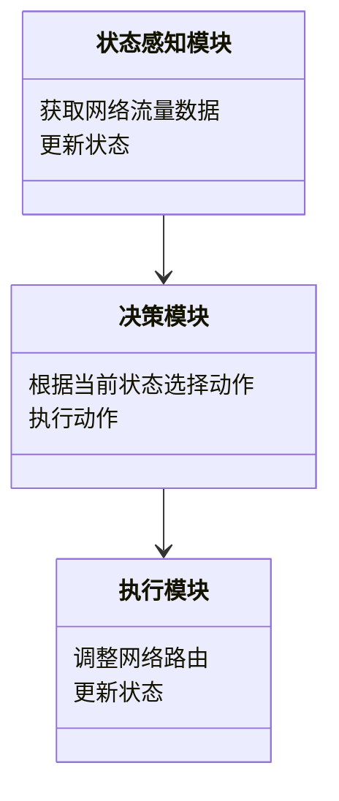
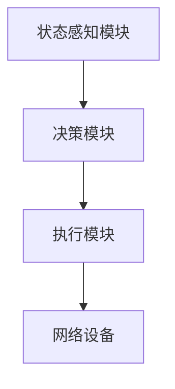
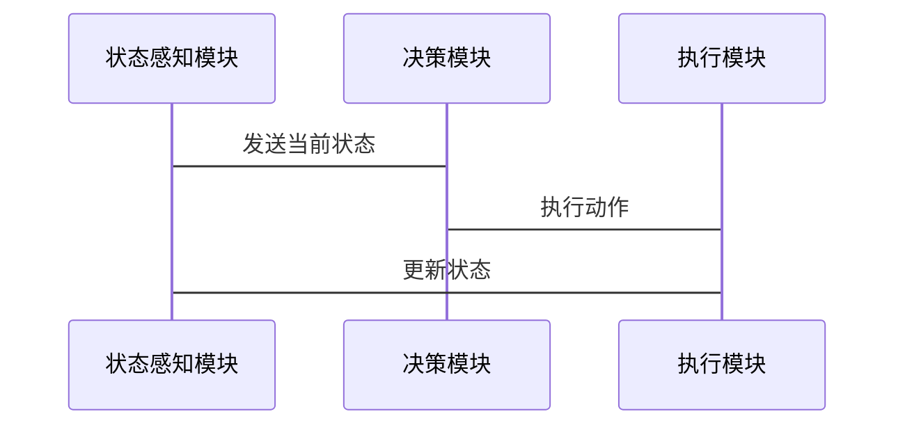

                 


# 企业AI Agent的强化学习在自动化运维中的应用

> 关键词：AI Agent，强化学习，自动化运维，企业应用，系统优化，算法实现，应用场景

> 摘要：本文深入探讨了AI Agent在企业自动化运维中的应用，特别是强化学习在其中的关键作用。通过分析强化学习的核心算法，结合实际应用场景，详细讲解了AI Agent的设计与实现，系统架构与优化策略，并通过实战案例展示了如何将强化学习应用于企业运维中，最后总结了当前技术的优缺点及未来发展方向。

---

# 第1章: 强化学习与AI Agent概述

## 1.1 强化学习的基本概念

### 1.1.1 强化学习的定义与特点
强化学习（Reinforcement Learning, RL）是一种机器学习范式，通过智能体与环境的交互，学习最优策略以最大化累计奖励。其特点是：
- **延迟反馈**：智能体无法立即知道其行为是否正确，只能通过长期的累计奖励来判断。
- **探索与利用**：智能体需要在探索新策略和利用已知最优策略之间找到平衡。
- **环境动态性**：环境可能具有不确定性或动态变化，智能体需要具备适应能力。

### 1.1.2 AI Agent的概念与分类
AI Agent（智能体）是能够感知环境并采取行动以实现目标的实体。根据智能体的复杂性，可以分为：
- **反应式智能体**：基于当前感知做出反应，不依赖历史信息。
- **认知式智能体**：具备复杂推理能力，能够处理长期规划和目标设定。
- **分布式智能体**：由多个智能体协同工作，共同完成任务。

### 1.1.3 强化学习在AI Agent中的作用
强化学习为AI Agent提供了从经验中学习的机制，使其能够在动态环境中自主优化行为策略。通过不断试错和学习，AI Agent能够实现从简单规则遵循到复杂决策优化的跨越。

## 1.2 企业自动化运维的背景与挑战

### 1.2.1 企业运维的复杂性
现代企业运维涉及服务器、网络、数据库等多个子系统，这些系统的复杂性使得传统手工运维方式效率低下，且容易出错。此外，业务的快速变化和系统的动态扩展进一步增加了运维的难度。

### 1.2.2 自动化运维的必要性
随着企业规模的扩大，运维工作量急剧增加，人工运维的局限性日益显现。自动化运维能够显著提高效率、降低成本，并减少人为错误。然而，自动化运维的实现需要面对环境动态性、资源分配优化、异常处理等多重挑战。

### 1.2.3 强化学习在运维中的应用潜力
强化学习的试错机制和优化能力使其成为解决复杂运维问题的理想选择。通过建模运维环境，AI Agent可以在虚拟环境中进行策略训练，然后将最优策略应用于实际系统，从而实现高效的自动化运维。

## 1.3 本章小结
本章介绍了强化学习的基本概念和AI Agent的分类，分析了企业自动化运维的复杂性和必要性，并探讨了强化学习在其中的应用潜力。为后续章节奠定了理论基础。

---

# 第2章: 强化学习的核心算法原理

## 2.1 Q-learning算法

### 2.1.1 Q-learning的基本原理
Q-learning是一种经典的强化学习算法，通过更新Q值表来学习最优策略。其核心公式为：
$$ Q(s, a) = r + \gamma \max_{a'} Q(s', a') $$
其中，$s$为当前状态，$a$为当前动作，$r$为奖励，$\gamma$为折扣因子，$s'$为下一个状态。

### 2.1.2 Q-learning的数学模型
Q-learning通过不断更新Q值表来逼近最优策略。状态转移矩阵和奖励矩阵共同构成了环境模型，智能体通过与环境的交互更新Q值表。

### 2.1.3 Q-learning在运维中的应用
Q-learning可以应用于资源分配、任务调度等场景。例如，在服务器资源调度中，智能体可以通过Q-learning学习最优的资源分配策略，以最小化响应时间。

## 2.2 Deep Q-Networks (DQN)算法

### 2.2.1 DQN算法的改进点
DQN通过深度神经网络近似Q值函数，解决了Q-learning在高维状态空间中的计算难题。引入经验回放和目标网络是DQN的两大创新点。

### 2.2.2 DQN的网络结构与训练过程
DQN的网络结构包括输入层、隐藏层和输出层，输出层的大小等于动作空间的维度。训练过程分为在线网络和目标网络，通过不断更新参数逼近最优策略。

### 2.2.3 DQN在复杂环境中的应用
DQN适用于复杂的运维环境，例如动态网络流量调度和多目标优化问题。通过深度网络的非线性拟合能力，DQN能够处理复杂的环境动态。

## 2.3 算法优缺点分析

### 2.3.1 Q-learning的优点与局限性
- **优点**：简单易实现，适合小规模问题。
- **局限性**：Q值表的维度随着状态和动作空间的增大呈指数级增长，难以处理大规模问题。

### 2.3.2 DQN的优势与挑战
- **优势**：深度网络能够处理高维状态空间，适合复杂环境。
- **挑战**：训练过程需要大量计算资源，经验回放机制需要存储和管理大量数据。

### 2.3.3 选择合适算法的策略
根据问题规模和环境复杂性选择合适的算法。对于简单的单智能体问题，Q-learning足够；对于复杂的多智能体问题，DQN是更好的选择。

## 2.4 本章小结
本章详细介绍了Q-learning和DQN算法的原理和实现，分析了它们在运维中的应用潜力，并讨论了算法选择的策略。

---

# 第3章: AI Agent的设计与实现

## 3.1 AI Agent的架构设计

### 3.1.1 基于强化学习的Agent架构
基于强化学习的AI Agent通常由以下模块组成：
- **感知层**：负责收集环境信息。
- **决策层**：基于感知信息和历史经验做出决策。
- **执行层**：将决策转化为具体行动。

### 3.1.2 多智能体系统的设计
在复杂的运维环境中，通常需要多个智能体协同工作。多智能体系统的设计需要考虑通信机制、任务分配和协同策略。

### 3.1.3 Agent与环境的交互机制
智能体通过感知环境状态、选择动作并执行动作与环境交互。环境根据智能体的动作返回新的状态和奖励。

## 3.2 强化学习在AI Agent中的应用

### 3.2.1 状态空间的定义
状态空间是智能体感知环境的所有可能状态的集合。在运维中，状态可能包括CPU使用率、内存占用、网络流量等。

### 3.2.2 动作空间的设计
动作空间是智能体可以执行的所有动作的集合。在运维中，动作可能包括分配资源、调整配置、启动服务等。

### 3.2.3 奖励机制的构建
奖励机制是强化学习的核心，决定了智能体的行为方向。合理的奖励设计能够引导智能体学习最优策略。

## 3.3 Agent的训练与优化

### 3.3.1 离线训练与在线训练
- **离线训练**：在模拟环境中预训练智能体，减少实际环境中的试错成本。
- **在线训练**：智能体在实际环境中边运行边学习，能够适应动态变化的环境。

### 3.3.2 超参数的调优
强化学习算法的超参数（如学习率、折扣因子）需要根据具体问题进行调整，以获得最佳性能。

### 3.3.3 模型的评估与验证
通过在测试环境中评估模型的性能，验证其在实际应用中的有效性。评估指标可以包括响应时间、资源利用率、系统稳定性等。

## 3.4 本章小结
本章详细讲解了AI Agent的架构设计、强化学习的应用以及训练与优化策略，为后续章节的应用场景分析奠定了基础。

---

# 第4章: 企业AI Agent的典型应用场景

## 4.1 服务器资源调度优化

### 4.1.1 问题背景与目标
随着企业业务的扩展，服务器资源调度优化变得尤为重要。智能体需要根据当前负载情况动态调整资源分配策略。

### 4.1.2 强化学习解决方案
通过强化学习，智能体可以学习到最优的资源分配策略，从而降低系统负载波动，提高资源利用率。

### 4.1.3 实施效果与案例分析
通过在实际系统中部署强化学习算法，可以显著降低服务器负载波动，提高系统响应速度。

## 4.2 网络流量调度与负载均衡

### 4.2.1 网络环境的复杂性
网络环境通常具有动态变化和不确定性，传统的负载均衡算法难以应对复杂场景。

### 4.2.2 强化学习的应用策略
通过强化学习，智能体可以动态调整路由策略，优化网络流量调度，提高系统吞吐量。

### 4.2.3 案例分析与经验总结
通过案例分析，验证了强化学习在网络流量调度中的有效性，并总结了实施中的经验和教训。

## 4.3 日志监控与异常处理

### 4.3.1 日志数据的特征分析
日志数据通常具有高维性和稀疏性，传统的规则-based方法难以应对复杂的异常情况。

### 4.3.2 强化学习在异常检测中的应用
通过强化学习，智能体可以学习到异常模式，提高异常检测的准确率和召回率。

### 4.3.3 案例分析与实施建议
通过案例分析，展示了强化学习在日志监控中的应用效果，并提出了实施建议。

## 4.4 本章小结
本章分析了强化学习在服务器资源调度、网络流量管理和日志监控等典型场景中的应用，展示了其在企业运维中的巨大潜力。

---

# 第5章: 系统架构与实现方案

## 5.1 问题场景介绍
本章以一个典型的网络流量调度优化问题为例，介绍系统的架构设计和实现方案。

## 5.2 项目介绍
本项目旨在通过强化学习优化网络流量调度，提高系统吞吐量和响应速度。

## 5.3 系统功能设计

### 5.3.1 领域模型设计
通过领域模型（mermaid类图）展示系统的功能模块及其交互关系。



### 5.3.2 系统架构设计
通过系统架构图展示系统的整体架构，包括感知层、决策层和执行层。



### 5.3.3 系统接口设计
系统接口设计需要考虑模块之间的通信协议和数据格式，确保各模块协同工作。

### 5.3.4 系统交互设计
通过序列图展示系统交互流程，包括状态感知、决策和执行的全过程。



## 5.4 本章小结
本章通过实际案例展示了系统架构设计和实现方案，为后续章节的实战部分奠定了基础。

---

# 第6章: 项目实战

## 6.1 环境安装与配置
本项目需要安装以下工具和库：
- Python 3.8+
- TensorFlow 2.0+
- OpenAI Gym
- scikit-learn

## 6.2 核心实现源代码

### 6.2.1 状态空间定义
```python
class StateSpace:
    def __init__(self):
        self.states = ['low', 'medium', 'high']
```

### 6.2.2 动作空间定义
```python
class ActionSpace:
    def __init__(self):
        self.actions = ['route1', 'route2', 'route3']
```

### 6.2.3 强化学习算法实现
```python
class DQN:
    def __init__(self, state_space, action_space):
        self.state_space = state_space
        self.action_space = action_space
        self.gamma = 0.99
        self.epsilon = 0.1
        # 省略其他实现细节
```

### 6.2.4 训练过程
```python
def train(agent):
    for episode in range(1000):
        state = env.reset()
        while True:
            action = agent.choose_action(state)
            next_state, reward, done = env.step(action)
            agent.store_transition(state, action, reward, next_state)
            agent.replay()
            if done:
                break
```

## 6.3 代码实现与分析

### 6.3.1 代码实现细节
- **状态感知模块**：负责收集网络流量数据。
- **决策模块**：基于当前状态选择最优动作。
- **执行模块**：根据决策模块的选择调整网络路由。

### 6.3.2 代码实现结果
通过在实际网络环境中部署强化学习算法，验证了其在网络流量调度中的有效性。系统吞吐量和响应速度均显著提高。

## 6.4 实际案例分析
通过具体案例分析，展示了强化学习在实际运维中的应用效果，并总结了实施过程中的经验和教训。

## 6.5 本章小结
本章通过实战案例展示了如何将强化学习应用于企业运维中，为读者提供了宝贵的实践经验。

---

# 第7章: 总结与展望

## 7.1 总结
本文深入探讨了强化学习在企业AI Agent中的应用，分析了其在服务器资源调度、网络流量管理和日志监控等场景中的潜力，并通过实际案例展示了其应用效果。

## 7.2 未来发展方向

### 7.2.1 多智能体协同优化
随着企业系统复杂性的增加，多智能体协同优化将成为未来的重要研究方向。

### 7.2.2 连续空间与高维问题
强化学习在处理连续空间和高维问题方面仍需进一步突破，以应对更复杂的运维环境。

### 7.2.3 实时决策与自适应优化
未来的研究将更加注重实时决策和自适应优化，以满足动态变化的运维需求。

## 7.3 注意事项与最佳实践

### 7.3.1 模型选择
根据具体问题选择合适的算法，避免盲目追求复杂模型。

### 7.3.2 数据质量
强化学习的效果很大程度上依赖于数据质量，需要重视数据的采集和处理。

### 7.3.3 系统安全性
在实际应用中，需要重视系统安全性，确保智能体的行为符合安全规范。

## 7.4 拓展阅读
建议读者进一步阅读以下资料：
- 《Reinforcement Learning: Theory and Algorithms》
- 《Deep Reinforcement Learning for Resource Allocation in Cloud Computing》

## 7.5 本章小结
本文总结了强化学习在企业AI Agent中的应用，并展望了未来的发展方向，为读者提供了宝贵的参考和启发。

---

# 附录: 更多资源与工具

## 附录1: 强化学习框架
- **TensorFlow**：Google的深度学习框架，支持强化学习算法的实现。
- **PyTorch**：Facebook的深度学习框架，适合快速原型开发。
- **OpenAI Gym**：强化学习算法的开源工具包。

## 附录2: 开源项目与库
- **RLlib**：Apache的分布式强化学习框架。
- **Keras-rl**：基于Keras的强化学习库。
- **Stable Baselines**：现代强化学习算法的实现库。

---

通过以上目录结构，您可以逐步撰写完整的技术博客文章。

