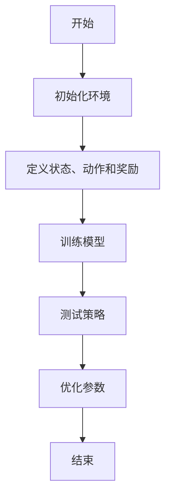
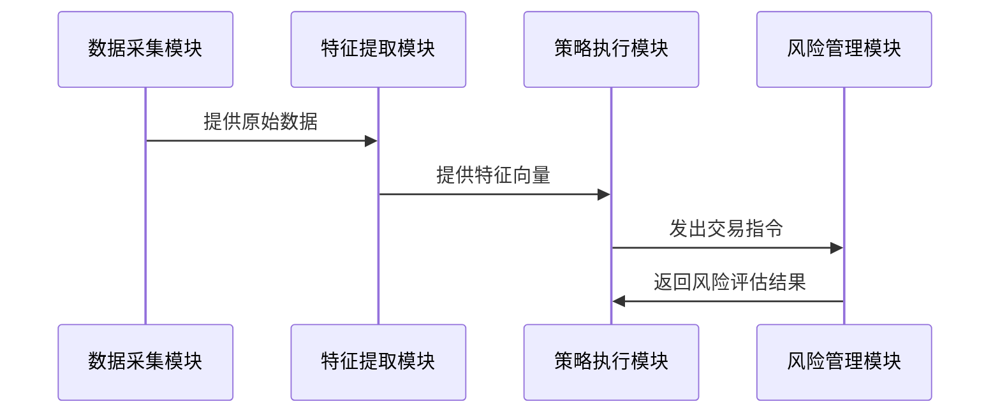

                 


# 企业AI Agent的强化学习在金融交易中的应用

---

## 关键词：企业AI Agent，强化学习，金融交易，算法交易，风险管理

---

## 摘要：  
本文探讨了企业AI Agent在金融交易中的应用，特别是强化学习技术的运用。文章从强化学习的基本概念和算法原理入手，详细分析了强化学习在金融交易中的应用场景、系统架构设计以及实际项目案例。通过结合理论与实践，本文为读者提供了从基础到应用的完整指南，帮助理解如何利用强化学习构建高效的AI Agent，以优化金融交易策略和风险管理。

---

# 第三章 强化学习在金融交易中的应用

## 3.1 金融交易中的强化学习场景

### 3.1.1 金融交易的核心问题

在金融交易中，AI Agent需要解决的核心问题包括：  
1. **市场预测**：预测股票价格、汇率等金融资产的波动。  
2. **交易策略优化**：制定买入、卖出或持有等决策。  
3. **风险管理**：控制交易中的风险，避免重大损失。  
4. **高频交易**：在极短时间内完成大量交易决策。  

### 3.1.2 强化学习的应用场景

#### 1. 自动化交易策略

AI Agent通过强化学习算法，可以在金融市场中自动学习最优交易策略。例如，DQN算法可以用于股票交易中的买卖决策，帮助AI Agent在不同的市场条件下做出最优选择。

#### 2. 风险管理

强化学习可以帮助AI Agent在交易过程中实时评估风险，并根据市场变化调整策略，从而降低潜在损失。

#### 3. 跨资产交易

通过强化学习，AI Agent可以在多种资产类别（如股票、债券、外汇等）之间进行优化配置，实现更高效的资产管理和风险控制。

---

## 3.2 强化学习在金融交易中的挑战

### 3.2.1 数据稀疏性

金融市场中的数据通常具有稀疏性，尤其是在极端市场条件下，数据样本较少，导致强化学习模型难以有效学习。

### 3.2.2 市场环境的动态变化

金融市场的波动性高，政策变化、经济指标等因素都会影响市场走势，使得强化学习模型难以长期保持稳定性能。

### 3.2.3 交易成本与延迟

高频交易需要极低的延迟和极高的交易速度，这对AI Agent的实时决策能力提出了更高的要求。

### 3.2.4 监管与伦理问题

金融交易中的AI Agent需要遵守相关法律法规，同时避免市场操纵等不正当行为，这对模型的设计和应用提出了额外的挑战。

---

## 3.3 基于强化学习的交易策略设计

### 3.3.1 状态空间设计

状态空间是强化学习模型感知市场环境的输入。在金融交易中，状态空间可以包括以下指标：  
- 当前资产价格  
- 历史价格数据（如过去n天的价格）  
- 市场成交量  
- 技术指标（如移动平均线、RSI等）  

### 3.3.2 动作空间设计

动作空间定义了AI Agent在每个时间步可以执行的操作。在金融交易中，常见的动作包括：  
- 买入  
- 卖出  
- 持有  

### 3.3.3 奖励函数设计

奖励函数是强化学习模型的目标函数，用于衡量AI Agent的交易表现。在金融交易中，奖励函数通常可以设计为：  
$$ reward = \text{收益} - \text{风险} $$  
其中，收益可以是资产的收益率，风险可以是波动率或最大回撤。

### 3.3.4 强化学习流程

以下是基于强化学习的交易策略设计流程图：



---

## 3.4 实际案例分析

### 3.4.1 案例背景

假设我们设计一个AI Agent用于股票交易，目标是在一段时间内最大化收益。

### 3.4.2 数据处理

我们需要将股票价格数据转换为强化学习模型可以处理的输入格式。例如，使用归一化处理和滑动窗口技术提取特征。

### 3.4.3 模型训练

使用DQN算法训练AI Agent的交易策略。训练过程中，AI Agent通过与虚拟市场环境交互，不断优化动作选择以最大化累计奖励。

### 3.4.4 模型评估

在测试阶段，评估AI Agent的交易表现，包括收益率、最大回撤、 Sharpe比率等指标。

---

# 第四章 AI Agent的系统架构与设计

## 4.1 系统架构设计

### 4.1.1 系统模块划分

AI Agent的系统架构通常包括以下几个模块：  
1. **数据采集模块**：从金融市场获取实时数据。  
2. **特征提取模块**：将原始数据转换为模型可接受的特征向量。  
3. **策略执行模块**：根据模型输出的决策执行交易操作。  
4. **风险管理模块**：监控和管理交易中的风险。  

### 4.1.2 系统架构图

以下是系统架构的Mermaid图：


---

## 4.2 组件交互设计

### 4.2.1 数据流设计

以下是系统组件的交互序列图：



---

## 4.3 数据预处理与特征提取

### 4.3.1 数据预处理

数据预处理包括：  
1. 数据清洗：处理缺失值、异常值。  
2. 数据归一化：将数据标准化，使其具有相似的尺度。  
3. 时间序列处理：提取时间相关的特征（如开盘价、收盘价、成交量等）。  

### 4.3.2 特征提取

常用的特征提取方法包括：  
- 技术指标：如RSI、MACD、移动平均线等。  
- 市场情绪指标：如VIX指数、新闻情感分析等。  
- 统计特征：如波动率、平均收益率等。  

---

## 4.4 系统接口设计

### 4.4.1 数据接口

系统需要与金融数据源（如股票交易API）进行交互，获取实时数据。

### 4.4.2 交易接口

系统需要与交易执行系统（如 brokerage API）进行交互，执行买入、卖出等操作。

### 4.4.3 风险监控接口

系统需要与风险管理系统进行交互，实时监控交易风险。

---

# 第五章 强化学习的项目实战

## 5.1 环境搭建

### 5.1.1 安装依赖

安装所需的Python库：  
```bash
pip install numpy pandas keras tensorflow matplotlib
```

### 5.1.2 环境配置

配置金融数据源，例如使用Yahoo Finance API获取股票数据。

---

## 5.2 核心实现

### 5.2.1 环境定义

定义强化学习环境，包括状态空间、动作空间和奖励函数。

### 5.2.2 策略网络

实现策略网络，用于输出动作的概率分布。

### 5.2.3 价值网络

实现价值网络，用于估计状态的价值。

---

## 5.3 代码实现与解读

### 5.3.1 环境代码

```python
import numpy as np

class TradingEnv:
    def __init__(self, data):
        self.data = data
        self.current_step = 0
        self.done = False
        self.state = self._get_state(0)
        
    def _get_state(self, step):
        # 返回当前步的状态，可以是价格、成交量等特征
        return self.data[step]
    
    def step(self, action):
        # 执行动作并返回下一个状态、奖励、是否结束
        self.current_step += 1
        next_state = self._get_state(self.current_step)
        reward = self._calculate_reward(action)
        done = self.current_step == len(self.data) - 1
        return next_state, reward, done
    
    def _calculate_reward(self, action):
        # 根据动作和实际收益计算奖励
        # 这里简化为随机奖励，实际应用中需要根据策略计算
        return np.random.random()
```

### 5.3.2 策略网络代码

```python
import tensorflow as tf
from tensorflow.keras import layers

def build_policy_model(state_shape):
    model = tf.keras.Sequential()
    model.add(layers.Dense(64, activation='relu', input_shape=state_shape))
    model.add(layers.Dense(3, activation='softmax'))  # 动作空间大小为3（买入、卖出、持有）
    return model
```

### 5.3.3 价值网络代码

```python
def build_value_model(state_shape):
    model = tf.keras.Sequential()
    model.add(layers.Dense(64, activation='relu', input_shape=state_shape))
    model.add(layers.Dense(1, activation='linear'))
    return model
```

---

## 5.4 实际案例分析

### 5.4.1 数据获取

使用Yahoo Finance API获取股票数据：

```python
import pandas_datareader as pdr

data = pdr.get_data_yahoo("AAPL", start="2020-01-01", end="2023-12-31")
```

### 5.4.2 模型训练

训练强化学习模型，优化交易策略。

### 5.4.3 模型评估

评估模型在测试集上的表现，包括收益率、风险指标等。

---

## 5.5 模型评估与优化

### 5.5.1 模型评估指标

常用的模型评估指标包括：  
- **收益率**：累计收益百分比。  
- **回撤**：从峰值到低谷的最大回撤幅度。  
- **Sharpe比率**：衡量收益与风险的比值。  

### 5.5.2 模型优化

根据评估结果，调整模型参数（如网络层数、学习率等），以优化交易表现。

---

# 第六章 最佳实践、小结与扩展阅读

## 6.1 最佳实践

1. **数据处理**：确保数据的高质量和代表性。  
2. **模型选择**：根据具体问题选择合适的强化学习算法。  
3. **风险管理**：在交易中始终优先考虑风险管理。  
4. **持续优化**：定期更新模型，适应市场变化。  

## 6.2 小结

本文详细探讨了企业AI Agent在金融交易中的应用，从强化学习的基本原理到实际项目案例，为读者提供了完整的知识体系。通过理论与实践的结合，帮助读者理解如何利用强化学习优化金融交易策略。

## 6.3 注意事项

1. **避免过拟合**：在训练过程中，防止模型过拟合训练数据。  
2. **监管合规**：确保AI Agent的交易行为符合相关法律法规。  
3. **模型解释性**：提升模型的可解释性，便于调试和优化。  

## 6.4 扩展阅读

1. **书籍**：《Reinforcement Learning: Theory and Algorithms》  
2. **论文**：DeepMind的《Playing Atari Games Using Deep Reinforcement Learning》  
3. **技术博客**：Kaggle上的金融数据分析与机器学习实践。

---

通过本文的学习，读者可以掌握强化学习在金融交易中的核心原理和实际应用，为构建高效的AI Agent打下坚实的基础。

