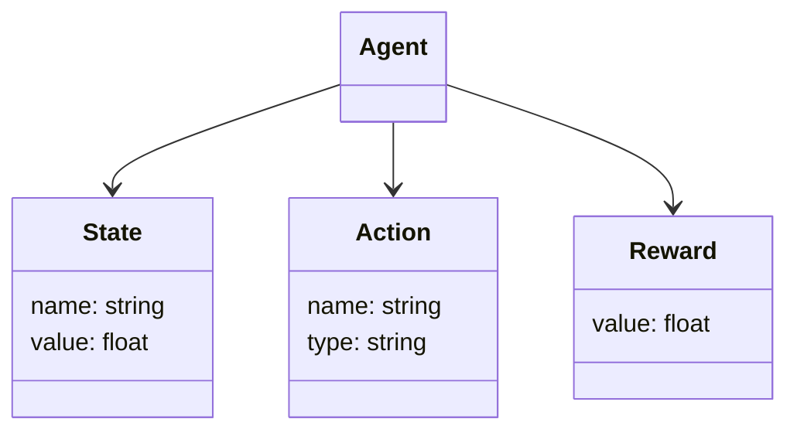
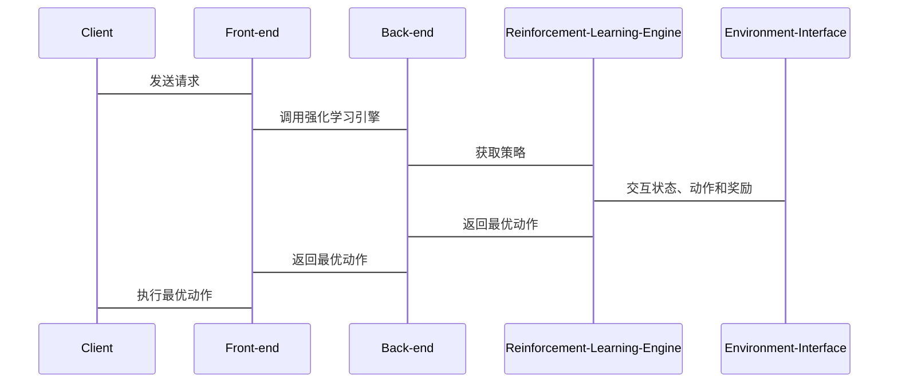

                 


# 企业AI Agent的强化学习应用：优化决策过程

---

## 关键词：
- 企业AI Agent
- 强化学习
- 决策优化
- 算法原理
- 系统架构

---

## 摘要：
本文探讨了企业AI Agent在强化学习中的应用，详细分析了强化学习的核心概念、算法原理及其在企业决策优化中的实际应用。文章从企业决策优化的背景与挑战入手，深入讲解了强化学习的基本原理、核心算法（如Q-Learning、DQN）以及AI Agent的系统架构设计。通过实际案例分析，展示了如何利用强化学习优化企业决策过程，并提供了系统实现和最佳实践的指导。

---

## 正文：

---

# 第一部分：企业AI Agent与强化学习概述

---

## 第1章：企业AI Agent与强化学习概述

### 1.1 AI Agent的基本概念

#### 1.1.1 AI Agent的定义与特点

AI Agent（人工智能代理）是一种智能体，能够感知环境并采取行动以实现目标。AI Agent的特点包括自主性、反应性、目标导向性和社会性。

- **自主性**：AI Agent能够在没有外部干预的情况下自主决策。
- **反应性**：AI Agent能够根据环境的变化调整自己的行为。
- **目标导向性**：AI Agent的行为旨在实现特定目标。
- **社会性**：AI Agent能够与其他AI Agent或人类交互协作。

#### 1.1.2 企业AI Agent的应用场景

企业AI Agent广泛应用于以下几个场景：

- **智能客服**：通过自然语言处理技术为用户提供24/7的智能客服支持。
- **供应链优化**：AI Agent可以监控供应链数据，优化库存管理和物流调度。
- **金融交易**：AI Agent可以实时分析市场数据，辅助做出最优交易决策。
- **风险管理**：AI Agent可以实时监控企业运营风险，提出风险规避策略。

#### 1.1.3 强化学习在AI Agent中的作用

强化学习是一种通过试错机制优化决策过程的机器学习方法。在AI Agent中，强化学习用于优化代理的行为策略，使其在动态环境中做出最优决策。

---

### 1.2 强化学习的基本原理

#### 1.2.1 强化学习的定义与特点

强化学习（Reinforcement Learning, RL）是一种机器学习范式，通过智能体与环境的交互，智能体通过试错学习来优化其行为策略。

- **试错学习**：智能体通过与环境交互，不断尝试不同的动作，逐步优化行为策略。
- **奖励机制**：智能体通过环境提供的奖励信号来评估其行为的好坏，并据此调整策略。
- **目标导向性**：强化学习的目标是通过最大化累积奖励来优化行为策略。

#### 1.2.2 强化学习的核心要素

强化学习的核心要素包括：

- **状态（State）**：智能体所处的环境状态。
- **动作（Action）**：智能体在给定状态下采取的行为。
- **奖励（Reward）**：智能体行为后，环境给予的反馈，用于指导智能体优化行为。
- **策略（Policy）**：智能体选择动作的概率分布，决定了如何根据状态选择动作。
- **值函数（Value Function）**：衡量状态或动作-状态对的价值，用于评估策略的优劣。

#### 1.2.3 强化学习与监督学习的区别

- **监督学习**：基于标记的训练数据，学习输入到输出的映射关系。
- **强化学习**：基于与环境的交互，通过试错优化行为策略。

---

### 1.3 企业决策优化的背景与挑战

#### 1.3.1 企业决策优化的背景

随着企业规模的不断扩大和市场竞争的加剧，传统的决策方法已经难以应对复杂的动态环境。企业需要一种更加灵活和高效的决策优化方法。

#### 1.3.2 传统决策方法的局限性

- **静态性**：传统决策方法通常基于静态数据，难以应对动态变化的环境。
- **主观性**：传统决策方法依赖于人类专家的经验和判断，具有较强的主观性。
- **低效性**：传统决策方法的优化过程通常需要大量的人工干预，效率较低。

#### 1.3.3 强化学习在决策优化中的优势

- **动态适应性**：强化学习能够根据环境的变化自适应地调整决策策略。
- **数据驱动**：强化学习通过与环境的交互，不断积累数据，优化决策策略。
- **高效性**：强化学习能够通过试错机制快速找到最优或近似最优的决策策略。

---

### 1.4 本章小结

本章介绍了企业AI Agent的基本概念、应用场景以及强化学习的基本原理和核心要素。通过对比强化学习与监督学习的区别，强调了强化学习在企业决策优化中的优势。

---

## 第2章：强化学习的核心概念与算法原理

### 2.1 状态、动作与奖励

#### 2.1.1 状态空间的定义与特点

- **状态空间**：智能体所处的所有可能状态的集合。
- **特点**：
  - 离散性：状态空间可以是离散的，也可以是连续的。
  - 马尔可夫性质：当前状态足以描述未来的决策，无需考虑历史状态。

#### 2.1.2 动作空间的定义与特点

- **动作空间**：智能体在给定状态下可以采取的所有动作的集合。
- **特点**：
  - 离散性：动作空间通常为离散的，例如“左转”、“右转”。
  - 连续性：在某些情况下，动作空间可以是连续的，例如调整温度。

#### 2.1.3 奖励函数的设计与优化

- **奖励函数**：定义智能体行为的优劣，通常是一个标量值。
- **设计原则**：
  - 明确性：奖励函数应清晰地反映行为的好坏。
  - 可调性：奖励函数可以根据任务需求进行调整。

---

### 2.2 策略与价值函数

#### 2.2.1 策略的定义与类型

- **策略**：智能体在给定状态下选择动作的概率分布。
- **类型**：
  - 确定性策略：智能体在给定状态下选择唯一动作。
  - 随机性策略：智能体在给定状态下选择多个动作的概率分布。

#### 2.2.2 价值函数的定义与作用

- **价值函数**：衡量状态或动作-状态对的价值，通常定义为从当前状态开始的期望累积奖励。
- **作用**：价值函数用于评估策略的优劣，指导策略的优化。

#### 2.2.3 策略与价值函数的关系

- **关系**：价值函数是策略的函数，即价值函数依赖于策略的选择。

---

### 2.3 马尔可夫决策过程（MDP）

#### 2.3.1 MDP的定义与特点

- **MDP**：强化学习的基本模型，描述智能体与环境的交互过程。
- **特点**：
  - 状态空间：智能体所处的所有可能状态的集合。
  - 动作空间：智能体在给定状态下可以采取的所有动作的集合。
  - 转换概率：从当前状态采取动作后转移到下一个状态的概率。
  - 奖励函数：智能体行为后获得的奖励。

#### 2.3.2 MDP的状态转移概率

- **状态转移概率**：从当前状态采取动作后转移到下一个状态的概率。

#### 2.3.3 MDP的最优策略求解

- **最优策略**：在MDP中，最优策略是指在所有可能的策略中，能够使累积奖励最大的策略。

---

### 2.4 本章小结

本章详细讲解了强化学习的核心概念，包括状态、动作、奖励、策略和价值函数。通过马尔可夫决策过程的定义与特点，强调了强化学习的基本模型。

---

## 第3章：强化学习的核心算法

### 3.1 Q-Learning算法

#### 3.1.1 Q-Learning的基本原理

- **Q-Learning**：一种基于值函数的强化学习算法，通过学习状态-动作对的价值来优化决策策略。
- **基本原理**：通过不断更新Q表（Q-Table）来优化状态-动作对的价值。

#### 3.1.2 Q-Learning的算法步骤

1. 初始化Q表：所有状态-动作对的初始价值设为0。
2. 与环境交互：智能体根据当前状态选择一个动作，并执行该动作。
3. 获取奖励：智能体根据执行的动作获得奖励。
4. 更新Q表：根据贝尔曼方程更新状态-动作对的价值。
5. 重复上述步骤，直到收敛。

#### 3.1.3 Q-Learning的优缺点

- **优点**：
  - 简单易实现。
  - 离线学习，适合离散状态空间和动作空间。
- **缺点**：
  - 需要完整的状态空间和动作空间。
  - 不适合连续状态空间和动作空间。

---

### 3.2 Deep Q-Networks（DQN）算法

#### 3.2.1 DQN的基本原理

- **DQN**：一种基于深度神经网络的强化学习算法，通过神经网络近似值函数来优化决策策略。
- **基本原理**：使用深度神经网络近似值函数，通过经验回放和目标网络来优化神经网络的参数。

#### 3.2.2 DQN的网络结构与训练过程

1. 经验回放：将智能体与环境交互得到的经验存储在经验回放池中。
2. 批量训练：从经验回放池中随机抽取一批经验，训练深度神经网络。
3. 目标网络：使用目标网络来稳定训练过程，避免更新频繁导致的不稳定。

#### 3.2.3 DQN的优缺点

- **优点**：
  - 能够处理连续状态空间和动作空间。
  - 经验回放池能够加速训练过程。
  - 目标网络能够稳定训练过程。
- **缺点**：
  - 训练过程较为复杂。
  - 需要大量的计算资源。

---

### 3.3 Policy Gradient方法

#### 3.3.1 Policy Gradient的基本原理

- **Policy Gradient**：一种基于策略的强化学习算法，通过直接优化策略来最大化累积奖励。
- **基本原理**：通过计算策略的梯度，优化策略的参数。

#### 3.3.2 Policy Gradient的优化过程

1. 初始化策略参数：随机初始化策略参数。
2. 与环境交互：智能体根据当前策略选择动作，并执行该动作。
3. 计算梯度：根据累积奖励计算策略的梯度。
4. 更新策略参数：根据梯度更新策略参数。
5. 重复上述步骤，直到收敛。

#### 3.3.3 Policy Gradient的优缺点

- **优点**：
  - 直接优化策略，无需近似值函数。
  - 适合连续动作空间。
- **缺点**：
  - 训练过程不稳定。
  - 需要处理复杂的梯度计算。

---

### 3.4 Actor-Critic方法

#### 3.4.1 Actor-Critic的基本原理

- **Actor-Critic**：一种结合策略和值函数的强化学习算法，通过同时优化策略和值函数来加速训练过程。
- **基本原理**：使用Actor网络优化策略，使用Critic网络评估策略的好坏。

#### 3.4.2 Actor-Critic的优化过程

1. 初始化Actor和Critic网络：随机初始化Actor和Critic网络的参数。
2. 与环境交互：智能体根据Actor网络选择动作，并执行该动作。
3. 获取奖励：智能体根据执行的动作获得奖励。
4. 更新Critic网络：根据累积奖励更新Critic网络的参数。
5. 更新Actor网络：根据Critic网络的反馈更新Actor网络的参数。
6. 重复上述步骤，直到收敛。

#### 3.4.3 Actor-Critic的优缺点

- **优点**：
  - 结合策略和值函数，加速训练过程。
  - 适合复杂环境中的决策优化。
- **缺点**：
  - 训练过程较为复杂。
  - 需要同时优化两个网络。

---

### 3.5 本章小结

本章详细讲解了强化学习的核心算法，包括Q-Learning、DQN、Policy Gradient和Actor-Critic方法。通过对比不同算法的优缺点，帮助读者选择合适的算法应用于实际场景。

---

## 第4章：企业AI Agent的系统分析与架构设计

### 4.1 系统功能设计

#### 4.1.1 领域模型（Domain Model）

- **领域模型**：描述企业AI Agent所处的业务领域，包括状态、动作和奖励的定义。
- **示意图**：使用Mermaid绘制领域模型的类图。



#### 4.1.2 系统架构设计

- **系统架构**：包括前端界面、后端服务、强化学习引擎和环境接口。
- **示意图**：使用Mermaid绘制系统架构图。

```mermaid
client
    front-end
        back-end
            reinforcement-learning-engine
                environment-interface
```

---

### 4.2 系统交互设计

#### 4.2.1 系统交互流程

- **交互流程**：
  1. 客户端发送请求到后端服务。
  2. 后端服务调用强化学习引擎。
  3. 强化学习引擎与环境接口交互，获取状态、动作和奖励。
  4. 强化学习引擎更新策略，返回最优动作。
  5. 客户端接收并执行最优动作。

- **示意图**：使用Mermaid绘制系统交互流程图。



---

### 4.3 本章小结

本章详细讲解了企业AI Agent的系统架构设计，包括系统功能设计、系统架构设计和系统交互设计。通过Mermaid图表展示了系统的结构和交互流程。

---

## 第5章：项目实战——企业AI Agent的强化学习实现

### 5.1 环境安装

#### 5.1.1 安装Python

- **安装命令**：
  ```bash
  python --version
  ```

#### 5.1.2 安装强化学习库

- **安装命令**：
  ```bash
  pip install numpy
  pip install gym
  pip install tensorflow
  ```

---

### 5.2 系统核心实现

#### 5.2.1 强化学习引擎的实现

- **代码示例**：

```python
import gym
import numpy as np
import tensorflow as tf

# 初始化环境
env = gym.make('CartPole-v0')
env.reset()

# 定义神经网络模型
model = tf.keras.Sequential([
    tf.keras.layers.Dense(64, activation='relu'),
    tf.keras.layers.Dense(2, activation='softmax')
])

# 定义策略优化函数
def optimize_policy():
    # 获取当前状态
    state = env.observation_space.sample()
    # 预测动作概率
    probabilities = model.predict(tf.expand_dims(state, axis=0))
    # 选择动作
    action = np.random.choice(2, p=probabilities[0])
    # 执行动作
    next_state, reward, done, _ = env.step(action)
    # 更新策略
    if done:
        env.reset()
    return reward

# 训练过程
for _ in range(1000):
    optimize_policy()
```

---

### 5.3 实际案例分析

#### 5.3.1 供应链优化案例

- **案例描述**：通过强化学习优化企业的供应链管理，降低库存成本，提高供应链效率。
- **代码示例**：
  ```python
  import numpy as np
  import gym
  from gym import spaces

  # 定义供应链环境
  class SupplyChainEnv(gym.Env):
      def __init__(self):
          self.observation_space = spaces.Box(low=0, high=100, shape=(1,))
          self.action_space = spaces.Box(low=0, high=10, shape=(1,))
          self.state = 0

      def step(self, action):
          # 计算库存成本
          inventory_cost = abs(self.state - action) * 2
          # 计算总成本
          total_cost = inventory_cost + abs(action - 5) * 1
          # 返回新的状态、奖励和终止标志
          self.state = action
          reward = -total_cost
          done = False
          return self.state, reward, done, {}

      def reset(self):
          self.state = 0
          return self.state

  # 初始化环境
  env = SupplyChainEnv()
  env.reset()

  # 定义强化学习算法
  class DQN:
      def __init__(self, state_space, action_space):
          self.state_space = state_space
          self.action_space = action_space
          self.q_table = np.zeros((self.state_space.shape[0], self.action_space.shape[0]))

      def choose_action(self, state):
          # 随机选择动作
          if np.random.random() < 0.1:
              return np.random.randint(0, self.action_space.shape[0])
          else:
              return np.argmax(self.q_table[state[0]])

      def learn(self, state, action, reward):
          # 更新Q表
          self.q_table[state[0]][action] += 0.1 * (reward + np.max(self.q_table[state[0]]))

  # 训练过程
  dqn = DQN(env.observation_space, env.action_space)
  for _ in range(100):
      state = env.reset()
      done = False
      while not done:
          action = dqn.choose_action(state)
          next_state, reward, done, _ = env.step(action)
          dqn.learn(state, action, reward)
          state = next_state

  # 测试过程
  state = env.reset()
  done = False
  while not done:
      action = dqn.choose_action(state)
      print(f"Action: {action}")
      state, reward, done, _ = env.step(action)
  ```

---

### 5.4 本章小结

本章通过具体的项目实战，详细讲解了企业AI Agent的强化学习实现。通过供应链优化案例，展示了如何利用强化学习优化企业的决策过程。

---

## 第6章：最佳实践与注意事项

### 6.1 最佳实践

#### 6.1.1 环境设计

- **建议**：确保环境设计能够准确反映企业的实际业务场景。
- **理由**：环境设计直接影响强化学习算法的性能。

#### 6.1.2 策略优化

- **建议**：根据实际业务需求选择合适的强化学习算法。
- **理由**：不同的算法适用于不同的场景，选择合适的算法能够提高决策优化效果。

#### 6.1.3 模型训练

- **建议**：在实际训练过程中，逐步增加训练数据量，避免过拟合。
- **理由**：逐步增加数据量能够提高模型的泛化能力。

---

### 6.2 小结

本章总结了企业AI Agent的强化学习应用中的最佳实践，包括环境设计、策略优化和模型训练等方面。

---

### 6.3 注意事项

- **数据质量**：强化学习的高度依赖于数据的质量，确保数据的准确性和完整性。
- **算法选择**：根据具体场景选择合适的强化学习算法，避免盲目使用。
- **系统稳定性**：在实际应用中，确保系统的稳定性和安全性，避免因系统故障导致的损失。

---

## 第7章：拓展阅读与未来展望

### 7.1 拓展阅读

#### 7.1.1 强化学习的经典论文

- **论文1**：《Deep Reinforcement Learning with Double Q-learning》
- **论文2**：《Actor-Critic Algorithms》
- **论文3**：《Reinforcement Learning: Theory and Algorithms》

#### 7.1.2 强化学习的最新研究

- **研究1**：基于神经网络的强化学习算法。
- **研究2**：强化学习在多智能体系统中的应用。

---

### 7.2 未来展望

随着强化学习技术的不断发展，企业AI Agent的应用场景将更加广泛。未来的研究方向包括：

- **多智能体强化学习**：研究多个智能体之间的协作与竞争。
- **连续控制强化学习**：研究在连续动作空间中的强化学习算法。
- **强化学习的安全性**：研究如何确保强化学习系统的安全性。

---

## 附录：完整的Python代码实现

### 附录A：强化学习算法实现

#### 附录A.1：Q-Learning算法实现

```python
import gym
import numpy as np

# 初始化环境
env = gym.make('CartPole-v0')
env.reset()

# 定义Q-Learning算法
class QLearning:
    def __init__(self, state_space, action_space):
        self.state_space = state_space
        self.action_space = action_space
        self.q_table = np.zeros((self.state_space.shape[0], self.action_space.shape[0]))

    def choose_action(self, state):
        # 随机选择动作
        if np.random.random() < 0.1:
            return np.random.randint(0, self.action_space.shape[0])
        else:
            return np.argmax(self.q_table[state[0]])

    def learn(self, state, action, reward):
        # 更新Q表
        self.q_table[state[0]][action] += 0.1 * (reward + np.max(self.q_table[state[0]]))

# 训练过程
ql = QLearning(env.observation_space, env.action_space)
for _ in range(100):
    state = env.reset()
    done = False
    while not done:
        action = ql.choose_action(state)
        next_state, reward, done, _ = env.step(action)
        ql.learn(state, action, reward)
        state = next_state

# 测试过程
state = env.reset()
done = False
while not done:
    action = ql.choose_action(state)
    print(f"Action: {action}")
    state, reward, done, _ = env.step(action)
```

---

## 附录B：系统架构设计

#### 附录B.1：系统架构图

```mermaid
client
    front-end
        back-end
            reinforcement-learning-engine
                environment-interface
```

---

## 附录C：系统交互流程图


---

## 附录D：数学公式

#### 附录D.1：贝尔曼方程

$$ V(s) = \max_{a} [ r(s,a) + V(s') ] $$

其中：
- \( V(s) \) 表示状态 \( s \) 的值函数。
- \( r(s,a) \) 表示在状态 \( s \) 下采取动作 \( a \) 后获得的奖励。
- \( V(s') \) 表示从状态 \( s' \) 开始的期望累积奖励。

---

## 参考文献

1. 纸质书籍：
   - Russell, S., & Norvig, P. (2010).《人工智能:一种现代的方法》.
2. 网络资源：
   - OpenAI. (2023).《Gym Library Documentation》.

---

# 结语

企业AI Agent的强化学习应用是一个充满挑战但也极具潜力的领域。通过本文的详细讲解，读者可以全面了解强化学习的核心概念、算法原理以及在企业决策优化中的实际应用。未来，随着强化学习技术的不断发展，企业AI Agent的应用场景将更加广泛，为企业创造更大的价值。

---

