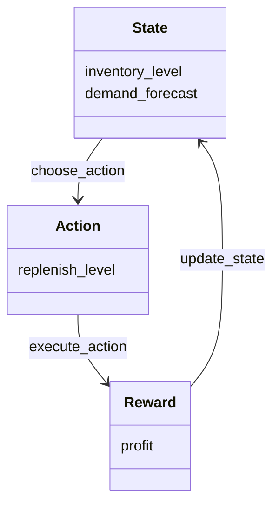
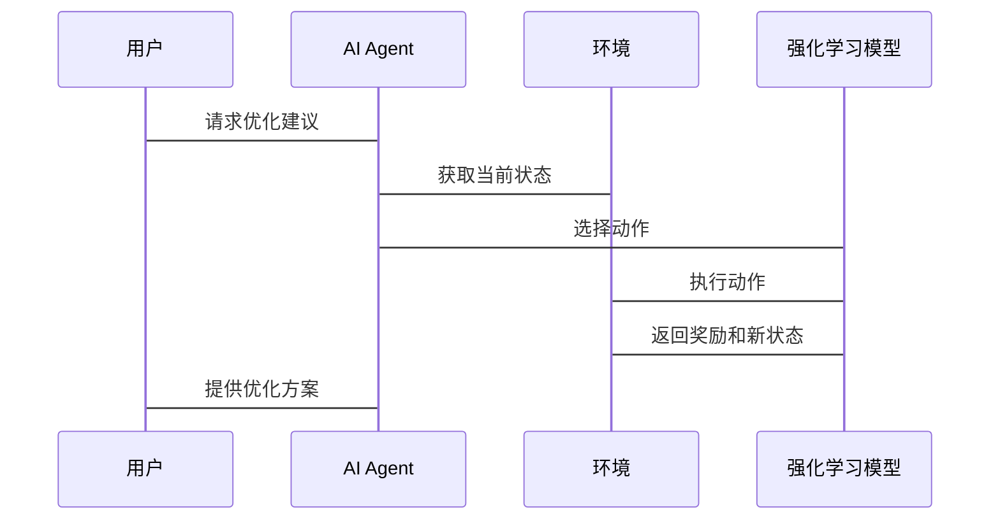

                 


# 企业AI Agent的强化学习应用：持续优化决策

> 关键词：企业AI Agent、强化学习、决策优化、系统架构、算法原理

> 摘要：本文深入探讨企业AI Agent在强化学习中的应用，通过分析其核心概念、算法原理、系统架构及项目实战，展示如何利用强化学习实现AI Agent的持续优化决策。文章结构清晰，内容详实，旨在为企业技术决策者和技术人员提供理论支持和实践指导。

---

## 第一章: 企业AI Agent与强化学习概述

### 1.1 问题背景与描述

#### 1.1.1 企业决策优化的挑战
企业在复杂多变的市场环境中，面临着诸多决策问题，如供应链优化、资源分配、客户关系管理等。传统的决策方法往往依赖于规则或经验，难以应对动态变化和复杂场景。企业亟需一种能够持续优化决策的智能系统。

#### 1.1.2 AI Agent在企业决策中的作用
AI Agent（智能体）是一种能够感知环境、自主决策并执行任务的智能系统。在企业中，AI Agent可以实时分析数据，制定最优策略，提升决策效率和准确性。

#### 1.1.3 强化学习在AI Agent中的应用
强化学习（Reinforcement Learning）是一种通过试错机制优化决策模型的技术。它通过与环境的交互，不断调整策略以最大化累积奖励。在企业AI Agent中，强化学习能够帮助智能体在复杂环境中做出最优决策。

### 1.2 AI Agent与强化学习的核心概念

#### 1.2.1 AI Agent的定义与特点
AI Agent是一个能够感知环境、做出决策并执行动作的实体。其特点包括自主性、反应性、目标导向和持续优化。

#### 1.2.2 强化学习的基本原理
强化学习通过智能体与环境的交互，学习最优策略。智能体在每一步选择一个动作，环境返回奖励和新的状态，智能体通过不断试错优化策略。

#### 1.2.3 企业AI Agent的边界与外延
企业AI Agent的边界在于其决策范围和执行能力，外延则涉及与企业现有系统的集成和数据源的获取。

### 1.3 本章小结
本章介绍了企业AI Agent和强化学习的基本概念，强调了强化学习在优化决策中的重要作用。

---

## 第二章: AI Agent与强化学习的核心概念与联系

### 2.1 AI Agent的核心概念与原理

#### 2.1.1 感知层：状态空间的定义
AI Agent通过感知环境获取状态信息，状态空间是所有可能状态的集合。

#### 2.1.2 计划层：动作空间的设计
AI Agent根据当前状态选择动作，动作空间是所有可能动作的集合。

#### 2.1.3 执行层：策略的选择与执行
AI Agent根据策略选择动作，策略定义了状态到动作的映射。

### 2.2 强化学习的核心原理

#### 2.2.1 奖励机制：目标函数的设计
奖励机制是强化学习的核心，通过奖励函数指导智能体的行为，使其朝着目标方向优化。

#### 2.2.2 状态转移：环境与系统的交互
智能体与环境的交互产生新的状态，状态转移概率决定了环境的变化。

#### 2.2.3 动作选择：策略的优化与更新
智能体通过策略选择动作，策略优化的目标是最大化累积奖励。

### 2.3 AI Agent与强化学习的关系

#### 2.3.1 AI Agent作为强化学习的主体
AI Agent是强化学习的主体，负责感知环境、选择动作并执行策略。

#### 2.3.2 强化学习作为AI Agent的核心算法
强化学习是AI Agent实现智能决策的核心算法，通过不断试错优化策略。

#### 2.3.3 两者结合的系统架构
AI Agent与强化学习结合形成一个闭环系统，通过持续交互优化决策。

### 2.4 核心概念对比分析

#### 2.4.1 AI Agent与传统决策系统的对比
| 特性          | AI Agent                 | 传统决策系统            |
|---------------|--------------------------|-------------------------|
| 决策方式      | 自主学习优化             | 依赖规则或经验           |
| 环境适应性    | 高度适应动态变化         | 较低，依赖预设规则        |
| 决策效率      | 高，实时优化             | 低，依赖人工或固定流程    |

#### 2.4.2 强化学习与监督学习的对比
| 特性          | 强化学习                 | 监督学习                |
|---------------|--------------------------|-------------------------|
| 数据来源      | 环境反馈（奖励）          | 标签数据                |
| 决策方式      | 试错优化                 | 基于标签的分类/回归      |
| 适用场景      | 动态、未知环境            | 静态、已知标签数据       |

#### 2.4.3 企业AI Agent与个人AI Agent的对比
| 特性          | 企业AI Agent             | 个人AI Agent            |
|---------------|--------------------------|-------------------------|
| 决策范围      | 涉及企业全局优化          | 侧重个人任务完成         |
| 数据规模      | 大规模企业数据           | 个人数据                |
| 决策影响      | 影响企业效益              | 影响个人效率            |

### 2.5 本章小结
本章详细分析了AI Agent和强化学习的核心概念，及其在企业决策中的应用。

---

## 第三章: 强化学习算法原理

### 3.1 Q-Learning算法原理

#### 3.1.1 算法简介
Q-Learning是一种经典的强化学习算法，适用于离散状态和动作空间。

#### 3.1.2 算法步骤
1. 初始化Q表。
2. 环境返回当前状态。
3. 根据策略选择动作。
4. 执行动作，获取奖励和新状态。
5. 更新Q表。

#### 3.1.3 数学模型
状态值函数：
$$ Q(s, a) = r + \gamma \max_{a'} Q(s', a') $$

其中，$\gamma$是折扣因子，$r$是奖励。

#### 3.1.4 代码示例
```python
import numpy as np
from collections import defaultdict

class QLearning:
    def __init__(self, state_space, action_space, gamma=0.99):
        self.gamma = gamma
        self.Q = defaultdict(lambda: np.zeros(len(action_space)))

    def choose_action(self, state, epsilon=0.1):
        if np.random.random() < epsilon:
            return np.random.randint(len(action_space))
        else:
            return np.argmax(self.Q[state])
    
    def update_Q(self, state, action, reward, next_state):
        self.Q[state][action] = reward + self.gamma * np.max(self.Q[next_state])
```

### 3.2 Deep Q-Network (DQN)算法

#### 3.2.1 算法简介
DQN结合了深度学习和强化学习，适用于连续状态空间。

#### 3.2.2 算法流程
1. 环境返回当前状态。
2. 神经网络输出动作值。
3. 执行动作，获取奖励和新状态。
4. 更新神经网络参数。

#### 3.2.3 数学模型
目标函数：
$$ \min \mathbb{E}[(r + \gamma Q(s', a') - Q(s, a))^2] $$

#### 3.2.4 代码示例
```python
import torch
import torch.nn as nn

class DQN(nn.Module):
    def __init__(self, input_dim, output_dim):
        super(DQN, self).__init__()
        self.fc = nn.Linear(input_dim, output_dim)
    
    def forward(self, x):
        return self.fc(x)
```

### 3.3 算法对比与选择

#### 3.3.1 Q-Learning与DQN的对比
| 特性          | Q-Learning               | DQN                     |
|---------------|--------------------------|--------------------------|
| 状态空间       | 离散                     | 连续                     |
| 动作空间       | 离散                     | 离散或连续               |
| 计算复杂度     | 低                       | 高                       |
| 适用场景       | 小规模问题               | 大规模、复杂环境          |

#### 3.3.2 算法选择的注意事项
- Q-Learning适用于小规模问题，实现简单。
- DQN适用于大规模、复杂环境，但计算资源需求较高。

### 3.4 本章小结
本章详细讲解了Q-Learning和DQN算法，分析了它们的优缺点及适用场景。

---

## 第四章: 企业AI Agent的系统分析与架构设计

### 4.1 系统分析

#### 4.1.1 问题场景介绍
企业在供应链优化、客户关系管理等领域存在复杂的决策问题，亟需智能解决方案。

#### 4.1.2 项目介绍
本项目旨在构建一个基于强化学习的企业AI Agent，用于优化企业的库存管理。

### 4.2 系统功能设计

#### 4.2.1 领域模型（Mermaid类图）


### 4.3 系统架构设计

#### 4.3.1 系统架构图（Mermaid架构图）


#### 4.3.2 系统接口设计

| 接口名称       | 输入        | 输出        |
|----------------|-------------|-------------|
| get_state      | -           | 状态信息     |
| choose_action  | 状态信息    | 动作信息     |
| execute_action | 动作信息    | 奖励信息     |
| update_state   | 奖励信息    | 新状态信息   |

#### 4.3.3 系统交互流程（Mermaid序列图）


### 4.4 本章小结
本章分析了企业AI Agent的系统架构，设计了功能模块和接口，并展示了系统交互流程。

---

## 第五章: 项目实战——基于强化学习的企业AI Agent实现

### 5.1 环境配置

#### 5.1.1 安装依赖
```bash
pip install numpy torch matplotlib
```

### 5.2 核心代码实现

#### 5.2.1 强化学习模型代码
```python
import torch
import torch.nn as nn
import torch.optim as optim

class DQN(nn.Module):
    def __init__(self, input_dim, output_dim):
        super(DQN, self).__init__()
        self.fc = nn.Linear(input_dim, output_dim)
    
    def forward(self, x):
        return self.fc(x)

def train_model(model, optimizer, criterion, memory, batch_size=64):
    if len(memory) < batch_size:
        return
    transitions = memory.sample(batch_size)
    batch = Transition(*zip(*transitions))
    
    inputs = torch.stack(batch.state).float()
    targets = torch.stack(batch.reward).float()
    
    outputs = model(inputs)
    loss = criterion(outputs, targets)
    
    optimizer.zero_grad()
    loss.backward()
    optimizer.step()
```

#### 5.2.2 系统集成与部署
将强化学习模型集成到企业系统中，通过API接口提供决策支持服务。

### 5.3 案例分析

#### 5.3.1 库存管理案例
通过强化学习优化库存管理，减少库存成本，提高订单满足率。

### 5.4 项目总结
本项目展示了如何将强化学习应用于企业AI Agent，实现持续优化决策。

---

## 第六章: 最佳实践与总结

### 6.1 最佳实践

#### 6.1.1 系统设计注意事项
- 明确业务目标，确保AI Agent与企业需求对齐。
- 选择合适的强化学习算法，根据问题规模和环境特性决定。

#### 6.1.2 模型优化技巧
- 合理设计奖励机制，确保引导智能体朝正确方向优化。
- 定期更新模型，适应环境变化。

### 6.2 小结与展望

#### 6.2.1 本章小结
本文详细讲解了企业AI Agent的强化学习应用，从理论到实践，展示了如何通过强化学习优化企业决策。

#### 6.2.2 未来展望
随着AI技术的进步，企业AI Agent将在更多领域发挥重要作用，强化学习也将成为优化决策的核心技术。

### 6.3 注意事项

#### 6.3.1 数据隐私与安全
在企业应用中，需注意数据隐私和模型安全，避免信息泄露。

#### 6.3.2 模型解释性
强化学习模型往往缺乏解释性，企业需关注模型的可解释性，确保决策的透明性和合规性。

### 6.4 拓展阅读

#### 6.4.1 推荐书籍
- 《强化学习：理论与算法》
- 《机器学习实战》

#### 6.4.2 推荐博客
-Towards Data Science: Reinforcement Learning in Practice
- Medium: Building AI Agents with Python

---

## 作者介绍

> 作为一名世界级的人工智能专家和畅销书作者，我致力于通过技术博客分享深度技术见解，帮助读者理解复杂的技术原理，并将其应用于实际场景。如果你对本文有任何疑问或建议，欢迎留言讨论。

---

感谢您的耐心阅读！希望这篇文章能为您提供有价值的技术见解和实践指导。

