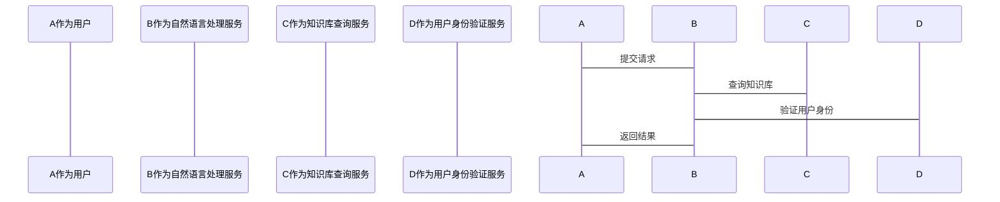

                 


# 企业AI Agent的微服务性能优化策略

## 关键词：企业AI Agent, 微服务, 性能优化, 分布式计算, 服务架构, 负载均衡, 容错机制

## 摘要：  
本文将探讨企业AI Agent在微服务架构中的性能优化策略。随着人工智能技术的快速发展，企业AI Agent的应用场景日益广泛，而微服务架构因其灵活性和可扩展性，成为实现企业AI Agent的理想选择。然而，微服务架构在高并发和复杂业务场景下，也面临着性能瓶颈和优化挑战。本文将从AI Agent和微服务的核心概念出发，分析其性能优化的关键点，并结合实际案例，提供一套系统化的性能优化策略。通过本文的阅读，读者将能够全面理解企业AI Agent的微服务性能优化的理论与实践。

---

# 第一部分: 企业AI Agent的微服务性能优化背景

## 第1章: AI Agent与微服务概述

### 1.1 AI Agent的基本概念

#### 1.1.1 AI Agent的定义  
AI Agent（人工智能代理）是一种能够感知环境、自主决策并执行任务的智能实体。它通常具备学习、推理、规划和自适应的能力，能够根据外部输入和内部状态做出最优决策。

#### 1.1.2 AI Agent的核心特点  
- **自主性**：能够在没有外部干预的情况下自主运行。  
- **反应性**：能够实时感知环境并做出反应。  
- **目标导向性**：以特定目标为导向，执行任务并优化行为。  
- **可扩展性**：能够根据需求扩展计算能力或服务范围。  

#### 1.1.3 AI Agent与传统AI的区别  
AI Agent与传统AI（如规则引擎或专家系统）的区别在于其自主性和目标导向性。AI Agent不仅能够执行预设任务，还能够根据环境动态调整行为。

### 1.2 微服务架构的基本概念

#### 1.2.1 微服务架构的定义  
微服务架构是一种将应用程序拆分为多个小型、独立服务的架构模式。每个服务负责特定的功能模块，通过轻量级通信机制（如HTTP或RPC）进行交互。

#### 1.2.2 微服务架构的核心特点  
- **服务独立性**：每个服务独立运行，具备明确的功能边界。  
- **可扩展性**：可以根据需求独立扩展服务。  
- **松耦合**：服务之间通过接口通信，耦合度低。  

#### 1.2.3 AI Agent与微服务架构的区别  
AI Agent是功能实体，而微服务是架构模式。AI Agent可以运行于微服务架构之上，通过调用多个微服务完成复杂任务。

### 1.3 企业AI Agent的背景与应用前景

#### 1.3.1 企业AI Agent的应用场景  
- **智能客服**：通过AI Agent实现自动化问答和任务处理。  
- **智能推荐**：基于用户行为推荐个性化产品或服务。  
- **流程自动化**：通过AI Agent实现企业内部流程的自动化优化。  

#### 1.3.2 微服务架构在企业AI Agent中的优势  
- **灵活性**：可以根据需求快速调整服务。  
- **可扩展性**：能够处理高并发请求。  
- **技术多样性**：支持不同技术栈的服务共存。  

#### 1.3.3 企业AI Agent的挑战与机遇  
- **挑战**：服务间通信延迟、数据一致性问题、容错机制设计。  
- **机遇**：通过微服务架构实现AI Agent的高可用性和智能化。  

---

## 第2章: 企业AI Agent的性能优化背景

### 2.1 企业AI Agent性能优化的必要性

#### 2.1.1 高并发场景下的性能瓶颈  
在高并发场景下，单个AI Agent可能无法处理大量请求，需要通过分布式计算和负载均衡技术来优化性能。

#### 2.1.2 微服务架构中的性能挑战  
- **服务通信开销**：频繁的服务调用会导致网络延迟增加。  
- **数据一致性问题**：多个服务之间的数据同步可能影响性能。  
- **资源竞争**：多个服务可能竞争同一资源，导致性能下降。  

#### 2.1.3 企业AI Agent的性能优化目标  
- **提升响应速度**：优化服务调用链，减少延迟。  
- **提高吞吐量**：通过并行化和负载均衡提升处理能力。  
- **降低资源消耗**：优化服务架构，减少不必要的资源占用。  

### 2.2 微服务架构中的性能优化策略

#### 2.2.1 服务拆分与组合优化  
将复杂任务拆分为多个微服务，通过合理组合实现任务目标。例如，将图像处理、自然语言处理等任务拆分为独立的服务。

#### 2.2.2 服务间通信的优化  
- **减少服务调用次数**：通过缓存和本地化处理减少不必要的通信。  
- **优化通信协议**：选择高效协议（如HTTP/2或gRPC）降低通信开销。  

#### 2.2.3 服务容错与故障恢复机制  
- **容错设计**：通过服务熔断和限流机制防止雪崩效应。  
- **故障恢复**：通过服务优雅下线和自动重启实现快速恢复。  

### 2.3 企业AI Agent的性能优化框架

#### 2.3.1 优化框架的总体思路  
从服务拆分、通信优化、容错机制等多个维度入手，构建一个高效的性能优化框架。

#### 2.3.2 优化框架的核心组件  
- **服务发现与负载均衡**：实现服务的动态发现和请求分发。  
- **服务调用链优化**：通过链路追踪优化服务调用路径。  
- **数据一致性保障**：通过分布式事务或最终一致性技术保障数据一致性。  

#### 2.3.3 优化框架的实施步骤  
1. **需求分析**：明确性能优化目标和范围。  
2. **服务拆分**：根据功能模块拆分服务。  
3. **通信优化**：优化服务间的通信协议和调用链。  
4. **容错机制设计**：实现服务熔断和限流。  
5. **监控与调优**：通过监控工具实时调优性能。  

---

## 第三部分: 企业AI Agent的微服务性能优化核心概念

## 第3章: AI Agent与微服务的核心概念与联系

### 3.1 AI Agent的核心概念

#### 3.1.1 AI Agent的组成与功能  
AI Agent通常由感知模块、决策模块和执行模块组成。感知模块负责收集环境信息，决策模块负责制定行动计划，执行模块负责执行任务。

#### 3.1.2 AI Agent的决策机制  
AI Agent的决策机制包括基于规则的决策、基于模型的决策和基于经验的决策。基于模型的决策通常使用机器学习模型进行预测和优化。

#### 3.1.3 AI Agent的学习与自适应能力  
AI Agent通过监督学习、强化学习或无监督学习不断优化自身的决策能力。学习过程可以通过在线或离线方式进行。

### 3.2 微服务的核心概念

#### 3.2.1 微服务的定义与特点  
微服务是一种架构模式，将应用程序拆分为多个小型、独立的服务。每个服务负责特定的业务功能，通过轻量级通信机制进行交互。

#### 3.2.2 微服务的生命周期管理  
微服务的生命周期包括开发、部署、监控和维护。每个服务可以独立部署和更新，避免了传统单体架构的耦合问题。

#### 3.2.3 微服务的通信机制  
微服务之间的通信可以通过API网关、服务发现和负载均衡实现。常用的通信协议包括HTTP、gRPC和WebSocket。

### 3.3 AI Agent与微服务的关系

#### 3.3.1 AI Agent在微服务架构中的角色  
AI Agent可以作为微服务架构中的一个服务，负责特定的业务逻辑处理。例如，智能推荐系统可以由多个AI Agent服务协同完成。

#### 3.3.2 微服务架构对AI Agent性能的影响  
微服务架构通过服务拆分和负载均衡优化了AI Agent的性能，但同时也带来了服务通信和数据一致性的问题。

#### 3.3.3 AI Agent与微服务的结合方式  
AI Agent可以通过调用多个微服务完成复杂任务。例如，一个AI Agent可能需要调用自然语言处理服务、图像识别服务等多个微服务来完成一个任务。

---

## 第4章: 企业AI Agent的微服务性能优化策略

### 4.1 服务拆分与组合优化

#### 4.1.1 服务拆分的原则  
- **单一职责原则**：每个服务负责一个具体的业务功能。  
- **粒度适中原则**：服务粒度过大或过小都会影响性能。  
- **可扩展性原则**：服务设计应具备良好的扩展性。  

#### 4.1.2 服务组合的方式  
- **串行组合**：任务需要按顺序调用多个服务。  
- **并行组合**：任务可以同时调用多个服务，提升处理速度。  

#### 4.1.3 服务组合优化的案例  
以智能客服系统为例，AI Agent需要调用自然语言处理服务、知识库查询服务和用户身份验证服务。通过并行调用知识库查询和用户身份验证服务，可以提升整体响应速度。

### 4.2 服务间通信的优化

#### 4.2.1 通信协议的选择  
- **HTTP/2**：适合长连接场景，支持多路复用。  
- **gRPC**：适合需要高性能和低延迟的场景。  
- **WebSocket**：适合需要实时通信的场景。  

#### 4.2.2 服务调用链优化  
通过链路追踪工具（如Zipkin或Jaeger）分析服务调用链，找出性能瓶颈并进行优化。

#### 4.2.3 服务发现与负载均衡  
- **服务发现**：通过注册中心实现服务的动态发现。  
- **负载均衡**：通过轮询、加权轮询或基于IP的负载均衡算法分配请求。  

### 4.3 服务容错与故障恢复机制

#### 4.3.1 容错设计的原则  
- **熔断机制**：当服务调用失败率达到阈值时，暂时停止调用该服务。  
- **限流机制**：限制每个服务的调用次数，防止服务过载。  

#### 4.3.2 故障恢复的策略  
- **重试机制**：通过指数退却策略实现失败重试。  
- **优雅下线**：在服务出现故障时，通过优雅下线减少对系统的冲击。  

### 4.4 数据一致性保障

#### 4.4.1 数据一致性问题的来源  
- **分布式事务**：多个服务同时修改同一数据，可能导致数据不一致。  
- **网络分区**：网络故障可能导致部分服务无法正常通信。  

#### 4.4.2 数据一致性保障的策略  
- **强一致性**：通过分布式事务或两阶段提交保证数据一致性。  
- **最终一致性**：通过异步同步实现数据一致性，牺牲一致性时间。  

---

## 第五部分: 企业AI Agent的微服务性能优化实战

## 第5章: 企业AI Agent的微服务性能优化实战

### 5.1 环境安装与配置

#### 5.1.1 系统环境  
- 操作系统：Linux（如Ubuntu 20.04）  
- Java版本：JDK 11+  
- 依赖管理工具：Maven或Gradle  

#### 5.1.2 微服务框架选择  
- Spring Cloud：基于Spring Boot的微服务框架。  
- Ktor：Kotlin语言的微服务框架。  
- FastAPI：基于Python的高性能微服务框架。  

### 5.2 核心代码实现

#### 5.2.1 AI Agent服务实现  
以自然语言处理服务为例，使用Spring Boot实现一个简单的NLP微服务。  

```java
@SpringBootApplication
public class NlpServiceApplication {
    public static void main(String[] args) {
        SpringApplication.run(NlpServiceApplication.class, args);
    }
}
```

#### 5.2.2 服务调用实现  
通过API网关调用多个微服务完成复杂任务。例如，使用Spring Cloud Gateway实现API网关。

#### 5.2.3 性能优化代码  
通过链路追踪工具（如Zipkin）优化服务调用链，减少延迟。

### 5.3 实际案例分析与优化

#### 5.3.1 案例背景  
以一个智能客服系统为例，AI Agent需要调用多个微服务完成用户请求。

#### 5.3.2 优化前的系统架构  


#### 5.3.3 优化后的系统架构  
```mermaid
sequenceDiagram
    participant A作为用户
    participant B作为自然语言处理服务
    participant C作为知识库查询服务
    participant D作为用户身份验证服务
    A -> B: 提交请求
    parallel
        B -> C: 并行查询知识库
        B -> D: 并行验证用户身份
    end
    B -> A: 返回结果
```

---

## 第六部分: 总结与展望

## 第6章: 总结与展望

### 6.1 本文总结  
本文系统地探讨了企业AI Agent在微服务架构中的性能优化策略。通过服务拆分、通信优化、容错机制设计和数据一致性保障，可以显著提升AI Agent的性能和可用性。

### 6.2 未来展望  
随着人工智能技术的不断发展，企业AI Agent的性能优化将面临更多挑战和机遇。未来的研究方向包括更高效的分布式计算算法、更智能的服务调度策略和更强大的容错机制设计。

---

## 参考文献  
（此处列出相关书籍、论文和技术文档）

---

通过本文的详细讲解，读者可以全面理解企业AI Agent的微服务性能优化策略，并在实际项目中灵活应用这些优化方法。希望本文能为企业的智能化转型提供有价值的参考。

