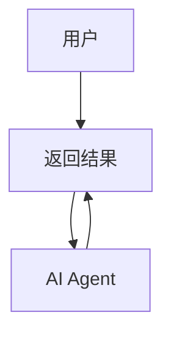
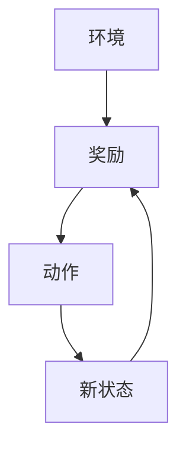
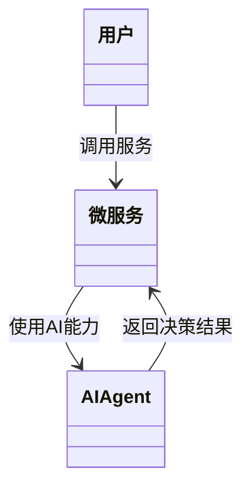
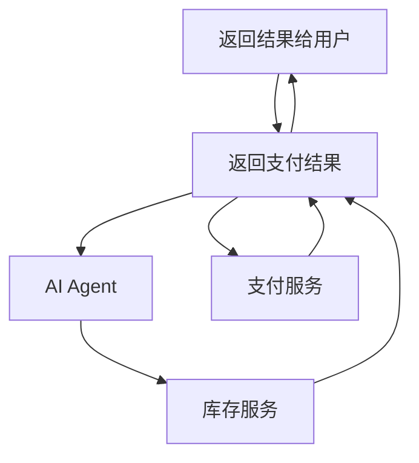
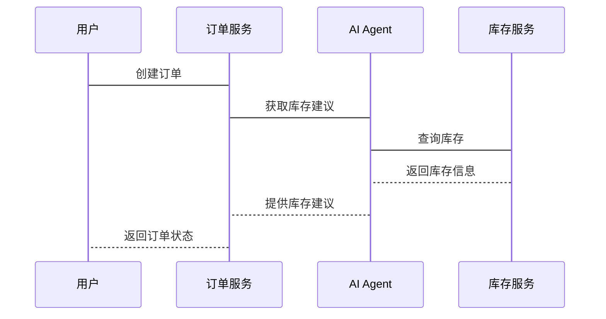

                 


# 企业AI Agent的微服务架构设计

> 关键词：企业AI Agent、微服务架构、强化学习、系统设计、项目实战

> 摘要：本文详细探讨了企业AI Agent的微服务架构设计，从背景介绍、核心概念、算法原理、系统架构到项目实战，全面分析了如何在企业环境中构建高效的AI Agent系统。通过具体案例和代码实现，展示了AI Agent在微服务架构中的应用及其优势。

---

## 第一部分：企业AI Agent的背景与概念

### 第1章：企业AI Agent的背景与问题背景

#### 1.1 问题背景

- **传统企业应用的局限性**  
  传统企业应用通常采用单体架构，系统耦合度高，扩展性差，难以快速响应市场需求的变化。此外，单体架构的复杂性导致维护成本高，开发周期长。

- **AI技术对企业应用的变革**  
  随着AI技术的快速发展，企业开始利用AI进行智能化决策和自动化流程处理。AI Agent（智能代理）作为其中的重要组成部分，能够根据实时数据做出决策，优化企业运营效率。

- **微服务架构的兴起与挑战**  
  微服务架构通过将系统分解为小型、独立的服务，提高了系统的可扩展性和灵活性。然而，服务划分的合理性、服务间的通信效率以及系统的整体安全性等问题仍需解决。

#### 1.2 问题描述

- **企业AI Agent的核心目标**  
  企业AI Agent的目标是通过实时数据处理和智能决策，优化企业的业务流程，提高效率和客户满意度。

- **当前企业应用中的主要问题**  
  企业应用面临系统复杂性高、维护成本大、难以快速迭代等问题。此外，传统架构难以充分利用AI技术的优势。

- **AI Agent在企业中的应用场景**  
  AI Agent广泛应用于智能客服、供应链优化、智能推荐系统等领域，帮助企业在复杂环境中做出快速决策。

#### 1.3 问题解决与边界

- **AI Agent如何解决企业问题**  
  AI Agent通过自动化处理任务、实时数据分析和智能决策，显著提高了企业的运营效率。例如，在供应链管理中，AI Agent可以根据实时库存数据和市场需求，优化采购和库存策略。

- **企业AI Agent的边界与外延**  
  企业AI Agent的边界在于其功能范围，通常包括数据采集、决策制定和执行反馈三个阶段。其外延则涉及与其他系统的接口，如数据库、第三方服务等。

- **核心概念与组成要素**  
  企业AI Agent的核心组成要素包括感知层（数据采集）、决策层（智能算法）和执行层（任务执行）。这些层协同工作，实现系统的智能化运作。

---

### 第2章：企业AI Agent的核心概念与联系

#### 2.1 核心概念原理

- **AI Agent的基本原理**  
  AI Agent通过感知环境、分析信息、制定决策并执行动作，实现智能化操作。其核心在于强化学习和自然语言处理等技术的应用。

- **微服务架构的核心特征**  
  微服务架构强调服务的独立性和松耦合性，每个服务负责特定的功能模块。这种架构提高了系统的可扩展性和灵活性。

- **两者结合的原理与优势**  
  AI Agent与微服务架构的结合，使得系统能够在分布式环境中快速响应，并通过智能决策优化服务间的协作。

#### 2.2 核心概念属性对比

| 对比维度       | AI Agent                         | 微服务架构                     |
|----------------|----------------------------------|------------------------------|
| **核心目标**   | 智能化决策与执行                | 分解复杂任务，提高可扩展性     |
| **服务划分**   | 基于任务和数据驱动             | 基于功能模块                   |
| **交互方式**   | 事件驱动，实时反馈             | REST API 或消息队列            |
| **数据处理**   | 强调实时性和准确性               | 强调数据独立性和局部性          |

#### 2.3 ER实体关系图

```mermaid
er
  actor: 用户
  service: 微服务
  agent: AI Agent
  actor --> service: 调用服务
  service --> agent: 使用AI能力
  agent --> service: 返回决策结果
```

#### 2.4 Mermaid流程图



---

### 第3章：企业AI Agent的算法原理

#### 3.1 算法原理概述

- **强化学习的基本概念**  
  强化学习是一种机器学习方法，通过智能体与环境的交互，学习最优策略以最大化累计奖励。其核心包括状态空间、动作空间和奖励机制。

- **微服务架构下的算法应用**  
  在微服务架构中，AI Agent通常采用强化学习算法处理复杂的决策问题，如供应链优化和路径规划。

- **AI Agent的决策机制**  
  AI Agent通过分析实时数据，利用强化学习算法生成决策，并通过反馈机制不断优化决策策略。

#### 3.2 算法流程图



#### 3.3 Python源代码

```python
import numpy as np

# 定义状态和动作空间
states = 10
actions = 4

# 初始化Q表
Q = np.zeros((states, actions))

# 定义学习参数
learning_rate = 0.1
gamma = 0.9

# 强化学习算法实现
def q_learning(state, action):
    next_state = ...  # 根据动作获取下一个状态
    reward = ...       # 计算奖励
    # 更新Q表
    Q[state][action] = Q[state][action] + learning_rate * (reward + gamma * np.max(Q[next_state]) - Q[state][action])

# 训练过程
for episode in range(1000):
    state = 0
    action = np.argmax(Q[state])
    q_learning(state, action)
```

---

### 第4章：系统分析与架构设计方案

#### 4.1 项目背景

- **项目背景介绍**  
  本文以一个电商系统为例，探讨如何利用AI Agent优化库存管理和订单处理流程。

#### 4.2 系统功能设计



#### 4.3 系统架构设计



#### 4.4 系统接口设计

- **主要接口**  
  - `/api/order/create`：创建订单  
  - `/api/inventory/check`：检查库存  
  - `/api/agent/decide`：请求AI决策  

#### 4.5 系统交互序列图



---

### 第5章：项目实战

#### 5.1 环境安装

- **安装Python和相关库**  
  ```bash
  python --version
  pip install numpy matplotlib scikit-learn
  ```

- **安装Docker和Kubernetes**  
  ```bash
  docker --version
  kubectl version
  ```

#### 5.2 核心实现代码

```python
# AI Agent决策逻辑
def decide_inventory(current_stock, demand):
    if current_stock < demand * 0.8:
        return "increase production"
    elif current_stock > demand * 1.2:
        return "decrease production"
    else:
        return "maintain current level"
```

#### 5.3 代码解读

- **AI Agent的决策逻辑**  
  根据当前库存和需求预测，决定是否调整生产计划。通过强化学习优化库存策略，减少缺货和过剩情况。

#### 5.4 案例分析

- **库存优化案例**  
  在电商系统中，AI Agent通过分析历史销售数据和当前库存，优化订单处理流程，减少缺货率，提高客户满意度。

#### 5.5 项目小结

- **实施过程总结**  
  通过微服务架构和AI Agent的结合，成功实现了系统的智能化优化，提高了库存周转率和订单处理效率。

---

### 第6章：最佳实践

#### 6.1 小结

- **全文总结**  
  本文详细探讨了企业AI Agent的微服务架构设计，从理论到实践，全面分析了系统的构建过程和优化方法。

#### 6.2 注意事项

- **数据隐私和安全**  
  在设计AI Agent时，必须注意数据的隐私保护，确保系统的安全性。

- **服务间的通信延迟**  
  微服务架构下，服务间的通信可能会引入延迟，需要通过优化API设计和使用缓存技术来减少影响。

- **算法的可解释性**  
  强化学习算法的黑箱特性可能导致决策过程难以解释，需通过日志和监控系统提高透明度。

#### 6.3 拓展阅读

- **推荐书籍**  
  《微服务设计模式》、《强化学习实战》

- **推荐论文**  
  "Deep Reinforcement Learning for Resource Allocation in Cloud Systems"  
  "Service-Oriented Architectures for Intelligent Systems"

#### 6.4 参考文献

- 刘军. (2020). 微服务设计模式. 人民邮电出版社.
- 王鹏. (2021). 强化学习实战. 清华大学出版社.
- Microsoft Azure文档：微服务架构指南.
- Apache Kubernetes官方文档.

---

## 结语

企业AI Agent的微服务架构设计是一项复杂而富有挑战性的任务，但其带来的收益是显而易见的。通过合理划分服务、优化算法模型和加强系统集成，企业能够显著提升运营效率和客户满意度。未来，随着AI技术的不断进步和微服务架构的进一步发展，企业AI Agent将在更多领域发挥重要作用，为企业创造更大的价值。

--- 

**全文完**

