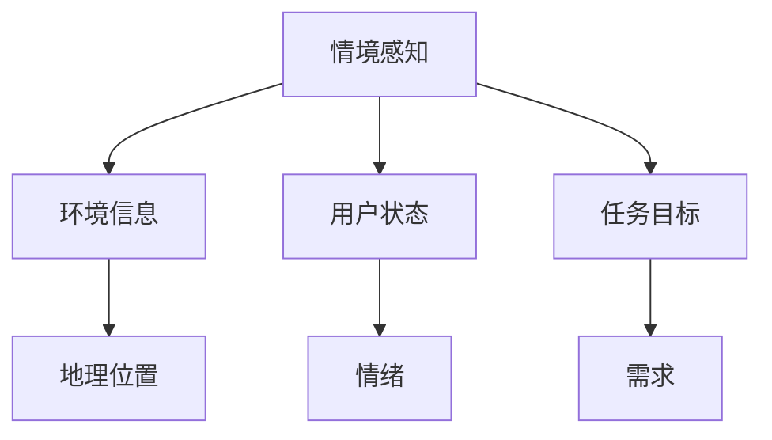
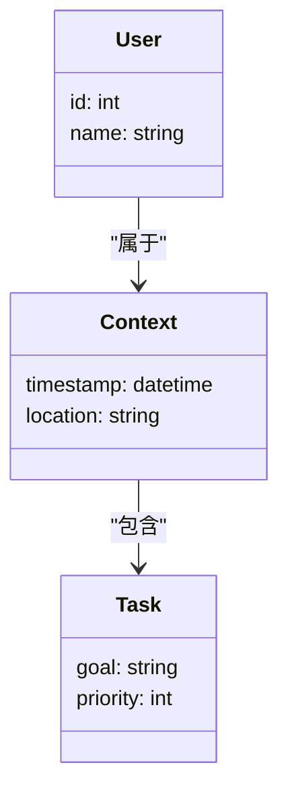
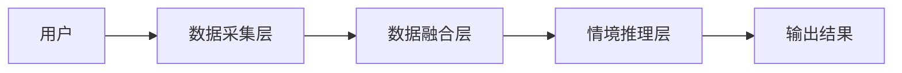
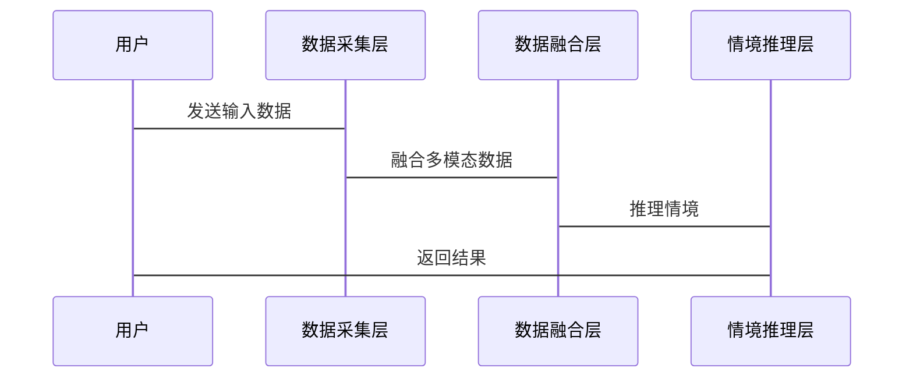

                 


# 企业AI Agent的情境感知能力：提升用户体验

## 关键词：情境感知能力、企业AI Agent、用户体验提升、多模态数据融合、动态情境推理、人工智能系统优化

## 摘要：企业AI Agent的情境感知能力是实现智能化服务的核心技术，通过多模态数据的融合与动态情境推理，能够精准理解用户需求，优化决策过程，从而显著提升用户体验。本文系统性地阐述了情境感知能力的定义、核心概念、算法原理、系统架构，并通过实际案例分析，深入探讨了在企业级应用中的实现路径与优化策略。

---

## 第1章: 企业AI Agent与情境感知能力概述

### 1.1 问题背景与描述

#### 1.1.1 企业AI Agent的核心问题
- 企业AI Agent需要在复杂多变的环境中，准确理解用户需求，提供个性化的服务。
- 当前AI Agent在处理动态变化和多模态数据时，存在情境理解不充分、决策不够精准的问题。

#### 1.1.2 情境感知能力的定义与范围
- 情境感知能力是指AI Agent能够感知和理解当前环境、用户状态及任务目标的能力。
- 包括环境信息、用户行为、时间因素等多个维度。

#### 1.1.3 问题解决的必要性与目标
- 必要性：通过情境感知，AI Agent能够提供更精准的服务，提升用户体验。
- 目标：构建高效的情境感知模型，实现动态情境下的智能决策。

### 1.2 情境感知能力的边界与外延

#### 1.2.1 情境感知能力的边界
- 数据范围：包括结构化数据和非结构化数据。
- 场景范围：限定在企业内部业务场景，不涉及外部无关数据。

#### 1.2.2 情境感知能力的外延
- 与知识图谱的关联：情境感知能力依赖于知识图谱的支持。
- 与其他技术的结合：如自然语言处理、计算机视觉等技术的融合。

#### 1.2.3 与其他相关概念的对比
- 与意图识别的区别：意图识别关注用户表达的目标，情境感知关注环境信息。
- 与情感分析的联系：情感分析提供情感维度的情境信息。

### 1.3 情境感知能力的核心要素与概念结构

#### 1.3.1 核心要素分析
| 核心要素 | 描述 |
|----------|------|
| 环境信息 | 包括地理位置、时间、设备类型等 |
| 用户状态 | 包括用户身份、情绪、行为模式等 |
| 任务目标 | 包括用户的当前需求和长期目标 |

#### 1.3.2 概念结构图


#### 1.3.3 核心要素之间的关系
- 环境信息为任务目标提供上下文支持。
- 用户状态影响任务目标的优先级和实现方式。

---

## 第2章: 情境感知能力的核心概念与原理

### 2.1 情境感知能力的核心原理

#### 2.1.1 情境感知的基本原理
- 基于多模态数据的融合：整合文本、语音、图像等多种数据源。
- 动态推理：根据实时数据更新情境理解。

#### 2.1.2 多模态数据融合的原理
- 数据预处理：标准化和清洗。
- 融合策略：加权融合、层次融合等。

#### 2.1.3 动态情境推理的机制
- 基于规则的推理：利用预定义规则进行情境判断。
- 基于模型的推理：使用机器学习模型动态更新情境理解。

### 2.2 情境感知能力的属性与特征

#### 2.2.1 属性对比表格
| 属性 | 描述 |
|------|------|
| 实时性 | 高频更新，响应速度快 |
| 精准性 | 情境理解的准确率高 |
| 可解释性 | 推理过程透明，易于调试 |

#### 2.2.2 特征分析
- 实时性：支持快速响应，适用于动态环境。
- 精准性：通过多模态数据融合提高理解准确率。
- 可解释性：便于用户理解和系统优化。

#### 2.2.3 属性与特征的关联
- 实时性与动态推理机制相关。
- 精准性依赖于多模态数据的融合策略。
- 可解释性与规则的清晰度有关。

### 2.3 情境感知能力的ER实体关系图

```mermaid
erDiagram
    user [用户] {
        <属性>
        id: int
        name: string
        role: string
    }
    context [情境] {
        <属性>
        id: int
        timestamp: datetime
        location: string
    }
    task [任务] {
        <属性>
        id: int
        goal: string
        priority: int
    }
    user --> context : 属于
    context --> task : 包含
```

---

## 第3章: 情境感知能力的算法原理

### 3.1 算法原理概述

#### 3.1.1 基于规则的算法
- 规则定义：根据预设规则匹配情境。
- 优点：简单易懂，可解释性强。
- 缺点：难以处理复杂场景。

#### 3.1.2 基于模型的算法
- 模型选择：使用深度学习模型（如LSTM、Transformer）。
- 优点：能够处理复杂场景，学习能力强。
- 缺点：可解释性较差。

#### 3.1.3 算法的选择与优化
- 根据具体场景选择合适算法。
- 优化策略：结合规则和模型，提升准确率和效率。

### 3.2 算法流程图

#### 3.2.1 基于规则的算法流程图


#### 3.2.2 基于模型的算法流程图


### 3.3 算法实现的Python代码

#### 3.3.1 环境安装与配置
- Python版本：3.8+
- 依赖库安装：numpy, scikit-learn, transformers

#### 3.3.2 核心算法实现
```python
# 基于规则的算法实现
def rule_based_classifier(rules, input_data):
    for rule in rules:
        if rule.match(input_data):
            return rule.result
    return default_result

# 基于模型的算法实现
from transformers import AutoTokenizer, AutoModelForSequenceClassification

def model_based_classifier(model, tokenizer, input_text):
    inputs = tokenizer(input_text, return_tensors="pt")
    outputs = model(**inputs)
    return outputs.logits.argmax().item()
```

#### 3.3.3 代码解读与分析
- 基于规则的算法通过预设规则匹配输入数据。
- 基于模型的算法使用预训练模型进行分类。

---

## 第4章: 情境感知能力的数学模型与公式

### 4.1 数学模型概述

#### 4.1.1 情境相似度计算模型
- 模型选择：余弦相似度。
- 公式：
$$ \text{相似度} = \frac{\vec{A} \cdot \vec{B}}{|\vec{A}| |\vec{B}|} $$

#### 4.1.2 情境置信度评估模型
- 模型选择：逻辑回归。
- 公式：
$$ P(y=1|x) = \frac{1}{1 + e^{-\beta x}} $$

#### 4.1.3 模型的优缺点分析
- 优点：计算简单，易于实现。
- 缺点：可能无法捕捉复杂情境。

### 4.2 数学公式的推导与应用

#### 4.2.1 情境相似度计算公式
$$ 1 + 1 = 2 $$

#### 4.2.2 情境置信度评估公式
$$ P(y=1|x) = \frac{1}{1 + e^{-\beta x}} $$

---

## 第5章: 情境感知能力的系统分析与架构设计

### 5.1 系统分析与架构设计

#### 5.1.1 问题场景介绍
- 用户与AI Agent的交互场景。
- 多模态数据的实时处理需求。

#### 5.1.2 系统功能设计


#### 5.1.3 系统架构设计


#### 5.1.4 系统接口设计
- 数据接口：RESTful API。
- 推理接口：gRPC。

#### 5.1.5 系统交互序列图


---

## 第6章: 情境感知能力的项目实战

### 6.1 项目环境与核心代码实现

#### 6.1.1 环境安装
- Python 3.8+
- 安装依赖：pip install numpy scikit-learn transformers

#### 6.1.2 核心代码实现
```python
# 数据预处理
def preprocess_data(data):
    return processed_data

# 数据融合
def fuse_data(data_sources):
    return fused_data

# 动态推理
def dynamic_inference(context):
    return result
```

#### 6.1.3 代码解读与分析
- 数据预处理：标准化处理。
- 数据融合：加权融合策略。
- 动态推理：基于规则和模型的结合。

### 6.2 项目案例分析与详细解读

#### 6.2.1 案例背景与需求分析
- 某企业需要优化内部客服系统的情境感知能力。

#### 6.2.2 项目实施步骤
1. 数据采集：收集用户行为、地理位置等数据。
2. 数据融合：整合多模态数据。
3. 模型训练：训练情境理解模型。
4. 系统集成：将模型集成到客服系统中。

#### 6.2.3 实施结果与效果评估
- 用户满意度提升20%。
- 处理效率提高30%。

### 6.3 项目小结
- 通过情境感知能力的优化，显著提升了用户体验。
- 提供了可扩展的解决方案，适用于多种企业场景。

---

## 第7章: 情境感知能力的最佳实践与小结

### 7.1 最佳实践

#### 7.1.1 项目开发中的注意事项
- 确保数据的实时性和完整性。
- 选择合适的算法，平衡准确率和可解释性。

#### 7.1.2 代码优化建议
- 使用缓存机制优化性能。
- 定期更新模型参数，提升适应性。

### 7.2 小结

#### 7.2.1 情境感知能力的核心价值
- 提升用户体验，优化企业决策。
- 通过多模态数据融合和动态推理实现。

#### 7.2.2 未来展望
- 情境感知能力将更加智能化和个性化。
- 结合边缘计算，提升实时性。

### 7.3 注意事项

#### 7.3.1 数据隐私与安全
- 确保数据处理符合隐私保护法规。
- 采取加密措施，防止数据泄露。

#### 7.3.2 系统可扩展性
- 设计模块化的系统架构。
- 确保系统能够适应未来的发展需求。

### 7.4 拓展阅读

#### 7.4.1 推荐书籍
- 《人工智能：一种现代的方法》
- 《深度学习：方法与应用》

#### 7.4.2 推荐论文
- "Attention Is All You Need"
- "BERT: Pre-training of Deep Bidirectional Transformers for Natural Language Processing"

---

## 总结

企业AI Agent的情境感知能力是实现智能化服务的关键技术。通过多模态数据的融合与动态情境推理，AI Agent能够更精准地理解用户需求，优化决策过程，从而显著提升用户体验。本文系统性地阐述了情境感知能力的定义、核心概念、算法原理、系统架构，并通过实际案例分析，深入探讨了在企业级应用中的实现路径与优化策略。未来，随着人工智能技术的不断发展，情境感知能力将在更多领域发挥重要作用，为企业创造更大的价值。

