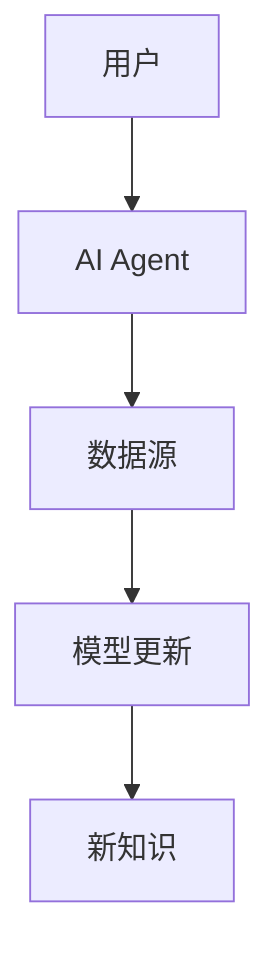
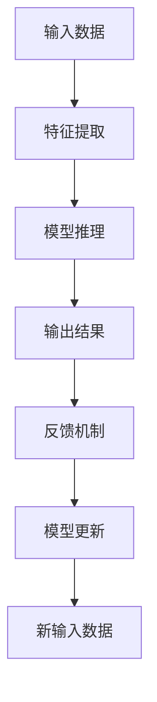
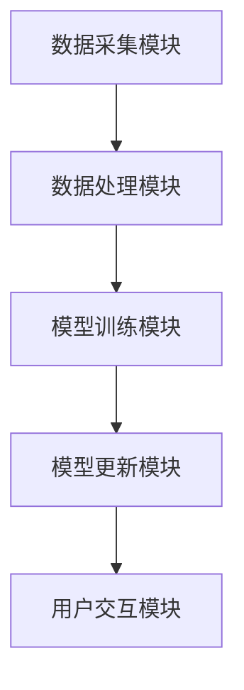
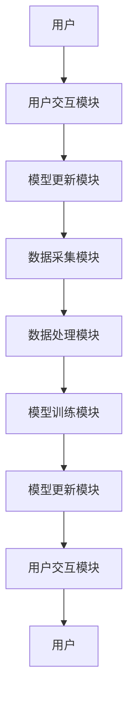

                 


# 企业AI Agent的持续学习与更新机制

> 关键词：人工智能代理、持续学习、更新机制、企业AI、机器学习

> 摘要：本文深入探讨了企业AI Agent的持续学习与更新机制，分析了其核心概念、算法原理、系统架构设计以及项目实战。通过详细讲解增量学习、模型蒸馏等技术，结合实际案例和系统设计，为读者提供了全面的理解和实践指导。

---

## 第1章: 企业AI Agent的背景与概念

### 1.1 人工智能代理的基本概念

人工智能代理（AI Agent）是指能够感知环境并采取行动以实现特定目标的智能实体。在企业环境中，AI Agent通常用于自动化任务、数据分析和决策支持。

#### 1.1.1 人工智能代理的定义
人工智能代理是一种能够通过感知环境、处理信息并采取行动来实现目标的智能系统。它具备自主性、反应性和目标导向性。

#### 1.1.2 企业AI Agent的核心特征
企业AI Agent的核心特征包括：
1. **自主性**：能够自主决策和行动，无需人工干预。
2. **反应性**：能够实时感知环境变化并做出响应。
3. **目标导向性**：通过行动实现预设目标。
4. **可扩展性**：能够适应企业规模和复杂度的变化。

#### 1.1.3 企业AI Agent的应用场景
企业AI Agent的应用场景包括：
1. **自动化任务处理**：如邮件分类、日程管理等。
2. **数据分析与决策支持**：如市场分析、风险评估等。
3. **客户交互**：如智能客服、聊天机器人等。

### 1.2 持续学习与更新机制的背景

持续学习是指AI系统在不断变化的环境中，能够通过增量数据不断优化自身模型的能力。对于企业AI Agent而言，持续学习与更新机制至关重要，因为企业环境通常是动态变化的，数据量大且复杂。

#### 1.2.1 人工智能的局限性与持续学习的必要性
传统机器学习模型通常在训练阶段完成后，无法适应新数据的变化。在企业环境中，数据分布可能随时间变化，模型需要不断更新以保持性能。

#### 1.2.2 企业AI Agent的动态环境挑战
企业环境通常具有以下特点：
1. **数据量大**：企业每天会产生大量数据。
2. **数据分布变化**：市场变化、用户行为变化等可能导致数据分布变化。
3. **任务复杂性高**：企业任务通常涉及多个部门和复杂的业务流程。

#### 1.2.3 持续学习在企业中的价值
持续学习能够使企业AI Agent在动态环境中保持高性能，提高企业的竞争力和效率。

### 1.3 本章小结
本章介绍了企业AI Agent的基本概念及其在持续学习与更新机制背景下的重要性。企业AI Agent需要具备自主性、反应性和目标导向性，并能在动态环境中不断优化自身模型。

---

## 第2章: 企业AI Agent的持续学习机制

### 2.1 持续学习的基本原理

持续学习是一种机器学习范式，旨在通过增量数据不断优化模型。与传统批量学习不同，持续学习能够在数据流中实时更新模型。

#### 2.1.1 持续学习的定义与特点
持续学习是指在不断接收新数据的情况下，通过增量方式优化模型的学习方法。其特点包括：
1. **在线性**：数据是实时流式输入的。
2. **增量性**：模型在每次接收到新数据后逐步更新。
3. **高效性**：模型更新速度快，能够快速适应新数据。

#### 2.1.2 企业AI Agent的动态环境挑战
在企业环境中，数据分布可能随时间变化，模型需要不断更新以保持性能。持续学习能够帮助企业AI Agent在动态环境中保持高性能。

#### 2.1.3 持续学习的核心挑战
持续学习的核心挑战包括：
1. **模型遗忘**：模型在更新过程中可能忘记之前学到的知识。
2. **数据稀疏性**：新数据可能不足以覆盖所有可能的情况。
3. **计算效率**：模型更新需要高效计算，以适应实时需求。

### 2.2 企业AI Agent的更新机制

更新机制是持续学习的核心，决定了模型如何适应新数据。企业AI Agent的更新机制可以分为基于模型和基于数据的两类。

#### 2.2.1 基于模型的更新机制
基于模型的更新机制是指通过优化模型参数来适应新数据。常见的基于模型的更新方法包括梯度下降和Adam优化器。

##### 梯度下降的基本原理
梯度下降是一种优化算法，通过计算损失函数的梯度，逐步调整模型参数以最小化损失。

$$ L = \frac{1}{2} \sum_{i=1}^n (y_i - \hat{y}_i)^2 $$
$$ \theta_{new} = \theta_{old} - \eta \frac{\partial L}{\partial \theta} $$

其中，$\theta$ 表示模型参数，$\eta$ 表示学习率。

##### Adam优化器的原理
Adam优化器结合了梯度的均值和方差，能够自适应地调整学习率。

$$ m_t = \beta_1 m_{t-1} + (1 - \beta_1) g_t $$
$$ v_t = \beta_2 v_{t-1} + (1 - \beta_2) g_t^2 $$
$$ \theta_{t} = \theta_{t-1} - \eta \frac{m_t}{\sqrt{v_t + \epsilon}} $$

其中，$m_t$ 表示梯度的移动平均，$v_t$ 表示梯度平方的移动平均，$\epsilon$ 是防止除以零的常数。

#### 2.2.2 基于数据的更新机制
基于数据的更新机制是指通过重新训练模型或调整数据分布来优化模型。常见的基于数据的更新方法包括增量学习和模型蒸馏。

##### 增量学习的实现步骤
1. **数据预处理**：将新数据与旧数据合并，并进行清洗和特征提取。
2. **模型更新**：使用新数据重新训练模型，或仅更新部分参数。
3. **模型评估**：通过验证集评估模型性能，并调整超参数。

##### 模型蒸馏的原理
模型蒸馏是一种通过小模型学习大模型知识的技术。企业AI Agent可以通过蒸馏技术将旧模型的知识迁移到新模型中。

$$ P(y|x) = \argmax_{y} P(y|x, \theta_{new}) $$

其中，$\theta_{new}$ 表示新模型的参数。

### 2.3 本章小结
本章详细介绍了持续学习的基本原理和企业AI Agent的更新机制。基于模型的更新机制包括梯度下降和Adam优化器，基于数据的更新机制包括增量学习和模型蒸馏。企业AI Agent需要结合多种更新机制，以在动态环境中保持高性能。

---

## 第3章: 企业AI Agent的持续学习与更新的核心概念

### 3.1 持续学习与更新的数学模型

#### 3.1.1 持续学习的基本数学框架
持续学习的数学框架通常包括损失函数、优化目标和更新规则。

$$ L = \frac{1}{2} (y - \hat{y})^2 $$
$$ \theta_{t} = \theta_{t-1} - \eta \frac{\partial L}{\partial \theta} $$

其中，$\theta$ 表示模型参数，$\eta$ 表示学习率。

#### 3.1.2 更新机制的数学表达
更新机制可以通过以下公式表示：

$$ \theta_{t} = f(\theta_{t-1}, x_t, y_t) $$

其中，$f$ 表示更新规则，$x_t$ 和 $y_t$ 表示第 $t$ 批的新数据。

#### 3.1.3 模型参数的更新公式
模型参数的更新公式可以表示为：

$$ \theta_{t} = \theta_{t-1} + \Delta \theta $$

其中，$\Delta \theta$ 表示参数的更新量。

### 3.2 核心概念的对比分析

#### 3.2.1 持续学习与在线学习的对比
| 对比维度 | 持续学习 | 在线学习 |
|----------|----------|----------|
| 数据输入方式 | 增量数据 | 实时数据流 |
| 记忆能力 | 具有记忆 | 通常没有记忆 |
| 处理速度 | 较慢 | 较快 |

#### 3.2.2 增量学习与批量学习的对比
| 对比维度 | 增量学习 | 批量学习 |
|----------|----------|----------|
| 数据处理方式 | 逐个样本处理 | 批量处理 |
| 内存消耗 | 较低 | 较高 |
| 适应性 | 高 | 低 |

#### 3.2.3 模型更新与参数更新的对比
| 对比维度 | 模型更新 | 参数更新 |
|----------|----------|----------|
| 更新对象 | 整个模型 | 模型参数 |
| 更新频率 | 低 | 高 |
| 计算复杂度 | 高 | 中 |

### 3.3 实体关系图与流程图

#### 3.3.1 实体关系图（ER图）



#### 3.3.2 持续学习流程图



### 3.4 本章小结
本章通过数学模型和对比分析，详细探讨了企业AI Agent持续学习与更新的核心概念。通过ER图和流程图，展示了持续学习的实现过程和关键步骤。

---

## 第4章: 企业AI Agent持续学习的算法原理

### 4.1 基于梯度的更新算法

#### 4.1.1 梯度下降的基本原理
梯度下降是一种优化算法，通过计算损失函数的梯度，逐步调整模型参数以最小化损失。

$$ L = \frac{1}{2} \sum_{i=1}^n (y_i - \hat{y}_i)^2 $$
$$ \theta_{new} = \theta_{old} - \eta \frac{\partial L}{\partial \theta} $$

其中，$\theta$ 表示模型参数，$\eta$ 表示学习率。

#### 4.1.2 动量优化器的原理
动量优化器通过引入动量项，加速模型收敛。

$$ v_t = \beta v_{t-1} + \eta \frac{\partial L}{\partial \theta} $$
$$ \theta_{t} = \theta_{t-1} - v_t $$

其中，$\beta$ 表示动量系数。

#### 4.1.3 Adam优化器的原理
Adam优化器结合了梯度的均值和方差，能够自适应地调整学习率。

$$ m_t = \beta_1 m_{t-1} + (1 - \beta_1) g_t $$
$$ v_t = \beta_2 v_{t-1} + (1 - \beta_2) g_t^2 $$
$$ \theta_{t} = \theta_{t-1} - \eta \frac{m_t}{\sqrt{v_t + \epsilon}} $$

其中，$m_t$ 表示梯度的移动平均，$v_t$ 表示梯度平方的移动平均，$\epsilon$ 是防止除以零的常数。

### 4.2 增量学习算法

#### 4.2.1 增量学习的数学模型
增量学习的数学模型可以表示为：

$$ \theta_{t} = f(\theta_{t-1}, x_t, y_t) $$

其中，$f$ 表示更新规则，$x_t$ 和 $y_t$ 表示第 $t$ 批的新数据。

#### 4.2.2 增量学习的实现步骤
1. **数据预处理**：将新数据与旧数据合并，并进行清洗和特征提取。
2. **模型更新**：使用新数据重新训练模型，或仅更新部分参数。
3. **模型评估**：通过验证集评估模型性能，并调整超参数。

### 4.3 模型蒸馏与知识蒸馏

#### 4.3.1 模型蒸馏的原理
模型蒸馏是一种通过小模型学习大模型知识的技术。企业AI Agent可以通过蒸馏技术将旧模型的知识迁移到新模型中。

$$ P(y|x) = \argmax_{y} P(y|x, \theta_{new}) $$

其中，$\theta_{new}$ 表示新模型的参数。

#### 4.3.2 知识蒸馏的实现步骤
1. **教师模型训练**：训练一个高性能的教师模型。
2. **学生模型训练**：使用教师模型的输出作为标签，训练学生模型。
3. **蒸馏过程**：通过调整蒸馏温度，使学生模型逐步逼近教师模型。

### 4.4 本章小结
本章详细介绍了企业AI Agent持续学习的算法原理，包括基于梯度的更新算法和增量学习算法。通过数学模型和算法流程图，展示了这些算法的实现过程和关键步骤。

---

## 第5章: 企业AI Agent的系统架构设计

### 5.1 问题场景介绍

#### 5.1.1 企业AI Agent的应用场景
企业AI Agent的应用场景包括：
1. **自动化任务处理**：如邮件分类、日程管理等。
2. **数据分析与决策支持**：如市场分析、风险评估等。
3. **客户交互**：如智能客服、聊天机器人等。

#### 5.1.2 企业AI Agent的系统目标
企业AI Agent的系统目标包括：
1. 实现自动化任务处理。
2. 提供数据分析与决策支持。
3. 提供高效的客户交互体验。

### 5.2 系统功能设计

#### 5.2.1 系统功能模块
系统功能模块包括：
1. **数据采集模块**：负责采集企业数据。
2. **数据处理模块**：负责数据清洗和特征提取。
3. **模型训练模块**：负责模型训练和优化。
4. **模型更新模块**：负责模型的持续学习和更新。
5. **用户交互模块**：负责与用户的交互和反馈。

#### 5.2.2 系统功能流程
系统功能流程包括：
1. 数据采集模块采集企业数据。
2. 数据处理模块清洗和特征提取数据。
3. 模型训练模块训练初始模型。
4. 模型更新模块通过持续学习优化模型。
5. 用户交互模块与用户交互并反馈结果。

### 5.3 系统架构设计

#### 5.3.1 系统架构的实现步骤
1. **模块划分**：将系统划分为数据采集、数据处理、模型训练、模型更新和用户交互五个模块。
2. **模块交互设计**：定义各模块之间的接口和数据流。
3. **系统集成**：将各模块集成到一个统一的系统中。

#### 5.3.2 系统架构图



### 5.4 系统接口设计

#### 5.4.1 数据接口设计
数据接口设计包括：
1. **数据输入接口**：用于接收企业数据。
2. **数据输出接口**：用于输出处理后的数据。

#### 5.4.2 模型接口设计
模型接口设计包括：
1. **模型训练接口**：用于训练初始模型。
2. **模型更新接口**：用于持续学习和优化模型。

### 5.5 系统交互设计

#### 5.5.1 用户交互序列图



### 5.6 本章小结
本章详细介绍了企业AI Agent的系统架构设计，包括功能模块划分、架构图和接口设计。通过系统架构设计，能够实现企业AI Agent的持续学习与更新机制。

---

## 第6章: 企业AI Agent的项目实战

### 6.1 环境安装

#### 6.1.1 安装Python环境
建议使用Python 3.8及以上版本，并安装以下库：
- numpy
- pandas
- scikit-learn
- keras
- tensorflow

#### 6.1.2 安装其他依赖
安装以下依赖：
- mermaid
- matplotlib
- jupyter notebook

### 6.2 系统核心实现源代码

#### 6.2.1 数据采集模块
```python
import pandas as pd

def collect_data():
    # 数据采集逻辑
    data = pd.read_csv('data.csv')
    return data
```

#### 6.2.2 数据处理模块
```python
import pandas as pd
from sklearn.preprocessing import StandardScaler

def preprocess_data(data):
    # 数据清洗和特征提取
    scaler = StandardScaler()
    data_processed = scaler.fit_transform(data)
    return data_processed
```

#### 6.2.3 模型训练模块
```python
from sklearn.neural_network import MLPClassifier

def train_model(data_processed, labels):
    # 模型训练
    model = MLPClassifier(hidden_layer_sizes=(100, 50), max_iter=1000)
    model.fit(data_processed, labels)
    return model
```

#### 6.2.4 模型更新模块
```python
def update_model(model, new_data_processed, new_labels):
    # 模型更新
    model.partial_fit(new_data_processed, new_labels)
    return model
```

#### 6.2.5 用户交互模块
```python
def user_interaction():
    # 用户交互逻辑
    pass
```

### 6.3 代码应用解读与分析

#### 6.3.1 数据采集模块
数据采集模块负责从数据源采集数据，并将其存储为CSV文件。

#### 6.3.2 数据处理模块
数据处理模块负责清洗数据，并进行特征提取，以便模型训练。

#### 6.3.3 模型训练模块
模型训练模块使用训练数据训练初始模型。

#### 6.3.4 模型更新模块
模型更新模块使用新数据更新模型，以实现持续学习。

#### 6.3.5 用户交互模块
用户交互模块负责与用户交互，并将用户反馈传递给模型更新模块。

### 6.4 实际案例分析和详细讲解剖析

#### 6.4.1 案例分析
假设我们有一个企业AI Agent，用于预测客户流失。我们可以通过以下步骤实现：

1. 数据采集：从数据库中采集客户数据。
2. 数据处理：清洗数据，并进行特征提取。
3. 模型训练：使用训练数据训练初始模型。
4. 模型更新：使用新数据更新模型，以实现持续学习。
5. 用户交互：与用户交互，并将反馈传递给模型更新模块。

#### 6.4.2 详细讲解剖析
通过上述步骤，企业AI Agent能够不断优化模型，提高预测准确性。

### 6.5 项目小结
本章通过实际案例分析和详细讲解，展示了企业AI Agent的实现过程。通过代码实现，能够帮助企业AI Agent在动态环境中保持高性能。

---

## 第7章: 总结与展望

### 7.1 本章总结
本文详细探讨了企业AI Agent的持续学习与更新机制，分析了其核心概念、算法原理、系统架构设计以及项目实战。通过详细讲解增量学习、模型蒸馏等技术，结合实际案例和系统设计，为读者提供了全面的理解和实践指导。

### 7.2 未来展望
未来，企业AI Agent的持续学习与更新机制将更加智能化和自动化。随着深度学习和强化学习技术的发展，企业AI Agent将能够更好地适应动态环境，提高企业的竞争力和效率。

### 7.3 本章小结
企业AI Agent的持续学习与更新机制是人工智能领域的重要研究方向。未来，随着技术的进步，企业AI Agent将能够在更多场景中实现高效的应用。

---

## 第8章: 附录

### 8.1 参考文献
1. LeCun, Y., Bengio, Y., & Hinton, G. (2015). Deep learning. Nature, 521(7552), 436-444.
2. Goodfellow, I., Bengio, Y., & Courville, A. (2016). Deep learning. MIT Press.

### 8.2 索引
- AI Agent
- 持续学习
- 更新机制
- 企业AI
- 机器学习

---

## 第9章: 小结与注意事项

### 9.1 小结
企业AI Agent的持续学习与更新机制是人工智能领域的重要研究方向。本文通过详细讲解核心概念、算法原理、系统架构设计以及项目实战，为读者提供了全面的理解和实践指导。

### 9.2 注意事项
在实际应用中，企业AI Agent的持续学习与更新机制需要结合具体业务需求，选择合适的算法和架构。同时，需要注意数据隐私和模型安全问题。

---

## 第10章: 拓展阅读

### 10.1 拓展阅读资料
1. 维基百科：人工智能代理
2. arXiv：Continual Learning in Neural Networks
3. 书籍：《深度学习》—— Ian Goodfellow, Yoshua Bengio, Aaron Courville

### 10.2 拓展思考
未来，企业AI Agent的持续学习与更新机制将更加智能化和自动化。随着技术的进步，企业AI Agent将能够在更多场景中实现高效的应用。

---

## 第11章: 附录

### 11.1 索引
- AI Agent
- 持续学习
- 更新机制
- 企业AI
- 机器学习

### 11.2 参考文献
1. LeCun, Y., Bengio, Y., & Hinton, G. (2015). Deep learning. Nature, 521(7552), 436-444.
2. Goodfellow, I., Bengio, Y., & Courville, A. (2016). Deep learning. MIT Press.

---

通过以上内容，我们详细探讨了企业AI Agent的持续学习与更新机制，分析了其核心概念、算法原理、系统架构设计以及项目实战。希望本文能够为企业AI Agent的研究和应用提供有价值的参考。

