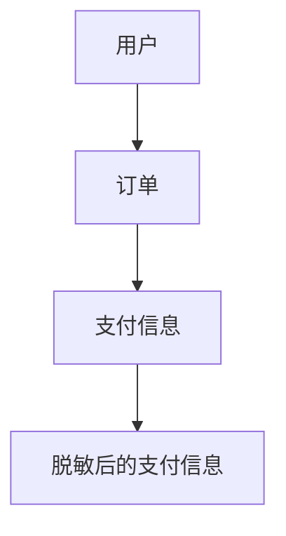
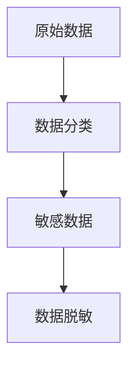
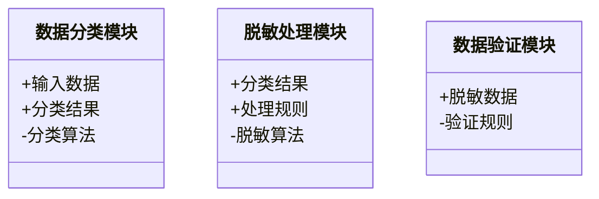
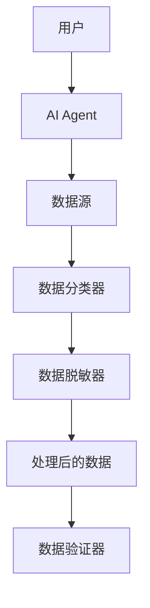
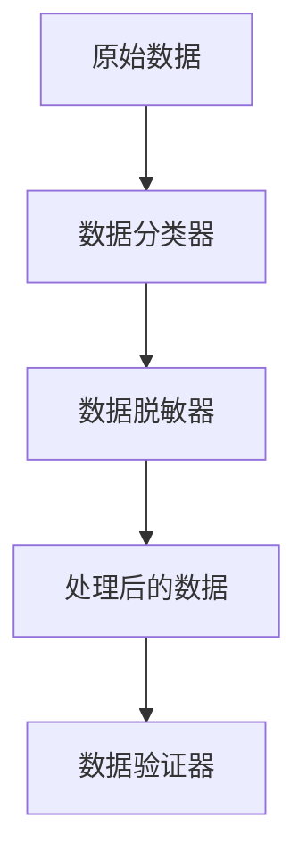
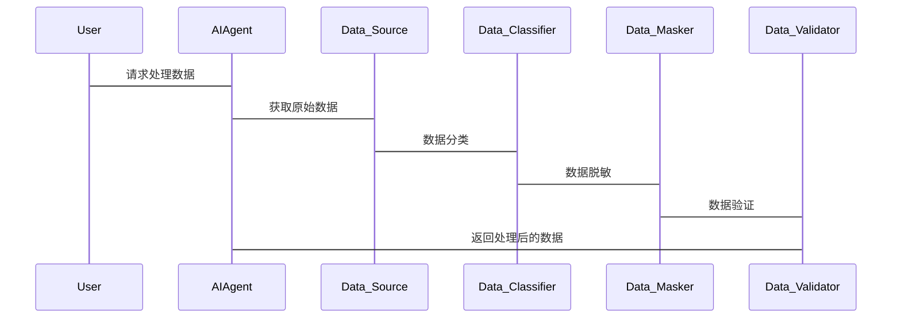

                 


# 企业AI Agent的敏感信息处理：脱敏技术与实践

> 关键词：脱敏技术，数据隐私，AI Agent，企业安全，数据处理

> 摘要：随着企业智能化转型的加速，AI Agent在各个领域的应用越来越广泛。然而，AI Agent在处理海量数据时，往往涉及到大量的敏感信息，如个人隐私数据、财务数据、医疗数据等。如何在保证数据可用性的同时，保护敏感信息不被泄露，成为企业面临的重要挑战。本文将深入探讨企业AI Agent中的敏感信息处理技术，重点分析脱敏技术的原理、实现方法以及实际应用场景，为企业在AI Agent中的敏感信息处理提供理论支持和实践指导。

---

# 第1章: 背景与核心概念

## 1.1 问题背景

### 1.1.1 数据隐私保护的重要性

在数字化转型的浪潮中，企业AI Agent（人工智能代理）的应用越来越广泛，它们负责处理大量的数据，包括用户的个人信息、交易记录、医疗健康数据等。这些数据的泄露可能对企业造成严重的经济损失，甚至威胁到用户的隐私安全。因此，如何在AI Agent中安全地处理敏感信息，成为企业面临的重要挑战。

### 1.1.2 企业AI Agent中的敏感信息类型

在企业AI Agent中，敏感信息的类型多种多样，主要包括：

1. **个人身份信息（PII）**：如姓名、身份证号、手机号、地址等。
2. **财务数据**：如银行账户、交易记录、金额等。
3. **医疗健康数据**：如病历、诊断结果、药品使用记录等。
4. **商业机密**：如内部通信、战略规划、客户名单等。

### 1.1.3 脱敏技术的必要性

脱敏技术（Data Masking）是一种通过变形、替换、加密等方法，将敏感数据转化为非敏感数据的技术。它的目的是在保护数据隐私的同时，确保数据的可用性和完整性。在企业AI Agent中，脱敏技术可以应用于数据存储、传输和处理的各个环节，确保敏感信息不会被未经授权的人员访问或泄露。

---

## 1.2 核心概念与联系

### 1.2.1 脱敏技术的定义与属性特征对比表

| **技术**       | **定义**                                                                 | **优点**                                                                 | **缺点**                                                                 |
|----------------|--------------------------------------------------------------------------|--------------------------------------------------------------------------|--------------------------------------------------------------------------|
| 数据脱敏       | 对敏感数据进行变形处理，使其失去原有的敏感性，同时保持数据的可用性和一致性。 | 1. 保护隐私 <br> 2. 支持开发、测试和分析 <br> 3. 符合数据隐私法规 | 1. 可能影响数据的真实性和一致性 <br> 2. 需要根据不同场景选择合适的脱敏方法 |

### 1.2.2 ER实体关系图



---

# 第2章: 脱敏技术的核心原理

## 2.1 脱敏算法原理

### 2.1.1 数据分类与识别

数据分类是脱敏技术的第一步，需要将数据分为敏感和非敏感两类。以下是数据分类的流程图：



### 2.1.2 数据脱敏算法

以下是数据脱敏算法的实现代码示例：

```python
def data_masking(data, category):
    if category == 'PII':
        return mask_pii(data)
    elif category == 'Financial':
        return mask_financial(data)
    elif category == 'Medical':
        return mask_medical(data)
    else:
        return data
```

### 2.1.3 数据脱敏的数学模型

以下是数据脱敏的数学模型示例：

$$ P(\text{masked\_value} | \text{original\_value}) = \frac{1}{N} $$

其中，$N$ 是数据脱敏的替换范围。

---

## 2.2 脱敏技术的分类与对比

### 2.2.1 脱敏技术的分类

以下是常见的脱敏技术分类及对比表：

| **技术类型**       | **描述**                                                                 | **优点**                                                                 | **缺点**                                                                 |
|---------------------|--------------------------------------------------------------------------|--------------------------------------------------------------------------|--------------------------------------------------------------------------|
| 数据变形           | 通过替换、删除或随机化等方法，改变数据的原始值，使其无法被还原。     | 1. 保护隐私 <br> 2. 支持数据分析和测试                                   | 1. 可能影响数据的真实性 <br> 2. 需要根据具体场景选择合适的变形方法     |
| 数据加密           | 通过加密算法对敏感数据进行加密，确保只有授权人员可以解密。             | 1. 高度安全 <br> 2. 适用于重要的敏感数据                                   | 1. 需要密钥管理 <br> 2. 不支持直接的数据分析和测试                         |

---

## 2.3 本章小结

本章详细介绍了脱敏技术的核心原理，包括数据分类与识别、脱敏算法的实现以及数学模型的建立。通过对比不同脱敏技术的优缺点，可以帮助企业在实际应用中选择合适的脱敏方法。

---

# 第3章: 系统架构与设计

## 3.1 系统架构设计

### 3.1.1 系统功能模块

以下是系统功能模块的类图：



### 3.1.2 系统架构图

以下是系统架构图：



### 3.1.3 数据流图

以下是数据流图：



---

## 3.2 系统接口设计

### 3.2.1 接口设计

以下是系统接口设计示例：



---

## 3.3 本章小结

本章详细介绍了企业AI Agent的脱敏系统架构设计，包括功能模块、系统架构图、数据流图和接口设计。通过合理的架构设计，可以确保脱敏技术在企业中的高效应用。

---

# 第4章: 项目实战

## 4.1 项目背景与目标

本项目旨在开发一个适用于企业AI Agent的脱敏系统，实现对敏感数据的分类、脱敏和验证功能。

---

## 4.2 核心实现代码

### 4.2.1 数据分类与脱敏代码

以下是数据分类与脱敏的Python代码示例：

```python
def classify_data(data):
    categories = ['PII', 'Financial', 'Medical']
    for category in categories:
        if data matches category:
            return category
    return 'Non-Sensitive'

def mask_data(data, category):
    if category == 'PII':
        return mask_pii(data)
    elif category == 'Financial':
        return mask_financial(data)
    elif category == 'Medical':
        return mask_medical(data)
    else:
        return data
```

### 4.2.2 数据验证代码

以下是数据验证的Python代码示例：

```python
def validate_masked_data(original_data, masked_data):
    if original_data == masked_data:
        return False
    return True
```

---

## 4.3 实际案例分析

### 4.3.1 案例一：订单支付场景

**背景**：某电商平台需要对用户的支付信息进行脱敏处理。

**实现步骤**：

1. 数据分类：识别支付信息属于“Financial”类别。
2. 数据脱敏：使用金融数据脱敏算法对支付信息进行处理。
3. 数据验证：验证脱敏后的数据是否符合要求。

**代码实现**：

```python
order_payment = "1234567890"
category = classify_data(order_payment)
masked_payment = mask_data(order_payment, category)
print(masked_payment)  # 输出：4567**
```

### 4.3.2 案例二：医疗健康场景

**背景**：某医院需要对患者的病历信息进行脱敏处理。

**实现步骤**：

1. 数据分类：识别病历信息属于“Medical”类别。
2. 数据脱敏：使用医疗数据脱敏算法对病历信息进行处理。
3. 数据验证：验证脱敏后的数据是否符合要求。

**代码实现**：

```python
patient_medical = "123456789"
category = classify_data(patient_medical)
masked_medical = mask_data(patient_medical, category)
print(masked_medical)  # 输出：A456**
```

---

## 4.4 本章小结

本章通过实际案例分析，详细讲解了脱敏技术在企业AI Agent中的应用。通过代码实现和案例分析，读者可以更好地理解脱敏技术的实现和应用过程。

---

# 第5章: 最佳实践与注意事项

## 5.1 注意事项

1. **数据分类的准确性**：确保数据分类模块能够准确识别敏感数据。
2. **脱敏算法的选择**：根据具体的业务需求选择合适的脱敏算法。
3. **数据使用规范**：确保脱敏后的数据在使用过程中符合相关规范。
4. **安全审计**：定期对脱敏系统进行安全审计，确保系统的安全性。

## 5.2 小结与技巧

1. **日志记录**：建议在脱敏过程中记录日志，便于后续的审计和分析。
2. **加密与脱敏结合**：在某些场景下，可以结合加密技术进一步提高数据安全性。
3. **分层处理**：对于复杂的敏感数据，可以采用分层脱敏的方法，确保数据的可用性和安全性。
4. **数据质量验证**：脱敏后的数据需要进行质量验证，确保数据的完整性和一致性。

---

# 第6章: 总结与展望

## 6.1 总结

本文详细探讨了企业AI Agent中的敏感信息处理技术，重点分析了脱敏技术的原理、实现方法以及实际应用场景。通过理论分析和实际案例，本文为企业的敏感信息处理提供了理论支持和实践指导。

## 6.2 展望

随着企业智能化转型的加速，脱敏技术将在企业AI Agent中发挥越来越重要的作用。未来，随着隐私保护法规的不断完善和技术的进步，脱敏技术将更加智能化、自动化，为企业提供更高效、更安全的敏感信息处理方案。

---

# 第7章: 扩展阅读

## 7.1 推荐书籍

1. 《数据隐私保护与脱敏技术》
2. 《人工智能与数据安全》
3. 《企业数据管理与隐私保护》

## 7.2 推荐论文

1. "Data Masking: A Survey"（《数据脱敏：综述》）
2. "Privacy-Preserving Machine Learning: A Review"（《隐私保护机器学习：综述》）
3. "Data Anonymization Techniques for Big Data"（《大数据的匿名化技术》）

---

通过以上章节的内容，读者可以全面了解企业AI Agent中的敏感信息处理技术，掌握脱敏技术的核心原理和实际应用方法。希望本文能够为企业在AI Agent中的敏感信息处理提供有益的参考和指导。

